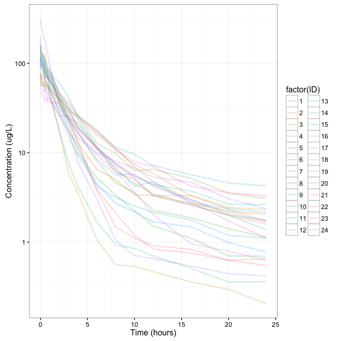
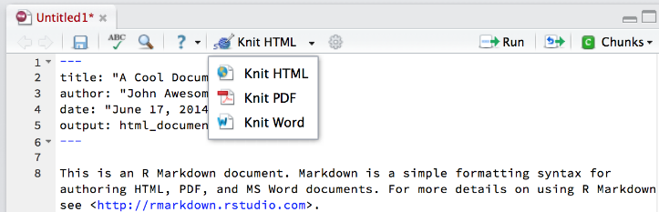
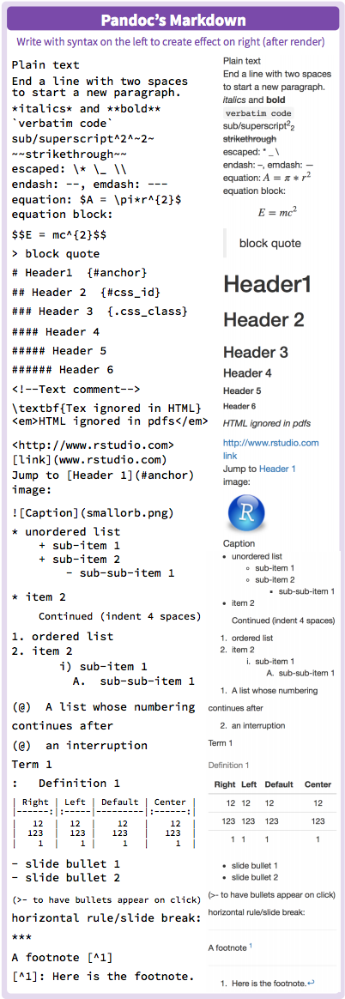
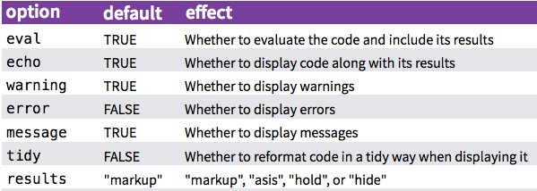
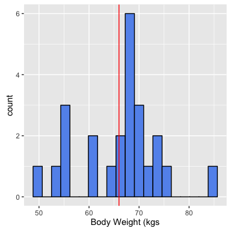
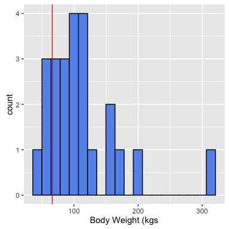
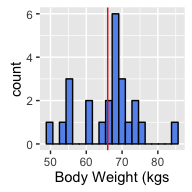
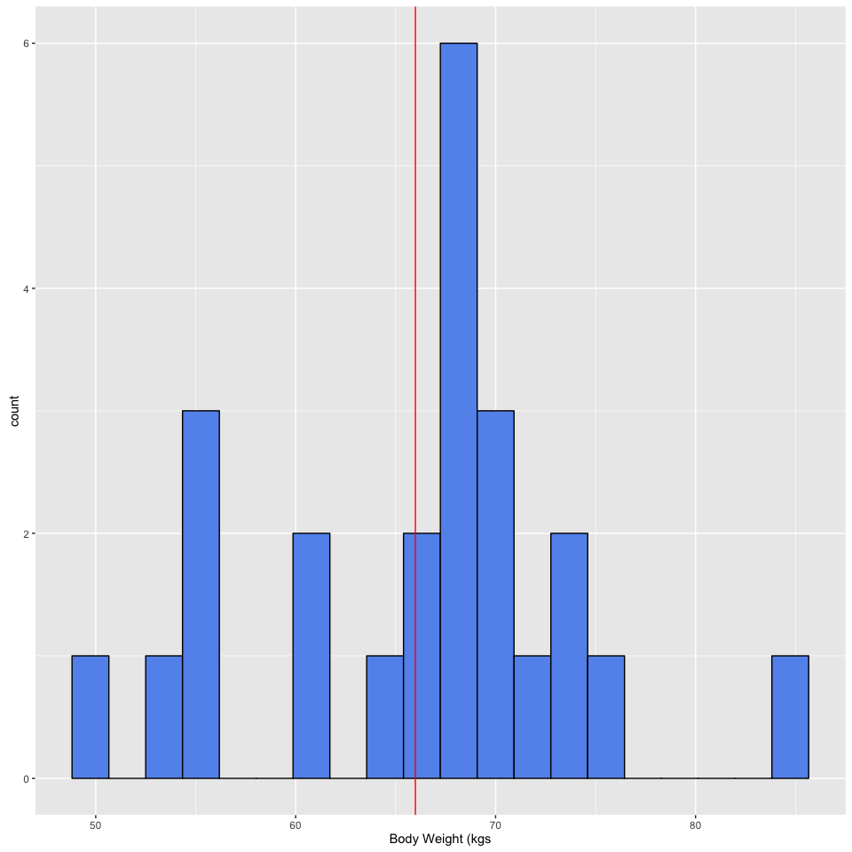
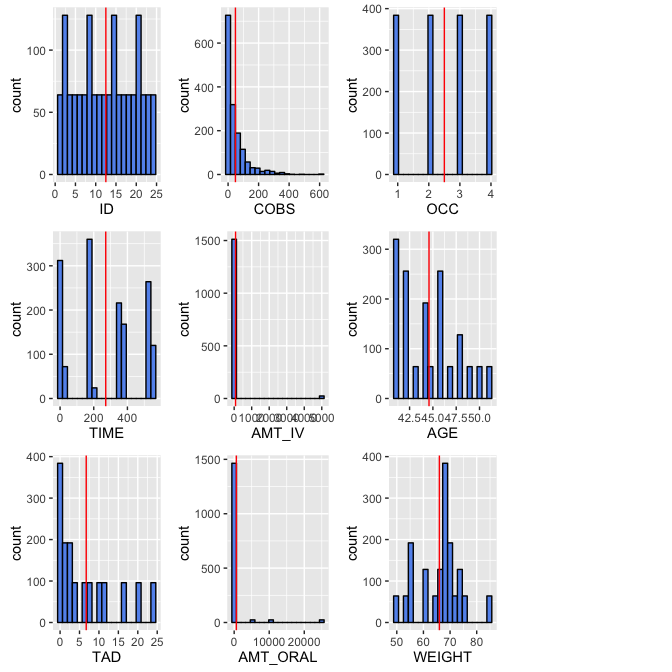

# Creating Dynamic Documents with RMarkdown and Knitr
By: Vijay Ivaturi, `@vijay_ivaturi`, vivaturi at rx dot umaryland dot edu  
`r format(Sys.time(), '%d %B, %Y')`  


******************************************************************************************

# Welcome!

This in an introduction to Rmarkdown - a R based version of a powerful yet simple to use text input system called **markdown**.

## Installation Instructions  

**Before working through the workshop materials, please do the following in preparation:**

1. Open up **RStudio**.  
2. Install and download the **devtools** R package by running the following in the R console. 


```r
install.packages("devtools") # To include the session information
library("devtools") # To include the session information  
```

3. Check that you have the correct versions of **R** and **RStudio** by running `devtools::session_info()` in the R console.  
Here, `devtools::` tells **R** to use the `session_info()` function within the **devtools** package rather than the `sessionInfo()` function within the **utils** package.  Running `devtools::session_info()` allows us to see the version of **R** and **RStudio**. 

Do you have the following versions of **R** and **RStudio**?  

- **R:** `Version 3.2.2 (2016-06-06)`  
- **RStudio:** `0.99.1172`  

  - If you **do** then you are good to go!  
  - If you **do not** have the correct versions of **R** and **RStudio**, please follow the Setup document provided in the workshop folder.  

4. Install other R packages necessary for the workshop.


```r
## Install the correct packages
install.packages("rmarkdown") # Make cool dynamic documents
install.packages("knitr") # Run R Code Chunks
install.packages("ggplot2") # For plotting
install.packages("DT") # Interactive HTML tables
install.packages("plotly") # Interactive HTML tables
devtools::install_github("dpastoor/PKPDdatasets") # A library of PKPD Datasets
devtools::install_github("dpastoor/PKPDmisc") # A library of miscellaneous functions for pharmacometrics analysis
```


```r
## Add these packages to the current session to make sure they load correctly
library("rmarkdown") # Make cool dynamic documents
library("knitr") # Run R Code Chunks
library("ggplot2") # For plotting
library("DT") # Interactive HTML tables
library("PKPDdatasets")
library("PKPDmisc")
library("plotly")
```

5. If your packages loaded without any errors, then you are ready for the workshop!  

If there were issues with the above packages please place a pink sticky to get help !


******************************************************************************************

# Must Have Resources

1. The RMarkdown website hosted by [RStudio](http://rmarkdown.rstudio.com/index.html).
2. Dr. Yuhui Xie's book: [Dynamic Documents with R and Knitr](http://www.amazon.com/Dynamic-Documents-knitr-Chapman-Hall/dp/1482203537) 2^nd^ Edition [@Xie2015] and his [Knitr](http://yihui.name/knitr/) website.  
3. [Cheatsheets](https://www.rstudio.com/resources/cheatsheets/) released by RStudio.


******************************************************************************************

# Dynamic Documents  

[Literate programming](https://en.wikipedia.org/wiki/Literate_programming) is the basic idea behind dynamic documents and was proposed by Donald Knuth in 1984.  Originally, it was for mixing the source code and documentation of software development together.  Today, we will create dynamic documents in which program or analysis code is run to produce output (e.g. tables, plots, models, etc) and then are explained through narrative writing.

The 3 steps of **Literate Programming**:  

1. **Parse** the source document and separate code from narratives.  
2. **Execute** source code and return results.  
3. **Mix** results from the source code with the original narratives.  


So that leaves 2 steps for us which includes writing:  

1. Analysis code  
2. A narrative to explain the results from the analysis code.  

Traditionally, people used comments to include narrative in their code file (for **R** that would be a `.R` file). For example, the file may include the following:


```r
# Title:  Initial Data Checkout for dapa dataset 
# By:  Vijay Ivaturi
# Date:  June 6th, 2016

# This document will contain the initial data checkout and exploratory data analysis of the dapa dataset.  
# It will allow qualification of data as well as to understand the pharmacokinetic profiles, information that can be used to set up the modeling framework.

# What does the data look like?
DT::datatable(dapa_IV_oral) # Interactive table 

# What are the total number of subjects in the dataset and by arm
dapa_IV_oral %>% distinct(ID) %>% tally  # Isolate the first row per ID and count the number of rows
dapa_IV_oral %>% distinct(ID,OCC)  %>%  group_by(ID) %>% group_size# No occassions per subject 


# Plot the relationship between concentration and time for the IV formulation  
plot <- ggplot(dapa_IV_oral %>% filter(FORMULATION=="IV"), aes(x = TIME, y = COBS, color=factor(ID))) + # 
  geom_line(size=1, alpha=0.2) + theme_bw() + scale_y_log10()+
  xlab("Time (hours)") + ylab("Concentration (ug/L)") # Add axis labels
ggplotly(plot) # Make the plot interactive  

# It appears that the IV profiles follow a bi-phasic distribution and hence we may use a 2-compartment model
# The end
```

Then the user would have to read the comments and run the code themselves.  

However, literate programming allows us to run the code and describe the code all within one document that we could share.  So for example we could do the following:  

***

**Title:**  Initial Data Checkout for dapa dataset   
*By:*  Vijay Ivaturi  
*Date:*  June 6th, 2016  

This document will contain the initial data checkout and exploratory data analysis of the dapa dataset.  It will allow qualification of data as well as to understand the pharmacokinetic profiles, information that can be used to set up the modeling framework.


*What does the data look like?*


```r
DT::datatable(dapa_IV_oral) # Interactive table 
```

<!--html_preserve--><div id="htmlwidget-8862" style="width:100%;height:auto;" class="datatables html-widget"></div>
<script type="application/json" data-for="htmlwidget-8862">{"x":{"data":[["1","2","3","4","5","6","7","8","9","10","11","12","13","14","15","16","17","18","19","20","21","22","23","24","25","26","27","28","29","30","31","32","33","34","35","36","37","38","39","40","41","42","43","44","45","46","47","48","49","50","51","52","53","54","55","56","57","58","59","60","61","62","63","64","65","66","67","68","69","70","71","72","73","74","75","76","77","78","79","80","81","82","83","84","85","86","87","88","89","90","91","92","93","94","95","96","97","98","99","100","101","102","103","104","105","106","107","108","109","110","111","112","113","114","115","116","117","118","119","120","121","122","123","124","125","126","127","128","129","130","131","132","133","134","135","136","137","138","139","140","141","142","143","144","145","146","147","148","149","150","151","152","153","154","155","156","157","158","159","160","161","162","163","164","165","166","167","168","169","170","171","172","173","174","175","176","177","178","179","180","181","182","183","184","185","186","187","188","189","190","191","192","193","194","195","196","197","198","199","200","201","202","203","204","205","206","207","208","209","210","211","212","213","214","215","216","217","218","219","220","221","222","223","224","225","226","227","228","229","230","231","232","233","234","235","236","237","238","239","240","241","242","243","244","245","246","247","248","249","250","251","252","253","254","255","256","257","258","259","260","261","262","263","264","265","266","267","268","269","270","271","272","273","274","275","276","277","278","279","280","281","282","283","284","285","286","287","288","289","290","291","292","293","294","295","296","297","298","299","300","301","302","303","304","305","306","307","308","309","310","311","312","313","314","315","316","317","318","319","320","321","322","323","324","325","326","327","328","329","330","331","332","333","334","335","336","337","338","339","340","341","342","343","344","345","346","347","348","349","350","351","352","353","354","355","356","357","358","359","360","361","362","363","364","365","366","367","368","369","370","371","372","373","374","375","376","377","378","379","380","381","382","383","384","385","386","387","388","389","390","391","392","393","394","395","396","397","398","399","400","401","402","403","404","405","406","407","408","409","410","411","412","413","414","415","416","417","418","419","420","421","422","423","424","425","426","427","428","429","430","431","432","433","434","435","436","437","438","439","440","441","442","443","444","445","446","447","448","449","450","451","452","453","454","455","456","457","458","459","460","461","462","463","464","465","466","467","468","469","470","471","472","473","474","475","476","477","478","479","480","481","482","483","484","485","486","487","488","489","490","491","492","493","494","495","496","497","498","499","500","501","502","503","504","505","506","507","508","509","510","511","512","513","514","515","516","517","518","519","520","521","522","523","524","525","526","527","528","529","530","531","532","533","534","535","536","537","538","539","540","541","542","543","544","545","546","547","548","549","550","551","552","553","554","555","556","557","558","559","560","561","562","563","564","565","566","567","568","569","570","571","572","573","574","575","576","577","578","579","580","581","582","583","584","585","586","587","588","589","590","591","592","593","594","595","596","597","598","599","600","601","602","603","604","605","606","607","608","609","610","611","612","613","614","615","616","617","618","619","620","621","622","623","624","625","626","627","628","629","630","631","632","633","634","635","636","637","638","639","640","641","642","643","644","645","646","647","648","649","650","651","652","653","654","655","656","657","658","659","660","661","662","663","664","665","666","667","668","669","670","671","672","673","674","675","676","677","678","679","680","681","682","683","684","685","686","687","688","689","690","691","692","693","694","695","696","697","698","699","700","701","702","703","704","705","706","707","708","709","710","711","712","713","714","715","716","717","718","719","720","721","722","723","724","725","726","727","728","729","730","731","732","733","734","735","736","737","738","739","740","741","742","743","744","745","746","747","748","749","750","751","752","753","754","755","756","757","758","759","760","761","762","763","764","765","766","767","768","769","770","771","772","773","774","775","776","777","778","779","780","781","782","783","784","785","786","787","788","789","790","791","792","793","794","795","796","797","798","799","800","801","802","803","804","805","806","807","808","809","810","811","812","813","814","815","816","817","818","819","820","821","822","823","824","825","826","827","828","829","830","831","832","833","834","835","836","837","838","839","840","841","842","843","844","845","846","847","848","849","850","851","852","853","854","855","856","857","858","859","860","861","862","863","864","865","866","867","868","869","870","871","872","873","874","875","876","877","878","879","880","881","882","883","884","885","886","887","888","889","890","891","892","893","894","895","896","897","898","899","900","901","902","903","904","905","906","907","908","909","910","911","912","913","914","915","916","917","918","919","920","921","922","923","924","925","926","927","928","929","930","931","932","933","934","935","936","937","938","939","940","941","942","943","944","945","946","947","948","949","950","951","952","953","954","955","956","957","958","959","960","961","962","963","964","965","966","967","968","969","970","971","972","973","974","975","976","977","978","979","980","981","982","983","984","985","986","987","988","989","990","991","992","993","994","995","996","997","998","999","1000","1001","1002","1003","1004","1005","1006","1007","1008","1009","1010","1011","1012","1013","1014","1015","1016","1017","1018","1019","1020","1021","1022","1023","1024","1025","1026","1027","1028","1029","1030","1031","1032","1033","1034","1035","1036","1037","1038","1039","1040","1041","1042","1043","1044","1045","1046","1047","1048","1049","1050","1051","1052","1053","1054","1055","1056","1057","1058","1059","1060","1061","1062","1063","1064","1065","1066","1067","1068","1069","1070","1071","1072","1073","1074","1075","1076","1077","1078","1079","1080","1081","1082","1083","1084","1085","1086","1087","1088","1089","1090","1091","1092","1093","1094","1095","1096","1097","1098","1099","1100","1101","1102","1103","1104","1105","1106","1107","1108","1109","1110","1111","1112","1113","1114","1115","1116","1117","1118","1119","1120","1121","1122","1123","1124","1125","1126","1127","1128","1129","1130","1131","1132","1133","1134","1135","1136","1137","1138","1139","1140","1141","1142","1143","1144","1145","1146","1147","1148","1149","1150","1151","1152","1153","1154","1155","1156","1157","1158","1159","1160","1161","1162","1163","1164","1165","1166","1167","1168","1169","1170","1171","1172","1173","1174","1175","1176","1177","1178","1179","1180","1181","1182","1183","1184","1185","1186","1187","1188","1189","1190","1191","1192","1193","1194","1195","1196","1197","1198","1199","1200","1201","1202","1203","1204","1205","1206","1207","1208","1209","1210","1211","1212","1213","1214","1215","1216","1217","1218","1219","1220","1221","1222","1223","1224","1225","1226","1227","1228","1229","1230","1231","1232","1233","1234","1235","1236","1237","1238","1239","1240","1241","1242","1243","1244","1245","1246","1247","1248","1249","1250","1251","1252","1253","1254","1255","1256","1257","1258","1259","1260","1261","1262","1263","1264","1265","1266","1267","1268","1269","1270","1271","1272","1273","1274","1275","1276","1277","1278","1279","1280","1281","1282","1283","1284","1285","1286","1287","1288","1289","1290","1291","1292","1293","1294","1295","1296","1297","1298","1299","1300","1301","1302","1303","1304","1305","1306","1307","1308","1309","1310","1311","1312","1313","1314","1315","1316","1317","1318","1319","1320","1321","1322","1323","1324","1325","1326","1327","1328","1329","1330","1331","1332","1333","1334","1335","1336","1337","1338","1339","1340","1341","1342","1343","1344","1345","1346","1347","1348","1349","1350","1351","1352","1353","1354","1355","1356","1357","1358","1359","1360","1361","1362","1363","1364","1365","1366","1367","1368","1369","1370","1371","1372","1373","1374","1375","1376","1377","1378","1379","1380","1381","1382","1383","1384","1385","1386","1387","1388","1389","1390","1391","1392","1393","1394","1395","1396","1397","1398","1399","1400","1401","1402","1403","1404","1405","1406","1407","1408","1409","1410","1411","1412","1413","1414","1415","1416","1417","1418","1419","1420","1421","1422","1423","1424","1425","1426","1427","1428","1429","1430","1431","1432","1433","1434","1435","1436","1437","1438","1439","1440","1441","1442","1443","1444","1445","1446","1447","1448","1449","1450","1451","1452","1453","1454","1455","1456","1457","1458","1459","1460","1461","1462","1463","1464","1465","1466","1467","1468","1469","1470","1471","1472","1473","1474","1475","1476","1477","1478","1479","1480","1481","1482","1483","1484","1485","1486","1487","1488","1489","1490","1491","1492","1493","1494","1495","1496","1497","1498","1499","1500","1501","1502","1503","1504","1505","1506","1507","1508","1509","1510","1511","1512","1513","1514","1515","1516","1517","1518","1519","1520","1521","1522","1523","1524","1525","1526","1527","1528","1529","1530","1531","1532","1533","1534","1535","1536"],[1,1,1,1,1,1,1,1,1,1,1,1,1,1,1,1,1,1,1,1,1,1,1,1,1,1,1,1,1,1,1,1,1,1,1,1,1,1,1,1,1,1,1,1,1,1,1,1,1,1,1,1,1,1,1,1,1,1,1,1,1,1,1,1,2,2,2,2,2,2,2,2,2,2,2,2,2,2,2,2,2,2,2,2,2,2,2,2,2,2,2,2,2,2,2,2,2,2,2,2,2,2,2,2,2,2,2,2,2,2,2,2,2,2,2,2,2,2,2,2,2,2,2,2,2,2,2,2,3,3,3,3,3,3,3,3,3,3,3,3,3,3,3,3,3,3,3,3,3,3,3,3,3,3,3,3,3,3,3,3,3,3,3,3,3,3,3,3,3,3,3,3,3,3,3,3,3,3,3,3,3,3,3,3,3,3,3,3,3,3,3,3,4,4,4,4,4,4,4,4,4,4,4,4,4,4,4,4,4,4,4,4,4,4,4,4,4,4,4,4,4,4,4,4,4,4,4,4,4,4,4,4,4,4,4,4,4,4,4,4,4,4,4,4,4,4,4,4,4,4,4,4,4,4,4,4,5,5,5,5,5,5,5,5,5,5,5,5,5,5,5,5,5,5,5,5,5,5,5,5,5,5,5,5,5,5,5,5,5,5,5,5,5,5,5,5,5,5,5,5,5,5,5,5,5,5,5,5,5,5,5,5,5,5,5,5,5,5,5,5,6,6,6,6,6,6,6,6,6,6,6,6,6,6,6,6,6,6,6,6,6,6,6,6,6,6,6,6,6,6,6,6,6,6,6,6,6,6,6,6,6,6,6,6,6,6,6,6,6,6,6,6,6,6,6,6,6,6,6,6,6,6,6,6,7,7,7,7,7,7,7,7,7,7,7,7,7,7,7,7,7,7,7,7,7,7,7,7,7,7,7,7,7,7,7,7,7,7,7,7,7,7,7,7,7,7,7,7,7,7,7,7,7,7,7,7,7,7,7,7,7,7,7,7,7,7,7,7,8,8,8,8,8,8,8,8,8,8,8,8,8,8,8,8,8,8,8,8,8,8,8,8,8,8,8,8,8,8,8,8,8,8,8,8,8,8,8,8,8,8,8,8,8,8,8,8,8,8,8,8,8,8,8,8,8,8,8,8,8,8,8,8,9,9,9,9,9,9,9,9,9,9,9,9,9,9,9,9,9,9,9,9,9,9,9,9,9,9,9,9,9,9,9,9,9,9,9,9,9,9,9,9,9,9,9,9,9,9,9,9,9,9,9,9,9,9,9,9,9,9,9,9,9,9,9,9,10,10,10,10,10,10,10,10,10,10,10,10,10,10,10,10,10,10,10,10,10,10,10,10,10,10,10,10,10,10,10,10,10,10,10,10,10,10,10,10,10,10,10,10,10,10,10,10,10,10,10,10,10,10,10,10,10,10,10,10,10,10,10,10,11,11,11,11,11,11,11,11,11,11,11,11,11,11,11,11,11,11,11,11,11,11,11,11,11,11,11,11,11,11,11,11,11,11,11,11,11,11,11,11,11,11,11,11,11,11,11,11,11,11,11,11,11,11,11,11,11,11,11,11,11,11,11,11,12,12,12,12,12,12,12,12,12,12,12,12,12,12,12,12,12,12,12,12,12,12,12,12,12,12,12,12,12,12,12,12,12,12,12,12,12,12,12,12,12,12,12,12,12,12,12,12,12,12,12,12,12,12,12,12,12,12,12,12,12,12,12,12,13,13,13,13,13,13,13,13,13,13,13,13,13,13,13,13,13,13,13,13,13,13,13,13,13,13,13,13,13,13,13,13,13,13,13,13,13,13,13,13,13,13,13,13,13,13,13,13,13,13,13,13,13,13,13,13,13,13,13,13,13,13,13,13,14,14,14,14,14,14,14,14,14,14,14,14,14,14,14,14,14,14,14,14,14,14,14,14,14,14,14,14,14,14,14,14,14,14,14,14,14,14,14,14,14,14,14,14,14,14,14,14,14,14,14,14,14,14,14,14,14,14,14,14,14,14,14,14,15,15,15,15,15,15,15,15,15,15,15,15,15,15,15,15,15,15,15,15,15,15,15,15,15,15,15,15,15,15,15,15,15,15,15,15,15,15,15,15,15,15,15,15,15,15,15,15,15,15,15,15,15,15,15,15,15,15,15,15,15,15,15,15,16,16,16,16,16,16,16,16,16,16,16,16,16,16,16,16,16,16,16,16,16,16,16,16,16,16,16,16,16,16,16,16,16,16,16,16,16,16,16,16,16,16,16,16,16,16,16,16,16,16,16,16,16,16,16,16,16,16,16,16,16,16,16,16,17,17,17,17,17,17,17,17,17,17,17,17,17,17,17,17,17,17,17,17,17,17,17,17,17,17,17,17,17,17,17,17,17,17,17,17,17,17,17,17,17,17,17,17,17,17,17,17,17,17,17,17,17,17,17,17,17,17,17,17,17,17,17,17,18,18,18,18,18,18,18,18,18,18,18,18,18,18,18,18,18,18,18,18,18,18,18,18,18,18,18,18,18,18,18,18,18,18,18,18,18,18,18,18,18,18,18,18,18,18,18,18,18,18,18,18,18,18,18,18,18,18,18,18,18,18,18,18,19,19,19,19,19,19,19,19,19,19,19,19,19,19,19,19,19,19,19,19,19,19,19,19,19,19,19,19,19,19,19,19,19,19,19,19,19,19,19,19,19,19,19,19,19,19,19,19,19,19,19,19,19,19,19,19,19,19,19,19,19,19,19,19,20,20,20,20,20,20,20,20,20,20,20,20,20,20,20,20,20,20,20,20,20,20,20,20,20,20,20,20,20,20,20,20,20,20,20,20,20,20,20,20,20,20,20,20,20,20,20,20,20,20,20,20,20,20,20,20,20,20,20,20,20,20,20,20,21,21,21,21,21,21,21,21,21,21,21,21,21,21,21,21,21,21,21,21,21,21,21,21,21,21,21,21,21,21,21,21,21,21,21,21,21,21,21,21,21,21,21,21,21,21,21,21,21,21,21,21,21,21,21,21,21,21,21,21,21,21,21,21,22,22,22,22,22,22,22,22,22,22,22,22,22,22,22,22,22,22,22,22,22,22,22,22,22,22,22,22,22,22,22,22,22,22,22,22,22,22,22,22,22,22,22,22,22,22,22,22,22,22,22,22,22,22,22,22,22,22,22,22,22,22,22,22,23,23,23,23,23,23,23,23,23,23,23,23,23,23,23,23,23,23,23,23,23,23,23,23,23,23,23,23,23,23,23,23,23,23,23,23,23,23,23,23,23,23,23,23,23,23,23,23,23,23,23,23,23,23,23,23,23,23,23,23,23,23,23,23,24,24,24,24,24,24,24,24,24,24,24,24,24,24,24,24,24,24,24,24,24,24,24,24,24,24,24,24,24,24,24,24,24,24,24,24,24,24,24,24,24,24,24,24,24,24,24,24,24,24,24,24,24,24,24,24,24,24,24,24,24,24,24,24],[0,0.05,0.35,0.5,0.75,1,2,3,4,6,8,10,12,16,20,24,168,168.05,168.35,168.5,168.75,169,170,171,172,174,176,178,180,184,188,192,360,360.05,360.35,360.5,360.75,361,362,363,364,366,368,370,372,376,380,384,530,530.05,530.35,530.5,530.75,531,532,533,534,536,538,540,542,546,550,554,0,0.05,0.35,0.5,0.75,1,2,3,4,6,8,10,12,16,20,24,168,168.05,168.35,168.5,168.75,169,170,171,172,174,176,178,180,184,188,192,360,360.05,360.35,360.5,360.75,361,362,363,364,366,368,370,372,376,380,384,530,530.05,530.35,530.5,530.75,531,532,533,534,536,538,540,542,546,550,554,0,0.05,0.35,0.5,0.75,1,2,3,4,6,8,10,12,16,20,24,168,168.05,168.35,168.5,168.75,169,170,171,172,174,176,178,180,184,188,192,360,360.05,360.35,360.5,360.75,361,362,363,364,366,368,370,372,376,380,384,530,530.05,530.35,530.5,530.75,531,532,533,534,536,538,540,542,546,550,554,0,0.05,0.35,0.5,0.75,1,2,3,4,6,8,10,12,16,20,24,168,168.05,168.35,168.5,168.75,169,170,171,172,174,176,178,180,184,188,192,360,360.05,360.35,360.5,360.75,361,362,363,364,366,368,370,372,376,380,384,530,530.05,530.35,530.5,530.75,531,532,533,534,536,538,540,542,546,550,554,0,0.05,0.35,0.5,0.75,1,2,3,4,6,8,10,12,16,20,24,168,168.05,168.35,168.5,168.75,169,170,171,172,174,176,178,180,184,188,192,360,360.05,360.35,360.5,360.75,361,362,363,364,366,368,370,372,376,380,384,530,530.05,530.35,530.5,530.75,531,532,533,534,536,538,540,542,546,550,554,0,0.05,0.35,0.5,0.75,1,2,3,4,6,8,10,12,16,20,24,168,168.05,168.35,168.5,168.75,169,170,171,172,174,176,178,180,184,188,192,360,360.05,360.35,360.5,360.75,361,362,363,364,366,368,370,372,376,380,384,530,530.05,530.35,530.5,530.75,531,532,533,534,536,538,540,542,546,550,554,0,0.05,0.35,0.5,0.75,1,2,3,4,6,8,10,12,16,20,24,168,168.05,168.35,168.5,168.75,169,170,171,172,174,176,178,180,184,188,192,360,360.05,360.35,360.5,360.75,361,362,363,364,366,368,370,372,376,380,384,530,530.05,530.35,530.5,530.75,531,532,533,534,536,538,540,542,546,550,554,0,0.05,0.35,0.5,0.75,1,2,3,4,6,8,10,12,16,20,24,168,168.05,168.35,168.5,168.75,169,170,171,172,174,176,178,180,184,188,192,360,360.05,360.35,360.5,360.75,361,362,363,364,366,368,370,372,376,380,384,530,530.05,530.35,530.5,530.75,531,532,533,534,536,538,540,542,546,550,554,0,0.05,0.35,0.5,0.75,1,2,3,4,6,8,10,12,16,20,24,168,168.05,168.35,168.5,168.75,169,170,171,172,174,176,178,180,184,188,192,360,360.05,360.35,360.5,360.75,361,362,363,364,366,368,370,372,376,380,384,530,530.05,530.35,530.5,530.75,531,532,533,534,536,538,540,542,546,550,554,0,0.05,0.35,0.5,0.75,1,2,3,4,6,8,10,12,16,20,24,168,168.05,168.35,168.5,168.75,169,170,171,172,174,176,178,180,184,188,192,360,360.05,360.35,360.5,360.75,361,362,363,364,366,368,370,372,376,380,384,530,530.05,530.35,530.5,530.75,531,532,533,534,536,538,540,542,546,550,554,0,0.05,0.35,0.5,0.75,1,2,3,4,6,8,10,12,16,20,24,168,168.05,168.35,168.5,168.75,169,170,171,172,174,176,178,180,184,188,192,360,360.05,360.35,360.5,360.75,361,362,363,364,366,368,370,372,376,380,384,530,530.05,530.35,530.5,530.75,531,532,533,534,536,538,540,542,546,550,554,0,0.05,0.35,0.5,0.75,1,2,3,4,6,8,10,12,16,20,24,168,168.05,168.35,168.5,168.75,169,170,171,172,174,176,178,180,184,188,192,360,360.05,360.35,360.5,360.75,361,362,363,364,366,368,370,372,376,380,384,530,530.05,530.35,530.5,530.75,531,532,533,534,536,538,540,542,546,550,554,0,0.05,0.35,0.5,0.75,1,2,3,4,6,8,10,12,16,20,24,168,168.05,168.35,168.5,168.75,169,170,171,172,174,176,178,180,184,188,192,360,360.05,360.35,360.5,360.75,361,362,363,364,366,368,370,372,376,380,384,530,530.05,530.35,530.5,530.75,531,532,533,534,536,538,540,542,546,550,554,0,0.05,0.35,0.5,0.75,1,2,3,4,6,8,10,12,16,20,24,168,168.05,168.35,168.5,168.75,169,170,171,172,174,176,178,180,184,188,192,360,360.05,360.35,360.5,360.75,361,362,363,364,366,368,370,372,376,380,384,530,530.05,530.35,530.5,530.75,531,532,533,534,536,538,540,542,546,550,554,0,0.05,0.35,0.5,0.75,1,2,3,4,6,8,10,12,16,20,24,168,168.05,168.35,168.5,168.75,169,170,171,172,174,176,178,180,184,188,192,360,360.05,360.35,360.5,360.75,361,362,363,364,366,368,370,372,376,380,384,530,530.05,530.35,530.5,530.75,531,532,533,534,536,538,540,542,546,550,554,0,0.05,0.35,0.5,0.75,1,2,3,4,6,8,10,12,16,20,24,168,168.05,168.35,168.5,168.75,169,170,171,172,174,176,178,180,184,188,192,360,360.05,360.35,360.5,360.75,361,362,363,364,366,368,370,372,376,380,384,530,530.05,530.35,530.5,530.75,531,532,533,534,536,538,540,542,546,550,554,0,0.05,0.35,0.5,0.75,1,2,3,4,6,8,10,12,16,20,24,168,168.05,168.35,168.5,168.75,169,170,171,172,174,176,178,180,184,188,192,360,360.05,360.35,360.5,360.75,361,362,363,364,366,368,370,372,376,380,384,530,530.05,530.35,530.5,530.75,531,532,533,534,536,538,540,542,546,550,554,0,0.05,0.35,0.5,0.75,1,2,3,4,6,8,10,12,16,20,24,168,168.05,168.35,168.5,168.75,169,170,171,172,174,176,178,180,184,188,192,360,360.05,360.35,360.5,360.75,361,362,363,364,366,368,370,372,376,380,384,530,530.05,530.35,530.5,530.75,531,532,533,534,536,538,540,542,546,550,554,0,0.05,0.35,0.5,0.75,1,2,3,4,6,8,10,12,16,20,24,168,168.05,168.35,168.5,168.75,169,170,171,172,174,176,178,180,184,188,192,360,360.05,360.35,360.5,360.75,361,362,363,364,366,368,370,372,376,380,384,530,530.05,530.35,530.5,530.75,531,532,533,534,536,538,540,542,546,550,554,0,0.05,0.35,0.5,0.75,1,2,3,4,6,8,10,12,16,20,24,168,168.05,168.35,168.5,168.75,169,170,171,172,174,176,178,180,184,188,192,360,360.05,360.35,360.5,360.75,361,362,363,364,366,368,370,372,376,380,384,530,530.05,530.35,530.5,530.75,531,532,533,534,536,538,540,542,546,550,554,0,0.05,0.35,0.5,0.75,1,2,3,4,6,8,10,12,16,20,24,168,168.05,168.35,168.5,168.75,169,170,171,172,174,176,178,180,184,188,192,360,360.05,360.35,360.5,360.75,361,362,363,364,366,368,370,372,376,380,384,530,530.05,530.35,530.5,530.75,531,532,533,534,536,538,540,542,546,550,554,0,0.05,0.35,0.5,0.75,1,2,3,4,6,8,10,12,16,20,24,168,168.05,168.35,168.5,168.75,169,170,171,172,174,176,178,180,184,188,192,360,360.05,360.35,360.5,360.75,361,362,363,364,366,368,370,372,376,380,384,530,530.05,530.35,530.5,530.75,531,532,533,534,536,538,540,542,546,550,554,0,0.05,0.35,0.5,0.75,1,2,3,4,6,8,10,12,16,20,24,168,168.05,168.35,168.5,168.75,169,170,171,172,174,176,178,180,184,188,192,360,360.05,360.35,360.5,360.75,361,362,363,364,366,368,370,372,376,380,384,530,530.05,530.35,530.5,530.75,531,532,533,534,536,538,540,542,546,550,554,0,0.05,0.35,0.5,0.75,1,2,3,4,6,8,10,12,16,20,24,168,168.05,168.35,168.5,168.75,169,170,171,172,174,176,178,180,184,188,192,360,360.05,360.35,360.5,360.75,361,362,363,364,366,368,370,372,376,380,384,530,530.05,530.35,530.5,530.75,531,532,533,534,536,538,540,542,546,550,554],[0,0.05,0.35,0.5,0.75,1,2,3,4,6,8,10,12,16,20,24,0,0.05,0.35,0.5,0.75,1,2,3,4,6,8,10,12,16,20,24,0,0.05,0.35,0.5,0.75,1,2,3,4,6,8,10,12,16,20,24,0,0.05,0.35,0.5,0.75,1,2,3,4,6,8,10,12,16,20,24,0,0.05,0.35,0.5,0.75,1,2,3,4,6,8,10,12,16,20,24,0,0.05,0.35,0.5,0.75,1,2,3,4,6,8,10,12,16,20,24,0,0.05,0.35,0.5,0.75,1,2,3,4,6,8,10,12,16,20,24,0,0.05,0.35,0.5,0.75,1,2,3,4,6,8,10,12,16,20,24,0,0.05,0.35,0.5,0.75,1,2,3,4,6,8,10,12,16,20,24,0,0.05,0.35,0.5,0.75,1,2,3,4,6,8,10,12,16,20,24,0,0.05,0.35,0.5,0.75,1,2,3,4,6,8,10,12,16,20,24,0,0.05,0.35,0.5,0.75,1,2,3,4,6,8,10,12,16,20,24,0,0.05,0.35,0.5,0.75,1,2,3,4,6,8,10,12,16,20,24,0,0.05,0.35,0.5,0.75,1,2,3,4,6,8,10,12,16,20,24,0,0.05,0.35,0.5,0.75,1,2,3,4,6,8,10,12,16,20,24,0,0.05,0.35,0.5,0.75,1,2,3,4,6,8,10,12,16,20,24,0,0.05,0.35,0.5,0.75,1,2,3,4,6,8,10,12,16,20,24,0,0.05,0.35,0.5,0.75,1,2,3,4,6,8,10,12,16,20,24,0,0.05,0.35,0.5,0.75,1,2,3,4,6,8,10,12,16,20,24,0,0.05,0.35,0.5,0.75,1,2,3,4,6,8,10,12,16,20,24,0,0.05,0.35,0.5,0.75,1,2,3,4,6,8,10,12,16,20,24,0,0.05,0.35,0.5,0.75,1,2,3,4,6,8,10,12,16,20,24,0,0.05,0.35,0.5,0.75,1,2,3,4,6,8,10,12,16,20,24,0,0.05,0.35,0.5,0.75,1,2,3,4,6,8,10,12,16,20,24,0,0.05,0.35,0.5,0.75,1,2,3,4,6,8,10,12,16,20,24,0,0.05,0.35,0.5,0.75,1,2,3,4,6,8,10,12,16,20,24,0,0.05,0.35,0.5,0.75,1,2,3,4,6,8,10,12,16,20,24,0,0.05,0.35,0.5,0.75,1,2,3,4,6,8,10,12,16,20,24,0,0.05,0.35,0.5,0.75,1,2,3,4,6,8,10,12,16,20,24,0,0.05,0.35,0.5,0.75,1,2,3,4,6,8,10,12,16,20,24,0,0.05,0.35,0.5,0.75,1,2,3,4,6,8,10,12,16,20,24,0,0.05,0.35,0.5,0.75,1,2,3,4,6,8,10,12,16,20,24,0,0.05,0.35,0.5,0.75,1,2,3,4,6,8,10,12,16,20,24,0,0.05,0.35,0.5,0.75,1,2,3,4,6,8,10,12,16,20,24,0,0.05,0.35,0.5,0.75,1,2,3,4,6,8,10,12,16,20,24,0,0.05,0.35,0.5,0.75,1,2,3,4,6,8,10,12,16,20,24,0,0.05,0.35,0.5,0.75,1,2,3,4,6,8,10,12,16,20,24,0,0.05,0.35,0.5,0.75,1,2,3,4,6,8,10,12,16,20,24,0,0.05,0.35,0.5,0.75,1,2,3,4,6,8,10,12,16,20,24,0,0.05,0.35,0.5,0.75,1,2,3,4,6,8,10,12,16,20,24,0,0.05,0.35,0.5,0.75,1,2,3,4,6,8,10,12,16,20,24,0,0.05,0.35,0.5,0.75,1,2,3,4,6,8,10,12,16,20,24,0,0.05,0.35,0.5,0.75,1,2,3,4,6,8,10,12,16,20,24,0,0.05,0.35,0.5,0.75,1,2,3,4,6,8,10,12,16,20,24,0,0.05,0.35,0.5,0.75,1,2,3,4,6,8,10,12,16,20,24,0,0.05,0.35,0.5,0.75,1,2,3,4,6,8,10,12,16,20,24,0,0.05,0.35,0.5,0.75,1,2,3,4,6,8,10,12,16,20,24,0,0.05,0.35,0.5,0.75,1,2,3,4,6,8,10,12,16,20,24,0,0.05,0.35,0.5,0.75,1,2,3,4,6,8,10,12,16,20,24,0,0.05,0.35,0.5,0.75,1,2,3,4,6,8,10,12,16,20,24,0,0.05,0.35,0.5,0.75,1,2,3,4,6,8,10,12,16,20,24,0,0.05,0.35,0.5,0.75,1,2,3,4,6,8,10,12,16,20,24,0,0.05,0.35,0.5,0.75,1,2,3,4,6,8,10,12,16,20,24,0,0.05,0.35,0.5,0.75,1,2,3,4,6,8,10,12,16,20,24,0,0.05,0.35,0.5,0.75,1,2,3,4,6,8,10,12,16,20,24,0,0.05,0.35,0.5,0.75,1,2,3,4,6,8,10,12,16,20,24,0,0.05,0.35,0.5,0.75,1,2,3,4,6,8,10,12,16,20,24,0,0.05,0.35,0.5,0.75,1,2,3,4,6,8,10,12,16,20,24,0,0.05,0.35,0.5,0.75,1,2,3,4,6,8,10,12,16,20,24,0,0.05,0.35,0.5,0.75,1,2,3,4,6,8,10,12,16,20,24,0,0.05,0.35,0.5,0.75,1,2,3,4,6,8,10,12,16,20,24,0,0.05,0.35,0.5,0.75,1,2,3,4,6,8,10,12,16,20,24,0,0.05,0.35,0.5,0.75,1,2,3,4,6,8,10,12,16,20,24,0,0.05,0.35,0.5,0.75,1,2,3,4,6,8,10,12,16,20,24,0,0.05,0.35,0.5,0.75,1,2,3,4,6,8,10,12,16,20,24,0,0.05,0.35,0.5,0.75,1,2,3,4,6,8,10,12,16,20,24,0,0.05,0.35,0.5,0.75,1,2,3,4,6,8,10,12,16,20,24,0,0.05,0.35,0.5,0.75,1,2,3,4,6,8,10,12,16,20,24,0,0.05,0.35,0.5,0.75,1,2,3,4,6,8,10,12,16,20,24,0,0.05,0.35,0.5,0.75,1,2,3,4,6,8,10,12,16,20,24,0,0.05,0.35,0.5,0.75,1,2,3,4,6,8,10,12,16,20,24,0,0.05,0.35,0.5,0.75,1,2,3,4,6,8,10,12,16,20,24,0,0.05,0.35,0.5,0.75,1,2,3,4,6,8,10,12,16,20,24,0,0.05,0.35,0.5,0.75,1,2,3,4,6,8,10,12,16,20,24,0,0.05,0.35,0.5,0.75,1,2,3,4,6,8,10,12,16,20,24,0,0.05,0.35,0.5,0.75,1,2,3,4,6,8,10,12,16,20,24,0,0.05,0.35,0.5,0.75,1,2,3,4,6,8,10,12,16,20,24,0,0.05,0.35,0.5,0.75,1,2,3,4,6,8,10,12,16,20,24,0,0.05,0.35,0.5,0.75,1,2,3,4,6,8,10,12,16,20,24,0,0.05,0.35,0.5,0.75,1,2,3,4,6,8,10,12,16,20,24,0,0.05,0.35,0.5,0.75,1,2,3,4,6,8,10,12,16,20,24,0,0.05,0.35,0.5,0.75,1,2,3,4,6,8,10,12,16,20,24,0,0.05,0.35,0.5,0.75,1,2,3,4,6,8,10,12,16,20,24,0,0.05,0.35,0.5,0.75,1,2,3,4,6,8,10,12,16,20,24,0,0.05,0.35,0.5,0.75,1,2,3,4,6,8,10,12,16,20,24,0,0.05,0.35,0.5,0.75,1,2,3,4,6,8,10,12,16,20,24,0,0.05,0.35,0.5,0.75,1,2,3,4,6,8,10,12,16,20,24,0,0.05,0.35,0.5,0.75,1,2,3,4,6,8,10,12,16,20,24,0,0.05,0.35,0.5,0.75,1,2,3,4,6,8,10,12,16,20,24,0,0.05,0.35,0.5,0.75,1,2,3,4,6,8,10,12,16,20,24,0,0.05,0.35,0.5,0.75,1,2,3,4,6,8,10,12,16,20,24,0,0.05,0.35,0.5,0.75,1,2,3,4,6,8,10,12,16,20,24,0,0.05,0.35,0.5,0.75,1,2,3,4,6,8,10,12,16,20,24,0,0.05,0.35,0.5,0.75,1,2,3,4,6,8,10,12,16,20,24,0,0.05,0.35,0.5,0.75,1,2,3,4,6,8,10,12,16,20,24,0,0.05,0.35,0.5,0.75,1,2,3,4,6,8,10,12,16,20,24],[157.021,141.892,116.228,109.353,66.4814,74.7532,39.1933,25.4495,13.0165,3.81448,1.47339,1.10532,0.911367,0.830115,0.624201,0.653632,0,13.7152,62.3357,67.9444,66.3308,86.3231,34.9557,23.6187,12.2325,4.4733,1.68681,0.8966,0.749637,0.63565,0.467679,0.543704,0,29.031,123.313,150.907,161.098,137.868,79.6176,47.5205,22.3583,8.2281,2.67766,2.12814,1.51163,1.23822,1.10156,0.958538,0,74.313,280.616,385.549,336.429,351.078,196.634,119.301,56.0364,16.0811,8.87156,4.33845,3.31126,2.67355,2.68271,2.38801,59.7702,66.354,55.507,59.0243,55.8154,53.6728,38.8955,30.9587,24.2407,15.8675,10.663,7.32787,5.83294,3.30032,2.32031,1.71656,0,6.68241,27.9394,37.7657,34.2626,42.9419,38.8677,23.9068,23.7539,14.8493,9.04962,6.06175,4.09532,2.71949,1.66304,1.22754,0,13.6936,64.7563,62.4923,82.4268,87.8165,65.7309,53.2907,40.9332,26.501,19.0743,13.6092,8.55341,4.55465,3.57839,3.33117,0,34.7291,156.724,192.247,175.571,187.438,163.676,136.856,111.838,56.8534,52.2996,25.0967,21.7551,12.3739,8.88206,7.4386,165.733,130.022,127.35,97.7563,86.6491,81.895,35.7601,22.2936,12.7924,6.46943,4.9808,3.38318,3.33256,2.69385,2.21823,2.0378,0,15.846,64.3859,72.3212,75.0977,56.3301,38.2908,22.9926,12.1411,5.84197,3.71023,2.80147,2.45486,1.95805,1.49644,1.50123,0,31.3954,153.01,155.339,170.954,123.535,82.65,32.1834,23.9157,10.7826,6.96082,5.59363,5.014,3.44589,3.22222,2.70304,0,85.0512,359.402,338.039,369.544,307.208,187.158,102.984,64.9039,25.526,20.4256,13.7164,12.0487,11.0042,8.36602,6.69207,133.911,123.97,111.766,122.325,83.3955,78.35,48.0467,31.5851,18.6643,11.0379,6.00809,5.01511,3.30577,3.3214,2.44532,2.29842,0,12.9396,54.5732,64.5178,65.8168,72.6184,50.304,31.6907,16.5589,10.8068,6.71486,4.4233,3.05464,2.69607,2.22232,1.71352,0,30.5815,107.968,133.293,134.983,125.861,89.4718,64.2362,40.6132,19.0997,11.3644,8.55125,5.73304,5.29671,3.7251,3.22788,0,65.3285,292.188,375.488,356.683,300.397,219.021,142.964,91.967,45.3359,25.0038,21.9277,19.0144,10.0446,8.36023,7.71932,94.9497,94.4308,80.6668,60.395,54.4291,46.0501,17.7773,5.77823,3.51213,1.05948,0.556339,0.536701,0.463861,0.359059,0.294797,0.204331,0,10.4403,44.6858,48.6987,35.5316,45.9585,18.3772,8.3578,3.9298,0.920966,0.414163,0.311959,0.300844,0.228361,0.203238,0.188479,0,25.4916,91.433,83.7161,108.837,78.0153,37.9272,12.3459,6.4828,1.8554,0.992242,0.906463,0.724322,0.445378,0.445532,0.356558,0,58.7033,258.304,201.098,187.292,204.914,92.9644,36.4875,20.0964,4.14251,2.85121,2.04075,1.66598,1.29477,0.930733,0.674463,57.5621,56.6637,61.846,56.7377,50.5078,52.6387,34.7388,28.8651,25.8931,16.7125,11.3748,6.88441,4.6557,2.98316,2.00589,1.74827,0,6.01497,29.4273,31.2931,37.2715,40.8591,32.348,26.2957,21.5962,14.0612,7.41001,6.25671,4.58739,2.54751,1.96669,1.47208,0,13.1746,58.8083,75.5742,75.0792,74.8446,49.9382,55.3372,46.0797,24.3952,14.5242,10.575,7.63071,4.85885,3.37795,3.09126,0,33.0691,116.975,197.489,194.309,194.714,142.228,119.718,96.316,62.4504,45.1299,29.1367,19.991,9.67451,9.2736,7.26302,81.5067,70.7892,80.9709,78.6712,69.3151,59.8387,39.5002,35.1191,25.6892,12.6418,9.81192,6.22511,6.53689,5.13534,3.52384,3.06487,0,7.97013,43.2855,52.4783,51.9129,44.9686,36.854,26.8615,16.0442,10.5863,7.31774,4.82601,4.37386,4.4128,2.77023,2.5707,0,19.6134,77.3652,93.1117,109.742,85.8294,73.9938,56.0575,32.6887,23.5289,16.7114,11.0981,8.79675,7.29614,6.68127,5.30664,0,38.5969,188.311,255.257,245.787,297.977,201.044,166.209,100.428,60.0831,45.1945,35.2671,26.7749,16.9505,15.6804,13.9773,113,96.5229,92.5591,75.7628,67.9254,68.9453,41.2265,23.2316,16.8023,8.01158,4.59409,3.56172,2.26596,1.87395,1.41121,1.13248,0,9.95841,44.2464,52.4645,55.3256,50.4451,27.1887,19.1756,17.5656,7.10535,3.42332,2.14499,1.81849,1.23247,1.18129,0.956415,0,19.9126,86.8207,84.8705,111.597,102.961,72.9473,44.9824,29.7535,12.5236,5.77451,3.76023,3.61146,2.5373,2.16456,1.78424,0,52.6086,216.975,287.159,248.037,201.555,161.364,110.567,81.475,33.2123,18.0951,11.0175,8.52037,7.60789,5.13363,3.70161,111.091,122.842,101.591,90.2969,79.2006,63.09,38.1385,21.7645,9.74321,5.2113,3.3392,2.22945,1.51027,1.10534,0.700592,0.693612,0,11.1704,41.5065,51.359,48.4168,49.2934,33.5158,16.1481,13.4586,4.38169,2.17545,1.60202,1.18004,0.94403,0.6487,0.541457,0,26.0431,106.066,92.4188,109.31,120.764,63.4806,35.514,20.586,8.99269,4.46628,3.21051,2.64303,1.54902,1.59077,1.05645,0,58.8227,235.902,251.587,328.378,266.17,172.725,95.2013,48.6731,19.0764,11.1529,6.41023,5.9326,4.45928,3.94021,2.72412,68.4081,59.1815,54.7049,55.2749,56.8574,47.3446,30.9587,24.0307,21.512,11.2863,6.54053,4.5084,3.44801,2.62583,1.98927,1.37595,0,7.27408,27.8276,34.9636,34.357,42.7339,25.437,19.8435,15.2242,9.01765,5.09098,3.55462,2.95066,2.21647,1.47136,1.20053,0,12.6196,61.8619,83.3259,76.1882,72.8393,51.4975,32.8804,28.4059,18.0312,11.3207,9.02283,4.64776,4.06618,2.78891,2.70808,0,32.8884,128.034,172.129,179.225,177.048,147.791,111.163,77.3918,44.952,30.8587,19.6177,13.7065,9.78243,7.17473,6.43536,110.864,105.597,95.5635,62.0561,60.8695,42.5593,17.5174,7.56689,4.10593,1.68345,0.928638,0.850635,0.699602,0.509505,0.357017,0.360361,0,9.58649,41.3958,51.6522,44.6526,42.0826,19.094,7.45247,4.81281,1.04034,0.778908,0.59783,0.562621,0.304099,0.312856,0.184341,0,21.2457,73.7895,86.9005,72.9227,83.9136,32.0644,17.0561,7.7454,2.59959,1.52003,1.28728,1.03204,0.77711,0.595052,0.459249,0,56.4454,190.298,227.847,217.843,203.539,101.33,40.7608,20.9819,7.40222,3.51761,2.98333,2.45964,1.80071,1.45778,1.07895,105.605,119.39,84.8637,87.2735,69.5526,63.1012,43.2706,28.2643,19.7256,11.4463,7.58598,5.51879,4.38439,3.70862,2.65796,2.6255,0,9.05387,54.5315,54.8089,68.0056,55.203,45.5787,25.9382,17.7599,10.3313,5.45925,4.16671,3.63637,2.72136,2.29687,1.87486,0,20.7294,113.233,124.195,132.711,108.967,66.7485,53.7796,31.1647,14.5984,10.3263,7.35427,7.59026,5.63218,3.99716,3.59583,0,46.7683,245.287,269.758,298.854,334.842,155.605,139.848,82.0311,44.3388,28.3663,21.5288,17.8205,13.189,11.8078,8.67114,158.479,130.195,97.4933,89.1422,85.1198,79.3291,60.3241,41.582,26.0103,17.8163,11.4932,9.5884,7.18144,5.67273,4.58263,4.26008,0,11.3631,48.3026,56.3469,79.6555,63.7322,45.1638,29.1831,23.4855,14.7919,10.188,6.1124,5.79365,5.08105,4.23024,3.09338,0,23.7123,100.664,134.99,128.595,132.09,95.7378,72.5407,42.3386,27.755,19.4288,13.1199,13.0503,10.547,6.99951,6.49515,0,57.9182,258.065,280.34,342.493,310.921,236.316,166.389,126.467,82.1369,43.2814,32.7503,29.3099,20.0586,17.2251,13.3974,103.412,132.907,115.993,87.8853,82.8416,67.0481,38.666,17.3443,12.0245,4.1689,3.15249,2.53549,2.14161,1.76281,1.18541,1.10783,0,13.0892,46.3105,58.6038,52.8197,54.7086,35.3658,18.0334,9.76999,3.94422,2.11765,1.7109,1.71439,1.38544,0.995059,0.853334,0,28.7484,120.365,142.416,120.902,130.498,63.9968,34.0722,17.3295,6.74712,4.59291,3.96405,3.43261,2.83088,2.04358,2.03514,0,64.8311,279.195,350.763,353.894,301.125,129.526,96.0019,50.6217,21.102,13.0484,10.3816,7.4305,6.63311,5.7225,5.12038,95.0664,84.9214,79.8047,67.1193,74.7577,75.8881,45.8706,31.8993,23.4283,11.4941,6.56762,4.22503,4.71811,2.74489,2.37626,2.1343,0,11.7322,41.8701,57.6157,58.8338,49.2289,34.0665,27.3704,18.8224,10.3627,5.30607,4.30138,3.69218,2.05592,1.8612,1.48882,0,14.6371,91.2417,106.568,121.258,95.4882,83.5815,54.9145,35.3823,17.087,10.6306,9.99599,5.80227,4.30599,4.49175,3.4347,0,47.591,259.72,255.037,299.693,246.862,177.653,157.135,107.372,43.071,31.0069,20.0904,15.2659,12.7861,8.32762,8.40525,88.4042,107.966,87.9894,80.566,68.8098,49.3247,27.4897,15.2634,9.1477,4.46958,2.69759,2.18332,1.68077,1.47758,0.986845,0.775588,0,9.87871,42.4483,46.4545,52.2977,46.5296,27.813,14.7443,8.37415,4.23251,2.46837,1.69009,1.50985,1.10095,0.719112,0.672328,0,24.8728,76.9896,109.554,101.938,92.6269,58.5272,30.751,16.6181,7.51961,4.74484,4.3183,2.80343,2.23484,1.68272,1.13279,0,50.9324,271.209,244.633,245.967,212.296,105.25,62.3297,48.2734,17.6176,10.8933,8.74632,6.29149,5.39445,3.37901,2.71881,194.133,134.469,96.6568,108.388,92.7207,87.104,44.7401,24.3866,16.3996,8.4547,5.64515,5.74208,4.20879,2.97233,2.13601,1.69842,0,16.276,57.4483,76.6861,73.9544,70.1992,34.2684,22.9178,16.4071,7.05893,4.22732,3.8851,3.14811,1.94303,1.92653,1.50464,0,28.4192,130.604,156.77,124.387,151.026,63.2926,42.206,27.2166,12.8432,10.0937,9.73029,6.42599,4.41341,3.01266,2.49919,0,81.8583,294.151,350.093,370.399,292.597,206.845,118.783,65.8795,37.5971,24.2105,18.6043,16.6187,10.4897,8.23699,7.52392,114.244,110.12,82.6987,79.8189,80.6013,53.9372,29.0968,17.8934,7.7103,3.0363,1.03971,0.705734,0.651778,0.539774,0.442734,0.417731,0,11.5903,48.9232,47.763,46.2345,54.438,25.8744,15.0712,7.8641,2.2803,1.11183,0.564107,0.494597,0.393843,0.369641,0.313892,0,22.068,87.6734,80.664,88.9837,97.8215,64.5785,29.5382,13.2037,4.91463,1.61216,1.21207,0.965648,0.620681,0.635763,0.577122,0,53.7414,263.044,269.068,300.076,214.067,131.444,71.1431,36.2891,11.6492,5.39016,2.7868,2.20937,1.99168,1.51162,1.28312,318.072,274.192,189.328,177.232,131.919,92.9974,33.2576,22.0696,14.5363,9.95232,8.00193,6.73231,5.31939,4.68499,3.05548,2.35383,0,27.1712,117.683,124.377,106.881,86.9612,42.2255,18.0789,9.78132,7.49225,5.70492,5.61917,3.90571,3.32922,2.37575,2.0171,0,58.1574,224.094,236.641,221.587,185.004,81.0869,41.3738,21.9096,14.586,12.8213,12.1229,9.64702,5.86475,5.33182,3.90703,0,138.893,476.227,611.254,605.164,406.555,211.653,103.422,61.6104,40.7802,35.9261,25.9595,21.231,15.151,14.1974,10.455,57.2367,53.3944,46.1744,54.9528,38.041,36.2091,35.6962,24.6867,16.7725,9.45536,6.19274,3.58935,2.03131,0.953787,0.79363,0.621857,0,6.87059,32.8671,31.1037,27.5744,35.3583,26.6328,15.8383,14.3103,8.24921,4.33745,3.21479,1.60037,0.928018,0.680758,0.481458,0,11.6135,62.6269,58.2794,63.2722,78.6851,56.5437,35.2453,27.0638,17.7247,9.67059,5.1667,3.51806,2.02644,1.05544,1.13792,0,31.4422,129.162,167.477,162.065,134.931,151.14,95.5785,72.3791,42.9182,25.7162,16.4392,9.63622,3.82449,2.95552,2.62414,47.1919,46.8161,42.3992,37.758,40.2515,40.476,25.8611,26.0294,18.4346,11.0347,7.50955,5.40254,4.38192,2.81505,1.71954,1.11272,0,4.40256,19.7288,29.4915,27.6878,29.7712,22.7525,18.7787,18.0165,10.0109,7.31529,3.93671,3.18058,1.87158,1.18486,0.959381,0,9.5667,49.7422,41.037,62.058,57.3305,55.7725,44.8936,27.4089,16.8941,15.8594,8.98224,7.37289,3.67498,2.66214,2.03101,0,29.444,120.73,147.87,160.135,166.899,126.382,81.4635,78.5155,51.9423,33.1015,22.3525,14.3151,8.32334,6.65555,4.56956,86.8349,102.389,86.9111,82.4566,68.7609,64.4843,44.8756,37.7156,25.0866,17.4841,10.8357,7.86665,6.97374,4.20272,3.55759,3.28554,0,9.54482,39.88,48.8172,49.2573,45.7963,39.5936,27.7954,24.6919,14.937,8.66398,5.84884,5.14943,3.61619,2.84886,2.54401,0,17.8789,70.8699,91.9357,101.397,86.9275,81.9766,67.7874,40.1259,32.1994,23.19,14.5934,9.2,7.84227,5.70617,4.59153,0,44.9289,194.813,238.163,241.663,260.243,192.28,161.573,96.5342,65.7989,43.513,35.9273,26.856,17.6685,10.3184,12.0133,77.3496,66.4852,72.0797,62.9499,56.9939,50.283,39.9529,29.8467,18.8701,11.7416,7.17614,5.15928,3.26366,2.57738,2.01412,1.5978,0,7.16173,35.1598,39.62,35.1783,42.2431,27.914,24.1944,16.3953,9.37193,5.90064,4.67972,2.50655,1.8471,1.89481,1.0924,0,16.9241,62.4877,74.7142,68.4348,67.5986,69.6579,49.815,36.7227,19.8938,10.6697,8.561,6.68747,4.14099,3.53499,2.51404,0,42.2416,169.435,144.349,207.784,190.128,146.928,107.645,92.8152,55.1048,27.1393,17.4954,19.1031,11.9172,7.50839,6.48047,66.5963,74.3649,54.3685,48.7612,47.3658,39.0786,26.2596,17.4119,11.1538,3.86121,2.11964,1.19236,0.832999,0.755442,0.628669,0.546453,0,6.97624,29.4317,36.2454,36.9221,34.9703,20.5219,14.6795,10.898,3.74605,1.7906,1.12598,0.67863,0.439811,0.399877,0.411906,0,14.218,65.1662,78.5456,87.0024,89.2366,43.1841,36.0535,16.2086,8.36924,3.51322,1.87952,1.52298,0.784457,0.892435,0.827457,0,34.7636,177.84,229.574,175.07,197.738,131.38,70.6766,47.4269,19.3806,9.00757,4.87868,3.63966,2.7949,1.94921,2.09285],[5000,0,0,0,0,0,0,0,0,0,0,0,0,0,0,0,0,0,0,0,0,0,0,0,0,0,0,0,0,0,0,0,0,0,0,0,0,0,0,0,0,0,0,0,0,0,0,0,0,0,0,0,0,0,0,0,0,0,0,0,0,0,0,0,5000,0,0,0,0,0,0,0,0,0,0,0,0,0,0,0,0,0,0,0,0,0,0,0,0,0,0,0,0,0,0,0,0,0,0,0,0,0,0,0,0,0,0,0,0,0,0,0,0,0,0,0,0,0,0,0,0,0,0,0,0,0,0,0,5000,0,0,0,0,0,0,0,0,0,0,0,0,0,0,0,0,0,0,0,0,0,0,0,0,0,0,0,0,0,0,0,0,0,0,0,0,0,0,0,0,0,0,0,0,0,0,0,0,0,0,0,0,0,0,0,0,0,0,0,0,0,0,0,5000,0,0,0,0,0,0,0,0,0,0,0,0,0,0,0,0,0,0,0,0,0,0,0,0,0,0,0,0,0,0,0,0,0,0,0,0,0,0,0,0,0,0,0,0,0,0,0,0,0,0,0,0,0,0,0,0,0,0,0,0,0,0,0,5000,0,0,0,0,0,0,0,0,0,0,0,0,0,0,0,0,0,0,0,0,0,0,0,0,0,0,0,0,0,0,0,0,0,0,0,0,0,0,0,0,0,0,0,0,0,0,0,0,0,0,0,0,0,0,0,0,0,0,0,0,0,0,0,5000,0,0,0,0,0,0,0,0,0,0,0,0,0,0,0,0,0,0,0,0,0,0,0,0,0,0,0,0,0,0,0,0,0,0,0,0,0,0,0,0,0,0,0,0,0,0,0,0,0,0,0,0,0,0,0,0,0,0,0,0,0,0,0,5000,0,0,0,0,0,0,0,0,0,0,0,0,0,0,0,0,0,0,0,0,0,0,0,0,0,0,0,0,0,0,0,0,0,0,0,0,0,0,0,0,0,0,0,0,0,0,0,0,0,0,0,0,0,0,0,0,0,0,0,0,0,0,0,5000,0,0,0,0,0,0,0,0,0,0,0,0,0,0,0,0,0,0,0,0,0,0,0,0,0,0,0,0,0,0,0,0,0,0,0,0,0,0,0,0,0,0,0,0,0,0,0,0,0,0,0,0,0,0,0,0,0,0,0,0,0,0,0,5000,0,0,0,0,0,0,0,0,0,0,0,0,0,0,0,0,0,0,0,0,0,0,0,0,0,0,0,0,0,0,0,0,0,0,0,0,0,0,0,0,0,0,0,0,0,0,0,0,0,0,0,0,0,0,0,0,0,0,0,0,0,0,0,5000,0,0,0,0,0,0,0,0,0,0,0,0,0,0,0,0,0,0,0,0,0,0,0,0,0,0,0,0,0,0,0,0,0,0,0,0,0,0,0,0,0,0,0,0,0,0,0,0,0,0,0,0,0,0,0,0,0,0,0,0,0,0,0,5000,0,0,0,0,0,0,0,0,0,0,0,0,0,0,0,0,0,0,0,0,0,0,0,0,0,0,0,0,0,0,0,0,0,0,0,0,0,0,0,0,0,0,0,0,0,0,0,0,0,0,0,0,0,0,0,0,0,0,0,0,0,0,0,5000,0,0,0,0,0,0,0,0,0,0,0,0,0,0,0,0,0,0,0,0,0,0,0,0,0,0,0,0,0,0,0,0,0,0,0,0,0,0,0,0,0,0,0,0,0,0,0,0,0,0,0,0,0,0,0,0,0,0,0,0,0,0,0,5000,0,0,0,0,0,0,0,0,0,0,0,0,0,0,0,0,0,0,0,0,0,0,0,0,0,0,0,0,0,0,0,0,0,0,0,0,0,0,0,0,0,0,0,0,0,0,0,0,0,0,0,0,0,0,0,0,0,0,0,0,0,0,0,5000,0,0,0,0,0,0,0,0,0,0,0,0,0,0,0,0,0,0,0,0,0,0,0,0,0,0,0,0,0,0,0,0,0,0,0,0,0,0,0,0,0,0,0,0,0,0,0,0,0,0,0,0,0,0,0,0,0,0,0,0,0,0,0,5000,0,0,0,0,0,0,0,0,0,0,0,0,0,0,0,0,0,0,0,0,0,0,0,0,0,0,0,0,0,0,0,0,0,0,0,0,0,0,0,0,0,0,0,0,0,0,0,0,0,0,0,0,0,0,0,0,0,0,0,0,0,0,0,5000,0,0,0,0,0,0,0,0,0,0,0,0,0,0,0,0,0,0,0,0,0,0,0,0,0,0,0,0,0,0,0,0,0,0,0,0,0,0,0,0,0,0,0,0,0,0,0,0,0,0,0,0,0,0,0,0,0,0,0,0,0,0,0,5000,0,0,0,0,0,0,0,0,0,0,0,0,0,0,0,0,0,0,0,0,0,0,0,0,0,0,0,0,0,0,0,0,0,0,0,0,0,0,0,0,0,0,0,0,0,0,0,0,0,0,0,0,0,0,0,0,0,0,0,0,0,0,0,5000,0,0,0,0,0,0,0,0,0,0,0,0,0,0,0,0,0,0,0,0,0,0,0,0,0,0,0,0,0,0,0,0,0,0,0,0,0,0,0,0,0,0,0,0,0,0,0,0,0,0,0,0,0,0,0,0,0,0,0,0,0,0,0,5000,0,0,0,0,0,0,0,0,0,0,0,0,0,0,0,0,0,0,0,0,0,0,0,0,0,0,0,0,0,0,0,0,0,0,0,0,0,0,0,0,0,0,0,0,0,0,0,0,0,0,0,0,0,0,0,0,0,0,0,0,0,0,0,5000,0,0,0,0,0,0,0,0,0,0,0,0,0,0,0,0,0,0,0,0,0,0,0,0,0,0,0,0,0,0,0,0,0,0,0,0,0,0,0,0,0,0,0,0,0,0,0,0,0,0,0,0,0,0,0,0,0,0,0,0,0,0,0,5000,0,0,0,0,0,0,0,0,0,0,0,0,0,0,0,0,0,0,0,0,0,0,0,0,0,0,0,0,0,0,0,0,0,0,0,0,0,0,0,0,0,0,0,0,0,0,0,0,0,0,0,0,0,0,0,0,0,0,0,0,0,0,0,5000,0,0,0,0,0,0,0,0,0,0,0,0,0,0,0,0,0,0,0,0,0,0,0,0,0,0,0,0,0,0,0,0,0,0,0,0,0,0,0,0,0,0,0,0,0,0,0,0,0,0,0,0,0,0,0,0,0,0,0,0,0,0,0,5000,0,0,0,0,0,0,0,0,0,0,0,0,0,0,0,0,0,0,0,0,0,0,0,0,0,0,0,0,0,0,0,0,0,0,0,0,0,0,0,0,0,0,0,0,0,0,0,0,0,0,0,0,0,0,0,0,0,0,0,0,0,0,0,5000,0,0,0,0,0,0,0,0,0,0,0,0,0,0,0,0,0,0,0,0,0,0,0,0,0,0,0,0,0,0,0,0,0,0,0,0,0,0,0,0,0,0,0,0,0,0,0,0,0,0,0,0,0,0,0,0,0,0,0,0,0,0,0],[0,0,0,0,0,0,0,0,0,0,0,0,0,0,0,0,5000,0,0,0,0,0,0,0,0,0,0,0,0,0,0,0,10000,0,0,0,0,0,0,0,0,0,0,0,0,0,0,0,25000,0,0,0,0,0,0,0,0,0,0,0,0,0,0,0,0,0,0,0,0,0,0,0,0,0,0,0,0,0,0,0,5000,0,0,0,0,0,0,0,0,0,0,0,0,0,0,0,10000,0,0,0,0,0,0,0,0,0,0,0,0,0,0,0,25000,0,0,0,0,0,0,0,0,0,0,0,0,0,0,0,0,0,0,0,0,0,0,0,0,0,0,0,0,0,0,0,5000,0,0,0,0,0,0,0,0,0,0,0,0,0,0,0,10000,0,0,0,0,0,0,0,0,0,0,0,0,0,0,0,25000,0,0,0,0,0,0,0,0,0,0,0,0,0,0,0,0,0,0,0,0,0,0,0,0,0,0,0,0,0,0,0,5000,0,0,0,0,0,0,0,0,0,0,0,0,0,0,0,10000,0,0,0,0,0,0,0,0,0,0,0,0,0,0,0,25000,0,0,0,0,0,0,0,0,0,0,0,0,0,0,0,0,0,0,0,0,0,0,0,0,0,0,0,0,0,0,0,5000,0,0,0,0,0,0,0,0,0,0,0,0,0,0,0,10000,0,0,0,0,0,0,0,0,0,0,0,0,0,0,0,25000,0,0,0,0,0,0,0,0,0,0,0,0,0,0,0,0,0,0,0,0,0,0,0,0,0,0,0,0,0,0,0,5000,0,0,0,0,0,0,0,0,0,0,0,0,0,0,0,10000,0,0,0,0,0,0,0,0,0,0,0,0,0,0,0,25000,0,0,0,0,0,0,0,0,0,0,0,0,0,0,0,0,0,0,0,0,0,0,0,0,0,0,0,0,0,0,0,5000,0,0,0,0,0,0,0,0,0,0,0,0,0,0,0,10000,0,0,0,0,0,0,0,0,0,0,0,0,0,0,0,25000,0,0,0,0,0,0,0,0,0,0,0,0,0,0,0,0,0,0,0,0,0,0,0,0,0,0,0,0,0,0,0,5000,0,0,0,0,0,0,0,0,0,0,0,0,0,0,0,10000,0,0,0,0,0,0,0,0,0,0,0,0,0,0,0,25000,0,0,0,0,0,0,0,0,0,0,0,0,0,0,0,0,0,0,0,0,0,0,0,0,0,0,0,0,0,0,0,5000,0,0,0,0,0,0,0,0,0,0,0,0,0,0,0,10000,0,0,0,0,0,0,0,0,0,0,0,0,0,0,0,25000,0,0,0,0,0,0,0,0,0,0,0,0,0,0,0,0,0,0,0,0,0,0,0,0,0,0,0,0,0,0,0,5000,0,0,0,0,0,0,0,0,0,0,0,0,0,0,0,10000,0,0,0,0,0,0,0,0,0,0,0,0,0,0,0,25000,0,0,0,0,0,0,0,0,0,0,0,0,0,0,0,0,0,0,0,0,0,0,0,0,0,0,0,0,0,0,0,5000,0,0,0,0,0,0,0,0,0,0,0,0,0,0,0,10000,0,0,0,0,0,0,0,0,0,0,0,0,0,0,0,25000,0,0,0,0,0,0,0,0,0,0,0,0,0,0,0,0,0,0,0,0,0,0,0,0,0,0,0,0,0,0,0,5000,0,0,0,0,0,0,0,0,0,0,0,0,0,0,0,10000,0,0,0,0,0,0,0,0,0,0,0,0,0,0,0,25000,0,0,0,0,0,0,0,0,0,0,0,0,0,0,0,0,0,0,0,0,0,0,0,0,0,0,0,0,0,0,0,5000,0,0,0,0,0,0,0,0,0,0,0,0,0,0,0,10000,0,0,0,0,0,0,0,0,0,0,0,0,0,0,0,25000,0,0,0,0,0,0,0,0,0,0,0,0,0,0,0,0,0,0,0,0,0,0,0,0,0,0,0,0,0,0,0,5000,0,0,0,0,0,0,0,0,0,0,0,0,0,0,0,10000,0,0,0,0,0,0,0,0,0,0,0,0,0,0,0,25000,0,0,0,0,0,0,0,0,0,0,0,0,0,0,0,0,0,0,0,0,0,0,0,0,0,0,0,0,0,0,0,5000,0,0,0,0,0,0,0,0,0,0,0,0,0,0,0,10000,0,0,0,0,0,0,0,0,0,0,0,0,0,0,0,25000,0,0,0,0,0,0,0,0,0,0,0,0,0,0,0,0,0,0,0,0,0,0,0,0,0,0,0,0,0,0,0,5000,0,0,0,0,0,0,0,0,0,0,0,0,0,0,0,10000,0,0,0,0,0,0,0,0,0,0,0,0,0,0,0,25000,0,0,0,0,0,0,0,0,0,0,0,0,0,0,0,0,0,0,0,0,0,0,0,0,0,0,0,0,0,0,0,5000,0,0,0,0,0,0,0,0,0,0,0,0,0,0,0,10000,0,0,0,0,0,0,0,0,0,0,0,0,0,0,0,25000,0,0,0,0,0,0,0,0,0,0,0,0,0,0,0,0,0,0,0,0,0,0,0,0,0,0,0,0,0,0,0,5000,0,0,0,0,0,0,0,0,0,0,0,0,0,0,0,10000,0,0,0,0,0,0,0,0,0,0,0,0,0,0,0,25000,0,0,0,0,0,0,0,0,0,0,0,0,0,0,0,0,0,0,0,0,0,0,0,0,0,0,0,0,0,0,0,5000,0,0,0,0,0,0,0,0,0,0,0,0,0,0,0,10000,0,0,0,0,0,0,0,0,0,0,0,0,0,0,0,25000,0,0,0,0,0,0,0,0,0,0,0,0,0,0,0,0,0,0,0,0,0,0,0,0,0,0,0,0,0,0,0,5000,0,0,0,0,0,0,0,0,0,0,0,0,0,0,0,10000,0,0,0,0,0,0,0,0,0,0,0,0,0,0,0,25000,0,0,0,0,0,0,0,0,0,0,0,0,0,0,0,0,0,0,0,0,0,0,0,0,0,0,0,0,0,0,0,5000,0,0,0,0,0,0,0,0,0,0,0,0,0,0,0,10000,0,0,0,0,0,0,0,0,0,0,0,0,0,0,0,25000,0,0,0,0,0,0,0,0,0,0,0,0,0,0,0,0,0,0,0,0,0,0,0,0,0,0,0,0,0,0,0,5000,0,0,0,0,0,0,0,0,0,0,0,0,0,0,0,10000,0,0,0,0,0,0,0,0,0,0,0,0,0,0,0,25000,0,0,0,0,0,0,0,0,0,0,0,0,0,0,0,0,0,0,0,0,0,0,0,0,0,0,0,0,0,0,0,5000,0,0,0,0,0,0,0,0,0,0,0,0,0,0,0,10000,0,0,0,0,0,0,0,0,0,0,0,0,0,0,0,25000,0,0,0,0,0,0,0,0,0,0,0,0,0,0,0,0,0,0,0,0,0,0,0,0,0,0,0,0,0,0,0,5000,0,0,0,0,0,0,0,0,0,0,0,0,0,0,0,10000,0,0,0,0,0,0,0,0,0,0,0,0,0,0,0,25000,0,0,0,0,0,0,0,0,0,0,0,0,0,0,0],[1,1,1,1,1,1,1,1,1,1,1,1,1,1,1,1,2,2,2,2,2,2,2,2,2,2,2,2,2,2,2,2,3,3,3,3,3,3,3,3,3,3,3,3,3,3,3,3,4,4,4,4,4,4,4,4,4,4,4,4,4,4,4,4,1,1,1,1,1,1,1,1,1,1,1,1,1,1,1,1,2,2,2,2,2,2,2,2,2,2,2,2,2,2,2,2,3,3,3,3,3,3,3,3,3,3,3,3,3,3,3,3,4,4,4,4,4,4,4,4,4,4,4,4,4,4,4,4,1,1,1,1,1,1,1,1,1,1,1,1,1,1,1,1,2,2,2,2,2,2,2,2,2,2,2,2,2,2,2,2,3,3,3,3,3,3,3,3,3,3,3,3,3,3,3,3,4,4,4,4,4,4,4,4,4,4,4,4,4,4,4,4,1,1,1,1,1,1,1,1,1,1,1,1,1,1,1,1,2,2,2,2,2,2,2,2,2,2,2,2,2,2,2,2,3,3,3,3,3,3,3,3,3,3,3,3,3,3,3,3,4,4,4,4,4,4,4,4,4,4,4,4,4,4,4,4,1,1,1,1,1,1,1,1,1,1,1,1,1,1,1,1,2,2,2,2,2,2,2,2,2,2,2,2,2,2,2,2,3,3,3,3,3,3,3,3,3,3,3,3,3,3,3,3,4,4,4,4,4,4,4,4,4,4,4,4,4,4,4,4,1,1,1,1,1,1,1,1,1,1,1,1,1,1,1,1,2,2,2,2,2,2,2,2,2,2,2,2,2,2,2,2,3,3,3,3,3,3,3,3,3,3,3,3,3,3,3,3,4,4,4,4,4,4,4,4,4,4,4,4,4,4,4,4,1,1,1,1,1,1,1,1,1,1,1,1,1,1,1,1,2,2,2,2,2,2,2,2,2,2,2,2,2,2,2,2,3,3,3,3,3,3,3,3,3,3,3,3,3,3,3,3,4,4,4,4,4,4,4,4,4,4,4,4,4,4,4,4,1,1,1,1,1,1,1,1,1,1,1,1,1,1,1,1,2,2,2,2,2,2,2,2,2,2,2,2,2,2,2,2,3,3,3,3,3,3,3,3,3,3,3,3,3,3,3,3,4,4,4,4,4,4,4,4,4,4,4,4,4,4,4,4,1,1,1,1,1,1,1,1,1,1,1,1,1,1,1,1,2,2,2,2,2,2,2,2,2,2,2,2,2,2,2,2,3,3,3,3,3,3,3,3,3,3,3,3,3,3,3,3,4,4,4,4,4,4,4,4,4,4,4,4,4,4,4,4,1,1,1,1,1,1,1,1,1,1,1,1,1,1,1,1,2,2,2,2,2,2,2,2,2,2,2,2,2,2,2,2,3,3,3,3,3,3,3,3,3,3,3,3,3,3,3,3,4,4,4,4,4,4,4,4,4,4,4,4,4,4,4,4,1,1,1,1,1,1,1,1,1,1,1,1,1,1,1,1,2,2,2,2,2,2,2,2,2,2,2,2,2,2,2,2,3,3,3,3,3,3,3,3,3,3,3,3,3,3,3,3,4,4,4,4,4,4,4,4,4,4,4,4,4,4,4,4,1,1,1,1,1,1,1,1,1,1,1,1,1,1,1,1,2,2,2,2,2,2,2,2,2,2,2,2,2,2,2,2,3,3,3,3,3,3,3,3,3,3,3,3,3,3,3,3,4,4,4,4,4,4,4,4,4,4,4,4,4,4,4,4,1,1,1,1,1,1,1,1,1,1,1,1,1,1,1,1,2,2,2,2,2,2,2,2,2,2,2,2,2,2,2,2,3,3,3,3,3,3,3,3,3,3,3,3,3,3,3,3,4,4,4,4,4,4,4,4,4,4,4,4,4,4,4,4,1,1,1,1,1,1,1,1,1,1,1,1,1,1,1,1,2,2,2,2,2,2,2,2,2,2,2,2,2,2,2,2,3,3,3,3,3,3,3,3,3,3,3,3,3,3,3,3,4,4,4,4,4,4,4,4,4,4,4,4,4,4,4,4,1,1,1,1,1,1,1,1,1,1,1,1,1,1,1,1,2,2,2,2,2,2,2,2,2,2,2,2,2,2,2,2,3,3,3,3,3,3,3,3,3,3,3,3,3,3,3,3,4,4,4,4,4,4,4,4,4,4,4,4,4,4,4,4,1,1,1,1,1,1,1,1,1,1,1,1,1,1,1,1,2,2,2,2,2,2,2,2,2,2,2,2,2,2,2,2,3,3,3,3,3,3,3,3,3,3,3,3,3,3,3,3,4,4,4,4,4,4,4,4,4,4,4,4,4,4,4,4,1,1,1,1,1,1,1,1,1,1,1,1,1,1,1,1,2,2,2,2,2,2,2,2,2,2,2,2,2,2,2,2,3,3,3,3,3,3,3,3,3,3,3,3,3,3,3,3,4,4,4,4,4,4,4,4,4,4,4,4,4,4,4,4,1,1,1,1,1,1,1,1,1,1,1,1,1,1,1,1,2,2,2,2,2,2,2,2,2,2,2,2,2,2,2,2,3,3,3,3,3,3,3,3,3,3,3,3,3,3,3,3,4,4,4,4,4,4,4,4,4,4,4,4,4,4,4,4,1,1,1,1,1,1,1,1,1,1,1,1,1,1,1,1,2,2,2,2,2,2,2,2,2,2,2,2,2,2,2,2,3,3,3,3,3,3,3,3,3,3,3,3,3,3,3,3,4,4,4,4,4,4,4,4,4,4,4,4,4,4,4,4,1,1,1,1,1,1,1,1,1,1,1,1,1,1,1,1,2,2,2,2,2,2,2,2,2,2,2,2,2,2,2,2,3,3,3,3,3,3,3,3,3,3,3,3,3,3,3,3,4,4,4,4,4,4,4,4,4,4,4,4,4,4,4,4,1,1,1,1,1,1,1,1,1,1,1,1,1,1,1,1,2,2,2,2,2,2,2,2,2,2,2,2,2,2,2,2,3,3,3,3,3,3,3,3,3,3,3,3,3,3,3,3,4,4,4,4,4,4,4,4,4,4,4,4,4,4,4,4,1,1,1,1,1,1,1,1,1,1,1,1,1,1,1,1,2,2,2,2,2,2,2,2,2,2,2,2,2,2,2,2,3,3,3,3,3,3,3,3,3,3,3,3,3,3,3,3,4,4,4,4,4,4,4,4,4,4,4,4,4,4,4,4,1,1,1,1,1,1,1,1,1,1,1,1,1,1,1,1,2,2,2,2,2,2,2,2,2,2,2,2,2,2,2,2,3,3,3,3,3,3,3,3,3,3,3,3,3,3,3,3,4,4,4,4,4,4,4,4,4,4,4,4,4,4,4,4,1,1,1,1,1,1,1,1,1,1,1,1,1,1,1,1,2,2,2,2,2,2,2,2,2,2,2,2,2,2,2,2,3,3,3,3,3,3,3,3,3,3,3,3,3,3,3,3,4,4,4,4,4,4,4,4,4,4,4,4,4,4,4,4],[44,44,44,44,44,44,44,44,44,44,44,44,44,44,44,44,44,44,44,44,44,44,44,44,44,44,44,44,44,44,44,44,44,44,44,44,44,44,44,44,44,44,44,44,44,44,44,44,44,44,44,44,44,44,44,44,44,44,44,44,44,44,44,44,46,46,46,46,46,46,46,46,46,46,46,46,46,46,46,46,46,46,46,46,46,46,46,46,46,46,46,46,46,46,46,46,46,46,46,46,46,46,46,46,46,46,46,46,46,46,46,46,46,46,46,46,46,46,46,46,46,46,46,46,46,46,46,46,41,41,41,41,41,41,41,41,41,41,41,41,41,41,41,41,41,41,41,41,41,41,41,41,41,41,41,41,41,41,41,41,41,41,41,41,41,41,41,41,41,41,41,41,41,41,41,41,41,41,41,41,41,41,41,41,41,41,41,41,41,41,41,41,41,41,41,41,41,41,41,41,41,41,41,41,41,41,41,41,41,41,41,41,41,41,41,41,41,41,41,41,41,41,41,41,41,41,41,41,41,41,41,41,41,41,41,41,41,41,41,41,41,41,41,41,41,41,41,41,41,41,41,41,41,41,41,41,41,41,41,41,41,41,41,41,41,41,41,41,41,41,41,41,41,41,41,41,41,41,41,41,41,41,41,41,41,41,41,41,41,41,41,41,41,41,41,41,41,41,41,41,41,41,41,41,41,41,41,41,41,41,41,41,41,41,41,41,41,41,41,41,51,51,51,51,51,51,51,51,51,51,51,51,51,51,51,51,51,51,51,51,51,51,51,51,51,51,51,51,51,51,51,51,51,51,51,51,51,51,51,51,51,51,51,51,51,51,51,51,51,51,51,51,51,51,51,51,51,51,51,51,51,51,51,51,47,47,47,47,47,47,47,47,47,47,47,47,47,47,47,47,47,47,47,47,47,47,47,47,47,47,47,47,47,47,47,47,47,47,47,47,47,47,47,47,47,47,47,47,47,47,47,47,47,47,47,47,47,47,47,47,47,47,47,47,47,47,47,47,42,42,42,42,42,42,42,42,42,42,42,42,42,42,42,42,42,42,42,42,42,42,42,42,42,42,42,42,42,42,42,42,42,42,42,42,42,42,42,42,42,42,42,42,42,42,42,42,42,42,42,42,42,42,42,42,42,42,42,42,42,42,42,42,44,44,44,44,44,44,44,44,44,44,44,44,44,44,44,44,44,44,44,44,44,44,44,44,44,44,44,44,44,44,44,44,44,44,44,44,44,44,44,44,44,44,44,44,44,44,44,44,44,44,44,44,44,44,44,44,44,44,44,44,44,44,44,44,46,46,46,46,46,46,46,46,46,46,46,46,46,46,46,46,46,46,46,46,46,46,46,46,46,46,46,46,46,46,46,46,46,46,46,46,46,46,46,46,46,46,46,46,46,46,46,46,46,46,46,46,46,46,46,46,46,46,46,46,46,46,46,46,46,46,46,46,46,46,46,46,46,46,46,46,46,46,46,46,46,46,46,46,46,46,46,46,46,46,46,46,46,46,46,46,46,46,46,46,46,46,46,46,46,46,46,46,46,46,46,46,46,46,46,46,46,46,46,46,46,46,46,46,46,46,46,46,41,41,41,41,41,41,41,41,41,41,41,41,41,41,41,41,41,41,41,41,41,41,41,41,41,41,41,41,41,41,41,41,41,41,41,41,41,41,41,41,41,41,41,41,41,41,41,41,41,41,41,41,41,41,41,41,41,41,41,41,41,41,41,41,41,41,41,41,41,41,41,41,41,41,41,41,41,41,41,41,41,41,41,41,41,41,41,41,41,41,41,41,41,41,41,41,41,41,41,41,41,41,41,41,41,41,41,41,41,41,41,41,41,41,41,41,41,41,41,41,41,41,41,41,41,41,41,41,44,44,44,44,44,44,44,44,44,44,44,44,44,44,44,44,44,44,44,44,44,44,44,44,44,44,44,44,44,44,44,44,44,44,44,44,44,44,44,44,44,44,44,44,44,44,44,44,44,44,44,44,44,44,44,44,44,44,44,44,44,44,44,44,46,46,46,46,46,46,46,46,46,46,46,46,46,46,46,46,46,46,46,46,46,46,46,46,46,46,46,46,46,46,46,46,46,46,46,46,46,46,46,46,46,46,46,46,46,46,46,46,46,46,46,46,46,46,46,46,46,46,46,46,46,46,46,46,48,48,48,48,48,48,48,48,48,48,48,48,48,48,48,48,48,48,48,48,48,48,48,48,48,48,48,48,48,48,48,48,48,48,48,48,48,48,48,48,48,48,48,48,48,48,48,48,48,48,48,48,48,48,48,48,48,48,48,48,48,48,48,48,43,43,43,43,43,43,43,43,43,43,43,43,43,43,43,43,43,43,43,43,43,43,43,43,43,43,43,43,43,43,43,43,43,43,43,43,43,43,43,43,43,43,43,43,43,43,43,43,43,43,43,43,43,43,43,43,43,43,43,43,43,43,43,43,42,42,42,42,42,42,42,42,42,42,42,42,42,42,42,42,42,42,42,42,42,42,42,42,42,42,42,42,42,42,42,42,42,42,42,42,42,42,42,42,42,42,42,42,42,42,42,42,42,42,42,42,42,42,42,42,42,42,42,42,42,42,42,42,48,48,48,48,48,48,48,48,48,48,48,48,48,48,48,48,48,48,48,48,48,48,48,48,48,48,48,48,48,48,48,48,48,48,48,48,48,48,48,48,48,48,48,48,48,48,48,48,48,48,48,48,48,48,48,48,48,48,48,48,48,48,48,48,49,49,49,49,49,49,49,49,49,49,49,49,49,49,49,49,49,49,49,49,49,49,49,49,49,49,49,49,49,49,49,49,49,49,49,49,49,49,49,49,49,49,49,49,49,49,49,49,49,49,49,49,49,49,49,49,49,49,49,49,49,49,49,49,42,42,42,42,42,42,42,42,42,42,42,42,42,42,42,42,42,42,42,42,42,42,42,42,42,42,42,42,42,42,42,42,42,42,42,42,42,42,42,42,42,42,42,42,42,42,42,42,42,42,42,42,42,42,42,42,42,42,42,42,42,42,42,42,45,45,45,45,45,45,45,45,45,45,45,45,45,45,45,45,45,45,45,45,45,45,45,45,45,45,45,45,45,45,45,45,45,45,45,45,45,45,45,45,45,45,45,45,45,45,45,45,45,45,45,45,45,45,45,45,45,45,45,45,45,45,45,45,50,50,50,50,50,50,50,50,50,50,50,50,50,50,50,50,50,50,50,50,50,50,50,50,50,50,50,50,50,50,50,50,50,50,50,50,50,50,50,50,50,50,50,50,50,50,50,50,50,50,50,50,50,50,50,50,50,50,50,50,50,50,50,50,42,42,42,42,42,42,42,42,42,42,42,42,42,42,42,42,42,42,42,42,42,42,42,42,42,42,42,42,42,42,42,42,42,42,42,42,42,42,42,42,42,42,42,42,42,42,42,42,42,42,42,42,42,42,42,42,42,42,42,42,42,42,42,42],[70.5,70.5,70.5,70.5,70.5,70.5,70.5,70.5,70.5,70.5,70.5,70.5,70.5,70.5,70.5,70.5,70.5,70.5,70.5,70.5,70.5,70.5,70.5,70.5,70.5,70.5,70.5,70.5,70.5,70.5,70.5,70.5,70.5,70.5,70.5,70.5,70.5,70.5,70.5,70.5,70.5,70.5,70.5,70.5,70.5,70.5,70.5,70.5,70.5,70.5,70.5,70.5,70.5,70.5,70.5,70.5,70.5,70.5,70.5,70.5,70.5,70.5,70.5,70.5,68.2,68.2,68.2,68.2,68.2,68.2,68.2,68.2,68.2,68.2,68.2,68.2,68.2,68.2,68.2,68.2,68.2,68.2,68.2,68.2,68.2,68.2,68.2,68.2,68.2,68.2,68.2,68.2,68.2,68.2,68.2,68.2,68.2,68.2,68.2,68.2,68.2,68.2,68.2,68.2,68.2,68.2,68.2,68.2,68.2,68.2,68.2,68.2,68.2,68.2,68.2,68.2,68.2,68.2,68.2,68.2,68.2,68.2,68.2,68.2,68.2,68.2,68.2,68.2,54.9,54.9,54.9,54.9,54.9,54.9,54.9,54.9,54.9,54.9,54.9,54.9,54.9,54.9,54.9,54.9,54.9,54.9,54.9,54.9,54.9,54.9,54.9,54.9,54.9,54.9,54.9,54.9,54.9,54.9,54.9,54.9,54.9,54.9,54.9,54.9,54.9,54.9,54.9,54.9,54.9,54.9,54.9,54.9,54.9,54.9,54.9,54.9,54.9,54.9,54.9,54.9,54.9,54.9,54.9,54.9,54.9,54.9,54.9,54.9,54.9,54.9,54.9,54.9,69.6,69.6,69.6,69.6,69.6,69.6,69.6,69.6,69.6,69.6,69.6,69.6,69.6,69.6,69.6,69.6,69.6,69.6,69.6,69.6,69.6,69.6,69.6,69.6,69.6,69.6,69.6,69.6,69.6,69.6,69.6,69.6,69.6,69.6,69.6,69.6,69.6,69.6,69.6,69.6,69.6,69.6,69.6,69.6,69.6,69.6,69.6,69.6,69.6,69.6,69.6,69.6,69.6,69.6,69.6,69.6,69.6,69.6,69.6,69.6,69.6,69.6,69.6,69.6,67.4,67.4,67.4,67.4,67.4,67.4,67.4,67.4,67.4,67.4,67.4,67.4,67.4,67.4,67.4,67.4,67.4,67.4,67.4,67.4,67.4,67.4,67.4,67.4,67.4,67.4,67.4,67.4,67.4,67.4,67.4,67.4,67.4,67.4,67.4,67.4,67.4,67.4,67.4,67.4,67.4,67.4,67.4,67.4,67.4,67.4,67.4,67.4,67.4,67.4,67.4,67.4,67.4,67.4,67.4,67.4,67.4,67.4,67.4,67.4,67.4,67.4,67.4,67.4,60.5,60.5,60.5,60.5,60.5,60.5,60.5,60.5,60.5,60.5,60.5,60.5,60.5,60.5,60.5,60.5,60.5,60.5,60.5,60.5,60.5,60.5,60.5,60.5,60.5,60.5,60.5,60.5,60.5,60.5,60.5,60.5,60.5,60.5,60.5,60.5,60.5,60.5,60.5,60.5,60.5,60.5,60.5,60.5,60.5,60.5,60.5,60.5,60.5,60.5,60.5,60.5,60.5,60.5,60.5,60.5,60.5,60.5,60.5,60.5,60.5,60.5,60.5,60.5,70.2,70.2,70.2,70.2,70.2,70.2,70.2,70.2,70.2,70.2,70.2,70.2,70.2,70.2,70.2,70.2,70.2,70.2,70.2,70.2,70.2,70.2,70.2,70.2,70.2,70.2,70.2,70.2,70.2,70.2,70.2,70.2,70.2,70.2,70.2,70.2,70.2,70.2,70.2,70.2,70.2,70.2,70.2,70.2,70.2,70.2,70.2,70.2,70.2,70.2,70.2,70.2,70.2,70.2,70.2,70.2,70.2,70.2,70.2,70.2,70.2,70.2,70.2,70.2,60.3,60.3,60.3,60.3,60.3,60.3,60.3,60.3,60.3,60.3,60.3,60.3,60.3,60.3,60.3,60.3,60.3,60.3,60.3,60.3,60.3,60.3,60.3,60.3,60.3,60.3,60.3,60.3,60.3,60.3,60.3,60.3,60.3,60.3,60.3,60.3,60.3,60.3,60.3,60.3,60.3,60.3,60.3,60.3,60.3,60.3,60.3,60.3,60.3,60.3,60.3,60.3,60.3,60.3,60.3,60.3,60.3,60.3,60.3,60.3,60.3,60.3,60.3,60.3,68.7,68.7,68.7,68.7,68.7,68.7,68.7,68.7,68.7,68.7,68.7,68.7,68.7,68.7,68.7,68.7,68.7,68.7,68.7,68.7,68.7,68.7,68.7,68.7,68.7,68.7,68.7,68.7,68.7,68.7,68.7,68.7,68.7,68.7,68.7,68.7,68.7,68.7,68.7,68.7,68.7,68.7,68.7,68.7,68.7,68.7,68.7,68.7,68.7,68.7,68.7,68.7,68.7,68.7,68.7,68.7,68.7,68.7,68.7,68.7,68.7,68.7,68.7,68.7,49.1,49.1,49.1,49.1,49.1,49.1,49.1,49.1,49.1,49.1,49.1,49.1,49.1,49.1,49.1,49.1,49.1,49.1,49.1,49.1,49.1,49.1,49.1,49.1,49.1,49.1,49.1,49.1,49.1,49.1,49.1,49.1,49.1,49.1,49.1,49.1,49.1,49.1,49.1,49.1,49.1,49.1,49.1,49.1,49.1,49.1,49.1,49.1,49.1,49.1,49.1,49.1,49.1,49.1,49.1,49.1,49.1,49.1,49.1,49.1,49.1,49.1,49.1,49.1,65.4,65.4,65.4,65.4,65.4,65.4,65.4,65.4,65.4,65.4,65.4,65.4,65.4,65.4,65.4,65.4,65.4,65.4,65.4,65.4,65.4,65.4,65.4,65.4,65.4,65.4,65.4,65.4,65.4,65.4,65.4,65.4,65.4,65.4,65.4,65.4,65.4,65.4,65.4,65.4,65.4,65.4,65.4,65.4,65.4,65.4,65.4,65.4,65.4,65.4,65.4,65.4,65.4,65.4,65.4,65.4,65.4,65.4,65.4,65.4,65.4,65.4,65.4,65.4,66,66,66,66,66,66,66,66,66,66,66,66,66,66,66,66,66,66,66,66,66,66,66,66,66,66,66,66,66,66,66,66,66,66,66,66,66,66,66,66,66,66,66,66,66,66,66,66,66,66,66,66,66,66,66,66,66,66,66,66,66,66,66,66,76.4,76.4,76.4,76.4,76.4,76.4,76.4,76.4,76.4,76.4,76.4,76.4,76.4,76.4,76.4,76.4,76.4,76.4,76.4,76.4,76.4,76.4,76.4,76.4,76.4,76.4,76.4,76.4,76.4,76.4,76.4,76.4,76.4,76.4,76.4,76.4,76.4,76.4,76.4,76.4,76.4,76.4,76.4,76.4,76.4,76.4,76.4,76.4,76.4,76.4,76.4,76.4,76.4,76.4,76.4,76.4,76.4,76.4,76.4,76.4,76.4,76.4,76.4,76.4,53.7,53.7,53.7,53.7,53.7,53.7,53.7,53.7,53.7,53.7,53.7,53.7,53.7,53.7,53.7,53.7,53.7,53.7,53.7,53.7,53.7,53.7,53.7,53.7,53.7,53.7,53.7,53.7,53.7,53.7,53.7,53.7,53.7,53.7,53.7,53.7,53.7,53.7,53.7,53.7,53.7,53.7,53.7,53.7,53.7,53.7,53.7,53.7,53.7,53.7,53.7,53.7,53.7,53.7,53.7,53.7,53.7,53.7,53.7,53.7,53.7,53.7,53.7,53.7,55.5,55.5,55.5,55.5,55.5,55.5,55.5,55.5,55.5,55.5,55.5,55.5,55.5,55.5,55.5,55.5,55.5,55.5,55.5,55.5,55.5,55.5,55.5,55.5,55.5,55.5,55.5,55.5,55.5,55.5,55.5,55.5,55.5,55.5,55.5,55.5,55.5,55.5,55.5,55.5,55.5,55.5,55.5,55.5,55.5,55.5,55.5,55.5,55.5,55.5,55.5,55.5,55.5,55.5,55.5,55.5,55.5,55.5,55.5,55.5,55.5,55.5,55.5,55.5,73.2,73.2,73.2,73.2,73.2,73.2,73.2,73.2,73.2,73.2,73.2,73.2,73.2,73.2,73.2,73.2,73.2,73.2,73.2,73.2,73.2,73.2,73.2,73.2,73.2,73.2,73.2,73.2,73.2,73.2,73.2,73.2,73.2,73.2,73.2,73.2,73.2,73.2,73.2,73.2,73.2,73.2,73.2,73.2,73.2,73.2,73.2,73.2,73.2,73.2,73.2,73.2,73.2,73.2,73.2,73.2,73.2,73.2,73.2,73.2,73.2,73.2,73.2,73.2,67.4,67.4,67.4,67.4,67.4,67.4,67.4,67.4,67.4,67.4,67.4,67.4,67.4,67.4,67.4,67.4,67.4,67.4,67.4,67.4,67.4,67.4,67.4,67.4,67.4,67.4,67.4,67.4,67.4,67.4,67.4,67.4,67.4,67.4,67.4,67.4,67.4,67.4,67.4,67.4,67.4,67.4,67.4,67.4,67.4,67.4,67.4,67.4,67.4,67.4,67.4,67.4,67.4,67.4,67.4,67.4,67.4,67.4,67.4,67.4,67.4,67.4,67.4,67.4,71.9,71.9,71.9,71.9,71.9,71.9,71.9,71.9,71.9,71.9,71.9,71.9,71.9,71.9,71.9,71.9,71.9,71.9,71.9,71.9,71.9,71.9,71.9,71.9,71.9,71.9,71.9,71.9,71.9,71.9,71.9,71.9,71.9,71.9,71.9,71.9,71.9,71.9,71.9,71.9,71.9,71.9,71.9,71.9,71.9,71.9,71.9,71.9,71.9,71.9,71.9,71.9,71.9,71.9,71.9,71.9,71.9,71.9,71.9,71.9,71.9,71.9,71.9,71.9,64.8,64.8,64.8,64.8,64.8,64.8,64.8,64.8,64.8,64.8,64.8,64.8,64.8,64.8,64.8,64.8,64.8,64.8,64.8,64.8,64.8,64.8,64.8,64.8,64.8,64.8,64.8,64.8,64.8,64.8,64.8,64.8,64.8,64.8,64.8,64.8,64.8,64.8,64.8,64.8,64.8,64.8,64.8,64.8,64.8,64.8,64.8,64.8,64.8,64.8,64.8,64.8,64.8,64.8,64.8,64.8,64.8,64.8,64.8,64.8,64.8,64.8,64.8,64.8,54.7,54.7,54.7,54.7,54.7,54.7,54.7,54.7,54.7,54.7,54.7,54.7,54.7,54.7,54.7,54.7,54.7,54.7,54.7,54.7,54.7,54.7,54.7,54.7,54.7,54.7,54.7,54.7,54.7,54.7,54.7,54.7,54.7,54.7,54.7,54.7,54.7,54.7,54.7,54.7,54.7,54.7,54.7,54.7,54.7,54.7,54.7,54.7,54.7,54.7,54.7,54.7,54.7,54.7,54.7,54.7,54.7,54.7,54.7,54.7,54.7,54.7,54.7,54.7,68.7,68.7,68.7,68.7,68.7,68.7,68.7,68.7,68.7,68.7,68.7,68.7,68.7,68.7,68.7,68.7,68.7,68.7,68.7,68.7,68.7,68.7,68.7,68.7,68.7,68.7,68.7,68.7,68.7,68.7,68.7,68.7,68.7,68.7,68.7,68.7,68.7,68.7,68.7,68.7,68.7,68.7,68.7,68.7,68.7,68.7,68.7,68.7,68.7,68.7,68.7,68.7,68.7,68.7,68.7,68.7,68.7,68.7,68.7,68.7,68.7,68.7,68.7,68.7,84.1,84.1,84.1,84.1,84.1,84.1,84.1,84.1,84.1,84.1,84.1,84.1,84.1,84.1,84.1,84.1,84.1,84.1,84.1,84.1,84.1,84.1,84.1,84.1,84.1,84.1,84.1,84.1,84.1,84.1,84.1,84.1,84.1,84.1,84.1,84.1,84.1,84.1,84.1,84.1,84.1,84.1,84.1,84.1,84.1,84.1,84.1,84.1,84.1,84.1,84.1,84.1,84.1,84.1,84.1,84.1,84.1,84.1,84.1,84.1,84.1,84.1,84.1,84.1,74.4,74.4,74.4,74.4,74.4,74.4,74.4,74.4,74.4,74.4,74.4,74.4,74.4,74.4,74.4,74.4,74.4,74.4,74.4,74.4,74.4,74.4,74.4,74.4,74.4,74.4,74.4,74.4,74.4,74.4,74.4,74.4,74.4,74.4,74.4,74.4,74.4,74.4,74.4,74.4,74.4,74.4,74.4,74.4,74.4,74.4,74.4,74.4,74.4,74.4,74.4,74.4,74.4,74.4,74.4,74.4,74.4,74.4,74.4,74.4,74.4,74.4,74.4,74.4,68.1,68.1,68.1,68.1,68.1,68.1,68.1,68.1,68.1,68.1,68.1,68.1,68.1,68.1,68.1,68.1,68.1,68.1,68.1,68.1,68.1,68.1,68.1,68.1,68.1,68.1,68.1,68.1,68.1,68.1,68.1,68.1,68.1,68.1,68.1,68.1,68.1,68.1,68.1,68.1,68.1,68.1,68.1,68.1,68.1,68.1,68.1,68.1,68.1,68.1,68.1,68.1,68.1,68.1,68.1,68.1,68.1,68.1,68.1,68.1,68.1,68.1,68.1,68.1],["0","0","0","0","0","0","0","0","0","0","0","0","0","0","0","0","0","0","0","0","0","0","0","0","0","0","0","0","0","0","0","0","0","0","0","0","0","0","0","0","0","0","0","0","0","0","0","0","0","0","0","0","0","0","0","0","0","0","0","0","0","0","0","0","0","0","0","0","0","0","0","0","0","0","0","0","0","0","0","0","0","0","0","0","0","0","0","0","0","0","0","0","0","0","0","0","0","0","0","0","0","0","0","0","0","0","0","0","0","0","0","0","0","0","0","0","0","0","0","0","0","0","0","0","0","0","0","0","0","0","0","0","0","0","0","0","0","0","0","0","0","0","0","0","0","0","0","0","0","0","0","0","0","0","0","0","0","0","0","0","0","0","0","0","0","0","0","0","0","0","0","0","0","0","0","0","0","0","0","0","0","0","0","0","0","0","0","0","0","0","0","0","0","0","0","0","0","0","0","0","0","0","0","0","0","0","0","0","0","0","0","0","0","0","0","0","0","0","0","0","0","0","0","0","0","0","0","0","0","0","0","0","0","0","0","0","0","0","0","0","0","0","0","0","0","0","0","0","0","0","0","0","0","0","0","0","0","0","0","0","0","0","0","0","0","0","0","0","0","0","0","0","0","0","0","0","0","0","0","0","0","0","0","0","0","0","0","0","0","0","0","0","0","0","0","0","0","0","0","0","0","0","0","0","0","0","0","0","0","0","0","0","0","0","0","0","0","0","0","0","1","1","1","1","1","1","1","1","1","1","1","1","1","1","1","1","1","1","1","1","1","1","1","1","1","1","1","1","1","1","1","1","1","1","1","1","1","1","1","1","1","1","1","1","1","1","1","1","1","1","1","1","1","1","1","1","1","1","1","1","1","1","1","1","0","0","0","0","0","0","0","0","0","0","0","0","0","0","0","0","0","0","0","0","0","0","0","0","0","0","0","0","0","0","0","0","0","0","0","0","0","0","0","0","0","0","0","0","0","0","0","0","0","0","0","0","0","0","0","0","0","0","0","0","0","0","0","0","0","0","0","0","0","0","0","0","0","0","0","0","0","0","0","0","0","0","0","0","0","0","0","0","0","0","0","0","0","0","0","0","0","0","0","0","0","0","0","0","0","0","0","0","0","0","0","0","0","0","0","0","0","0","0","0","0","0","0","0","0","0","0","0","1","1","1","1","1","1","1","1","1","1","1","1","1","1","1","1","1","1","1","1","1","1","1","1","1","1","1","1","1","1","1","1","1","1","1","1","1","1","1","1","1","1","1","1","1","1","1","1","1","1","1","1","1","1","1","1","1","1","1","1","1","1","1","1","1","1","1","1","1","1","1","1","1","1","1","1","1","1","1","1","1","1","1","1","1","1","1","1","1","1","1","1","1","1","1","1","1","1","1","1","1","1","1","1","1","1","1","1","1","1","1","1","1","1","1","1","1","1","1","1","1","1","1","1","1","1","1","1","1","1","1","1","1","1","1","1","1","1","1","1","1","1","1","1","1","1","1","1","1","1","1","1","1","1","1","1","1","1","1","1","1","1","1","1","1","1","1","1","1","1","1","1","1","1","1","1","1","1","1","1","1","1","1","1","1","1","1","1","1","1","1","1","1","1","1","1","1","1","1","1","1","1","1","1","1","1","1","1","1","1","1","1","1","1","1","1","1","1","1","1","1","1","1","1","1","1","1","1","1","1","1","1","1","1","1","1","1","1","1","1","1","1","1","1","1","1","1","1","1","1","1","1","1","1","1","1","0","0","0","0","0","0","0","0","0","0","0","0","0","0","0","0","0","0","0","0","0","0","0","0","0","0","0","0","0","0","0","0","0","0","0","0","0","0","0","0","0","0","0","0","0","0","0","0","0","0","0","0","0","0","0","0","0","0","0","0","0","0","0","0","1","1","1","1","1","1","1","1","1","1","1","1","1","1","1","1","1","1","1","1","1","1","1","1","1","1","1","1","1","1","1","1","1","1","1","1","1","1","1","1","1","1","1","1","1","1","1","1","1","1","1","1","1","1","1","1","1","1","1","1","1","1","1","1","1","1","1","1","1","1","1","1","1","1","1","1","1","1","1","1","1","1","1","1","1","1","1","1","1","1","1","1","1","1","1","1","1","1","1","1","1","1","1","1","1","1","1","1","1","1","1","1","1","1","1","1","1","1","1","1","1","1","1","1","1","1","1","1","0","0","0","0","0","0","0","0","0","0","0","0","0","0","0","0","0","0","0","0","0","0","0","0","0","0","0","0","0","0","0","0","0","0","0","0","0","0","0","0","0","0","0","0","0","0","0","0","0","0","0","0","0","0","0","0","0","0","0","0","0","0","0","0","0","0","0","0","0","0","0","0","0","0","0","0","0","0","0","0","0","0","0","0","0","0","0","0","0","0","0","0","0","0","0","0","0","0","0","0","0","0","0","0","0","0","0","0","0","0","0","0","0","0","0","0","0","0","0","0","0","0","0","0","0","0","0","0","0","0","0","0","0","0","0","0","0","0","0","0","0","0","0","0","0","0","0","0","0","0","0","0","0","0","0","0","0","0","0","0","0","0","0","0","0","0","0","0","0","0","0","0","0","0","0","0","0","0","0","0","0","0","0","0","0","0","0","0","0","0","0","0","0","0","0","0","0","0","0","0","0","0","0","0","0","0","0","0","0","0","0","0","0","0","0","0","0","0","0","0","0","0","0","0","0","0","0","0","0","0","0","0","0","0","0","0","0","0","0","0","0","0","0","0","0","0","0","0","0","0","0","0","0","0","0","0","1","1","1","1","1","1","1","1","1","1","1","1","1","1","1","1","1","1","1","1","1","1","1","1","1","1","1","1","1","1","1","1","1","1","1","1","1","1","1","1","1","1","1","1","1","1","1","1","1","1","1","1","1","1","1","1","1","1","1","1","1","1","1","1","1","1","1","1","1","1","1","1","1","1","1","1","1","1","1","1","1","1","1","1","1","1","1","1","1","1","1","1","1","1","1","1","1","1","1","1","1","1","1","1","1","1","1","1","1","1","1","1","1","1","1","1","1","1","1","1","1","1","1","1","1","1","1","1","0","0","0","0","0","0","0","0","0","0","0","0","0","0","0","0","0","0","0","0","0","0","0","0","0","0","0","0","0","0","0","0","0","0","0","0","0","0","0","0","0","0","0","0","0","0","0","0","0","0","0","0","0","0","0","0","0","0","0","0","0","0","0","0","0","0","0","0","0","0","0","0","0","0","0","0","0","0","0","0","0","0","0","0","0","0","0","0","0","0","0","0","0","0","0","0","0","0","0","0","0","0","0","0","0","0","0","0","0","0","0","0","0","0","0","0","0","0","0","0","0","0","0","0","0","0","0","0","0","0","0","0","0","0","0","0","0","0","0","0","0","0","0","0","0","0","0","0","0","0","0","0","0","0","0","0","0","0","0","0","0","0","0","0","0","0","0","0","0","0","0","0","0","0","0","0","0","0","0","0","0","0","0","0","0","0","0","0","0","0","0","0"],["IV","IV","IV","IV","IV","IV","IV","IV","IV","IV","IV","IV","IV","IV","IV","IV","ORAL","ORAL","ORAL","ORAL","ORAL","ORAL","ORAL","ORAL","ORAL","ORAL","ORAL","ORAL","ORAL","ORAL","ORAL","ORAL","ORAL","ORAL","ORAL","ORAL","ORAL","ORAL","ORAL","ORAL","ORAL","ORAL","ORAL","ORAL","ORAL","ORAL","ORAL","ORAL","ORAL","ORAL","ORAL","ORAL","ORAL","ORAL","ORAL","ORAL","ORAL","ORAL","ORAL","ORAL","ORAL","ORAL","ORAL","ORAL","IV","IV","IV","IV","IV","IV","IV","IV","IV","IV","IV","IV","IV","IV","IV","IV","ORAL","ORAL","ORAL","ORAL","ORAL","ORAL","ORAL","ORAL","ORAL","ORAL","ORAL","ORAL","ORAL","ORAL","ORAL","ORAL","ORAL","ORAL","ORAL","ORAL","ORAL","ORAL","ORAL","ORAL","ORAL","ORAL","ORAL","ORAL","ORAL","ORAL","ORAL","ORAL","ORAL","ORAL","ORAL","ORAL","ORAL","ORAL","ORAL","ORAL","ORAL","ORAL","ORAL","ORAL","ORAL","ORAL","ORAL","ORAL","IV","IV","IV","IV","IV","IV","IV","IV","IV","IV","IV","IV","IV","IV","IV","IV","ORAL","ORAL","ORAL","ORAL","ORAL","ORAL","ORAL","ORAL","ORAL","ORAL","ORAL","ORAL","ORAL","ORAL","ORAL","ORAL","ORAL","ORAL","ORAL","ORAL","ORAL","ORAL","ORAL","ORAL","ORAL","ORAL","ORAL","ORAL","ORAL","ORAL","ORAL","ORAL","ORAL","ORAL","ORAL","ORAL","ORAL","ORAL","ORAL","ORAL","ORAL","ORAL","ORAL","ORAL","ORAL","ORAL","ORAL","ORAL","IV","IV","IV","IV","IV","IV","IV","IV","IV","IV","IV","IV","IV","IV","IV","IV","ORAL","ORAL","ORAL","ORAL","ORAL","ORAL","ORAL","ORAL","ORAL","ORAL","ORAL","ORAL","ORAL","ORAL","ORAL","ORAL","ORAL","ORAL","ORAL","ORAL","ORAL","ORAL","ORAL","ORAL","ORAL","ORAL","ORAL","ORAL","ORAL","ORAL","ORAL","ORAL","ORAL","ORAL","ORAL","ORAL","ORAL","ORAL","ORAL","ORAL","ORAL","ORAL","ORAL","ORAL","ORAL","ORAL","ORAL","ORAL","IV","IV","IV","IV","IV","IV","IV","IV","IV","IV","IV","IV","IV","IV","IV","IV","ORAL","ORAL","ORAL","ORAL","ORAL","ORAL","ORAL","ORAL","ORAL","ORAL","ORAL","ORAL","ORAL","ORAL","ORAL","ORAL","ORAL","ORAL","ORAL","ORAL","ORAL","ORAL","ORAL","ORAL","ORAL","ORAL","ORAL","ORAL","ORAL","ORAL","ORAL","ORAL","ORAL","ORAL","ORAL","ORAL","ORAL","ORAL","ORAL","ORAL","ORAL","ORAL","ORAL","ORAL","ORAL","ORAL","ORAL","ORAL","IV","IV","IV","IV","IV","IV","IV","IV","IV","IV","IV","IV","IV","IV","IV","IV","ORAL","ORAL","ORAL","ORAL","ORAL","ORAL","ORAL","ORAL","ORAL","ORAL","ORAL","ORAL","ORAL","ORAL","ORAL","ORAL","ORAL","ORAL","ORAL","ORAL","ORAL","ORAL","ORAL","ORAL","ORAL","ORAL","ORAL","ORAL","ORAL","ORAL","ORAL","ORAL","ORAL","ORAL","ORAL","ORAL","ORAL","ORAL","ORAL","ORAL","ORAL","ORAL","ORAL","ORAL","ORAL","ORAL","ORAL","ORAL","IV","IV","IV","IV","IV","IV","IV","IV","IV","IV","IV","IV","IV","IV","IV","IV","ORAL","ORAL","ORAL","ORAL","ORAL","ORAL","ORAL","ORAL","ORAL","ORAL","ORAL","ORAL","ORAL","ORAL","ORAL","ORAL","ORAL","ORAL","ORAL","ORAL","ORAL","ORAL","ORAL","ORAL","ORAL","ORAL","ORAL","ORAL","ORAL","ORAL","ORAL","ORAL","ORAL","ORAL","ORAL","ORAL","ORAL","ORAL","ORAL","ORAL","ORAL","ORAL","ORAL","ORAL","ORAL","ORAL","ORAL","ORAL","IV","IV","IV","IV","IV","IV","IV","IV","IV","IV","IV","IV","IV","IV","IV","IV","ORAL","ORAL","ORAL","ORAL","ORAL","ORAL","ORAL","ORAL","ORAL","ORAL","ORAL","ORAL","ORAL","ORAL","ORAL","ORAL","ORAL","ORAL","ORAL","ORAL","ORAL","ORAL","ORAL","ORAL","ORAL","ORAL","ORAL","ORAL","ORAL","ORAL","ORAL","ORAL","ORAL","ORAL","ORAL","ORAL","ORAL","ORAL","ORAL","ORAL","ORAL","ORAL","ORAL","ORAL","ORAL","ORAL","ORAL","ORAL","IV","IV","IV","IV","IV","IV","IV","IV","IV","IV","IV","IV","IV","IV","IV","IV","ORAL","ORAL","ORAL","ORAL","ORAL","ORAL","ORAL","ORAL","ORAL","ORAL","ORAL","ORAL","ORAL","ORAL","ORAL","ORAL","ORAL","ORAL","ORAL","ORAL","ORAL","ORAL","ORAL","ORAL","ORAL","ORAL","ORAL","ORAL","ORAL","ORAL","ORAL","ORAL","ORAL","ORAL","ORAL","ORAL","ORAL","ORAL","ORAL","ORAL","ORAL","ORAL","ORAL","ORAL","ORAL","ORAL","ORAL","ORAL","IV","IV","IV","IV","IV","IV","IV","IV","IV","IV","IV","IV","IV","IV","IV","IV","ORAL","ORAL","ORAL","ORAL","ORAL","ORAL","ORAL","ORAL","ORAL","ORAL","ORAL","ORAL","ORAL","ORAL","ORAL","ORAL","ORAL","ORAL","ORAL","ORAL","ORAL","ORAL","ORAL","ORAL","ORAL","ORAL","ORAL","ORAL","ORAL","ORAL","ORAL","ORAL","ORAL","ORAL","ORAL","ORAL","ORAL","ORAL","ORAL","ORAL","ORAL","ORAL","ORAL","ORAL","ORAL","ORAL","ORAL","ORAL","IV","IV","IV","IV","IV","IV","IV","IV","IV","IV","IV","IV","IV","IV","IV","IV","ORAL","ORAL","ORAL","ORAL","ORAL","ORAL","ORAL","ORAL","ORAL","ORAL","ORAL","ORAL","ORAL","ORAL","ORAL","ORAL","ORAL","ORAL","ORAL","ORAL","ORAL","ORAL","ORAL","ORAL","ORAL","ORAL","ORAL","ORAL","ORAL","ORAL","ORAL","ORAL","ORAL","ORAL","ORAL","ORAL","ORAL","ORAL","ORAL","ORAL","ORAL","ORAL","ORAL","ORAL","ORAL","ORAL","ORAL","ORAL","IV","IV","IV","IV","IV","IV","IV","IV","IV","IV","IV","IV","IV","IV","IV","IV","ORAL","ORAL","ORAL","ORAL","ORAL","ORAL","ORAL","ORAL","ORAL","ORAL","ORAL","ORAL","ORAL","ORAL","ORAL","ORAL","ORAL","ORAL","ORAL","ORAL","ORAL","ORAL","ORAL","ORAL","ORAL","ORAL","ORAL","ORAL","ORAL","ORAL","ORAL","ORAL","ORAL","ORAL","ORAL","ORAL","ORAL","ORAL","ORAL","ORAL","ORAL","ORAL","ORAL","ORAL","ORAL","ORAL","ORAL","ORAL","IV","IV","IV","IV","IV","IV","IV","IV","IV","IV","IV","IV","IV","IV","IV","IV","ORAL","ORAL","ORAL","ORAL","ORAL","ORAL","ORAL","ORAL","ORAL","ORAL","ORAL","ORAL","ORAL","ORAL","ORAL","ORAL","ORAL","ORAL","ORAL","ORAL","ORAL","ORAL","ORAL","ORAL","ORAL","ORAL","ORAL","ORAL","ORAL","ORAL","ORAL","ORAL","ORAL","ORAL","ORAL","ORAL","ORAL","ORAL","ORAL","ORAL","ORAL","ORAL","ORAL","ORAL","ORAL","ORAL","ORAL","ORAL","IV","IV","IV","IV","IV","IV","IV","IV","IV","IV","IV","IV","IV","IV","IV","IV","ORAL","ORAL","ORAL","ORAL","ORAL","ORAL","ORAL","ORAL","ORAL","ORAL","ORAL","ORAL","ORAL","ORAL","ORAL","ORAL","ORAL","ORAL","ORAL","ORAL","ORAL","ORAL","ORAL","ORAL","ORAL","ORAL","ORAL","ORAL","ORAL","ORAL","ORAL","ORAL","ORAL","ORAL","ORAL","ORAL","ORAL","ORAL","ORAL","ORAL","ORAL","ORAL","ORAL","ORAL","ORAL","ORAL","ORAL","ORAL","IV","IV","IV","IV","IV","IV","IV","IV","IV","IV","IV","IV","IV","IV","IV","IV","ORAL","ORAL","ORAL","ORAL","ORAL","ORAL","ORAL","ORAL","ORAL","ORAL","ORAL","ORAL","ORAL","ORAL","ORAL","ORAL","ORAL","ORAL","ORAL","ORAL","ORAL","ORAL","ORAL","ORAL","ORAL","ORAL","ORAL","ORAL","ORAL","ORAL","ORAL","ORAL","ORAL","ORAL","ORAL","ORAL","ORAL","ORAL","ORAL","ORAL","ORAL","ORAL","ORAL","ORAL","ORAL","ORAL","ORAL","ORAL","IV","IV","IV","IV","IV","IV","IV","IV","IV","IV","IV","IV","IV","IV","IV","IV","ORAL","ORAL","ORAL","ORAL","ORAL","ORAL","ORAL","ORAL","ORAL","ORAL","ORAL","ORAL","ORAL","ORAL","ORAL","ORAL","ORAL","ORAL","ORAL","ORAL","ORAL","ORAL","ORAL","ORAL","ORAL","ORAL","ORAL","ORAL","ORAL","ORAL","ORAL","ORAL","ORAL","ORAL","ORAL","ORAL","ORAL","ORAL","ORAL","ORAL","ORAL","ORAL","ORAL","ORAL","ORAL","ORAL","ORAL","ORAL","IV","IV","IV","IV","IV","IV","IV","IV","IV","IV","IV","IV","IV","IV","IV","IV","ORAL","ORAL","ORAL","ORAL","ORAL","ORAL","ORAL","ORAL","ORAL","ORAL","ORAL","ORAL","ORAL","ORAL","ORAL","ORAL","ORAL","ORAL","ORAL","ORAL","ORAL","ORAL","ORAL","ORAL","ORAL","ORAL","ORAL","ORAL","ORAL","ORAL","ORAL","ORAL","ORAL","ORAL","ORAL","ORAL","ORAL","ORAL","ORAL","ORAL","ORAL","ORAL","ORAL","ORAL","ORAL","ORAL","ORAL","ORAL","IV","IV","IV","IV","IV","IV","IV","IV","IV","IV","IV","IV","IV","IV","IV","IV","ORAL","ORAL","ORAL","ORAL","ORAL","ORAL","ORAL","ORAL","ORAL","ORAL","ORAL","ORAL","ORAL","ORAL","ORAL","ORAL","ORAL","ORAL","ORAL","ORAL","ORAL","ORAL","ORAL","ORAL","ORAL","ORAL","ORAL","ORAL","ORAL","ORAL","ORAL","ORAL","ORAL","ORAL","ORAL","ORAL","ORAL","ORAL","ORAL","ORAL","ORAL","ORAL","ORAL","ORAL","ORAL","ORAL","ORAL","ORAL","IV","IV","IV","IV","IV","IV","IV","IV","IV","IV","IV","IV","IV","IV","IV","IV","ORAL","ORAL","ORAL","ORAL","ORAL","ORAL","ORAL","ORAL","ORAL","ORAL","ORAL","ORAL","ORAL","ORAL","ORAL","ORAL","ORAL","ORAL","ORAL","ORAL","ORAL","ORAL","ORAL","ORAL","ORAL","ORAL","ORAL","ORAL","ORAL","ORAL","ORAL","ORAL","ORAL","ORAL","ORAL","ORAL","ORAL","ORAL","ORAL","ORAL","ORAL","ORAL","ORAL","ORAL","ORAL","ORAL","ORAL","ORAL","IV","IV","IV","IV","IV","IV","IV","IV","IV","IV","IV","IV","IV","IV","IV","IV","ORAL","ORAL","ORAL","ORAL","ORAL","ORAL","ORAL","ORAL","ORAL","ORAL","ORAL","ORAL","ORAL","ORAL","ORAL","ORAL","ORAL","ORAL","ORAL","ORAL","ORAL","ORAL","ORAL","ORAL","ORAL","ORAL","ORAL","ORAL","ORAL","ORAL","ORAL","ORAL","ORAL","ORAL","ORAL","ORAL","ORAL","ORAL","ORAL","ORAL","ORAL","ORAL","ORAL","ORAL","ORAL","ORAL","ORAL","ORAL","IV","IV","IV","IV","IV","IV","IV","IV","IV","IV","IV","IV","IV","IV","IV","IV","ORAL","ORAL","ORAL","ORAL","ORAL","ORAL","ORAL","ORAL","ORAL","ORAL","ORAL","ORAL","ORAL","ORAL","ORAL","ORAL","ORAL","ORAL","ORAL","ORAL","ORAL","ORAL","ORAL","ORAL","ORAL","ORAL","ORAL","ORAL","ORAL","ORAL","ORAL","ORAL","ORAL","ORAL","ORAL","ORAL","ORAL","ORAL","ORAL","ORAL","ORAL","ORAL","ORAL","ORAL","ORAL","ORAL","ORAL","ORAL","IV","IV","IV","IV","IV","IV","IV","IV","IV","IV","IV","IV","IV","IV","IV","IV","ORAL","ORAL","ORAL","ORAL","ORAL","ORAL","ORAL","ORAL","ORAL","ORAL","ORAL","ORAL","ORAL","ORAL","ORAL","ORAL","ORAL","ORAL","ORAL","ORAL","ORAL","ORAL","ORAL","ORAL","ORAL","ORAL","ORAL","ORAL","ORAL","ORAL","ORAL","ORAL","ORAL","ORAL","ORAL","ORAL","ORAL","ORAL","ORAL","ORAL","ORAL","ORAL","ORAL","ORAL","ORAL","ORAL","ORAL","ORAL","IV","IV","IV","IV","IV","IV","IV","IV","IV","IV","IV","IV","IV","IV","IV","IV","ORAL","ORAL","ORAL","ORAL","ORAL","ORAL","ORAL","ORAL","ORAL","ORAL","ORAL","ORAL","ORAL","ORAL","ORAL","ORAL","ORAL","ORAL","ORAL","ORAL","ORAL","ORAL","ORAL","ORAL","ORAL","ORAL","ORAL","ORAL","ORAL","ORAL","ORAL","ORAL","ORAL","ORAL","ORAL","ORAL","ORAL","ORAL","ORAL","ORAL","ORAL","ORAL","ORAL","ORAL","ORAL","ORAL","ORAL","ORAL","IV","IV","IV","IV","IV","IV","IV","IV","IV","IV","IV","IV","IV","IV","IV","IV","ORAL","ORAL","ORAL","ORAL","ORAL","ORAL","ORAL","ORAL","ORAL","ORAL","ORAL","ORAL","ORAL","ORAL","ORAL","ORAL","ORAL","ORAL","ORAL","ORAL","ORAL","ORAL","ORAL","ORAL","ORAL","ORAL","ORAL","ORAL","ORAL","ORAL","ORAL","ORAL","ORAL","ORAL","ORAL","ORAL","ORAL","ORAL","ORAL","ORAL","ORAL","ORAL","ORAL","ORAL","ORAL","ORAL","ORAL","ORAL"]],"container":"<table class=\"display\">\n  <thead>\n    <tr>\n      <th> \u003c/th>\n      <th>ID\u003c/th>\n      <th>TIME\u003c/th>\n      <th>TAD\u003c/th>\n      <th>COBS\u003c/th>\n      <th>AMT_IV\u003c/th>\n      <th>AMT_ORAL\u003c/th>\n      <th>OCC\u003c/th>\n      <th>AGE\u003c/th>\n      <th>WEIGHT\u003c/th>\n      <th>GENDER\u003c/th>\n      <th>FORMULATION\u003c/th>\n    \u003c/tr>\n  \u003c/thead>\n\u003c/table>","options":{"columnDefs":[{"className":"dt-right","targets":[1,2,3,4,5,6,7,8,9]},{"orderable":false,"targets":0}],"order":[],"autoWidth":false,"orderClasses":false},"callback":null,"filter":"none"},"evals":[],"jsHooks":[]}</script><!--/html_preserve-->

*What are the total number of subjects in the dataset and by arm*

```r
dapa_IV_oral %>% distinct(ID) %>% tally  # Isolate the first row per ID and count the number of rows
```

```
##    n
## 1 24
```

*What are the total number of occassions per subejct*

```r
dapa_IV_oral %>% distinct(ID,OCC)  %>%  group_by(ID) %>% group_size# No occassions per subject 
```

```
##  [1] 4 4 4 4 4 4 4 4 4 4 4 4 4 4 4 4 4 4 4 4 4 4 4 4
```

If you would rather just make a statement about the number of subjects, you can use inline code like below (more on that later) -

The total number of subjects in the `dapa` dataset are 24

*Plot the relationship between concentration and time for the IV formulation*

```r
plot <- ggplot(dapa_IV_oral %>% filter(FORMULATION=="IV"), aes(x = TIME, y = COBS, color=factor(ID))) + # 
  geom_line(size=1, alpha=0.2) + theme_bw() + scale_y_log10()+
  xlab("Time (hours)") + ylab("Concentration (ug/L)") # Add axis labels
plot
```



```r
ggplotly(plot) # Make the plot interactive  
```

<!--html_preserve--><div id="htmlwidget-3347" style="width:672px;height:672px;" class="plotly html-widget"></div>
<script type="application/json" data-for="htmlwidget-3347">{"x":{"data":[{"x":[0,0.05,0.35,0.5,0.75,1,2,3,4,6,8,10,12,16,20,24],"y":[2.19595773886927,2.15195791022987,2.06531076472074,2.03883070201082,1.82270015647209,1.87362978846932,1.5932118317724,1.40567925428087,1.11449422270925,0.581435342153815,0.168317717942133,0.0434880283515613,-0.0403067009865859,-0.0808617384603455,-0.204675539909497,-0.184666694108404],"text":["TIME: 0<br>COBS: 2.2<br>factor(ID): 1","TIME: 0.05<br>COBS: 2.15<br>factor(ID): 1","TIME: 0.35<br>COBS: 2.07<br>factor(ID): 1","TIME: 0.5<br>COBS: 2.04<br>factor(ID): 1","TIME: 0.75<br>COBS: 1.82<br>factor(ID): 1","TIME: 1<br>COBS: 1.87<br>factor(ID): 1","TIME: 2<br>COBS: 1.59<br>factor(ID): 1","TIME: 3<br>COBS: 1.41<br>factor(ID): 1","TIME: 4<br>COBS: 1.11<br>factor(ID): 1","TIME: 6<br>COBS: 0.58<br>factor(ID): 1","TIME: 8<br>COBS: 0.17<br>factor(ID): 1","TIME: 10<br>COBS: 0.04<br>factor(ID): 1","TIME: 12<br>COBS: -0.04<br>factor(ID): 1","TIME: 16<br>COBS: -0.08<br>factor(ID): 1","TIME: 20<br>COBS: -0.2<br>factor(ID): 1","TIME: 24<br>COBS: -0.18<br>factor(ID): 1"],"key":null,"type":"scatter","mode":"lines","name":"1","line":{"width":3.77952755905512,"color":"rgba(248,118,109,0.2)","dash":"solid"},"legendgroup":"1","showlegend":true,"xaxis":"x","yaxis":"y","hoverinfo":"text"},{"x":[0,0.05,0.35,0.5,0.75,1,2,3,4,6,8,10,12,16,20,24],"y":[1.7764847090502,1.82186710844485,1.74434775554923,1.77103084525623,1.74675404145149,1.72975425213127,1.58989935869803,1.49078271574858,1.38454515682048,1.20050850698599,1.02787940920721,0.864977756131486,0.765887509122809,0.518556051240463,0.365546011742377,0.23465898819492],"text":["TIME: 0<br>COBS: 1.78<br>factor(ID): 2","TIME: 0.05<br>COBS: 1.82<br>factor(ID): 2","TIME: 0.35<br>COBS: 1.74<br>factor(ID): 2","TIME: 0.5<br>COBS: 1.77<br>factor(ID): 2","TIME: 0.75<br>COBS: 1.75<br>factor(ID): 2","TIME: 1<br>COBS: 1.73<br>factor(ID): 2","TIME: 2<br>COBS: 1.59<br>factor(ID): 2","TIME: 3<br>COBS: 1.49<br>factor(ID): 2","TIME: 4<br>COBS: 1.38<br>factor(ID): 2","TIME: 6<br>COBS: 1.2<br>factor(ID): 2","TIME: 8<br>COBS: 1.03<br>factor(ID): 2","TIME: 10<br>COBS: 0.86<br>factor(ID): 2","TIME: 12<br>COBS: 0.77<br>factor(ID): 2","TIME: 16<br>COBS: 0.52<br>factor(ID): 2","TIME: 20<br>COBS: 0.37<br>factor(ID): 2","TIME: 24<br>COBS: 0.23<br>factor(ID): 2"],"key":null,"type":"scatter","mode":"lines","name":"2","line":{"width":3.77952755905512,"color":"rgba(237,129,62,0.2)","dash":"solid"},"legendgroup":"2","showlegend":true,"xaxis":"x","yaxis":"y","hoverinfo":"text"},{"x":[0,0.05,0.35,0.5,0.75,1,2,3,4,6,8,10,12,16,20,24],"y":[2.21940899176861,2.11401684207789,2.10499894929963,1.99014475550085,1.93776405617788,1.91325738724642,1.55339872459221,1.3481802045903,1.10695203071604,0.810866018109245,0.69729910333844,0.529325104772058,0.522777977270995,0.430373409506513,0.346006574523766,0.309161557904644],"text":["TIME: 0<br>COBS: 2.22<br>factor(ID): 3","TIME: 0.05<br>COBS: 2.11<br>factor(ID): 3","TIME: 0.35<br>COBS: 2.1<br>factor(ID): 3","TIME: 0.5<br>COBS: 1.99<br>factor(ID): 3","TIME: 0.75<br>COBS: 1.94<br>factor(ID): 3","TIME: 1<br>COBS: 1.91<br>factor(ID): 3","TIME: 2<br>COBS: 1.55<br>factor(ID): 3","TIME: 3<br>COBS: 1.35<br>factor(ID): 3","TIME: 4<br>COBS: 1.11<br>factor(ID): 3","TIME: 6<br>COBS: 0.81<br>factor(ID): 3","TIME: 8<br>COBS: 0.7<br>factor(ID): 3","TIME: 10<br>COBS: 0.53<br>factor(ID): 3","TIME: 12<br>COBS: 0.52<br>factor(ID): 3","TIME: 16<br>COBS: 0.43<br>factor(ID): 3","TIME: 20<br>COBS: 0.35<br>factor(ID): 3","TIME: 24<br>COBS: 0.31<br>factor(ID): 3"],"key":null,"type":"scatter","mode":"lines","name":"3","line":{"width":3.77952755905512,"color":"rgba(222,140,0,0.2)","dash":"solid"},"legendgroup":"3","showlegend":true,"xaxis":"x","yaxis":"y","hoverinfo":"text"},{"x":[0,0.05,0.35,0.5,0.75,1,2,3,4,6,8,10,12,16,20,24],"y":[2.1268162532113,2.09331660120433,2.04830970821839,2.08751522443198,1.92114261685003,1.89403900080461,1.68166356430412,1.49948225623053,1.27101170645959,1.04288645517181,0.778736429690289,0.700280463152866,0.519272634109713,0.521321181329137,0.388335699917952,0.361429392070146],"text":["TIME: 0<br>COBS: 2.13<br>factor(ID): 4","TIME: 0.05<br>COBS: 2.09<br>factor(ID): 4","TIME: 0.35<br>COBS: 2.05<br>factor(ID): 4","TIME: 0.5<br>COBS: 2.09<br>factor(ID): 4","TIME: 0.75<br>COBS: 1.92<br>factor(ID): 4","TIME: 1<br>COBS: 1.89<br>factor(ID): 4","TIME: 2<br>COBS: 1.68<br>factor(ID): 4","TIME: 3<br>COBS: 1.5<br>factor(ID): 4","TIME: 4<br>COBS: 1.27<br>factor(ID): 4","TIME: 6<br>COBS: 1.04<br>factor(ID): 4","TIME: 8<br>COBS: 0.78<br>factor(ID): 4","TIME: 10<br>COBS: 0.7<br>factor(ID): 4","TIME: 12<br>COBS: 0.52<br>factor(ID): 4","TIME: 16<br>COBS: 0.52<br>factor(ID): 4","TIME: 20<br>COBS: 0.39<br>factor(ID): 4","TIME: 24<br>COBS: 0.36<br>factor(ID): 4"],"key":null,"type":"scatter","mode":"lines","name":"4","line":{"width":3.77952755905512,"color":"rgba(205,150,0,0.2)","dash":"solid"},"legendgroup":"4","showlegend":true,"xaxis":"x","yaxis":"y","hoverinfo":"text"},{"x":[0,0.05,0.35,0.5,0.75,1,2,3,4,6,8,10,12,16,20,24],"y":[1.97749359689241,1.97511366896302,1.90669482910229,1.78100098560303,1.73583115319884,1.66323057762518,1.24986580139556,0.76179482476031,0.545570582757341,0.0250927628668982,-0.254660494452284,-0.270267595519603,-0.333612140084819,-0.444834182984018,-0.530476940385832,-0.689665739546649],"text":["TIME: 0<br>COBS: 1.98<br>factor(ID): 5","TIME: 0.05<br>COBS: 1.98<br>factor(ID): 5","TIME: 0.35<br>COBS: 1.91<br>factor(ID): 5","TIME: 0.5<br>COBS: 1.78<br>factor(ID): 5","TIME: 0.75<br>COBS: 1.74<br>factor(ID): 5","TIME: 1<br>COBS: 1.66<br>factor(ID): 5","TIME: 2<br>COBS: 1.25<br>factor(ID): 5","TIME: 3<br>COBS: 0.76<br>factor(ID): 5","TIME: 4<br>COBS: 0.55<br>factor(ID): 5","TIME: 6<br>COBS: 0.03<br>factor(ID): 5","TIME: 8<br>COBS: -0.25<br>factor(ID): 5","TIME: 10<br>COBS: -0.27<br>factor(ID): 5","TIME: 12<br>COBS: -0.33<br>factor(ID): 5","TIME: 16<br>COBS: -0.44<br>factor(ID): 5","TIME: 20<br>COBS: -0.53<br>factor(ID): 5","TIME: 24<br>COBS: -0.69<br>factor(ID): 5"],"key":null,"type":"scatter","mode":"lines","name":"5","line":{"width":3.77952755905512,"color":"rgba(183,159,0,0.2)","dash":"solid"},"legendgroup":"5","showlegend":true,"xaxis":"x","yaxis":"y","hoverinfo":"text"},{"x":[0,0.05,0.35,0.5,0.75,1,2,3,4,6,8,10,12,16,20,24],"y":[1.76013662963176,1.75330492946996,1.79131161610574,1.75387172663865,1.70335845208652,1.72130515511581,1.54081481231547,1.46037306640326,1.4131840485924,1.22304142027004,1.05594376931509,0.837866726768144,0.667984987848407,0.474676547111181,0.302307113279181,0.242608505217699],"text":["TIME: 0<br>COBS: 1.76<br>factor(ID): 6","TIME: 0.05<br>COBS: 1.75<br>factor(ID): 6","TIME: 0.35<br>COBS: 1.79<br>factor(ID): 6","TIME: 0.5<br>COBS: 1.75<br>factor(ID): 6","TIME: 0.75<br>COBS: 1.7<br>factor(ID): 6","TIME: 1<br>COBS: 1.72<br>factor(ID): 6","TIME: 2<br>COBS: 1.54<br>factor(ID): 6","TIME: 3<br>COBS: 1.46<br>factor(ID): 6","TIME: 4<br>COBS: 1.41<br>factor(ID): 6","TIME: 6<br>COBS: 1.22<br>factor(ID): 6","TIME: 8<br>COBS: 1.06<br>factor(ID): 6","TIME: 10<br>COBS: 0.84<br>factor(ID): 6","TIME: 12<br>COBS: 0.67<br>factor(ID): 6","TIME: 16<br>COBS: 0.47<br>factor(ID): 6","TIME: 20<br>COBS: 0.3<br>factor(ID): 6","TIME: 24<br>COBS: 0.24<br>factor(ID): 6"],"key":null,"type":"scatter","mode":"lines","name":"6","line":{"width":3.77952755905512,"color":"rgba(157,167,0,0.2)","dash":"solid"},"legendgroup":"6","showlegend":true,"xaxis":"x","yaxis":"y","hoverinfo":"text"},{"x":[0,0.05,0.35,0.5,0.75,1,2,3,4,6,8,10,12,16,20,24],"y":[1.91119331000907,1.84996700432562,1.90832896653148,1.89581577466899,1.84082785412588,1.77698214988048,1.5965992945803,1.54554337767706,1.40975057989907,1.10180891527639,0.991753998594663,0.794147029979971,0.815371176904888,0.710569202604301,0.547016181041199,0.486412058143177],"text":["TIME: 0<br>COBS: 1.91<br>factor(ID): 7","TIME: 0.05<br>COBS: 1.85<br>factor(ID): 7","TIME: 0.35<br>COBS: 1.91<br>factor(ID): 7","TIME: 0.5<br>COBS: 1.9<br>factor(ID): 7","TIME: 0.75<br>COBS: 1.84<br>factor(ID): 7","TIME: 1<br>COBS: 1.78<br>factor(ID): 7","TIME: 2<br>COBS: 1.6<br>factor(ID): 7","TIME: 3<br>COBS: 1.55<br>factor(ID): 7","TIME: 4<br>COBS: 1.41<br>factor(ID): 7","TIME: 6<br>COBS: 1.1<br>factor(ID): 7","TIME: 8<br>COBS: 0.99<br>factor(ID): 7","TIME: 10<br>COBS: 0.79<br>factor(ID): 7","TIME: 12<br>COBS: 0.82<br>factor(ID): 7","TIME: 16<br>COBS: 0.71<br>factor(ID): 7","TIME: 20<br>COBS: 0.55<br>factor(ID): 7","TIME: 24<br>COBS: 0.49<br>factor(ID): 7"],"key":null,"type":"scatter","mode":"lines","name":"7","line":{"width":3.77952755905512,"color":"rgba(124,174,0,0.2)","dash":"solid"},"legendgroup":"7","showlegend":true,"xaxis":"x","yaxis":"y","hoverinfo":"text"},{"x":[0,0.05,0.35,0.5,0.75,1,2,3,4,6,8,10,12,16,20,24],"y":[2.05307844348342,1.98463036167311,1.96641912309436,1.87945601670903,1.83203220457659,1.83850466567304,1.61517646613273,1.36607912143356,1.2253687346389,0.903718173713964,0.662199498939222,0.551659774971521,0.355252239184659,0.272757999031063,0.149591645260414,0.0540305409574208],"text":["TIME: 0<br>COBS: 2.05<br>factor(ID): 8","TIME: 0.05<br>COBS: 1.98<br>factor(ID): 8","TIME: 0.35<br>COBS: 1.97<br>factor(ID): 8","TIME: 0.5<br>COBS: 1.88<br>factor(ID): 8","TIME: 0.75<br>COBS: 1.83<br>factor(ID): 8","TIME: 1<br>COBS: 1.84<br>factor(ID): 8","TIME: 2<br>COBS: 1.62<br>factor(ID): 8","TIME: 3<br>COBS: 1.37<br>factor(ID): 8","TIME: 4<br>COBS: 1.23<br>factor(ID): 8","TIME: 6<br>COBS: 0.9<br>factor(ID): 8","TIME: 8<br>COBS: 0.66<br>factor(ID): 8","TIME: 10<br>COBS: 0.55<br>factor(ID): 8","TIME: 12<br>COBS: 0.36<br>factor(ID): 8","TIME: 16<br>COBS: 0.27<br>factor(ID): 8","TIME: 20<br>COBS: 0.15<br>factor(ID): 8","TIME: 24<br>COBS: 0.05<br>factor(ID): 8"],"key":null,"type":"scatter","mode":"lines","name":"8","line":{"width":3.77952755905512,"color":"rgba(73,181,0,0.2)","dash":"solid"},"legendgroup":"8","showlegend":true,"xaxis":"x","yaxis":"y","hoverinfo":"text"},{"x":[0,0.05,0.35,0.5,0.75,1,2,3,4,6,8,10,12,16,20,24],"y":[2.04567887614463,2.08934687861028,2.00685523527598,1.95567284072321,1.89872847168674,1.79996052740598,1.5813636080982,1.33774869447825,0.988702063204475,0.71694607500793,0.523642431721379,0.348197736848177,0.179054595656015,0.0434958865383818,-0.154534826161478,-0.158883401851482],"text":["TIME: 0<br>COBS: 2.05<br>factor(ID): 9","TIME: 0.05<br>COBS: 2.09<br>factor(ID): 9","TIME: 0.35<br>COBS: 2.01<br>factor(ID): 9","TIME: 0.5<br>COBS: 1.96<br>factor(ID): 9","TIME: 0.75<br>COBS: 1.9<br>factor(ID): 9","TIME: 1<br>COBS: 1.8<br>factor(ID): 9","TIME: 2<br>COBS: 1.58<br>factor(ID): 9","TIME: 3<br>COBS: 1.34<br>factor(ID): 9","TIME: 4<br>COBS: 0.99<br>factor(ID): 9","TIME: 6<br>COBS: 0.72<br>factor(ID): 9","TIME: 8<br>COBS: 0.52<br>factor(ID): 9","TIME: 10<br>COBS: 0.35<br>factor(ID): 9","TIME: 12<br>COBS: 0.18<br>factor(ID): 9","TIME: 16<br>COBS: 0.04<br>factor(ID): 9","TIME: 20<br>COBS: -0.15<br>factor(ID): 9","TIME: 24<br>COBS: -0.16<br>factor(ID): 9"],"key":null,"type":"scatter","mode":"lines","name":"9","line":{"width":3.77952755905512,"color":"rgba(0,186,56,0.2)","dash":"solid"},"legendgroup":"9","showlegend":true,"xaxis":"x","yaxis":"y","hoverinfo":"text"},{"x":[0,0.05,0.35,0.5,0.75,1,2,3,4,6,8,10,12,16,20,24],"y":[1.83510752828488,1.77218596848712,1.7380262284843,1.7425279655522,1.75478699620089,1.67527045168269,1.49078271574858,1.38076642172814,1.33268078921525,1.05255159002519,0.815612942016806,0.654022441111009,0.537568516705611,0.419266605815988,0.298693733125463,0.138602652563278],"text":["TIME: 0<br>COBS: 1.84<br>factor(ID): 10","TIME: 0.05<br>COBS: 1.77<br>factor(ID): 10","TIME: 0.35<br>COBS: 1.74<br>factor(ID): 10","TIME: 0.5<br>COBS: 1.74<br>factor(ID): 10","TIME: 0.75<br>COBS: 1.75<br>factor(ID): 10","TIME: 1<br>COBS: 1.68<br>factor(ID): 10","TIME: 2<br>COBS: 1.49<br>factor(ID): 10","TIME: 3<br>COBS: 1.38<br>factor(ID): 10","TIME: 4<br>COBS: 1.33<br>factor(ID): 10","TIME: 6<br>COBS: 1.05<br>factor(ID): 10","TIME: 8<br>COBS: 0.82<br>factor(ID): 10","TIME: 10<br>COBS: 0.65<br>factor(ID): 10","TIME: 12<br>COBS: 0.54<br>factor(ID): 10","TIME: 16<br>COBS: 0.42<br>factor(ID): 10","TIME: 20<br>COBS: 0.3<br>factor(ID): 10","TIME: 24<br>COBS: 0.14<br>factor(ID): 10"],"key":null,"type":"scatter","mode":"lines","name":"10","line":{"width":3.77952755905512,"color":"rgba(0,190,103,0.2)","dash":"solid"},"legendgroup":"10","showlegend":true,"xaxis":"x","yaxis":"y","hoverinfo":"text"},{"x":[0,0.05,0.35,0.5,0.75,1,2,3,4,6,8,10,12,16,20,24],"y":[2.04479054398933,2.02365158011112,1.98029204734459,1.79278447827842,1.78439973434488,1.6289944762269,1.24346964695499,0.878917420667681,0.61341154102267,0.226200221973549,-0.0321535489138128,-0.0702567518898671,-0.155148957644301,-0.292851549711029,-0.447311103690574,-0.443262216586674],"text":["TIME: 0<br>COBS: 2.04<br>factor(ID): 11","TIME: 0.05<br>COBS: 2.02<br>factor(ID): 11","TIME: 0.35<br>COBS: 1.98<br>factor(ID): 11","TIME: 0.5<br>COBS: 1.79<br>factor(ID): 11","TIME: 0.75<br>COBS: 1.78<br>factor(ID): 11","TIME: 1<br>COBS: 1.63<br>factor(ID): 11","TIME: 2<br>COBS: 1.24<br>factor(ID): 11","TIME: 3<br>COBS: 0.88<br>factor(ID): 11","TIME: 4<br>COBS: 0.61<br>factor(ID): 11","TIME: 6<br>COBS: 0.23<br>factor(ID): 11","TIME: 8<br>COBS: -0.03<br>factor(ID): 11","TIME: 10<br>COBS: -0.07<br>factor(ID): 11","TIME: 12<br>COBS: -0.16<br>factor(ID): 11","TIME: 16<br>COBS: -0.29<br>factor(ID): 11","TIME: 20<br>COBS: -0.45<br>factor(ID): 11","TIME: 24<br>COBS: -0.44<br>factor(ID): 11"],"key":null,"type":"scatter","mode":"lines","name":"11","line":{"width":3.77952755905512,"color":"rgba(0,192,139,0.2)","dash":"solid"},"legendgroup":"11","showlegend":true,"xaxis":"x","yaxis":"y","hoverinfo":"text"},{"x":[0,0.05,0.35,0.5,0.75,1,2,3,4,6,8,10,12,16,20,24],"y":[2.02368448089669,2.07696795219792,1.92872196278946,1.94088239318005,1.84231336933234,1.80003761833166,1.63619291726673,1.45123823409467,1.29503022215908,1.05866512429447,0.880011693375856,0.741843868684511,0.641909178531652,0.569212336063108,0.424548440899418,0.419212022623076],"text":["TIME: 0<br>COBS: 2.02<br>factor(ID): 12","TIME: 0.05<br>COBS: 2.08<br>factor(ID): 12","TIME: 0.35<br>COBS: 1.93<br>factor(ID): 12","TIME: 0.5<br>COBS: 1.94<br>factor(ID): 12","TIME: 0.75<br>COBS: 1.84<br>factor(ID): 12","TIME: 1<br>COBS: 1.8<br>factor(ID): 12","TIME: 2<br>COBS: 1.64<br>factor(ID): 12","TIME: 3<br>COBS: 1.45<br>factor(ID): 12","TIME: 4<br>COBS: 1.3<br>factor(ID): 12","TIME: 6<br>COBS: 1.06<br>factor(ID): 12","TIME: 8<br>COBS: 0.88<br>factor(ID): 12","TIME: 10<br>COBS: 0.74<br>factor(ID): 12","TIME: 12<br>COBS: 0.64<br>factor(ID): 12","TIME: 16<br>COBS: 0.57<br>factor(ID): 12","TIME: 20<br>COBS: 0.42<br>factor(ID): 12","TIME: 24<br>COBS: 0.42<br>factor(ID): 12"],"key":null,"type":"scatter","mode":"lines","name":"12","line":{"width":3.77952755905512,"color":"rgba(0,193,169,0.2)","dash":"solid"},"legendgroup":"12","showlegend":true,"xaxis":"x","yaxis":"y","hoverinfo":"text"},{"x":[0,0.05,0.35,0.5,0.75,1,2,3,4,6,8,10,12,16,20,24],"y":[2.19997172214778,2.11459430593643,1.98897477084715,1.95008334812653,1.93003059452101,1.89943252718104,1.78049085121158,1.61890537407854,1.41514536133056,1.25081751696085,1.06044096418474,0.981746143234917,0.856211536352289,0.753792113319573,0.661114793870334,0.629417754791058],"text":["TIME: 0<br>COBS: 2.2<br>factor(ID): 13","TIME: 0.05<br>COBS: 2.11<br>factor(ID): 13","TIME: 0.35<br>COBS: 1.99<br>factor(ID): 13","TIME: 0.5<br>COBS: 1.95<br>factor(ID): 13","TIME: 0.75<br>COBS: 1.93<br>factor(ID): 13","TIME: 1<br>COBS: 1.9<br>factor(ID): 13","TIME: 2<br>COBS: 1.78<br>factor(ID): 13","TIME: 3<br>COBS: 1.62<br>factor(ID): 13","TIME: 4<br>COBS: 1.42<br>factor(ID): 13","TIME: 6<br>COBS: 1.25<br>factor(ID): 13","TIME: 8<br>COBS: 1.06<br>factor(ID): 13","TIME: 10<br>COBS: 0.98<br>factor(ID): 13","TIME: 12<br>COBS: 0.86<br>factor(ID): 13","TIME: 16<br>COBS: 0.75<br>factor(ID): 13","TIME: 20<br>COBS: 0.66<br>factor(ID): 13","TIME: 24<br>COBS: 0.63<br>factor(ID): 13"],"key":null,"type":"scatter","mode":"lines","name":"13","line":{"width":3.77952755905512,"color":"rgba(0,191,196,0.2)","dash":"solid"},"legendgroup":"13","showlegend":true,"xaxis":"x","yaxis":"y","hoverinfo":"text"},{"x":[0,0.05,0.35,0.5,0.75,1,2,3,4,6,8,10,12,16,20,24],"y":[2.01457093751417,2.12354785514374,2.06443178101051,1.94391623954738,1.91824847825208,1.82638647538363,1.58732924660681,1.23915677680581,1.08006702668782,0.620021477767444,0.498653717623642,0.404061902025133,0.330740386071424,0.246205505493713,0.0738685865831923,0.0444731216502075],"text":["TIME: 0<br>COBS: 2.01<br>factor(ID): 14","TIME: 0.05<br>COBS: 2.12<br>factor(ID): 14","TIME: 0.35<br>COBS: 2.06<br>factor(ID): 14","TIME: 0.5<br>COBS: 1.94<br>factor(ID): 14","TIME: 0.75<br>COBS: 1.92<br>factor(ID): 14","TIME: 1<br>COBS: 1.83<br>factor(ID): 14","TIME: 2<br>COBS: 1.59<br>factor(ID): 14","TIME: 3<br>COBS: 1.24<br>factor(ID): 14","TIME: 4<br>COBS: 1.08<br>factor(ID): 14","TIME: 6<br>COBS: 0.62<br>factor(ID): 14","TIME: 8<br>COBS: 0.5<br>factor(ID): 14","TIME: 10<br>COBS: 0.4<br>factor(ID): 14","TIME: 12<br>COBS: 0.33<br>factor(ID): 14","TIME: 16<br>COBS: 0.25<br>factor(ID): 14","TIME: 20<br>COBS: 0.07<br>factor(ID): 14","TIME: 24<br>COBS: 0.04<br>factor(ID): 14"],"key":null,"type":"scatter","mode":"lines","name":"14","line":{"width":3.77952755905512,"color":"rgba(0,187,220,0.2)","dash":"solid"},"legendgroup":"14","showlegend":true,"xaxis":"x","yaxis":"y","hoverinfo":"text"},{"x":[0,0.05,0.35,0.5,0.75,1,2,3,4,6,8,10,12,16,20,24],"y":[1.97802704824112,1.92901714525919,1.90202846934518,1.82684741850416,1.87365593138157,1.88017367959089,1.6615344208598,1.50378115297966,1.36974077654383,1.06047497122636,0.817408016724452,0.625829797022563,0.673768061991737,0.438524945015538,0.37589395751608,0.329255464379638],"text":["TIME: 0<br>COBS: 1.98<br>factor(ID): 15","TIME: 0.05<br>COBS: 1.93<br>factor(ID): 15","TIME: 0.35<br>COBS: 1.9<br>factor(ID): 15","TIME: 0.5<br>COBS: 1.83<br>factor(ID): 15","TIME: 0.75<br>COBS: 1.87<br>factor(ID): 15","TIME: 1<br>COBS: 1.88<br>factor(ID): 15","TIME: 2<br>COBS: 1.66<br>factor(ID): 15","TIME: 3<br>COBS: 1.5<br>factor(ID): 15","TIME: 4<br>COBS: 1.37<br>factor(ID): 15","TIME: 6<br>COBS: 1.06<br>factor(ID): 15","TIME: 8<br>COBS: 0.82<br>factor(ID): 15","TIME: 10<br>COBS: 0.63<br>factor(ID): 15","TIME: 12<br>COBS: 0.67<br>factor(ID): 15","TIME: 16<br>COBS: 0.44<br>factor(ID): 15","TIME: 20<br>COBS: 0.38<br>factor(ID): 15","TIME: 24<br>COBS: 0.33<br>factor(ID): 15"],"key":null,"type":"scatter","mode":"lines","name":"15","line":{"width":3.77952755905512,"color":"rgba(0,180,240,0.2)","dash":"solid"},"legendgroup":"15","showlegend":true,"xaxis":"x","yaxis":"y","hoverinfo":"text"},{"x":[0,0.05,0.35,0.5,0.75,1,2,3,4,6,8,10,12,16,20,24],"y":[1.94647289842364,2.03328701162443,1.94443035625485,1.90615180200757,1.83765029554407,1.69306445249005,1.43917000033617,1.18365128570052,0.961311913424768,0.650266715021816,0.430975943012535,0.33911739308398,0.225508287761335,0.169551004015548,-0.0057510549604795,-0.11036891900295],"text":["TIME: 0<br>COBS: 1.95<br>factor(ID): 16","TIME: 0.05<br>COBS: 2.03<br>factor(ID): 16","TIME: 0.35<br>COBS: 1.94<br>factor(ID): 16","TIME: 0.5<br>COBS: 1.91<br>factor(ID): 16","TIME: 0.75<br>COBS: 1.84<br>factor(ID): 16","TIME: 1<br>COBS: 1.69<br>factor(ID): 16","TIME: 2<br>COBS: 1.44<br>factor(ID): 16","TIME: 3<br>COBS: 1.18<br>factor(ID): 16","TIME: 4<br>COBS: 0.96<br>factor(ID): 16","TIME: 6<br>COBS: 0.65<br>factor(ID): 16","TIME: 8<br>COBS: 0.43<br>factor(ID): 16","TIME: 10<br>COBS: 0.34<br>factor(ID): 16","TIME: 12<br>COBS: 0.23<br>factor(ID): 16","TIME: 16<br>COBS: 0.17<br>factor(ID): 16","TIME: 20<br>COBS: -0.01<br>factor(ID): 16","TIME: 24<br>COBS: -0.11<br>factor(ID): 16"],"key":null,"type":"scatter","mode":"lines","name":"16","line":{"width":3.77952755905512,"color":"rgba(0,169,255,0.2)","dash":"solid"},"legendgroup":"16","showlegend":true,"xaxis":"x","yaxis":"y","hoverinfo":"text"},{"x":[0,0.05,0.35,0.5,0.75,1,2,3,4,6,8,10,12,16,20,24],"y":[2.28809936588674,2.12862217518831,1.98523241292839,2.03498120266117,1.96717670169788,1.94003809918722,1.65069695046691,1.38715125483738,1.21483325537018,0.927098202039489,0.751675486262189,0.759069238894817,0.624157256915415,0.473097024880903,0.329603281565626,0.230045095288004],"text":["TIME: 0<br>COBS: 2.29<br>factor(ID): 17","TIME: 0.05<br>COBS: 2.13<br>factor(ID): 17","TIME: 0.35<br>COBS: 1.99<br>factor(ID): 17","TIME: 0.5<br>COBS: 2.03<br>factor(ID): 17","TIME: 0.75<br>COBS: 1.97<br>factor(ID): 17","TIME: 1<br>COBS: 1.94<br>factor(ID): 17","TIME: 2<br>COBS: 1.65<br>factor(ID): 17","TIME: 3<br>COBS: 1.39<br>factor(ID): 17","TIME: 4<br>COBS: 1.21<br>factor(ID): 17","TIME: 6<br>COBS: 0.93<br>factor(ID): 17","TIME: 8<br>COBS: 0.75<br>factor(ID): 17","TIME: 10<br>COBS: 0.76<br>factor(ID): 17","TIME: 12<br>COBS: 0.62<br>factor(ID): 17","TIME: 16<br>COBS: 0.47<br>factor(ID): 17","TIME: 20<br>COBS: 0.33<br>factor(ID): 17","TIME: 24<br>COBS: 0.23<br>factor(ID): 17"],"key":null,"type":"scatter","mode":"lines","name":"17","line":{"width":3.77952755905512,"color":"rgba(97,156,255,0.2)","dash":"solid"},"legendgroup":"17","showlegend":true,"xaxis":"x","yaxis":"y","hoverinfo":"text"},{"x":[0,0.05,0.35,0.5,0.75,1,2,3,4,6,8,10,12,16,20,24],"y":[2.05783340055531,2.04186620272129,1.9174986826207,1.90210573839135,1.90634204649831,1.73188839750968,1.46384522889107,1.252692870525,0.887071276340171,0.482344679577798,0.0169122210654033,-0.151358959147006,-0.185900302723053,-0.267788038505836,-0.353857124857863,-0.379103294355721],"text":["TIME: 0<br>COBS: 2.06<br>factor(ID): 18","TIME: 0.05<br>COBS: 2.04<br>factor(ID): 18","TIME: 0.35<br>COBS: 1.92<br>factor(ID): 18","TIME: 0.5<br>COBS: 1.9<br>factor(ID): 18","TIME: 0.75<br>COBS: 1.91<br>factor(ID): 18","TIME: 1<br>COBS: 1.73<br>factor(ID): 18","TIME: 2<br>COBS: 1.46<br>factor(ID): 18","TIME: 3<br>COBS: 1.25<br>factor(ID): 18","TIME: 4<br>COBS: 0.89<br>factor(ID): 18","TIME: 6<br>COBS: 0.48<br>factor(ID): 18","TIME: 8<br>COBS: 0.02<br>factor(ID): 18","TIME: 10<br>COBS: -0.15<br>factor(ID): 18","TIME: 12<br>COBS: -0.19<br>factor(ID): 18","TIME: 16<br>COBS: -0.27<br>factor(ID): 18","TIME: 20<br>COBS: -0.35<br>factor(ID): 18","TIME: 24<br>COBS: -0.38<br>factor(ID): 18"],"key":null,"type":"scatter","mode":"lines","name":"18","line":{"width":3.77952755905512,"color":"rgba(159,140,255,0.2)","dash":"solid"},"legendgroup":"18","showlegend":true,"xaxis":"x","yaxis":"y","hoverinfo":"text"},{"x":[0,0.05,0.35,0.5,0.75,1,2,3,4,6,8,10,12,16,20,24],"y":[2.50252543968041,2.43805477938661,2.27721484717167,2.24854213836777,2.12030735051906,1.96847080681805,1.52189090560617,1.3437944618718,1.16245387735722,0.997924331575034,0.903194747899426,0.828164105549432,0.725861832516254,0.670708668233519,0.485079445340066,0.371775093712189],"text":["TIME: 0<br>COBS: 2.5<br>factor(ID): 19","TIME: 0.05<br>COBS: 2.44<br>factor(ID): 19","TIME: 0.35<br>COBS: 2.28<br>factor(ID): 19","TIME: 0.5<br>COBS: 2.25<br>factor(ID): 19","TIME: 0.75<br>COBS: 2.12<br>factor(ID): 19","TIME: 1<br>COBS: 1.97<br>factor(ID): 19","TIME: 2<br>COBS: 1.52<br>factor(ID): 19","TIME: 3<br>COBS: 1.34<br>factor(ID): 19","TIME: 4<br>COBS: 1.16<br>factor(ID): 19","TIME: 6<br>COBS: 1<br>factor(ID): 19","TIME: 8<br>COBS: 0.9<br>factor(ID): 19","TIME: 10<br>COBS: 0.83<br>factor(ID): 19","TIME: 12<br>COBS: 0.73<br>factor(ID): 19","TIME: 16<br>COBS: 0.67<br>factor(ID): 19","TIME: 20<br>COBS: 0.49<br>factor(ID): 19","TIME: 24<br>COBS: 0.37<br>factor(ID): 19"],"key":null,"type":"scatter","mode":"lines","name":"19","line":{"width":3.77952755905512,"color":"rgba(199,124,255,0.2)","dash":"solid"},"legendgroup":"19","showlegend":true,"xaxis":"x","yaxis":"y","hoverinfo":"text"},{"x":[0,0.05,0.35,0.5,0.75,1,2,3,4,6,8,10,12,16,20,24],"y":[1.75767458642414,1.7274957106497,1.66440126083384,1.73998982585084,1.5802519248998,1.55881773028812,1.55262198622789,1.39246303940233,1.22459780054791,0.975678068668855,0.791882846692012,0.555015808753263,0.307776206524338,-0.0205486012424123,-0.10038192378205,-0.206309472625876],"text":["TIME: 0<br>COBS: 1.76<br>factor(ID): 20","TIME: 0.05<br>COBS: 1.73<br>factor(ID): 20","TIME: 0.35<br>COBS: 1.66<br>factor(ID): 20","TIME: 0.5<br>COBS: 1.74<br>factor(ID): 20","TIME: 0.75<br>COBS: 1.58<br>factor(ID): 20","TIME: 1<br>COBS: 1.56<br>factor(ID): 20","TIME: 2<br>COBS: 1.55<br>factor(ID): 20","TIME: 3<br>COBS: 1.39<br>factor(ID): 20","TIME: 4<br>COBS: 1.22<br>factor(ID): 20","TIME: 6<br>COBS: 0.98<br>factor(ID): 20","TIME: 8<br>COBS: 0.79<br>factor(ID): 20","TIME: 10<br>COBS: 0.56<br>factor(ID): 20","TIME: 12<br>COBS: 0.31<br>factor(ID): 20","TIME: 16<br>COBS: -0.02<br>factor(ID): 20","TIME: 20<br>COBS: -0.1<br>factor(ID): 20","TIME: 24<br>COBS: -0.21<br>factor(ID): 20"],"key":null,"type":"scatter","mode":"lines","name":"20","line":{"width":3.77952755905512,"color":"rgba(227,110,246,0.2)","dash":"solid"},"legendgroup":"20","showlegend":true,"xaxis":"x","yaxis":"y","hoverinfo":"text"},{"x":[0,0.05,0.35,0.5,0.75,1,2,3,4,6,8,10,12,16,20,24],"y":[1.67386746288871,1.67039523210674,1.62735766227992,1.57700898213113,1.60478206928984,1.60719758723683,1.41264699362133,1.41546415736423,1.26563371858019,1.0427605305094,0.875613913252869,0.732597991050877,0.641664444453417,0.449486113052818,0.235412282849061,0.0463858941160155],"text":["TIME: 0<br>COBS: 1.67<br>factor(ID): 21","TIME: 0.05<br>COBS: 1.67<br>factor(ID): 21","TIME: 0.35<br>COBS: 1.63<br>factor(ID): 21","TIME: 0.5<br>COBS: 1.58<br>factor(ID): 21","TIME: 0.75<br>COBS: 1.6<br>factor(ID): 21","TIME: 1<br>COBS: 1.61<br>factor(ID): 21","TIME: 2<br>COBS: 1.41<br>factor(ID): 21","TIME: 3<br>COBS: 1.42<br>factor(ID): 21","TIME: 4<br>COBS: 1.27<br>factor(ID): 21","TIME: 6<br>COBS: 1.04<br>factor(ID): 21","TIME: 8<br>COBS: 0.88<br>factor(ID): 21","TIME: 10<br>COBS: 0.73<br>factor(ID): 21","TIME: 12<br>COBS: 0.64<br>factor(ID): 21","TIME: 16<br>COBS: 0.45<br>factor(ID): 21","TIME: 20<br>COBS: 0.24<br>factor(ID): 21","TIME: 24<br>COBS: 0.05<br>factor(ID): 21"],"key":null,"type":"scatter","mode":"lines","name":"21","line":{"width":3.77952755905512,"color":"rgba(245,100,227,0.2)","dash":"solid"},"legendgroup":"21","showlegend":true,"xaxis":"x","yaxis":"y","hoverinfo":"text"},{"x":[0,0.05,0.35,0.5,0.75,1,2,3,4,6,8,10,12,16,20,24],"y":[1.9386943084846,2.01025330140632,1.9390752466546,1.91622542321721,1.83734155246056,1.80945398977729,1.65201026827043,1.57652102109655,1.39944180514497,1.24264328176431,1.03485697253793,0.895789828134042,0.843465751661956,0.623530456742141,0.551155895687864,0.516606758902437],"text":["TIME: 0<br>COBS: 1.94<br>factor(ID): 22","TIME: 0.05<br>COBS: 2.01<br>factor(ID): 22","TIME: 0.35<br>COBS: 1.94<br>factor(ID): 22","TIME: 0.5<br>COBS: 1.92<br>factor(ID): 22","TIME: 0.75<br>COBS: 1.84<br>factor(ID): 22","TIME: 1<br>COBS: 1.81<br>factor(ID): 22","TIME: 2<br>COBS: 1.65<br>factor(ID): 22","TIME: 3<br>COBS: 1.58<br>factor(ID): 22","TIME: 4<br>COBS: 1.4<br>factor(ID): 22","TIME: 6<br>COBS: 1.24<br>factor(ID): 22","TIME: 8<br>COBS: 1.03<br>factor(ID): 22","TIME: 10<br>COBS: 0.9<br>factor(ID): 22","TIME: 12<br>COBS: 0.84<br>factor(ID): 22","TIME: 16<br>COBS: 0.62<br>factor(ID): 22","TIME: 20<br>COBS: 0.55<br>factor(ID): 22","TIME: 24<br>COBS: 0.52<br>factor(ID): 22"],"key":null,"type":"scatter","mode":"lines","name":"22","line":{"width":3.77952755905512,"color":"rgba(255,97,204,0.2)","dash":"solid"},"legendgroup":"22","showlegend":true,"xaxis":"x","yaxis":"y","hoverinfo":"text"},{"x":[0,0.05,0.35,0.5,0.75,1,2,3,4,6,8,10,12,16,20,24],"y":[1.88845807216283,1.8227249795334,1.85781297041529,1.79899504453947,1.75582837605661,1.70142118079949,1.60154830826296,1.47489632035595,1.27577420166642,1.06972728122375,0.855890902811171,0.712589098168932,0.51370490871693,0.411178454149142,0.304085341979912,0.203522416822585],"text":["TIME: 0<br>COBS: 1.89<br>factor(ID): 23","TIME: 0.05<br>COBS: 1.82<br>factor(ID): 23","TIME: 0.35<br>COBS: 1.86<br>factor(ID): 23","TIME: 0.5<br>COBS: 1.8<br>factor(ID): 23","TIME: 0.75<br>COBS: 1.76<br>factor(ID): 23","TIME: 1<br>COBS: 1.7<br>factor(ID): 23","TIME: 2<br>COBS: 1.6<br>factor(ID): 23","TIME: 3<br>COBS: 1.47<br>factor(ID): 23","TIME: 4<br>COBS: 1.28<br>factor(ID): 23","TIME: 6<br>COBS: 1.07<br>factor(ID): 23","TIME: 8<br>COBS: 0.86<br>factor(ID): 23","TIME: 10<br>COBS: 0.71<br>factor(ID): 23","TIME: 12<br>COBS: 0.51<br>factor(ID): 23","TIME: 16<br>COBS: 0.41<br>factor(ID): 23","TIME: 20<br>COBS: 0.3<br>factor(ID): 23","TIME: 24<br>COBS: 0.2<br>factor(ID): 23"],"key":null,"type":"scatter","mode":"lines","name":"23","line":{"width":3.77952755905512,"color":"rgba(255,100,176,0.2)","dash":"solid"},"legendgroup":"23","showlegend":true,"xaxis":"x","yaxis":"y","hoverinfo":"text"},{"x":[0,0.05,0.35,0.5,0.75,1,2,3,4,6,8,10,12,16,20,24],"y":[1.82345010102885,1.87136799827106,1.73534735119724,1.6880743849481,1.67546487686028,1.59193899662387,1.41928810640251,1.24084616425306,1.04742285284381,0.586723422282183,0.326262106546841,0.076407398364738,-0.0793555199554484,-0.121798873544528,-0.201577954411814,-0.262447185440587],"text":["TIME: 0<br>COBS: 1.82<br>factor(ID): 24","TIME: 0.05<br>COBS: 1.87<br>factor(ID): 24","TIME: 0.35<br>COBS: 1.74<br>factor(ID): 24","TIME: 0.5<br>COBS: 1.69<br>factor(ID): 24","TIME: 0.75<br>COBS: 1.68<br>factor(ID): 24","TIME: 1<br>COBS: 1.59<br>factor(ID): 24","TIME: 2<br>COBS: 1.42<br>factor(ID): 24","TIME: 3<br>COBS: 1.24<br>factor(ID): 24","TIME: 4<br>COBS: 1.05<br>factor(ID): 24","TIME: 6<br>COBS: 0.59<br>factor(ID): 24","TIME: 8<br>COBS: 0.33<br>factor(ID): 24","TIME: 10<br>COBS: 0.08<br>factor(ID): 24","TIME: 12<br>COBS: -0.08<br>factor(ID): 24","TIME: 16<br>COBS: -0.12<br>factor(ID): 24","TIME: 20<br>COBS: -0.2<br>factor(ID): 24","TIME: 24<br>COBS: -0.26<br>factor(ID): 24"],"key":null,"type":"scatter","mode":"lines","name":"24","line":{"width":3.77952755905512,"color":"rgba(255,108,145,0.2)","dash":"solid"},"legendgroup":"24","showlegend":true,"xaxis":"x","yaxis":"y","hoverinfo":"text"}],"layout":{"margin":{"b":40.6475716064757,"l":47.0236612702366,"t":23.9701120797011,"r":7.97011207970112},"plot_bgcolor":"rgba(255,255,255,1)","paper_bgcolor":"rgba(255,255,255,1)","font":{"color":"rgba(0,0,0,1)","family":"","size":15.9402241594022},"xaxis":{"type":"linear","autorange":false,"tickmode":"array","range":[-1.2,25.2],"ticktext":["0","5","10","15","20","25"],"tickvals":[0,5,10,15,20,25],"ticks":"outside","tickcolor":"rgba(0,0,0,1)","ticklen":3.98505603985056,"tickwidth":0.66417600664176,"showticklabels":true,"tickfont":{"color":"rgba(0,0,0,1)","family":"","size":12.7521793275218},"tickangle":-0,"showline":false,"linecolor":null,"linewidth":0,"showgrid":true,"domain":[0,1],"gridcolor":"rgba(229,229,229,1)","gridwidth":0.265670402656704,"zeroline":false,"anchor":"y","title":"Time (hours)","titlefont":{"color":"rgba(0,0,0,1)","family":"","size":15.9402241594022},"hoverformat":".2f"},"yaxis":{"type":"linear","autorange":false,"tickmode":"array","range":[-0.849275298508002,2.66213499864177],"ticktext":["1","10","100"],"tickvals":[0,1,2],"ticks":"outside","tickcolor":"rgba(0,0,0,1)","ticklen":3.98505603985056,"tickwidth":0.66417600664176,"showticklabels":true,"tickfont":{"color":"rgba(0,0,0,1)","family":"","size":12.7521793275218},"tickangle":-0,"showline":false,"linecolor":null,"linewidth":0,"showgrid":true,"domain":[0,1],"gridcolor":"rgba(229,229,229,1)","gridwidth":0.265670402656704,"zeroline":false,"anchor":"x","title":"Concentration (ug/L)","titlefont":{"color":"rgba(0,0,0,1)","family":"","size":15.9402241594022},"hoverformat":".2f"},"shapes":[{"type":"rect","fillcolor":"transparent","line":{"color":"rgba(127,127,127,1)","width":0.66417600664176,"linetype":"solid"},"yref":"paper","xref":"paper","x0":0,"x1":1,"y0":0,"y1":1}],"showlegend":true,"legend":{"bgcolor":"rgba(255,255,255,1)","bordercolor":"transparent","borderwidth":1.88976377952756,"font":{"color":"rgba(0,0,0,1)","family":"","size":12.7521793275218},"y":0.932508436445444},"annotations":[{"text":"factor(ID)","x":1.02,"y":1,"showarrow":false,"ax":0,"ay":0,"font":{"color":"rgba(0,0,0,1)","family":"","size":15.9402241594022},"xref":"paper","yref":"paper","textangle":-0,"xanchor":"left","yanchor":"top"}],"hovermode":"closest"},"source":"A","config":{"modeBarButtonsToRemove":["sendDataToCloud"]},"base_url":"https://plot.ly"},"evals":[],"jsHooks":[]}</script><!--/html_preserve-->

It appears that the IV profiles follow a bi-phasic distribution and hence we may use a 2-compartment model

**The end**


***

If we use literate programming, we could also:  

1. **Tangle**:  Extract the source code out of the document.  
2. **Weave**:  Execute the code to get the compiled results.  


******************************************************************************************

## Reproducible Research  

Reproducible research is one possible product of dynamic documents, however, it is not guaranteed!  Good practices for reproducible research include:  

1. Encapsulate the full project into one directory that is supported with version control.  
2. Release your code and data.  
3. Document everything and use code as documentation!  
4. Make figures, tables, and statistics the results of scripts and `inline code`.  
5. Write code that uses relative paths.  
6. Always Set your seed.  
7. Always include session information in the code file.  For example, you can use `devtools::session_info()`.

To read more about reproducibility and data management check out Vince Buffalo's Book[@Buffalo2015].


******************************************************************************************

# Markdown

To fully understand RMarkdown, we first need to cover [Markdown](https://daringfireball.net/projects/markdown/), which is a system for writing simple, readable text that is easily converted to HTML.  Markdown essentially is two things:  

1. A plain text formatting syntax  
2. A software tool written in Perl.  
    - Converts the plain text formatting into HTML.  
    
>**Main goal of Markdown:**  
> Make the syntax of the raw (pre-HTML) document as readable possible. 

Would you rather read this code in HTML?  
```html
<body>
  <section>
    <h1>Project Workflow</h1>
    <ul>
      <li>Data checkout</li>
      <li>Data munging</li>
      <li>Exploratory data analysis</li>
      <li>Modeling</li>
      <li>Reports</li>
    </ul>
  </section>
</body>
```

Or this code in Markdown?  
```markdown
# Project Workflow

* Data checkout
* Data munging
* Exploratory data analysis  
* Modeling
* Reports
```
If you are human, the Markdown code is definitely easier to read!

We will talk more about the syntax of Markdown after we introduce RMarkdown but let us take a moment to soak in how much easier our lives are/will be because Markdown exists! Thank you [John Gruber](https://en.wikipedia.org/wiki/John_Gruber) and [Aaron Swartz](https://en.wikipedia.org/wiki/Aaron_Swartz) (RIP) for creating Markdown in 2004! 

******************************************************************************************

# RMarkdown
[RMarkdown](http://rmarkdown.rstudio.com/) is a variant of Markdown that makes it easy to create dynamic documents, presentations and reports within RStudio.  It has embedded R code chunks to be used with **knitr** to make it easy to create reproducible (web-based) reports in the sense that they can be automatically regenerated when the underlying code is modified.    

- RMarkdown lets you combine **Markdown** with images, links, tables, LaTeX, and actual code.
- RStudio makes creating documents from RMarkdown easy  
- RStudio (like R) is free and runs on any operating system.


**RMarkdown renders many different types of files including:**  

- [HTML](http://rmarkdown.rstudio.com/html_document_format.html)    
- [PDF](http://rmarkdown.rstudio.com/pdf_document_format.html")  
- Markdown  
- [Microsoft Word](http://rmarkdown.rstudio.com/word_document_format.html)
- Presentations:  
    - Fancy HTML5 presentations:  
        - [ioslides](http://rmarkdown.rstudio.com/ioslides_presentation_format.html)
        - [Slidy](http://rmarkdown.rstudio.com/slidy_presentation_format.html)
        - [Slidify](http://slidify.org/index.html)
    - PDF Presentations:  
        - [Beamer](http://rmarkdown.rstudio.com/beamer_presentation_format.html)
    - Handouts:  
        - [Tufte Handouts](http://rmarkdown.rstudio.com/tufte_handout_format.html)
- [HTML R Package Vignettes](http://rmarkdown.rstudio.com/package_vignette_format.html)  
- [Even Entire Websites](http://rmarkdown.rstudio.com/rmarkdown_websites.html)!


While there are a lot of different types of rendered documents in RMarkdown, today we will focus primarily on HTML output files, as we have found these files to be the most useful and flexible for our pharmacometric workflows during development phase.

## Why R Markdown?
A convenient tool for reproducible and dynamic reports!       

- While it was created for R, it now accepts many programming languages.  For simplicity, we will only work with R today.  
- Execute code in a few ways:  
    1. **Inline Code:**  Brief code that takes place during the written part of the document. 
    2. **Code Chunks:**  Parts of the document that includes several lines of program or analysis code.  It may render a plot or table, calculate summary statistics, load packages, etc.  
- It is easy to:  
    - Embed images.  
    - Learn Markdown syntax.  
    - Include LaTeX equations.  
    - Include interactive tables.
    - Use version control with **Git**.  
        - Even easier to share and collaborate on analyses, projects and publications!
    - Add external links - Rmarkdown even understands some html code!  
    - Make beautifully formatted documents.
- Do not need to worry about page breaks or figure placement.  
- Consolidate your code and write up into a single file:  
    + Slideshows, PDFs, html documents, word files  

## Simple Workflow  

Briefly, to make a report:  

1. **Open** a `.Rmd` file.  
    - Create a YAML header (more on this in a minute!)
2. **Write** the content with RMarkdown syntax.  
3. **Embed** the R code in code chunks or inline code.  
4. **Render** the document output.  


**Overview of the steps RMarkdown takes to get to the rendered document:**  

1. Create `.Rmd` report that includes R code chunks and and markdown narratives (as indicated in steps above.).  
2. Give the `.Rmd` file to `knitr` to execute the R code chunks and create a new `.md` file.  
    - [Knitr](http://yihui.name/knitr/) is a package within R that allows the integration of R code into rendered RMarkdown documents such as HTML, latex, pdf, word, among other document types.  
3. Give the `.md` file to **pandoc**, which will create the final rendered document (e.g. html, Microsoft word, pdf, etc.).  
    - [Pandoc](http://pandoc.org/) is a universal document converter and enables the conversion of one document type (in this case: `.Rmd`) to another (in this case: `HTML`)


While this may seem complicated, we can hit the "Knit" button at the top of the page like this:  


or we can run the following code:  

```r
rmarkdown::render("RMarkdown_Lesson.Rmd", "html_document")
```

## Creating a `.Rmd` File  

It's go time!  Let's start working with RMarkdown!

1.  In the menu bar, click **File -> New File -> RMarkdown**  
    - Or simply click on the green plus sign in the top left corner of RStudio. 
    


2. The window below will pop up.  
- Inside of this window, choose the type of output by selecting the radio buttons.  **Note:** this output can be easily changed later!  


3. Click **OK**  
  


## YAML Headers

YAML stands for "YAML Ain't Markup Language" and is basically a nested list structure that includes the metadata of the document.  It is enclosed between two lines of three dashes `---` and as we saw above is automatically written by RStudio.  A simple example:  

```
---
title:  "Data checkout"  
Author:  "Vijay Ivaturi"  
date: "June 06, 2016"  
output:  html_document
---
```

The above example will create an HTML document.  However, the following options are also available.  

- `html_document`  
- `pdf_document`  
- `word_document`  
- `beamer_presentation` (pdf slideshow)  
- `ioslides_presentation` (HTML slideshow)  
- and more...  

Today, we will be focused on HTML files.  However, please be welcome to play around with creating word and pdf documents.  Presentation slides take on a slightly different syntax (e.g. to specify when one slide ends and the next one starts) and so there is a bit of markdown syntax specific to presentations that are beyond the focus of this workshop.  

We will build on the details of YAML headers throughout the workshop.  


## Markdown Basics  

Check out the [RMarkdown Reference Guide](http://www.rstudio.com/wp-content/uploads/2015/03/rmarkdown-reference.pdf)

To list a few from the [RMarkdown Cheatsheet](http://www.rstudio.com/wp-content/uploads/2016/03/rmarkdown-cheatsheet-2.0.pdf) :  




**Helpful Hints:**  

- End a line with two spaces to start a new paragraph.  
- Words formatted like code should be surrounded by back ticks on both sides: `  
- To make something superscript surround it with `^` on each side.  Super^script^ was created by typing `Super^script^`.  
- Equations can be inline code using `$` and centered as a blocked equation within the document with `$$`.  For example $DOSE = CL \times AUC$ is inline while the following is a blocked equation is: $$DOSE = CL \times AUC$$  
    - **Note:** To make it superscript with `$` and `$$` a `^` is needed before each alphanumeric that is superscript.  
    - Other fun math stuff:  
        - Square root:  `$\sqrt{\omega}$` will create $\sqrt{\omega}$  
        - Fractions:  `$\frac{DOSE}{CL}$` = $\frac{DOSE}{CL}$  
            - - Fractional Equations:  `$f(x)=\frac{P(x)}{Q(x)}$` = $f(x)=\frac{P(x)}{Q(x)}$  
        - Binomial Coefficients:  `$\binom{k}{n}$` = $\binom{k}{n}$  
        - Integrals:  `$$\int_{0}^{\inf} C dt$$` = $$\int_{0}^{\inf} C dt$$
    - [ShareLaTeX](https://www.sharelatex.com/learn/Main_Page) is an awesome source for LaTeX code.

**Some more mathy stuff:**
		
| Description |         Code        |      Examples          |
|------------:|---------------------|:----------------------:|
|   Greek letters  |  `$\alpha$` `$\beta$` `$\gamma$` `$\rho$` `$\sigma$` `$\delta$` `$\epsilon$` `$mu$`  |    $\alpha$ $\beta$ $\gamma$ $\rho$ $\sigma$ $\delta$ $\epsilon$ $\mu$   |
|  Binary operators  |  `$\times$` `$\otimes$` `$\oplus$` `$\cup$` `$\cap$`|   $\times$ $\otimes$ $\oplus$ $\cup$ $\cap$	$\times$|
|    Relation operators  |    `$< >$` `$\subset$` `$\supset$` `$\subseteq$` `$\supseteq$` |     $< >$ $\subset$ $\supset$ $\subseteq$ $\supseteq$ |
|    Others  |    `$\int$` `$\oint$` `$\sum$` `$\prod$` |     $\int$ $\oint$ $\sum$ $\prod$ |


******************************************************************************************


> **Challenge:** 
> Try to mimic the output of the following:  

1.  Today, I am **bold** and am learning *RMarkdown*.

2.  *Clearance* and *Volume* are _independent_ parameters.  

3. YAS!!!^!!!^  

4. R^2^ values are **informative**!  

5. $R^{2}$ describe the *variance* explained in the model.  

6.  ~~I do not know RMarkdown~~  `Today I learned RMarkdown`   

7.  [RStudio link](www.rstudio.com)  

8.  Output from the following:  
```
# RMarkdown   
## R   
### Knitr   
#### Pandoc  
##### HTML  
```

9.  $\sqrt{b^2 - 4ac}$

10. $$\sqrt{b^2 - 4ac}$$  

11.  $X_{i,j}$  

> 12.  Today is the day I will make a dynamic document!  

13.  The following list:  

**Manuscript Outline** 

1. Abstract
2. Introduction  
3. Methods
  - Clinical Study
  - Data
  - Modeling
    - make sure to include all relevant **equations**
4. Results  
5. Conclusions 


******************************************************************************************


**Fun Fact!**  The table of contents of this website was created from headers with 1-3 pound symbols! (More on this later)


## Embed Code

There are 2 ways to embed code within an RMarkdown document.  


1. **Inline Code:**  Brief code that takes place during the written part of the document.  

2. **Code Chunks:**  Parts of the document that includes several lines of program or analysis code.  It may render a plot or table, calculate summary statistics, load packages, etc.  
    
    
### Inline R Code  

Inline code is created by using a back tick (`) and the letter r followed by another back tick.  

- For example:  2^11^ is 2048.  

Imagine that you're reporting a p-value and you do not want to go back and add it every time the statistical test is re-run.  Rather, the p-value is `0.0045`.  

This is really helpful when writing up the results section of a paper.  For example, you may have ran a bunch of statistics for your scientific questions and this would be a way to have **R** save that value in a variable name.  

For example:  What is the average body weight in the `dapa_IV_oral` dataset ?  

To extract the average body weight can perform the calculation `dapa_IV_oral %>% distinct(ID) %>% summarise(avg_wt=round(mean(WEIGHT),2)) %>% unlist` within inline code. 

The average body weight is 65.99.


### R Code Chunks  

R code chunks can be used to render R output into documents or to display code for illustration.  

**The Anatomy of a code chunk:**  

To insert an R code chunk, you can type it manually by typing ```` ```{r} ```` followed by  ```` ``` ```` on the next line.  You can also press the `Insert a new code chunk` button or use the shortcut key. This will produce the following code chunk:

  

    ```{r}
    n <- 10
    seq(n)
    ```


Name the code chunk something meaningful as to what it is doing.  Below I have named the code chunk `10-random-numbers`:

    ```{r 10-random-numbers}
    n <- 10
    seq(n)
    ```
    
    
The code chunk input and output is then displayed as follows:


```r
n = 10
seq(n)
```

```
##  [1]  1  2  3  4  5  6  7  8  9 10
```


**************************************************************************************************


# Knitr  

**Knitr** is an R-Package that works with  

1. **Identifies code** including chunks and inline
2. **Evaluates** all the code and returns the results 
3. **Renders** a formatted results and combines with original file.   

**Knitr** runs code as if it were being run in the R console.  


Mainly **Knitr** works with code chunks.

A code chunk looks like:

    
    ```r
    x <- rnorm(100)  
    y <- 2*x + rnorm(100)
    ```
  


**Best practices regarding code chunks:**  

1. Always name/label your code chunks!  
2. Instead of specifying the chunk options in every chunk, set the global chunk options at the beginning of the document.  More on this in a minute!  


## Chunk Labels 

Chunk labels must be **unique IDs** in a document and are good for:  

- Generating external files such as images and cached documents.  
- Chunk labels often are output when errors arise (more often for line of code).     
- **Navigating throughout long `.Rmd` documents.**  


When naming the code chunk:  Use `-` or `_` in between words for code chunks labels instead of spaces.  This will help you and other users of your document to navigate through.  

Chunk labels must be unique throughout the document - otherwise there will be an error!    
  
  

## Chunk Options  

Pressing tab when inside the braces will bring up code chunk options.





- `results = "asis"` stands for "as is" and will output a non-formatted version. 
- `collapse` is another chunk option which can be helpful.  If a code chunk has many short R expressions with some output, you can collapse the output into a chunk.     

There are too many chunk options to cover here.  After the workshop take a look around at the options.

Great website for exploring [Knitr Chunk Options](http://yihui.name/knitr/options/#chunk_options).  


> **Challenge**  
> Run the code chunk below and play with the following knitr code chunk options:  


>- `eval = TRUE/FALSE`  
>- `echo = TRUE/FALSE`  
>- `collapse = TRUE/FALSE`  
>- `results = "asis","markup`, and `"hide` 

> In markdown, record your results.  
> **Note:**  Be sure to name your chunks!


```r
1+1
2*5
seq(1, 21, by = 3)
head(dapa_IV_oral)
```

**Some examples from the chunk above**

Results from `results="markup", collapse = TRUE}`:


```r
1+1
## [1] 2
2*5
## [1] 10
seq(1, 21, by = 3)
## [1]  1  4  7 10 13 16 19
head(dapa_IV_oral)
##   ID TIME  TAD     COBS AMT_IV AMT_ORAL OCC AGE WEIGHT GENDER FORMULATION
## 1  1 0.00 0.00 157.0210   5000        0   1  44   70.5      0          IV
## 2  1 0.05 0.05 141.8920      0        0   1  44   70.5      0          IV
## 3  1 0.35 0.35 116.2280      0        0   1  44   70.5      0          IV
## 4  1 0.50 0.50 109.3530      0        0   1  44   70.5      0          IV
## 5  1 0.75 0.75  66.4814      0        0   1  44   70.5      0          IV
## 6  1 1.00 1.00  74.7532      0        0   1  44   70.5      0          IV
```


Results from `results="asis", collapse = TRUE}`:

```r
1+1
```

[1] 2

```r
2*5
```

[1] 10

```r
seq(1, 21, by = 3)
```

[1]  1  4  7 10 13 16 19

```r
head(dapa_IV_oral)
```

  ID TIME  TAD     COBS AMT_IV AMT_ORAL OCC AGE WEIGHT GENDER FORMULATION
1  1 0.00 0.00 157.0210   5000        0   1  44   70.5      0          IV
2  1 0.05 0.05 141.8920      0        0   1  44   70.5      0          IV
3  1 0.35 0.35 116.2280      0        0   1  44   70.5      0          IV
4  1 0.50 0.50 109.3530      0        0   1  44   70.5      0          IV
5  1 0.75 0.75  66.4814      0        0   1  44   70.5      0          IV
6  1 1.00 1.00  74.7532      0        0   1  44   70.5      0          IV

## Global Options 

You may wish to have the same chunk settings throughout your document and so it might be nice to type options once instead of always re-typing it for each chunk.  To do so, you can set global chunk options at the top of the document.  

```
knitr::opts_chunk$set(echo = FALSE, 
                      eval = TRUE, 
                      message = FALSE,
                      warning = FALSE, 
                      fig.path = "Figures/",
                      fig.width = 12, 
                      fig.height = 8)
```

For example, if you're working with a collaborator who does not want to see the code - you could set `eval = TRUE` and `echo = FALSE` so the code is evaluated but not shown.  In addition, you may want to use `message = FALSE` and `warning = FALSE` so your collaborator does not see any messages or warnings from R.  

If you would like to save and store figures within a sub directory within the project, `fig.path = "Figures/"`.  Here, the `"Figures/"` denotes a folder named *Figures* within the current directory where the figures produced within the document will be stored.  **Note:** by default figures are not saved.  

Global chunk options will be set for the rest of the document.  If you would like to have a particular chunk be different from the global options, specify at the beginning of that particular chunk.


## Figures  

**Knitr** makes producing figures really easy.  If analysis code within a chunk is supposed to produce a figure, it will just print out into the document.  

Some knitr chunk options that relate to figures:  

- `fig.width` and `fig.height`  
    - *Default:* `fig.width = 7`, `fig.height = 7`  
- `fig.align`:  How to align the figure  
    - *Options include:* `"left"`, `"right"`, and `"center"`  
- `fig.path`: A file path to the directory to where knitr should store the graphic output created by the chunk.  
    - *Default:* `'figure/'`  
- There's even a `fig.retina`(only for HTML output) for higher figure resolution with retina displays.  


Making a single figure:  

With `fig.align = "center"`


```r
ggplot(dapa_IV_oral %>% distinct(ID), aes(x = WEIGHT)) + xlab("Body Weight (kgs") +
    geom_histogram(bins = 20, fill = "cornflowerblue", color = "black") +
    geom_vline(xintercept=mean(dapa_IV_oral$WEIGHT), col="red") 
```



With `fig.align = "right"`


```r
ggplot(dapa_IV_oral %>% distinct(ID), aes(x = WEIGHT)) + xlab("Body Weight (kgs") +
    geom_histogram(bins = 20, fill = "cornflowerblue", color = "black") +
    geom_vline(xintercept=mean(dapa_IV_oral$WEIGHT), col="red") 
```


With `fig.align = "left"`


```r
ggplot(dapa_IV_oral %>% distinct(ID), aes(x = COBS)) + xlab("Body Weight (kgs") +
    geom_histogram(bins = 20, fill = "cornflowerblue", color = "black") +
    geom_vline(xintercept=mean(dapa_IV_oral$WEIGHT), col="red") 
```



With `fig.width = 2, fig.height = 2`


```r
ggplot(dapa_IV_oral %>% distinct(ID), aes(x = WEIGHT)) + xlab("Body Weight (kgs") +
    geom_histogram(bins = 20, fill = "cornflowerblue", color = "black") +
    geom_vline(xintercept=mean(dapa_IV_oral$WEIGHT), col="red") 
```



With `fig.width = 10, fig.height = 10`


```r
ggplot(dapa_IV_oral %>% distinct(ID), aes(x = WEIGHT)) + xlab("Body Weight (kgs") +
    geom_histogram(bins = 20, fill = "cornflowerblue", color = "black") +
    geom_vline(xintercept=mean(dapa_IV_oral$WEIGHT), col="red") 
```




```r
myplots <- list()  # new empty list
for(i in 1:ncol(dapa_IV_oral)){
  col <- names(dapa_IV_oral)[i]
  ggp <- ggplot(dapa_IV_oral, aes_string(x = col)) +
    geom_histogram(bins = 20, fill = "cornflowerblue", color = "black") +
    geom_vline(xintercept = mean(dapa_IV_oral[[col]]), col = "red") 
  myplots[[i]] <- ggp  # add each plot into plot list
}
```

```
## Warning in mean.default(dapa_IV_oral[[col]]): argument is not numeric or
## logical: returning NA

## Warning in mean.default(dapa_IV_oral[[col]]): argument is not numeric or
## logical: returning NA
```

```r
multiplot(plotlist = myplots, cols = 4) # must load in multiplot function from the Rcookbook see http://www.cookbook-r.com/Graphs/Multiple_graphs_on_one_page_(ggplot2)/
```

```
## Error: StatBin requires a continuous x variable the x variable is discrete. Perhaps you want stat="count"?
```




## Tables

Hand writing tables in Markdown can get tedious.  We will not go over this here, however, if you'd like to learn more about Markdown tables check out the [documentation on tables](http://rmarkdown.rstudio.com/authoring_pandoc_markdown.html#tables) at the RMarkdown v2 website.

There's a few types of tables that are useful.  Here, we will use our previous example of a looking at the `dapa_IV_oral` data  

In his [Knitr in a Knutshell](http://kbroman.org/knitr_knutshell/pages/figs_tables.html), Dr. Karl Broman introduces:  `kable`, `pander`, and `xtable` and I have especially enjoyed using the first two:  

- `kable`: Within the **knitr** package - not many options but looks nice with ease. 
- `pander`: Within the **pander** package - has many more options and customization.  Useful for bold-ing certain values (e.g. values below a threshold).  

`kable` and `pander` tables are nice as they are useful for making non-interactive tables:


```r
kable(head(dapa_IV_oral, n = 4)) # kable table with 4 rows
```


 ID   TIME    TAD      COBS   AMT_IV   AMT_ORAL   OCC   AGE   WEIGHT  GENDER   FORMULATION 
---  -----  -----  --------  -------  ---------  ----  ----  -------  -------  ------------
  1   0.00   0.00   157.021     5000          0     1    44     70.5  0        IV          
  1   0.05   0.05   141.892        0          0     1    44     70.5  0        IV          
  1   0.35   0.35   116.228        0          0     1    44     70.5  0        IV          
  1   0.50   0.50   109.353        0          0     1    44     70.5  0        IV          

```r
# Pander table
# install.packages("pander") # install pander first
library(pander)
pander(head(dapa_IV_oral, n = 4))
```


----------------------------------------------------------------------------------------
 ID   TIME   TAD   COBS   AMT_IV   AMT_ORAL   OCC   AGE   WEIGHT   GENDER   FORMULATION 
---- ------ ----- ------ -------- ---------- ----- ----- -------- -------- -------------
 1     0      0    157     5000       0        1    44     70.5      0          IV      

 1    0.05  0.05  141.9     0         0        1    44     70.5      0          IV      

 1    0.35  0.35  116.2     0         0        1    44     70.5      0          IV      

 1    0.5    0.5  109.4     0         0        1    44     70.5      0          IV      
----------------------------------------------------------------------------------------


## HTML Widgets  

With the release of the new RMarkdown v2 it is now easier than ever to include [HTML Widgets](http://www.htmlwidgets.org/showcase_datatables.html).  Follow the link to explore widgets you're interested in!  

The **DT** package which makes the tables interactive in the HTML output is a useful option.  In addition, [Plotly for R](https://plot.ly/r/) produces really beautiful interactive graphics based on **Plotly**.  

Cool, huh? 


```r
# DT table = interactive
# install.packages("DT") # install DT first
#library(DT)
datatable(head(dapa_IV_oral, n = nrow(dapa_IV_oral)), options = list(pageLength = 5)) 
```

<!--html_preserve--><div id="htmlwidget-7951" style="width:100%;height:auto;" class="datatables html-widget"></div>
<script type="application/json" data-for="htmlwidget-7951">{"x":{"data":[["1","2","3","4","5","6","7","8","9","10","11","12","13","14","15","16","17","18","19","20","21","22","23","24","25","26","27","28","29","30","31","32","33","34","35","36","37","38","39","40","41","42","43","44","45","46","47","48","49","50","51","52","53","54","55","56","57","58","59","60","61","62","63","64","65","66","67","68","69","70","71","72","73","74","75","76","77","78","79","80","81","82","83","84","85","86","87","88","89","90","91","92","93","94","95","96","97","98","99","100","101","102","103","104","105","106","107","108","109","110","111","112","113","114","115","116","117","118","119","120","121","122","123","124","125","126","127","128","129","130","131","132","133","134","135","136","137","138","139","140","141","142","143","144","145","146","147","148","149","150","151","152","153","154","155","156","157","158","159","160","161","162","163","164","165","166","167","168","169","170","171","172","173","174","175","176","177","178","179","180","181","182","183","184","185","186","187","188","189","190","191","192","193","194","195","196","197","198","199","200","201","202","203","204","205","206","207","208","209","210","211","212","213","214","215","216","217","218","219","220","221","222","223","224","225","226","227","228","229","230","231","232","233","234","235","236","237","238","239","240","241","242","243","244","245","246","247","248","249","250","251","252","253","254","255","256","257","258","259","260","261","262","263","264","265","266","267","268","269","270","271","272","273","274","275","276","277","278","279","280","281","282","283","284","285","286","287","288","289","290","291","292","293","294","295","296","297","298","299","300","301","302","303","304","305","306","307","308","309","310","311","312","313","314","315","316","317","318","319","320","321","322","323","324","325","326","327","328","329","330","331","332","333","334","335","336","337","338","339","340","341","342","343","344","345","346","347","348","349","350","351","352","353","354","355","356","357","358","359","360","361","362","363","364","365","366","367","368","369","370","371","372","373","374","375","376","377","378","379","380","381","382","383","384","385","386","387","388","389","390","391","392","393","394","395","396","397","398","399","400","401","402","403","404","405","406","407","408","409","410","411","412","413","414","415","416","417","418","419","420","421","422","423","424","425","426","427","428","429","430","431","432","433","434","435","436","437","438","439","440","441","442","443","444","445","446","447","448","449","450","451","452","453","454","455","456","457","458","459","460","461","462","463","464","465","466","467","468","469","470","471","472","473","474","475","476","477","478","479","480","481","482","483","484","485","486","487","488","489","490","491","492","493","494","495","496","497","498","499","500","501","502","503","504","505","506","507","508","509","510","511","512","513","514","515","516","517","518","519","520","521","522","523","524","525","526","527","528","529","530","531","532","533","534","535","536","537","538","539","540","541","542","543","544","545","546","547","548","549","550","551","552","553","554","555","556","557","558","559","560","561","562","563","564","565","566","567","568","569","570","571","572","573","574","575","576","577","578","579","580","581","582","583","584","585","586","587","588","589","590","591","592","593","594","595","596","597","598","599","600","601","602","603","604","605","606","607","608","609","610","611","612","613","614","615","616","617","618","619","620","621","622","623","624","625","626","627","628","629","630","631","632","633","634","635","636","637","638","639","640","641","642","643","644","645","646","647","648","649","650","651","652","653","654","655","656","657","658","659","660","661","662","663","664","665","666","667","668","669","670","671","672","673","674","675","676","677","678","679","680","681","682","683","684","685","686","687","688","689","690","691","692","693","694","695","696","697","698","699","700","701","702","703","704","705","706","707","708","709","710","711","712","713","714","715","716","717","718","719","720","721","722","723","724","725","726","727","728","729","730","731","732","733","734","735","736","737","738","739","740","741","742","743","744","745","746","747","748","749","750","751","752","753","754","755","756","757","758","759","760","761","762","763","764","765","766","767","768","769","770","771","772","773","774","775","776","777","778","779","780","781","782","783","784","785","786","787","788","789","790","791","792","793","794","795","796","797","798","799","800","801","802","803","804","805","806","807","808","809","810","811","812","813","814","815","816","817","818","819","820","821","822","823","824","825","826","827","828","829","830","831","832","833","834","835","836","837","838","839","840","841","842","843","844","845","846","847","848","849","850","851","852","853","854","855","856","857","858","859","860","861","862","863","864","865","866","867","868","869","870","871","872","873","874","875","876","877","878","879","880","881","882","883","884","885","886","887","888","889","890","891","892","893","894","895","896","897","898","899","900","901","902","903","904","905","906","907","908","909","910","911","912","913","914","915","916","917","918","919","920","921","922","923","924","925","926","927","928","929","930","931","932","933","934","935","936","937","938","939","940","941","942","943","944","945","946","947","948","949","950","951","952","953","954","955","956","957","958","959","960","961","962","963","964","965","966","967","968","969","970","971","972","973","974","975","976","977","978","979","980","981","982","983","984","985","986","987","988","989","990","991","992","993","994","995","996","997","998","999","1000","1001","1002","1003","1004","1005","1006","1007","1008","1009","1010","1011","1012","1013","1014","1015","1016","1017","1018","1019","1020","1021","1022","1023","1024","1025","1026","1027","1028","1029","1030","1031","1032","1033","1034","1035","1036","1037","1038","1039","1040","1041","1042","1043","1044","1045","1046","1047","1048","1049","1050","1051","1052","1053","1054","1055","1056","1057","1058","1059","1060","1061","1062","1063","1064","1065","1066","1067","1068","1069","1070","1071","1072","1073","1074","1075","1076","1077","1078","1079","1080","1081","1082","1083","1084","1085","1086","1087","1088","1089","1090","1091","1092","1093","1094","1095","1096","1097","1098","1099","1100","1101","1102","1103","1104","1105","1106","1107","1108","1109","1110","1111","1112","1113","1114","1115","1116","1117","1118","1119","1120","1121","1122","1123","1124","1125","1126","1127","1128","1129","1130","1131","1132","1133","1134","1135","1136","1137","1138","1139","1140","1141","1142","1143","1144","1145","1146","1147","1148","1149","1150","1151","1152","1153","1154","1155","1156","1157","1158","1159","1160","1161","1162","1163","1164","1165","1166","1167","1168","1169","1170","1171","1172","1173","1174","1175","1176","1177","1178","1179","1180","1181","1182","1183","1184","1185","1186","1187","1188","1189","1190","1191","1192","1193","1194","1195","1196","1197","1198","1199","1200","1201","1202","1203","1204","1205","1206","1207","1208","1209","1210","1211","1212","1213","1214","1215","1216","1217","1218","1219","1220","1221","1222","1223","1224","1225","1226","1227","1228","1229","1230","1231","1232","1233","1234","1235","1236","1237","1238","1239","1240","1241","1242","1243","1244","1245","1246","1247","1248","1249","1250","1251","1252","1253","1254","1255","1256","1257","1258","1259","1260","1261","1262","1263","1264","1265","1266","1267","1268","1269","1270","1271","1272","1273","1274","1275","1276","1277","1278","1279","1280","1281","1282","1283","1284","1285","1286","1287","1288","1289","1290","1291","1292","1293","1294","1295","1296","1297","1298","1299","1300","1301","1302","1303","1304","1305","1306","1307","1308","1309","1310","1311","1312","1313","1314","1315","1316","1317","1318","1319","1320","1321","1322","1323","1324","1325","1326","1327","1328","1329","1330","1331","1332","1333","1334","1335","1336","1337","1338","1339","1340","1341","1342","1343","1344","1345","1346","1347","1348","1349","1350","1351","1352","1353","1354","1355","1356","1357","1358","1359","1360","1361","1362","1363","1364","1365","1366","1367","1368","1369","1370","1371","1372","1373","1374","1375","1376","1377","1378","1379","1380","1381","1382","1383","1384","1385","1386","1387","1388","1389","1390","1391","1392","1393","1394","1395","1396","1397","1398","1399","1400","1401","1402","1403","1404","1405","1406","1407","1408","1409","1410","1411","1412","1413","1414","1415","1416","1417","1418","1419","1420","1421","1422","1423","1424","1425","1426","1427","1428","1429","1430","1431","1432","1433","1434","1435","1436","1437","1438","1439","1440","1441","1442","1443","1444","1445","1446","1447","1448","1449","1450","1451","1452","1453","1454","1455","1456","1457","1458","1459","1460","1461","1462","1463","1464","1465","1466","1467","1468","1469","1470","1471","1472","1473","1474","1475","1476","1477","1478","1479","1480","1481","1482","1483","1484","1485","1486","1487","1488","1489","1490","1491","1492","1493","1494","1495","1496","1497","1498","1499","1500","1501","1502","1503","1504","1505","1506","1507","1508","1509","1510","1511","1512","1513","1514","1515","1516","1517","1518","1519","1520","1521","1522","1523","1524","1525","1526","1527","1528","1529","1530","1531","1532","1533","1534","1535","1536"],[1,1,1,1,1,1,1,1,1,1,1,1,1,1,1,1,1,1,1,1,1,1,1,1,1,1,1,1,1,1,1,1,1,1,1,1,1,1,1,1,1,1,1,1,1,1,1,1,1,1,1,1,1,1,1,1,1,1,1,1,1,1,1,1,2,2,2,2,2,2,2,2,2,2,2,2,2,2,2,2,2,2,2,2,2,2,2,2,2,2,2,2,2,2,2,2,2,2,2,2,2,2,2,2,2,2,2,2,2,2,2,2,2,2,2,2,2,2,2,2,2,2,2,2,2,2,2,2,3,3,3,3,3,3,3,3,3,3,3,3,3,3,3,3,3,3,3,3,3,3,3,3,3,3,3,3,3,3,3,3,3,3,3,3,3,3,3,3,3,3,3,3,3,3,3,3,3,3,3,3,3,3,3,3,3,3,3,3,3,3,3,3,4,4,4,4,4,4,4,4,4,4,4,4,4,4,4,4,4,4,4,4,4,4,4,4,4,4,4,4,4,4,4,4,4,4,4,4,4,4,4,4,4,4,4,4,4,4,4,4,4,4,4,4,4,4,4,4,4,4,4,4,4,4,4,4,5,5,5,5,5,5,5,5,5,5,5,5,5,5,5,5,5,5,5,5,5,5,5,5,5,5,5,5,5,5,5,5,5,5,5,5,5,5,5,5,5,5,5,5,5,5,5,5,5,5,5,5,5,5,5,5,5,5,5,5,5,5,5,5,6,6,6,6,6,6,6,6,6,6,6,6,6,6,6,6,6,6,6,6,6,6,6,6,6,6,6,6,6,6,6,6,6,6,6,6,6,6,6,6,6,6,6,6,6,6,6,6,6,6,6,6,6,6,6,6,6,6,6,6,6,6,6,6,7,7,7,7,7,7,7,7,7,7,7,7,7,7,7,7,7,7,7,7,7,7,7,7,7,7,7,7,7,7,7,7,7,7,7,7,7,7,7,7,7,7,7,7,7,7,7,7,7,7,7,7,7,7,7,7,7,7,7,7,7,7,7,7,8,8,8,8,8,8,8,8,8,8,8,8,8,8,8,8,8,8,8,8,8,8,8,8,8,8,8,8,8,8,8,8,8,8,8,8,8,8,8,8,8,8,8,8,8,8,8,8,8,8,8,8,8,8,8,8,8,8,8,8,8,8,8,8,9,9,9,9,9,9,9,9,9,9,9,9,9,9,9,9,9,9,9,9,9,9,9,9,9,9,9,9,9,9,9,9,9,9,9,9,9,9,9,9,9,9,9,9,9,9,9,9,9,9,9,9,9,9,9,9,9,9,9,9,9,9,9,9,10,10,10,10,10,10,10,10,10,10,10,10,10,10,10,10,10,10,10,10,10,10,10,10,10,10,10,10,10,10,10,10,10,10,10,10,10,10,10,10,10,10,10,10,10,10,10,10,10,10,10,10,10,10,10,10,10,10,10,10,10,10,10,10,11,11,11,11,11,11,11,11,11,11,11,11,11,11,11,11,11,11,11,11,11,11,11,11,11,11,11,11,11,11,11,11,11,11,11,11,11,11,11,11,11,11,11,11,11,11,11,11,11,11,11,11,11,11,11,11,11,11,11,11,11,11,11,11,12,12,12,12,12,12,12,12,12,12,12,12,12,12,12,12,12,12,12,12,12,12,12,12,12,12,12,12,12,12,12,12,12,12,12,12,12,12,12,12,12,12,12,12,12,12,12,12,12,12,12,12,12,12,12,12,12,12,12,12,12,12,12,12,13,13,13,13,13,13,13,13,13,13,13,13,13,13,13,13,13,13,13,13,13,13,13,13,13,13,13,13,13,13,13,13,13,13,13,13,13,13,13,13,13,13,13,13,13,13,13,13,13,13,13,13,13,13,13,13,13,13,13,13,13,13,13,13,14,14,14,14,14,14,14,14,14,14,14,14,14,14,14,14,14,14,14,14,14,14,14,14,14,14,14,14,14,14,14,14,14,14,14,14,14,14,14,14,14,14,14,14,14,14,14,14,14,14,14,14,14,14,14,14,14,14,14,14,14,14,14,14,15,15,15,15,15,15,15,15,15,15,15,15,15,15,15,15,15,15,15,15,15,15,15,15,15,15,15,15,15,15,15,15,15,15,15,15,15,15,15,15,15,15,15,15,15,15,15,15,15,15,15,15,15,15,15,15,15,15,15,15,15,15,15,15,16,16,16,16,16,16,16,16,16,16,16,16,16,16,16,16,16,16,16,16,16,16,16,16,16,16,16,16,16,16,16,16,16,16,16,16,16,16,16,16,16,16,16,16,16,16,16,16,16,16,16,16,16,16,16,16,16,16,16,16,16,16,16,16,17,17,17,17,17,17,17,17,17,17,17,17,17,17,17,17,17,17,17,17,17,17,17,17,17,17,17,17,17,17,17,17,17,17,17,17,17,17,17,17,17,17,17,17,17,17,17,17,17,17,17,17,17,17,17,17,17,17,17,17,17,17,17,17,18,18,18,18,18,18,18,18,18,18,18,18,18,18,18,18,18,18,18,18,18,18,18,18,18,18,18,18,18,18,18,18,18,18,18,18,18,18,18,18,18,18,18,18,18,18,18,18,18,18,18,18,18,18,18,18,18,18,18,18,18,18,18,18,19,19,19,19,19,19,19,19,19,19,19,19,19,19,19,19,19,19,19,19,19,19,19,19,19,19,19,19,19,19,19,19,19,19,19,19,19,19,19,19,19,19,19,19,19,19,19,19,19,19,19,19,19,19,19,19,19,19,19,19,19,19,19,19,20,20,20,20,20,20,20,20,20,20,20,20,20,20,20,20,20,20,20,20,20,20,20,20,20,20,20,20,20,20,20,20,20,20,20,20,20,20,20,20,20,20,20,20,20,20,20,20,20,20,20,20,20,20,20,20,20,20,20,20,20,20,20,20,21,21,21,21,21,21,21,21,21,21,21,21,21,21,21,21,21,21,21,21,21,21,21,21,21,21,21,21,21,21,21,21,21,21,21,21,21,21,21,21,21,21,21,21,21,21,21,21,21,21,21,21,21,21,21,21,21,21,21,21,21,21,21,21,22,22,22,22,22,22,22,22,22,22,22,22,22,22,22,22,22,22,22,22,22,22,22,22,22,22,22,22,22,22,22,22,22,22,22,22,22,22,22,22,22,22,22,22,22,22,22,22,22,22,22,22,22,22,22,22,22,22,22,22,22,22,22,22,23,23,23,23,23,23,23,23,23,23,23,23,23,23,23,23,23,23,23,23,23,23,23,23,23,23,23,23,23,23,23,23,23,23,23,23,23,23,23,23,23,23,23,23,23,23,23,23,23,23,23,23,23,23,23,23,23,23,23,23,23,23,23,23,24,24,24,24,24,24,24,24,24,24,24,24,24,24,24,24,24,24,24,24,24,24,24,24,24,24,24,24,24,24,24,24,24,24,24,24,24,24,24,24,24,24,24,24,24,24,24,24,24,24,24,24,24,24,24,24,24,24,24,24,24,24,24,24],[0,0.05,0.35,0.5,0.75,1,2,3,4,6,8,10,12,16,20,24,168,168.05,168.35,168.5,168.75,169,170,171,172,174,176,178,180,184,188,192,360,360.05,360.35,360.5,360.75,361,362,363,364,366,368,370,372,376,380,384,530,530.05,530.35,530.5,530.75,531,532,533,534,536,538,540,542,546,550,554,0,0.05,0.35,0.5,0.75,1,2,3,4,6,8,10,12,16,20,24,168,168.05,168.35,168.5,168.75,169,170,171,172,174,176,178,180,184,188,192,360,360.05,360.35,360.5,360.75,361,362,363,364,366,368,370,372,376,380,384,530,530.05,530.35,530.5,530.75,531,532,533,534,536,538,540,542,546,550,554,0,0.05,0.35,0.5,0.75,1,2,3,4,6,8,10,12,16,20,24,168,168.05,168.35,168.5,168.75,169,170,171,172,174,176,178,180,184,188,192,360,360.05,360.35,360.5,360.75,361,362,363,364,366,368,370,372,376,380,384,530,530.05,530.35,530.5,530.75,531,532,533,534,536,538,540,542,546,550,554,0,0.05,0.35,0.5,0.75,1,2,3,4,6,8,10,12,16,20,24,168,168.05,168.35,168.5,168.75,169,170,171,172,174,176,178,180,184,188,192,360,360.05,360.35,360.5,360.75,361,362,363,364,366,368,370,372,376,380,384,530,530.05,530.35,530.5,530.75,531,532,533,534,536,538,540,542,546,550,554,0,0.05,0.35,0.5,0.75,1,2,3,4,6,8,10,12,16,20,24,168,168.05,168.35,168.5,168.75,169,170,171,172,174,176,178,180,184,188,192,360,360.05,360.35,360.5,360.75,361,362,363,364,366,368,370,372,376,380,384,530,530.05,530.35,530.5,530.75,531,532,533,534,536,538,540,542,546,550,554,0,0.05,0.35,0.5,0.75,1,2,3,4,6,8,10,12,16,20,24,168,168.05,168.35,168.5,168.75,169,170,171,172,174,176,178,180,184,188,192,360,360.05,360.35,360.5,360.75,361,362,363,364,366,368,370,372,376,380,384,530,530.05,530.35,530.5,530.75,531,532,533,534,536,538,540,542,546,550,554,0,0.05,0.35,0.5,0.75,1,2,3,4,6,8,10,12,16,20,24,168,168.05,168.35,168.5,168.75,169,170,171,172,174,176,178,180,184,188,192,360,360.05,360.35,360.5,360.75,361,362,363,364,366,368,370,372,376,380,384,530,530.05,530.35,530.5,530.75,531,532,533,534,536,538,540,542,546,550,554,0,0.05,0.35,0.5,0.75,1,2,3,4,6,8,10,12,16,20,24,168,168.05,168.35,168.5,168.75,169,170,171,172,174,176,178,180,184,188,192,360,360.05,360.35,360.5,360.75,361,362,363,364,366,368,370,372,376,380,384,530,530.05,530.35,530.5,530.75,531,532,533,534,536,538,540,542,546,550,554,0,0.05,0.35,0.5,0.75,1,2,3,4,6,8,10,12,16,20,24,168,168.05,168.35,168.5,168.75,169,170,171,172,174,176,178,180,184,188,192,360,360.05,360.35,360.5,360.75,361,362,363,364,366,368,370,372,376,380,384,530,530.05,530.35,530.5,530.75,531,532,533,534,536,538,540,542,546,550,554,0,0.05,0.35,0.5,0.75,1,2,3,4,6,8,10,12,16,20,24,168,168.05,168.35,168.5,168.75,169,170,171,172,174,176,178,180,184,188,192,360,360.05,360.35,360.5,360.75,361,362,363,364,366,368,370,372,376,380,384,530,530.05,530.35,530.5,530.75,531,532,533,534,536,538,540,542,546,550,554,0,0.05,0.35,0.5,0.75,1,2,3,4,6,8,10,12,16,20,24,168,168.05,168.35,168.5,168.75,169,170,171,172,174,176,178,180,184,188,192,360,360.05,360.35,360.5,360.75,361,362,363,364,366,368,370,372,376,380,384,530,530.05,530.35,530.5,530.75,531,532,533,534,536,538,540,542,546,550,554,0,0.05,0.35,0.5,0.75,1,2,3,4,6,8,10,12,16,20,24,168,168.05,168.35,168.5,168.75,169,170,171,172,174,176,178,180,184,188,192,360,360.05,360.35,360.5,360.75,361,362,363,364,366,368,370,372,376,380,384,530,530.05,530.35,530.5,530.75,531,532,533,534,536,538,540,542,546,550,554,0,0.05,0.35,0.5,0.75,1,2,3,4,6,8,10,12,16,20,24,168,168.05,168.35,168.5,168.75,169,170,171,172,174,176,178,180,184,188,192,360,360.05,360.35,360.5,360.75,361,362,363,364,366,368,370,372,376,380,384,530,530.05,530.35,530.5,530.75,531,532,533,534,536,538,540,542,546,550,554,0,0.05,0.35,0.5,0.75,1,2,3,4,6,8,10,12,16,20,24,168,168.05,168.35,168.5,168.75,169,170,171,172,174,176,178,180,184,188,192,360,360.05,360.35,360.5,360.75,361,362,363,364,366,368,370,372,376,380,384,530,530.05,530.35,530.5,530.75,531,532,533,534,536,538,540,542,546,550,554,0,0.05,0.35,0.5,0.75,1,2,3,4,6,8,10,12,16,20,24,168,168.05,168.35,168.5,168.75,169,170,171,172,174,176,178,180,184,188,192,360,360.05,360.35,360.5,360.75,361,362,363,364,366,368,370,372,376,380,384,530,530.05,530.35,530.5,530.75,531,532,533,534,536,538,540,542,546,550,554,0,0.05,0.35,0.5,0.75,1,2,3,4,6,8,10,12,16,20,24,168,168.05,168.35,168.5,168.75,169,170,171,172,174,176,178,180,184,188,192,360,360.05,360.35,360.5,360.75,361,362,363,364,366,368,370,372,376,380,384,530,530.05,530.35,530.5,530.75,531,532,533,534,536,538,540,542,546,550,554,0,0.05,0.35,0.5,0.75,1,2,3,4,6,8,10,12,16,20,24,168,168.05,168.35,168.5,168.75,169,170,171,172,174,176,178,180,184,188,192,360,360.05,360.35,360.5,360.75,361,362,363,364,366,368,370,372,376,380,384,530,530.05,530.35,530.5,530.75,531,532,533,534,536,538,540,542,546,550,554,0,0.05,0.35,0.5,0.75,1,2,3,4,6,8,10,12,16,20,24,168,168.05,168.35,168.5,168.75,169,170,171,172,174,176,178,180,184,188,192,360,360.05,360.35,360.5,360.75,361,362,363,364,366,368,370,372,376,380,384,530,530.05,530.35,530.5,530.75,531,532,533,534,536,538,540,542,546,550,554,0,0.05,0.35,0.5,0.75,1,2,3,4,6,8,10,12,16,20,24,168,168.05,168.35,168.5,168.75,169,170,171,172,174,176,178,180,184,188,192,360,360.05,360.35,360.5,360.75,361,362,363,364,366,368,370,372,376,380,384,530,530.05,530.35,530.5,530.75,531,532,533,534,536,538,540,542,546,550,554,0,0.05,0.35,0.5,0.75,1,2,3,4,6,8,10,12,16,20,24,168,168.05,168.35,168.5,168.75,169,170,171,172,174,176,178,180,184,188,192,360,360.05,360.35,360.5,360.75,361,362,363,364,366,368,370,372,376,380,384,530,530.05,530.35,530.5,530.75,531,532,533,534,536,538,540,542,546,550,554,0,0.05,0.35,0.5,0.75,1,2,3,4,6,8,10,12,16,20,24,168,168.05,168.35,168.5,168.75,169,170,171,172,174,176,178,180,184,188,192,360,360.05,360.35,360.5,360.75,361,362,363,364,366,368,370,372,376,380,384,530,530.05,530.35,530.5,530.75,531,532,533,534,536,538,540,542,546,550,554,0,0.05,0.35,0.5,0.75,1,2,3,4,6,8,10,12,16,20,24,168,168.05,168.35,168.5,168.75,169,170,171,172,174,176,178,180,184,188,192,360,360.05,360.35,360.5,360.75,361,362,363,364,366,368,370,372,376,380,384,530,530.05,530.35,530.5,530.75,531,532,533,534,536,538,540,542,546,550,554,0,0.05,0.35,0.5,0.75,1,2,3,4,6,8,10,12,16,20,24,168,168.05,168.35,168.5,168.75,169,170,171,172,174,176,178,180,184,188,192,360,360.05,360.35,360.5,360.75,361,362,363,364,366,368,370,372,376,380,384,530,530.05,530.35,530.5,530.75,531,532,533,534,536,538,540,542,546,550,554,0,0.05,0.35,0.5,0.75,1,2,3,4,6,8,10,12,16,20,24,168,168.05,168.35,168.5,168.75,169,170,171,172,174,176,178,180,184,188,192,360,360.05,360.35,360.5,360.75,361,362,363,364,366,368,370,372,376,380,384,530,530.05,530.35,530.5,530.75,531,532,533,534,536,538,540,542,546,550,554],[0,0.05,0.35,0.5,0.75,1,2,3,4,6,8,10,12,16,20,24,0,0.05,0.35,0.5,0.75,1,2,3,4,6,8,10,12,16,20,24,0,0.05,0.35,0.5,0.75,1,2,3,4,6,8,10,12,16,20,24,0,0.05,0.35,0.5,0.75,1,2,3,4,6,8,10,12,16,20,24,0,0.05,0.35,0.5,0.75,1,2,3,4,6,8,10,12,16,20,24,0,0.05,0.35,0.5,0.75,1,2,3,4,6,8,10,12,16,20,24,0,0.05,0.35,0.5,0.75,1,2,3,4,6,8,10,12,16,20,24,0,0.05,0.35,0.5,0.75,1,2,3,4,6,8,10,12,16,20,24,0,0.05,0.35,0.5,0.75,1,2,3,4,6,8,10,12,16,20,24,0,0.05,0.35,0.5,0.75,1,2,3,4,6,8,10,12,16,20,24,0,0.05,0.35,0.5,0.75,1,2,3,4,6,8,10,12,16,20,24,0,0.05,0.35,0.5,0.75,1,2,3,4,6,8,10,12,16,20,24,0,0.05,0.35,0.5,0.75,1,2,3,4,6,8,10,12,16,20,24,0,0.05,0.35,0.5,0.75,1,2,3,4,6,8,10,12,16,20,24,0,0.05,0.35,0.5,0.75,1,2,3,4,6,8,10,12,16,20,24,0,0.05,0.35,0.5,0.75,1,2,3,4,6,8,10,12,16,20,24,0,0.05,0.35,0.5,0.75,1,2,3,4,6,8,10,12,16,20,24,0,0.05,0.35,0.5,0.75,1,2,3,4,6,8,10,12,16,20,24,0,0.05,0.35,0.5,0.75,1,2,3,4,6,8,10,12,16,20,24,0,0.05,0.35,0.5,0.75,1,2,3,4,6,8,10,12,16,20,24,0,0.05,0.35,0.5,0.75,1,2,3,4,6,8,10,12,16,20,24,0,0.05,0.35,0.5,0.75,1,2,3,4,6,8,10,12,16,20,24,0,0.05,0.35,0.5,0.75,1,2,3,4,6,8,10,12,16,20,24,0,0.05,0.35,0.5,0.75,1,2,3,4,6,8,10,12,16,20,24,0,0.05,0.35,0.5,0.75,1,2,3,4,6,8,10,12,16,20,24,0,0.05,0.35,0.5,0.75,1,2,3,4,6,8,10,12,16,20,24,0,0.05,0.35,0.5,0.75,1,2,3,4,6,8,10,12,16,20,24,0,0.05,0.35,0.5,0.75,1,2,3,4,6,8,10,12,16,20,24,0,0.05,0.35,0.5,0.75,1,2,3,4,6,8,10,12,16,20,24,0,0.05,0.35,0.5,0.75,1,2,3,4,6,8,10,12,16,20,24,0,0.05,0.35,0.5,0.75,1,2,3,4,6,8,10,12,16,20,24,0,0.05,0.35,0.5,0.75,1,2,3,4,6,8,10,12,16,20,24,0,0.05,0.35,0.5,0.75,1,2,3,4,6,8,10,12,16,20,24,0,0.05,0.35,0.5,0.75,1,2,3,4,6,8,10,12,16,20,24,0,0.05,0.35,0.5,0.75,1,2,3,4,6,8,10,12,16,20,24,0,0.05,0.35,0.5,0.75,1,2,3,4,6,8,10,12,16,20,24,0,0.05,0.35,0.5,0.75,1,2,3,4,6,8,10,12,16,20,24,0,0.05,0.35,0.5,0.75,1,2,3,4,6,8,10,12,16,20,24,0,0.05,0.35,0.5,0.75,1,2,3,4,6,8,10,12,16,20,24,0,0.05,0.35,0.5,0.75,1,2,3,4,6,8,10,12,16,20,24,0,0.05,0.35,0.5,0.75,1,2,3,4,6,8,10,12,16,20,24,0,0.05,0.35,0.5,0.75,1,2,3,4,6,8,10,12,16,20,24,0,0.05,0.35,0.5,0.75,1,2,3,4,6,8,10,12,16,20,24,0,0.05,0.35,0.5,0.75,1,2,3,4,6,8,10,12,16,20,24,0,0.05,0.35,0.5,0.75,1,2,3,4,6,8,10,12,16,20,24,0,0.05,0.35,0.5,0.75,1,2,3,4,6,8,10,12,16,20,24,0,0.05,0.35,0.5,0.75,1,2,3,4,6,8,10,12,16,20,24,0,0.05,0.35,0.5,0.75,1,2,3,4,6,8,10,12,16,20,24,0,0.05,0.35,0.5,0.75,1,2,3,4,6,8,10,12,16,20,24,0,0.05,0.35,0.5,0.75,1,2,3,4,6,8,10,12,16,20,24,0,0.05,0.35,0.5,0.75,1,2,3,4,6,8,10,12,16,20,24,0,0.05,0.35,0.5,0.75,1,2,3,4,6,8,10,12,16,20,24,0,0.05,0.35,0.5,0.75,1,2,3,4,6,8,10,12,16,20,24,0,0.05,0.35,0.5,0.75,1,2,3,4,6,8,10,12,16,20,24,0,0.05,0.35,0.5,0.75,1,2,3,4,6,8,10,12,16,20,24,0,0.05,0.35,0.5,0.75,1,2,3,4,6,8,10,12,16,20,24,0,0.05,0.35,0.5,0.75,1,2,3,4,6,8,10,12,16,20,24,0,0.05,0.35,0.5,0.75,1,2,3,4,6,8,10,12,16,20,24,0,0.05,0.35,0.5,0.75,1,2,3,4,6,8,10,12,16,20,24,0,0.05,0.35,0.5,0.75,1,2,3,4,6,8,10,12,16,20,24,0,0.05,0.35,0.5,0.75,1,2,3,4,6,8,10,12,16,20,24,0,0.05,0.35,0.5,0.75,1,2,3,4,6,8,10,12,16,20,24,0,0.05,0.35,0.5,0.75,1,2,3,4,6,8,10,12,16,20,24,0,0.05,0.35,0.5,0.75,1,2,3,4,6,8,10,12,16,20,24,0,0.05,0.35,0.5,0.75,1,2,3,4,6,8,10,12,16,20,24,0,0.05,0.35,0.5,0.75,1,2,3,4,6,8,10,12,16,20,24,0,0.05,0.35,0.5,0.75,1,2,3,4,6,8,10,12,16,20,24,0,0.05,0.35,0.5,0.75,1,2,3,4,6,8,10,12,16,20,24,0,0.05,0.35,0.5,0.75,1,2,3,4,6,8,10,12,16,20,24,0,0.05,0.35,0.5,0.75,1,2,3,4,6,8,10,12,16,20,24,0,0.05,0.35,0.5,0.75,1,2,3,4,6,8,10,12,16,20,24,0,0.05,0.35,0.5,0.75,1,2,3,4,6,8,10,12,16,20,24,0,0.05,0.35,0.5,0.75,1,2,3,4,6,8,10,12,16,20,24,0,0.05,0.35,0.5,0.75,1,2,3,4,6,8,10,12,16,20,24,0,0.05,0.35,0.5,0.75,1,2,3,4,6,8,10,12,16,20,24,0,0.05,0.35,0.5,0.75,1,2,3,4,6,8,10,12,16,20,24,0,0.05,0.35,0.5,0.75,1,2,3,4,6,8,10,12,16,20,24,0,0.05,0.35,0.5,0.75,1,2,3,4,6,8,10,12,16,20,24,0,0.05,0.35,0.5,0.75,1,2,3,4,6,8,10,12,16,20,24,0,0.05,0.35,0.5,0.75,1,2,3,4,6,8,10,12,16,20,24,0,0.05,0.35,0.5,0.75,1,2,3,4,6,8,10,12,16,20,24,0,0.05,0.35,0.5,0.75,1,2,3,4,6,8,10,12,16,20,24,0,0.05,0.35,0.5,0.75,1,2,3,4,6,8,10,12,16,20,24,0,0.05,0.35,0.5,0.75,1,2,3,4,6,8,10,12,16,20,24,0,0.05,0.35,0.5,0.75,1,2,3,4,6,8,10,12,16,20,24,0,0.05,0.35,0.5,0.75,1,2,3,4,6,8,10,12,16,20,24,0,0.05,0.35,0.5,0.75,1,2,3,4,6,8,10,12,16,20,24,0,0.05,0.35,0.5,0.75,1,2,3,4,6,8,10,12,16,20,24,0,0.05,0.35,0.5,0.75,1,2,3,4,6,8,10,12,16,20,24,0,0.05,0.35,0.5,0.75,1,2,3,4,6,8,10,12,16,20,24,0,0.05,0.35,0.5,0.75,1,2,3,4,6,8,10,12,16,20,24,0,0.05,0.35,0.5,0.75,1,2,3,4,6,8,10,12,16,20,24,0,0.05,0.35,0.5,0.75,1,2,3,4,6,8,10,12,16,20,24,0,0.05,0.35,0.5,0.75,1,2,3,4,6,8,10,12,16,20,24,0,0.05,0.35,0.5,0.75,1,2,3,4,6,8,10,12,16,20,24,0,0.05,0.35,0.5,0.75,1,2,3,4,6,8,10,12,16,20,24],[157.021,141.892,116.228,109.353,66.4814,74.7532,39.1933,25.4495,13.0165,3.81448,1.47339,1.10532,0.911367,0.830115,0.624201,0.653632,0,13.7152,62.3357,67.9444,66.3308,86.3231,34.9557,23.6187,12.2325,4.4733,1.68681,0.8966,0.749637,0.63565,0.467679,0.543704,0,29.031,123.313,150.907,161.098,137.868,79.6176,47.5205,22.3583,8.2281,2.67766,2.12814,1.51163,1.23822,1.10156,0.958538,0,74.313,280.616,385.549,336.429,351.078,196.634,119.301,56.0364,16.0811,8.87156,4.33845,3.31126,2.67355,2.68271,2.38801,59.7702,66.354,55.507,59.0243,55.8154,53.6728,38.8955,30.9587,24.2407,15.8675,10.663,7.32787,5.83294,3.30032,2.32031,1.71656,0,6.68241,27.9394,37.7657,34.2626,42.9419,38.8677,23.9068,23.7539,14.8493,9.04962,6.06175,4.09532,2.71949,1.66304,1.22754,0,13.6936,64.7563,62.4923,82.4268,87.8165,65.7309,53.2907,40.9332,26.501,19.0743,13.6092,8.55341,4.55465,3.57839,3.33117,0,34.7291,156.724,192.247,175.571,187.438,163.676,136.856,111.838,56.8534,52.2996,25.0967,21.7551,12.3739,8.88206,7.4386,165.733,130.022,127.35,97.7563,86.6491,81.895,35.7601,22.2936,12.7924,6.46943,4.9808,3.38318,3.33256,2.69385,2.21823,2.0378,0,15.846,64.3859,72.3212,75.0977,56.3301,38.2908,22.9926,12.1411,5.84197,3.71023,2.80147,2.45486,1.95805,1.49644,1.50123,0,31.3954,153.01,155.339,170.954,123.535,82.65,32.1834,23.9157,10.7826,6.96082,5.59363,5.014,3.44589,3.22222,2.70304,0,85.0512,359.402,338.039,369.544,307.208,187.158,102.984,64.9039,25.526,20.4256,13.7164,12.0487,11.0042,8.36602,6.69207,133.911,123.97,111.766,122.325,83.3955,78.35,48.0467,31.5851,18.6643,11.0379,6.00809,5.01511,3.30577,3.3214,2.44532,2.29842,0,12.9396,54.5732,64.5178,65.8168,72.6184,50.304,31.6907,16.5589,10.8068,6.71486,4.4233,3.05464,2.69607,2.22232,1.71352,0,30.5815,107.968,133.293,134.983,125.861,89.4718,64.2362,40.6132,19.0997,11.3644,8.55125,5.73304,5.29671,3.7251,3.22788,0,65.3285,292.188,375.488,356.683,300.397,219.021,142.964,91.967,45.3359,25.0038,21.9277,19.0144,10.0446,8.36023,7.71932,94.9497,94.4308,80.6668,60.395,54.4291,46.0501,17.7773,5.77823,3.51213,1.05948,0.556339,0.536701,0.463861,0.359059,0.294797,0.204331,0,10.4403,44.6858,48.6987,35.5316,45.9585,18.3772,8.3578,3.9298,0.920966,0.414163,0.311959,0.300844,0.228361,0.203238,0.188479,0,25.4916,91.433,83.7161,108.837,78.0153,37.9272,12.3459,6.4828,1.8554,0.992242,0.906463,0.724322,0.445378,0.445532,0.356558,0,58.7033,258.304,201.098,187.292,204.914,92.9644,36.4875,20.0964,4.14251,2.85121,2.04075,1.66598,1.29477,0.930733,0.674463,57.5621,56.6637,61.846,56.7377,50.5078,52.6387,34.7388,28.8651,25.8931,16.7125,11.3748,6.88441,4.6557,2.98316,2.00589,1.74827,0,6.01497,29.4273,31.2931,37.2715,40.8591,32.348,26.2957,21.5962,14.0612,7.41001,6.25671,4.58739,2.54751,1.96669,1.47208,0,13.1746,58.8083,75.5742,75.0792,74.8446,49.9382,55.3372,46.0797,24.3952,14.5242,10.575,7.63071,4.85885,3.37795,3.09126,0,33.0691,116.975,197.489,194.309,194.714,142.228,119.718,96.316,62.4504,45.1299,29.1367,19.991,9.67451,9.2736,7.26302,81.5067,70.7892,80.9709,78.6712,69.3151,59.8387,39.5002,35.1191,25.6892,12.6418,9.81192,6.22511,6.53689,5.13534,3.52384,3.06487,0,7.97013,43.2855,52.4783,51.9129,44.9686,36.854,26.8615,16.0442,10.5863,7.31774,4.82601,4.37386,4.4128,2.77023,2.5707,0,19.6134,77.3652,93.1117,109.742,85.8294,73.9938,56.0575,32.6887,23.5289,16.7114,11.0981,8.79675,7.29614,6.68127,5.30664,0,38.5969,188.311,255.257,245.787,297.977,201.044,166.209,100.428,60.0831,45.1945,35.2671,26.7749,16.9505,15.6804,13.9773,113,96.5229,92.5591,75.7628,67.9254,68.9453,41.2265,23.2316,16.8023,8.01158,4.59409,3.56172,2.26596,1.87395,1.41121,1.13248,0,9.95841,44.2464,52.4645,55.3256,50.4451,27.1887,19.1756,17.5656,7.10535,3.42332,2.14499,1.81849,1.23247,1.18129,0.956415,0,19.9126,86.8207,84.8705,111.597,102.961,72.9473,44.9824,29.7535,12.5236,5.77451,3.76023,3.61146,2.5373,2.16456,1.78424,0,52.6086,216.975,287.159,248.037,201.555,161.364,110.567,81.475,33.2123,18.0951,11.0175,8.52037,7.60789,5.13363,3.70161,111.091,122.842,101.591,90.2969,79.2006,63.09,38.1385,21.7645,9.74321,5.2113,3.3392,2.22945,1.51027,1.10534,0.700592,0.693612,0,11.1704,41.5065,51.359,48.4168,49.2934,33.5158,16.1481,13.4586,4.38169,2.17545,1.60202,1.18004,0.94403,0.6487,0.541457,0,26.0431,106.066,92.4188,109.31,120.764,63.4806,35.514,20.586,8.99269,4.46628,3.21051,2.64303,1.54902,1.59077,1.05645,0,58.8227,235.902,251.587,328.378,266.17,172.725,95.2013,48.6731,19.0764,11.1529,6.41023,5.9326,4.45928,3.94021,2.72412,68.4081,59.1815,54.7049,55.2749,56.8574,47.3446,30.9587,24.0307,21.512,11.2863,6.54053,4.5084,3.44801,2.62583,1.98927,1.37595,0,7.27408,27.8276,34.9636,34.357,42.7339,25.437,19.8435,15.2242,9.01765,5.09098,3.55462,2.95066,2.21647,1.47136,1.20053,0,12.6196,61.8619,83.3259,76.1882,72.8393,51.4975,32.8804,28.4059,18.0312,11.3207,9.02283,4.64776,4.06618,2.78891,2.70808,0,32.8884,128.034,172.129,179.225,177.048,147.791,111.163,77.3918,44.952,30.8587,19.6177,13.7065,9.78243,7.17473,6.43536,110.864,105.597,95.5635,62.0561,60.8695,42.5593,17.5174,7.56689,4.10593,1.68345,0.928638,0.850635,0.699602,0.509505,0.357017,0.360361,0,9.58649,41.3958,51.6522,44.6526,42.0826,19.094,7.45247,4.81281,1.04034,0.778908,0.59783,0.562621,0.304099,0.312856,0.184341,0,21.2457,73.7895,86.9005,72.9227,83.9136,32.0644,17.0561,7.7454,2.59959,1.52003,1.28728,1.03204,0.77711,0.595052,0.459249,0,56.4454,190.298,227.847,217.843,203.539,101.33,40.7608,20.9819,7.40222,3.51761,2.98333,2.45964,1.80071,1.45778,1.07895,105.605,119.39,84.8637,87.2735,69.5526,63.1012,43.2706,28.2643,19.7256,11.4463,7.58598,5.51879,4.38439,3.70862,2.65796,2.6255,0,9.05387,54.5315,54.8089,68.0056,55.203,45.5787,25.9382,17.7599,10.3313,5.45925,4.16671,3.63637,2.72136,2.29687,1.87486,0,20.7294,113.233,124.195,132.711,108.967,66.7485,53.7796,31.1647,14.5984,10.3263,7.35427,7.59026,5.63218,3.99716,3.59583,0,46.7683,245.287,269.758,298.854,334.842,155.605,139.848,82.0311,44.3388,28.3663,21.5288,17.8205,13.189,11.8078,8.67114,158.479,130.195,97.4933,89.1422,85.1198,79.3291,60.3241,41.582,26.0103,17.8163,11.4932,9.5884,7.18144,5.67273,4.58263,4.26008,0,11.3631,48.3026,56.3469,79.6555,63.7322,45.1638,29.1831,23.4855,14.7919,10.188,6.1124,5.79365,5.08105,4.23024,3.09338,0,23.7123,100.664,134.99,128.595,132.09,95.7378,72.5407,42.3386,27.755,19.4288,13.1199,13.0503,10.547,6.99951,6.49515,0,57.9182,258.065,280.34,342.493,310.921,236.316,166.389,126.467,82.1369,43.2814,32.7503,29.3099,20.0586,17.2251,13.3974,103.412,132.907,115.993,87.8853,82.8416,67.0481,38.666,17.3443,12.0245,4.1689,3.15249,2.53549,2.14161,1.76281,1.18541,1.10783,0,13.0892,46.3105,58.6038,52.8197,54.7086,35.3658,18.0334,9.76999,3.94422,2.11765,1.7109,1.71439,1.38544,0.995059,0.853334,0,28.7484,120.365,142.416,120.902,130.498,63.9968,34.0722,17.3295,6.74712,4.59291,3.96405,3.43261,2.83088,2.04358,2.03514,0,64.8311,279.195,350.763,353.894,301.125,129.526,96.0019,50.6217,21.102,13.0484,10.3816,7.4305,6.63311,5.7225,5.12038,95.0664,84.9214,79.8047,67.1193,74.7577,75.8881,45.8706,31.8993,23.4283,11.4941,6.56762,4.22503,4.71811,2.74489,2.37626,2.1343,0,11.7322,41.8701,57.6157,58.8338,49.2289,34.0665,27.3704,18.8224,10.3627,5.30607,4.30138,3.69218,2.05592,1.8612,1.48882,0,14.6371,91.2417,106.568,121.258,95.4882,83.5815,54.9145,35.3823,17.087,10.6306,9.99599,5.80227,4.30599,4.49175,3.4347,0,47.591,259.72,255.037,299.693,246.862,177.653,157.135,107.372,43.071,31.0069,20.0904,15.2659,12.7861,8.32762,8.40525,88.4042,107.966,87.9894,80.566,68.8098,49.3247,27.4897,15.2634,9.1477,4.46958,2.69759,2.18332,1.68077,1.47758,0.986845,0.775588,0,9.87871,42.4483,46.4545,52.2977,46.5296,27.813,14.7443,8.37415,4.23251,2.46837,1.69009,1.50985,1.10095,0.719112,0.672328,0,24.8728,76.9896,109.554,101.938,92.6269,58.5272,30.751,16.6181,7.51961,4.74484,4.3183,2.80343,2.23484,1.68272,1.13279,0,50.9324,271.209,244.633,245.967,212.296,105.25,62.3297,48.2734,17.6176,10.8933,8.74632,6.29149,5.39445,3.37901,2.71881,194.133,134.469,96.6568,108.388,92.7207,87.104,44.7401,24.3866,16.3996,8.4547,5.64515,5.74208,4.20879,2.97233,2.13601,1.69842,0,16.276,57.4483,76.6861,73.9544,70.1992,34.2684,22.9178,16.4071,7.05893,4.22732,3.8851,3.14811,1.94303,1.92653,1.50464,0,28.4192,130.604,156.77,124.387,151.026,63.2926,42.206,27.2166,12.8432,10.0937,9.73029,6.42599,4.41341,3.01266,2.49919,0,81.8583,294.151,350.093,370.399,292.597,206.845,118.783,65.8795,37.5971,24.2105,18.6043,16.6187,10.4897,8.23699,7.52392,114.244,110.12,82.6987,79.8189,80.6013,53.9372,29.0968,17.8934,7.7103,3.0363,1.03971,0.705734,0.651778,0.539774,0.442734,0.417731,0,11.5903,48.9232,47.763,46.2345,54.438,25.8744,15.0712,7.8641,2.2803,1.11183,0.564107,0.494597,0.393843,0.369641,0.313892,0,22.068,87.6734,80.664,88.9837,97.8215,64.5785,29.5382,13.2037,4.91463,1.61216,1.21207,0.965648,0.620681,0.635763,0.577122,0,53.7414,263.044,269.068,300.076,214.067,131.444,71.1431,36.2891,11.6492,5.39016,2.7868,2.20937,1.99168,1.51162,1.28312,318.072,274.192,189.328,177.232,131.919,92.9974,33.2576,22.0696,14.5363,9.95232,8.00193,6.73231,5.31939,4.68499,3.05548,2.35383,0,27.1712,117.683,124.377,106.881,86.9612,42.2255,18.0789,9.78132,7.49225,5.70492,5.61917,3.90571,3.32922,2.37575,2.0171,0,58.1574,224.094,236.641,221.587,185.004,81.0869,41.3738,21.9096,14.586,12.8213,12.1229,9.64702,5.86475,5.33182,3.90703,0,138.893,476.227,611.254,605.164,406.555,211.653,103.422,61.6104,40.7802,35.9261,25.9595,21.231,15.151,14.1974,10.455,57.2367,53.3944,46.1744,54.9528,38.041,36.2091,35.6962,24.6867,16.7725,9.45536,6.19274,3.58935,2.03131,0.953787,0.79363,0.621857,0,6.87059,32.8671,31.1037,27.5744,35.3583,26.6328,15.8383,14.3103,8.24921,4.33745,3.21479,1.60037,0.928018,0.680758,0.481458,0,11.6135,62.6269,58.2794,63.2722,78.6851,56.5437,35.2453,27.0638,17.7247,9.67059,5.1667,3.51806,2.02644,1.05544,1.13792,0,31.4422,129.162,167.477,162.065,134.931,151.14,95.5785,72.3791,42.9182,25.7162,16.4392,9.63622,3.82449,2.95552,2.62414,47.1919,46.8161,42.3992,37.758,40.2515,40.476,25.8611,26.0294,18.4346,11.0347,7.50955,5.40254,4.38192,2.81505,1.71954,1.11272,0,4.40256,19.7288,29.4915,27.6878,29.7712,22.7525,18.7787,18.0165,10.0109,7.31529,3.93671,3.18058,1.87158,1.18486,0.959381,0,9.5667,49.7422,41.037,62.058,57.3305,55.7725,44.8936,27.4089,16.8941,15.8594,8.98224,7.37289,3.67498,2.66214,2.03101,0,29.444,120.73,147.87,160.135,166.899,126.382,81.4635,78.5155,51.9423,33.1015,22.3525,14.3151,8.32334,6.65555,4.56956,86.8349,102.389,86.9111,82.4566,68.7609,64.4843,44.8756,37.7156,25.0866,17.4841,10.8357,7.86665,6.97374,4.20272,3.55759,3.28554,0,9.54482,39.88,48.8172,49.2573,45.7963,39.5936,27.7954,24.6919,14.937,8.66398,5.84884,5.14943,3.61619,2.84886,2.54401,0,17.8789,70.8699,91.9357,101.397,86.9275,81.9766,67.7874,40.1259,32.1994,23.19,14.5934,9.2,7.84227,5.70617,4.59153,0,44.9289,194.813,238.163,241.663,260.243,192.28,161.573,96.5342,65.7989,43.513,35.9273,26.856,17.6685,10.3184,12.0133,77.3496,66.4852,72.0797,62.9499,56.9939,50.283,39.9529,29.8467,18.8701,11.7416,7.17614,5.15928,3.26366,2.57738,2.01412,1.5978,0,7.16173,35.1598,39.62,35.1783,42.2431,27.914,24.1944,16.3953,9.37193,5.90064,4.67972,2.50655,1.8471,1.89481,1.0924,0,16.9241,62.4877,74.7142,68.4348,67.5986,69.6579,49.815,36.7227,19.8938,10.6697,8.561,6.68747,4.14099,3.53499,2.51404,0,42.2416,169.435,144.349,207.784,190.128,146.928,107.645,92.8152,55.1048,27.1393,17.4954,19.1031,11.9172,7.50839,6.48047,66.5963,74.3649,54.3685,48.7612,47.3658,39.0786,26.2596,17.4119,11.1538,3.86121,2.11964,1.19236,0.832999,0.755442,0.628669,0.546453,0,6.97624,29.4317,36.2454,36.9221,34.9703,20.5219,14.6795,10.898,3.74605,1.7906,1.12598,0.67863,0.439811,0.399877,0.411906,0,14.218,65.1662,78.5456,87.0024,89.2366,43.1841,36.0535,16.2086,8.36924,3.51322,1.87952,1.52298,0.784457,0.892435,0.827457,0,34.7636,177.84,229.574,175.07,197.738,131.38,70.6766,47.4269,19.3806,9.00757,4.87868,3.63966,2.7949,1.94921,2.09285],[5000,0,0,0,0,0,0,0,0,0,0,0,0,0,0,0,0,0,0,0,0,0,0,0,0,0,0,0,0,0,0,0,0,0,0,0,0,0,0,0,0,0,0,0,0,0,0,0,0,0,0,0,0,0,0,0,0,0,0,0,0,0,0,0,5000,0,0,0,0,0,0,0,0,0,0,0,0,0,0,0,0,0,0,0,0,0,0,0,0,0,0,0,0,0,0,0,0,0,0,0,0,0,0,0,0,0,0,0,0,0,0,0,0,0,0,0,0,0,0,0,0,0,0,0,0,0,0,0,5000,0,0,0,0,0,0,0,0,0,0,0,0,0,0,0,0,0,0,0,0,0,0,0,0,0,0,0,0,0,0,0,0,0,0,0,0,0,0,0,0,0,0,0,0,0,0,0,0,0,0,0,0,0,0,0,0,0,0,0,0,0,0,0,5000,0,0,0,0,0,0,0,0,0,0,0,0,0,0,0,0,0,0,0,0,0,0,0,0,0,0,0,0,0,0,0,0,0,0,0,0,0,0,0,0,0,0,0,0,0,0,0,0,0,0,0,0,0,0,0,0,0,0,0,0,0,0,0,5000,0,0,0,0,0,0,0,0,0,0,0,0,0,0,0,0,0,0,0,0,0,0,0,0,0,0,0,0,0,0,0,0,0,0,0,0,0,0,0,0,0,0,0,0,0,0,0,0,0,0,0,0,0,0,0,0,0,0,0,0,0,0,0,5000,0,0,0,0,0,0,0,0,0,0,0,0,0,0,0,0,0,0,0,0,0,0,0,0,0,0,0,0,0,0,0,0,0,0,0,0,0,0,0,0,0,0,0,0,0,0,0,0,0,0,0,0,0,0,0,0,0,0,0,0,0,0,0,5000,0,0,0,0,0,0,0,0,0,0,0,0,0,0,0,0,0,0,0,0,0,0,0,0,0,0,0,0,0,0,0,0,0,0,0,0,0,0,0,0,0,0,0,0,0,0,0,0,0,0,0,0,0,0,0,0,0,0,0,0,0,0,0,5000,0,0,0,0,0,0,0,0,0,0,0,0,0,0,0,0,0,0,0,0,0,0,0,0,0,0,0,0,0,0,0,0,0,0,0,0,0,0,0,0,0,0,0,0,0,0,0,0,0,0,0,0,0,0,0,0,0,0,0,0,0,0,0,5000,0,0,0,0,0,0,0,0,0,0,0,0,0,0,0,0,0,0,0,0,0,0,0,0,0,0,0,0,0,0,0,0,0,0,0,0,0,0,0,0,0,0,0,0,0,0,0,0,0,0,0,0,0,0,0,0,0,0,0,0,0,0,0,5000,0,0,0,0,0,0,0,0,0,0,0,0,0,0,0,0,0,0,0,0,0,0,0,0,0,0,0,0,0,0,0,0,0,0,0,0,0,0,0,0,0,0,0,0,0,0,0,0,0,0,0,0,0,0,0,0,0,0,0,0,0,0,0,5000,0,0,0,0,0,0,0,0,0,0,0,0,0,0,0,0,0,0,0,0,0,0,0,0,0,0,0,0,0,0,0,0,0,0,0,0,0,0,0,0,0,0,0,0,0,0,0,0,0,0,0,0,0,0,0,0,0,0,0,0,0,0,0,5000,0,0,0,0,0,0,0,0,0,0,0,0,0,0,0,0,0,0,0,0,0,0,0,0,0,0,0,0,0,0,0,0,0,0,0,0,0,0,0,0,0,0,0,0,0,0,0,0,0,0,0,0,0,0,0,0,0,0,0,0,0,0,0,5000,0,0,0,0,0,0,0,0,0,0,0,0,0,0,0,0,0,0,0,0,0,0,0,0,0,0,0,0,0,0,0,0,0,0,0,0,0,0,0,0,0,0,0,0,0,0,0,0,0,0,0,0,0,0,0,0,0,0,0,0,0,0,0,5000,0,0,0,0,0,0,0,0,0,0,0,0,0,0,0,0,0,0,0,0,0,0,0,0,0,0,0,0,0,0,0,0,0,0,0,0,0,0,0,0,0,0,0,0,0,0,0,0,0,0,0,0,0,0,0,0,0,0,0,0,0,0,0,5000,0,0,0,0,0,0,0,0,0,0,0,0,0,0,0,0,0,0,0,0,0,0,0,0,0,0,0,0,0,0,0,0,0,0,0,0,0,0,0,0,0,0,0,0,0,0,0,0,0,0,0,0,0,0,0,0,0,0,0,0,0,0,0,5000,0,0,0,0,0,0,0,0,0,0,0,0,0,0,0,0,0,0,0,0,0,0,0,0,0,0,0,0,0,0,0,0,0,0,0,0,0,0,0,0,0,0,0,0,0,0,0,0,0,0,0,0,0,0,0,0,0,0,0,0,0,0,0,5000,0,0,0,0,0,0,0,0,0,0,0,0,0,0,0,0,0,0,0,0,0,0,0,0,0,0,0,0,0,0,0,0,0,0,0,0,0,0,0,0,0,0,0,0,0,0,0,0,0,0,0,0,0,0,0,0,0,0,0,0,0,0,0,5000,0,0,0,0,0,0,0,0,0,0,0,0,0,0,0,0,0,0,0,0,0,0,0,0,0,0,0,0,0,0,0,0,0,0,0,0,0,0,0,0,0,0,0,0,0,0,0,0,0,0,0,0,0,0,0,0,0,0,0,0,0,0,0,5000,0,0,0,0,0,0,0,0,0,0,0,0,0,0,0,0,0,0,0,0,0,0,0,0,0,0,0,0,0,0,0,0,0,0,0,0,0,0,0,0,0,0,0,0,0,0,0,0,0,0,0,0,0,0,0,0,0,0,0,0,0,0,0,5000,0,0,0,0,0,0,0,0,0,0,0,0,0,0,0,0,0,0,0,0,0,0,0,0,0,0,0,0,0,0,0,0,0,0,0,0,0,0,0,0,0,0,0,0,0,0,0,0,0,0,0,0,0,0,0,0,0,0,0,0,0,0,0,5000,0,0,0,0,0,0,0,0,0,0,0,0,0,0,0,0,0,0,0,0,0,0,0,0,0,0,0,0,0,0,0,0,0,0,0,0,0,0,0,0,0,0,0,0,0,0,0,0,0,0,0,0,0,0,0,0,0,0,0,0,0,0,0,5000,0,0,0,0,0,0,0,0,0,0,0,0,0,0,0,0,0,0,0,0,0,0,0,0,0,0,0,0,0,0,0,0,0,0,0,0,0,0,0,0,0,0,0,0,0,0,0,0,0,0,0,0,0,0,0,0,0,0,0,0,0,0,0,5000,0,0,0,0,0,0,0,0,0,0,0,0,0,0,0,0,0,0,0,0,0,0,0,0,0,0,0,0,0,0,0,0,0,0,0,0,0,0,0,0,0,0,0,0,0,0,0,0,0,0,0,0,0,0,0,0,0,0,0,0,0,0,0,5000,0,0,0,0,0,0,0,0,0,0,0,0,0,0,0,0,0,0,0,0,0,0,0,0,0,0,0,0,0,0,0,0,0,0,0,0,0,0,0,0,0,0,0,0,0,0,0,0,0,0,0,0,0,0,0,0,0,0,0,0,0,0,0],[0,0,0,0,0,0,0,0,0,0,0,0,0,0,0,0,5000,0,0,0,0,0,0,0,0,0,0,0,0,0,0,0,10000,0,0,0,0,0,0,0,0,0,0,0,0,0,0,0,25000,0,0,0,0,0,0,0,0,0,0,0,0,0,0,0,0,0,0,0,0,0,0,0,0,0,0,0,0,0,0,0,5000,0,0,0,0,0,0,0,0,0,0,0,0,0,0,0,10000,0,0,0,0,0,0,0,0,0,0,0,0,0,0,0,25000,0,0,0,0,0,0,0,0,0,0,0,0,0,0,0,0,0,0,0,0,0,0,0,0,0,0,0,0,0,0,0,5000,0,0,0,0,0,0,0,0,0,0,0,0,0,0,0,10000,0,0,0,0,0,0,0,0,0,0,0,0,0,0,0,25000,0,0,0,0,0,0,0,0,0,0,0,0,0,0,0,0,0,0,0,0,0,0,0,0,0,0,0,0,0,0,0,5000,0,0,0,0,0,0,0,0,0,0,0,0,0,0,0,10000,0,0,0,0,0,0,0,0,0,0,0,0,0,0,0,25000,0,0,0,0,0,0,0,0,0,0,0,0,0,0,0,0,0,0,0,0,0,0,0,0,0,0,0,0,0,0,0,5000,0,0,0,0,0,0,0,0,0,0,0,0,0,0,0,10000,0,0,0,0,0,0,0,0,0,0,0,0,0,0,0,25000,0,0,0,0,0,0,0,0,0,0,0,0,0,0,0,0,0,0,0,0,0,0,0,0,0,0,0,0,0,0,0,5000,0,0,0,0,0,0,0,0,0,0,0,0,0,0,0,10000,0,0,0,0,0,0,0,0,0,0,0,0,0,0,0,25000,0,0,0,0,0,0,0,0,0,0,0,0,0,0,0,0,0,0,0,0,0,0,0,0,0,0,0,0,0,0,0,5000,0,0,0,0,0,0,0,0,0,0,0,0,0,0,0,10000,0,0,0,0,0,0,0,0,0,0,0,0,0,0,0,25000,0,0,0,0,0,0,0,0,0,0,0,0,0,0,0,0,0,0,0,0,0,0,0,0,0,0,0,0,0,0,0,5000,0,0,0,0,0,0,0,0,0,0,0,0,0,0,0,10000,0,0,0,0,0,0,0,0,0,0,0,0,0,0,0,25000,0,0,0,0,0,0,0,0,0,0,0,0,0,0,0,0,0,0,0,0,0,0,0,0,0,0,0,0,0,0,0,5000,0,0,0,0,0,0,0,0,0,0,0,0,0,0,0,10000,0,0,0,0,0,0,0,0,0,0,0,0,0,0,0,25000,0,0,0,0,0,0,0,0,0,0,0,0,0,0,0,0,0,0,0,0,0,0,0,0,0,0,0,0,0,0,0,5000,0,0,0,0,0,0,0,0,0,0,0,0,0,0,0,10000,0,0,0,0,0,0,0,0,0,0,0,0,0,0,0,25000,0,0,0,0,0,0,0,0,0,0,0,0,0,0,0,0,0,0,0,0,0,0,0,0,0,0,0,0,0,0,0,5000,0,0,0,0,0,0,0,0,0,0,0,0,0,0,0,10000,0,0,0,0,0,0,0,0,0,0,0,0,0,0,0,25000,0,0,0,0,0,0,0,0,0,0,0,0,0,0,0,0,0,0,0,0,0,0,0,0,0,0,0,0,0,0,0,5000,0,0,0,0,0,0,0,0,0,0,0,0,0,0,0,10000,0,0,0,0,0,0,0,0,0,0,0,0,0,0,0,25000,0,0,0,0,0,0,0,0,0,0,0,0,0,0,0,0,0,0,0,0,0,0,0,0,0,0,0,0,0,0,0,5000,0,0,0,0,0,0,0,0,0,0,0,0,0,0,0,10000,0,0,0,0,0,0,0,0,0,0,0,0,0,0,0,25000,0,0,0,0,0,0,0,0,0,0,0,0,0,0,0,0,0,0,0,0,0,0,0,0,0,0,0,0,0,0,0,5000,0,0,0,0,0,0,0,0,0,0,0,0,0,0,0,10000,0,0,0,0,0,0,0,0,0,0,0,0,0,0,0,25000,0,0,0,0,0,0,0,0,0,0,0,0,0,0,0,0,0,0,0,0,0,0,0,0,0,0,0,0,0,0,0,5000,0,0,0,0,0,0,0,0,0,0,0,0,0,0,0,10000,0,0,0,0,0,0,0,0,0,0,0,0,0,0,0,25000,0,0,0,0,0,0,0,0,0,0,0,0,0,0,0,0,0,0,0,0,0,0,0,0,0,0,0,0,0,0,0,5000,0,0,0,0,0,0,0,0,0,0,0,0,0,0,0,10000,0,0,0,0,0,0,0,0,0,0,0,0,0,0,0,25000,0,0,0,0,0,0,0,0,0,0,0,0,0,0,0,0,0,0,0,0,0,0,0,0,0,0,0,0,0,0,0,5000,0,0,0,0,0,0,0,0,0,0,0,0,0,0,0,10000,0,0,0,0,0,0,0,0,0,0,0,0,0,0,0,25000,0,0,0,0,0,0,0,0,0,0,0,0,0,0,0,0,0,0,0,0,0,0,0,0,0,0,0,0,0,0,0,5000,0,0,0,0,0,0,0,0,0,0,0,0,0,0,0,10000,0,0,0,0,0,0,0,0,0,0,0,0,0,0,0,25000,0,0,0,0,0,0,0,0,0,0,0,0,0,0,0,0,0,0,0,0,0,0,0,0,0,0,0,0,0,0,0,5000,0,0,0,0,0,0,0,0,0,0,0,0,0,0,0,10000,0,0,0,0,0,0,0,0,0,0,0,0,0,0,0,25000,0,0,0,0,0,0,0,0,0,0,0,0,0,0,0,0,0,0,0,0,0,0,0,0,0,0,0,0,0,0,0,5000,0,0,0,0,0,0,0,0,0,0,0,0,0,0,0,10000,0,0,0,0,0,0,0,0,0,0,0,0,0,0,0,25000,0,0,0,0,0,0,0,0,0,0,0,0,0,0,0,0,0,0,0,0,0,0,0,0,0,0,0,0,0,0,0,5000,0,0,0,0,0,0,0,0,0,0,0,0,0,0,0,10000,0,0,0,0,0,0,0,0,0,0,0,0,0,0,0,25000,0,0,0,0,0,0,0,0,0,0,0,0,0,0,0,0,0,0,0,0,0,0,0,0,0,0,0,0,0,0,0,5000,0,0,0,0,0,0,0,0,0,0,0,0,0,0,0,10000,0,0,0,0,0,0,0,0,0,0,0,0,0,0,0,25000,0,0,0,0,0,0,0,0,0,0,0,0,0,0,0,0,0,0,0,0,0,0,0,0,0,0,0,0,0,0,0,5000,0,0,0,0,0,0,0,0,0,0,0,0,0,0,0,10000,0,0,0,0,0,0,0,0,0,0,0,0,0,0,0,25000,0,0,0,0,0,0,0,0,0,0,0,0,0,0,0,0,0,0,0,0,0,0,0,0,0,0,0,0,0,0,0,5000,0,0,0,0,0,0,0,0,0,0,0,0,0,0,0,10000,0,0,0,0,0,0,0,0,0,0,0,0,0,0,0,25000,0,0,0,0,0,0,0,0,0,0,0,0,0,0,0],[1,1,1,1,1,1,1,1,1,1,1,1,1,1,1,1,2,2,2,2,2,2,2,2,2,2,2,2,2,2,2,2,3,3,3,3,3,3,3,3,3,3,3,3,3,3,3,3,4,4,4,4,4,4,4,4,4,4,4,4,4,4,4,4,1,1,1,1,1,1,1,1,1,1,1,1,1,1,1,1,2,2,2,2,2,2,2,2,2,2,2,2,2,2,2,2,3,3,3,3,3,3,3,3,3,3,3,3,3,3,3,3,4,4,4,4,4,4,4,4,4,4,4,4,4,4,4,4,1,1,1,1,1,1,1,1,1,1,1,1,1,1,1,1,2,2,2,2,2,2,2,2,2,2,2,2,2,2,2,2,3,3,3,3,3,3,3,3,3,3,3,3,3,3,3,3,4,4,4,4,4,4,4,4,4,4,4,4,4,4,4,4,1,1,1,1,1,1,1,1,1,1,1,1,1,1,1,1,2,2,2,2,2,2,2,2,2,2,2,2,2,2,2,2,3,3,3,3,3,3,3,3,3,3,3,3,3,3,3,3,4,4,4,4,4,4,4,4,4,4,4,4,4,4,4,4,1,1,1,1,1,1,1,1,1,1,1,1,1,1,1,1,2,2,2,2,2,2,2,2,2,2,2,2,2,2,2,2,3,3,3,3,3,3,3,3,3,3,3,3,3,3,3,3,4,4,4,4,4,4,4,4,4,4,4,4,4,4,4,4,1,1,1,1,1,1,1,1,1,1,1,1,1,1,1,1,2,2,2,2,2,2,2,2,2,2,2,2,2,2,2,2,3,3,3,3,3,3,3,3,3,3,3,3,3,3,3,3,4,4,4,4,4,4,4,4,4,4,4,4,4,4,4,4,1,1,1,1,1,1,1,1,1,1,1,1,1,1,1,1,2,2,2,2,2,2,2,2,2,2,2,2,2,2,2,2,3,3,3,3,3,3,3,3,3,3,3,3,3,3,3,3,4,4,4,4,4,4,4,4,4,4,4,4,4,4,4,4,1,1,1,1,1,1,1,1,1,1,1,1,1,1,1,1,2,2,2,2,2,2,2,2,2,2,2,2,2,2,2,2,3,3,3,3,3,3,3,3,3,3,3,3,3,3,3,3,4,4,4,4,4,4,4,4,4,4,4,4,4,4,4,4,1,1,1,1,1,1,1,1,1,1,1,1,1,1,1,1,2,2,2,2,2,2,2,2,2,2,2,2,2,2,2,2,3,3,3,3,3,3,3,3,3,3,3,3,3,3,3,3,4,4,4,4,4,4,4,4,4,4,4,4,4,4,4,4,1,1,1,1,1,1,1,1,1,1,1,1,1,1,1,1,2,2,2,2,2,2,2,2,2,2,2,2,2,2,2,2,3,3,3,3,3,3,3,3,3,3,3,3,3,3,3,3,4,4,4,4,4,4,4,4,4,4,4,4,4,4,4,4,1,1,1,1,1,1,1,1,1,1,1,1,1,1,1,1,2,2,2,2,2,2,2,2,2,2,2,2,2,2,2,2,3,3,3,3,3,3,3,3,3,3,3,3,3,3,3,3,4,4,4,4,4,4,4,4,4,4,4,4,4,4,4,4,1,1,1,1,1,1,1,1,1,1,1,1,1,1,1,1,2,2,2,2,2,2,2,2,2,2,2,2,2,2,2,2,3,3,3,3,3,3,3,3,3,3,3,3,3,3,3,3,4,4,4,4,4,4,4,4,4,4,4,4,4,4,4,4,1,1,1,1,1,1,1,1,1,1,1,1,1,1,1,1,2,2,2,2,2,2,2,2,2,2,2,2,2,2,2,2,3,3,3,3,3,3,3,3,3,3,3,3,3,3,3,3,4,4,4,4,4,4,4,4,4,4,4,4,4,4,4,4,1,1,1,1,1,1,1,1,1,1,1,1,1,1,1,1,2,2,2,2,2,2,2,2,2,2,2,2,2,2,2,2,3,3,3,3,3,3,3,3,3,3,3,3,3,3,3,3,4,4,4,4,4,4,4,4,4,4,4,4,4,4,4,4,1,1,1,1,1,1,1,1,1,1,1,1,1,1,1,1,2,2,2,2,2,2,2,2,2,2,2,2,2,2,2,2,3,3,3,3,3,3,3,3,3,3,3,3,3,3,3,3,4,4,4,4,4,4,4,4,4,4,4,4,4,4,4,4,1,1,1,1,1,1,1,1,1,1,1,1,1,1,1,1,2,2,2,2,2,2,2,2,2,2,2,2,2,2,2,2,3,3,3,3,3,3,3,3,3,3,3,3,3,3,3,3,4,4,4,4,4,4,4,4,4,4,4,4,4,4,4,4,1,1,1,1,1,1,1,1,1,1,1,1,1,1,1,1,2,2,2,2,2,2,2,2,2,2,2,2,2,2,2,2,3,3,3,3,3,3,3,3,3,3,3,3,3,3,3,3,4,4,4,4,4,4,4,4,4,4,4,4,4,4,4,4,1,1,1,1,1,1,1,1,1,1,1,1,1,1,1,1,2,2,2,2,2,2,2,2,2,2,2,2,2,2,2,2,3,3,3,3,3,3,3,3,3,3,3,3,3,3,3,3,4,4,4,4,4,4,4,4,4,4,4,4,4,4,4,4,1,1,1,1,1,1,1,1,1,1,1,1,1,1,1,1,2,2,2,2,2,2,2,2,2,2,2,2,2,2,2,2,3,3,3,3,3,3,3,3,3,3,3,3,3,3,3,3,4,4,4,4,4,4,4,4,4,4,4,4,4,4,4,4,1,1,1,1,1,1,1,1,1,1,1,1,1,1,1,1,2,2,2,2,2,2,2,2,2,2,2,2,2,2,2,2,3,3,3,3,3,3,3,3,3,3,3,3,3,3,3,3,4,4,4,4,4,4,4,4,4,4,4,4,4,4,4,4,1,1,1,1,1,1,1,1,1,1,1,1,1,1,1,1,2,2,2,2,2,2,2,2,2,2,2,2,2,2,2,2,3,3,3,3,3,3,3,3,3,3,3,3,3,3,3,3,4,4,4,4,4,4,4,4,4,4,4,4,4,4,4,4,1,1,1,1,1,1,1,1,1,1,1,1,1,1,1,1,2,2,2,2,2,2,2,2,2,2,2,2,2,2,2,2,3,3,3,3,3,3,3,3,3,3,3,3,3,3,3,3,4,4,4,4,4,4,4,4,4,4,4,4,4,4,4,4,1,1,1,1,1,1,1,1,1,1,1,1,1,1,1,1,2,2,2,2,2,2,2,2,2,2,2,2,2,2,2,2,3,3,3,3,3,3,3,3,3,3,3,3,3,3,3,3,4,4,4,4,4,4,4,4,4,4,4,4,4,4,4,4,1,1,1,1,1,1,1,1,1,1,1,1,1,1,1,1,2,2,2,2,2,2,2,2,2,2,2,2,2,2,2,2,3,3,3,3,3,3,3,3,3,3,3,3,3,3,3,3,4,4,4,4,4,4,4,4,4,4,4,4,4,4,4,4],[44,44,44,44,44,44,44,44,44,44,44,44,44,44,44,44,44,44,44,44,44,44,44,44,44,44,44,44,44,44,44,44,44,44,44,44,44,44,44,44,44,44,44,44,44,44,44,44,44,44,44,44,44,44,44,44,44,44,44,44,44,44,44,44,46,46,46,46,46,46,46,46,46,46,46,46,46,46,46,46,46,46,46,46,46,46,46,46,46,46,46,46,46,46,46,46,46,46,46,46,46,46,46,46,46,46,46,46,46,46,46,46,46,46,46,46,46,46,46,46,46,46,46,46,46,46,46,46,41,41,41,41,41,41,41,41,41,41,41,41,41,41,41,41,41,41,41,41,41,41,41,41,41,41,41,41,41,41,41,41,41,41,41,41,41,41,41,41,41,41,41,41,41,41,41,41,41,41,41,41,41,41,41,41,41,41,41,41,41,41,41,41,41,41,41,41,41,41,41,41,41,41,41,41,41,41,41,41,41,41,41,41,41,41,41,41,41,41,41,41,41,41,41,41,41,41,41,41,41,41,41,41,41,41,41,41,41,41,41,41,41,41,41,41,41,41,41,41,41,41,41,41,41,41,41,41,41,41,41,41,41,41,41,41,41,41,41,41,41,41,41,41,41,41,41,41,41,41,41,41,41,41,41,41,41,41,41,41,41,41,41,41,41,41,41,41,41,41,41,41,41,41,41,41,41,41,41,41,41,41,41,41,41,41,41,41,41,41,41,41,51,51,51,51,51,51,51,51,51,51,51,51,51,51,51,51,51,51,51,51,51,51,51,51,51,51,51,51,51,51,51,51,51,51,51,51,51,51,51,51,51,51,51,51,51,51,51,51,51,51,51,51,51,51,51,51,51,51,51,51,51,51,51,51,47,47,47,47,47,47,47,47,47,47,47,47,47,47,47,47,47,47,47,47,47,47,47,47,47,47,47,47,47,47,47,47,47,47,47,47,47,47,47,47,47,47,47,47,47,47,47,47,47,47,47,47,47,47,47,47,47,47,47,47,47,47,47,47,42,42,42,42,42,42,42,42,42,42,42,42,42,42,42,42,42,42,42,42,42,42,42,42,42,42,42,42,42,42,42,42,42,42,42,42,42,42,42,42,42,42,42,42,42,42,42,42,42,42,42,42,42,42,42,42,42,42,42,42,42,42,42,42,44,44,44,44,44,44,44,44,44,44,44,44,44,44,44,44,44,44,44,44,44,44,44,44,44,44,44,44,44,44,44,44,44,44,44,44,44,44,44,44,44,44,44,44,44,44,44,44,44,44,44,44,44,44,44,44,44,44,44,44,44,44,44,44,46,46,46,46,46,46,46,46,46,46,46,46,46,46,46,46,46,46,46,46,46,46,46,46,46,46,46,46,46,46,46,46,46,46,46,46,46,46,46,46,46,46,46,46,46,46,46,46,46,46,46,46,46,46,46,46,46,46,46,46,46,46,46,46,46,46,46,46,46,46,46,46,46,46,46,46,46,46,46,46,46,46,46,46,46,46,46,46,46,46,46,46,46,46,46,46,46,46,46,46,46,46,46,46,46,46,46,46,46,46,46,46,46,46,46,46,46,46,46,46,46,46,46,46,46,46,46,46,41,41,41,41,41,41,41,41,41,41,41,41,41,41,41,41,41,41,41,41,41,41,41,41,41,41,41,41,41,41,41,41,41,41,41,41,41,41,41,41,41,41,41,41,41,41,41,41,41,41,41,41,41,41,41,41,41,41,41,41,41,41,41,41,41,41,41,41,41,41,41,41,41,41,41,41,41,41,41,41,41,41,41,41,41,41,41,41,41,41,41,41,41,41,41,41,41,41,41,41,41,41,41,41,41,41,41,41,41,41,41,41,41,41,41,41,41,41,41,41,41,41,41,41,41,41,41,41,44,44,44,44,44,44,44,44,44,44,44,44,44,44,44,44,44,44,44,44,44,44,44,44,44,44,44,44,44,44,44,44,44,44,44,44,44,44,44,44,44,44,44,44,44,44,44,44,44,44,44,44,44,44,44,44,44,44,44,44,44,44,44,44,46,46,46,46,46,46,46,46,46,46,46,46,46,46,46,46,46,46,46,46,46,46,46,46,46,46,46,46,46,46,46,46,46,46,46,46,46,46,46,46,46,46,46,46,46,46,46,46,46,46,46,46,46,46,46,46,46,46,46,46,46,46,46,46,48,48,48,48,48,48,48,48,48,48,48,48,48,48,48,48,48,48,48,48,48,48,48,48,48,48,48,48,48,48,48,48,48,48,48,48,48,48,48,48,48,48,48,48,48,48,48,48,48,48,48,48,48,48,48,48,48,48,48,48,48,48,48,48,43,43,43,43,43,43,43,43,43,43,43,43,43,43,43,43,43,43,43,43,43,43,43,43,43,43,43,43,43,43,43,43,43,43,43,43,43,43,43,43,43,43,43,43,43,43,43,43,43,43,43,43,43,43,43,43,43,43,43,43,43,43,43,43,42,42,42,42,42,42,42,42,42,42,42,42,42,42,42,42,42,42,42,42,42,42,42,42,42,42,42,42,42,42,42,42,42,42,42,42,42,42,42,42,42,42,42,42,42,42,42,42,42,42,42,42,42,42,42,42,42,42,42,42,42,42,42,42,48,48,48,48,48,48,48,48,48,48,48,48,48,48,48,48,48,48,48,48,48,48,48,48,48,48,48,48,48,48,48,48,48,48,48,48,48,48,48,48,48,48,48,48,48,48,48,48,48,48,48,48,48,48,48,48,48,48,48,48,48,48,48,48,49,49,49,49,49,49,49,49,49,49,49,49,49,49,49,49,49,49,49,49,49,49,49,49,49,49,49,49,49,49,49,49,49,49,49,49,49,49,49,49,49,49,49,49,49,49,49,49,49,49,49,49,49,49,49,49,49,49,49,49,49,49,49,49,42,42,42,42,42,42,42,42,42,42,42,42,42,42,42,42,42,42,42,42,42,42,42,42,42,42,42,42,42,42,42,42,42,42,42,42,42,42,42,42,42,42,42,42,42,42,42,42,42,42,42,42,42,42,42,42,42,42,42,42,42,42,42,42,45,45,45,45,45,45,45,45,45,45,45,45,45,45,45,45,45,45,45,45,45,45,45,45,45,45,45,45,45,45,45,45,45,45,45,45,45,45,45,45,45,45,45,45,45,45,45,45,45,45,45,45,45,45,45,45,45,45,45,45,45,45,45,45,50,50,50,50,50,50,50,50,50,50,50,50,50,50,50,50,50,50,50,50,50,50,50,50,50,50,50,50,50,50,50,50,50,50,50,50,50,50,50,50,50,50,50,50,50,50,50,50,50,50,50,50,50,50,50,50,50,50,50,50,50,50,50,50,42,42,42,42,42,42,42,42,42,42,42,42,42,42,42,42,42,42,42,42,42,42,42,42,42,42,42,42,42,42,42,42,42,42,42,42,42,42,42,42,42,42,42,42,42,42,42,42,42,42,42,42,42,42,42,42,42,42,42,42,42,42,42,42],[70.5,70.5,70.5,70.5,70.5,70.5,70.5,70.5,70.5,70.5,70.5,70.5,70.5,70.5,70.5,70.5,70.5,70.5,70.5,70.5,70.5,70.5,70.5,70.5,70.5,70.5,70.5,70.5,70.5,70.5,70.5,70.5,70.5,70.5,70.5,70.5,70.5,70.5,70.5,70.5,70.5,70.5,70.5,70.5,70.5,70.5,70.5,70.5,70.5,70.5,70.5,70.5,70.5,70.5,70.5,70.5,70.5,70.5,70.5,70.5,70.5,70.5,70.5,70.5,68.2,68.2,68.2,68.2,68.2,68.2,68.2,68.2,68.2,68.2,68.2,68.2,68.2,68.2,68.2,68.2,68.2,68.2,68.2,68.2,68.2,68.2,68.2,68.2,68.2,68.2,68.2,68.2,68.2,68.2,68.2,68.2,68.2,68.2,68.2,68.2,68.2,68.2,68.2,68.2,68.2,68.2,68.2,68.2,68.2,68.2,68.2,68.2,68.2,68.2,68.2,68.2,68.2,68.2,68.2,68.2,68.2,68.2,68.2,68.2,68.2,68.2,68.2,68.2,54.9,54.9,54.9,54.9,54.9,54.9,54.9,54.9,54.9,54.9,54.9,54.9,54.9,54.9,54.9,54.9,54.9,54.9,54.9,54.9,54.9,54.9,54.9,54.9,54.9,54.9,54.9,54.9,54.9,54.9,54.9,54.9,54.9,54.9,54.9,54.9,54.9,54.9,54.9,54.9,54.9,54.9,54.9,54.9,54.9,54.9,54.9,54.9,54.9,54.9,54.9,54.9,54.9,54.9,54.9,54.9,54.9,54.9,54.9,54.9,54.9,54.9,54.9,54.9,69.6,69.6,69.6,69.6,69.6,69.6,69.6,69.6,69.6,69.6,69.6,69.6,69.6,69.6,69.6,69.6,69.6,69.6,69.6,69.6,69.6,69.6,69.6,69.6,69.6,69.6,69.6,69.6,69.6,69.6,69.6,69.6,69.6,69.6,69.6,69.6,69.6,69.6,69.6,69.6,69.6,69.6,69.6,69.6,69.6,69.6,69.6,69.6,69.6,69.6,69.6,69.6,69.6,69.6,69.6,69.6,69.6,69.6,69.6,69.6,69.6,69.6,69.6,69.6,67.4,67.4,67.4,67.4,67.4,67.4,67.4,67.4,67.4,67.4,67.4,67.4,67.4,67.4,67.4,67.4,67.4,67.4,67.4,67.4,67.4,67.4,67.4,67.4,67.4,67.4,67.4,67.4,67.4,67.4,67.4,67.4,67.4,67.4,67.4,67.4,67.4,67.4,67.4,67.4,67.4,67.4,67.4,67.4,67.4,67.4,67.4,67.4,67.4,67.4,67.4,67.4,67.4,67.4,67.4,67.4,67.4,67.4,67.4,67.4,67.4,67.4,67.4,67.4,60.5,60.5,60.5,60.5,60.5,60.5,60.5,60.5,60.5,60.5,60.5,60.5,60.5,60.5,60.5,60.5,60.5,60.5,60.5,60.5,60.5,60.5,60.5,60.5,60.5,60.5,60.5,60.5,60.5,60.5,60.5,60.5,60.5,60.5,60.5,60.5,60.5,60.5,60.5,60.5,60.5,60.5,60.5,60.5,60.5,60.5,60.5,60.5,60.5,60.5,60.5,60.5,60.5,60.5,60.5,60.5,60.5,60.5,60.5,60.5,60.5,60.5,60.5,60.5,70.2,70.2,70.2,70.2,70.2,70.2,70.2,70.2,70.2,70.2,70.2,70.2,70.2,70.2,70.2,70.2,70.2,70.2,70.2,70.2,70.2,70.2,70.2,70.2,70.2,70.2,70.2,70.2,70.2,70.2,70.2,70.2,70.2,70.2,70.2,70.2,70.2,70.2,70.2,70.2,70.2,70.2,70.2,70.2,70.2,70.2,70.2,70.2,70.2,70.2,70.2,70.2,70.2,70.2,70.2,70.2,70.2,70.2,70.2,70.2,70.2,70.2,70.2,70.2,60.3,60.3,60.3,60.3,60.3,60.3,60.3,60.3,60.3,60.3,60.3,60.3,60.3,60.3,60.3,60.3,60.3,60.3,60.3,60.3,60.3,60.3,60.3,60.3,60.3,60.3,60.3,60.3,60.3,60.3,60.3,60.3,60.3,60.3,60.3,60.3,60.3,60.3,60.3,60.3,60.3,60.3,60.3,60.3,60.3,60.3,60.3,60.3,60.3,60.3,60.3,60.3,60.3,60.3,60.3,60.3,60.3,60.3,60.3,60.3,60.3,60.3,60.3,60.3,68.7,68.7,68.7,68.7,68.7,68.7,68.7,68.7,68.7,68.7,68.7,68.7,68.7,68.7,68.7,68.7,68.7,68.7,68.7,68.7,68.7,68.7,68.7,68.7,68.7,68.7,68.7,68.7,68.7,68.7,68.7,68.7,68.7,68.7,68.7,68.7,68.7,68.7,68.7,68.7,68.7,68.7,68.7,68.7,68.7,68.7,68.7,68.7,68.7,68.7,68.7,68.7,68.7,68.7,68.7,68.7,68.7,68.7,68.7,68.7,68.7,68.7,68.7,68.7,49.1,49.1,49.1,49.1,49.1,49.1,49.1,49.1,49.1,49.1,49.1,49.1,49.1,49.1,49.1,49.1,49.1,49.1,49.1,49.1,49.1,49.1,49.1,49.1,49.1,49.1,49.1,49.1,49.1,49.1,49.1,49.1,49.1,49.1,49.1,49.1,49.1,49.1,49.1,49.1,49.1,49.1,49.1,49.1,49.1,49.1,49.1,49.1,49.1,49.1,49.1,49.1,49.1,49.1,49.1,49.1,49.1,49.1,49.1,49.1,49.1,49.1,49.1,49.1,65.4,65.4,65.4,65.4,65.4,65.4,65.4,65.4,65.4,65.4,65.4,65.4,65.4,65.4,65.4,65.4,65.4,65.4,65.4,65.4,65.4,65.4,65.4,65.4,65.4,65.4,65.4,65.4,65.4,65.4,65.4,65.4,65.4,65.4,65.4,65.4,65.4,65.4,65.4,65.4,65.4,65.4,65.4,65.4,65.4,65.4,65.4,65.4,65.4,65.4,65.4,65.4,65.4,65.4,65.4,65.4,65.4,65.4,65.4,65.4,65.4,65.4,65.4,65.4,66,66,66,66,66,66,66,66,66,66,66,66,66,66,66,66,66,66,66,66,66,66,66,66,66,66,66,66,66,66,66,66,66,66,66,66,66,66,66,66,66,66,66,66,66,66,66,66,66,66,66,66,66,66,66,66,66,66,66,66,66,66,66,66,76.4,76.4,76.4,76.4,76.4,76.4,76.4,76.4,76.4,76.4,76.4,76.4,76.4,76.4,76.4,76.4,76.4,76.4,76.4,76.4,76.4,76.4,76.4,76.4,76.4,76.4,76.4,76.4,76.4,76.4,76.4,76.4,76.4,76.4,76.4,76.4,76.4,76.4,76.4,76.4,76.4,76.4,76.4,76.4,76.4,76.4,76.4,76.4,76.4,76.4,76.4,76.4,76.4,76.4,76.4,76.4,76.4,76.4,76.4,76.4,76.4,76.4,76.4,76.4,53.7,53.7,53.7,53.7,53.7,53.7,53.7,53.7,53.7,53.7,53.7,53.7,53.7,53.7,53.7,53.7,53.7,53.7,53.7,53.7,53.7,53.7,53.7,53.7,53.7,53.7,53.7,53.7,53.7,53.7,53.7,53.7,53.7,53.7,53.7,53.7,53.7,53.7,53.7,53.7,53.7,53.7,53.7,53.7,53.7,53.7,53.7,53.7,53.7,53.7,53.7,53.7,53.7,53.7,53.7,53.7,53.7,53.7,53.7,53.7,53.7,53.7,53.7,53.7,55.5,55.5,55.5,55.5,55.5,55.5,55.5,55.5,55.5,55.5,55.5,55.5,55.5,55.5,55.5,55.5,55.5,55.5,55.5,55.5,55.5,55.5,55.5,55.5,55.5,55.5,55.5,55.5,55.5,55.5,55.5,55.5,55.5,55.5,55.5,55.5,55.5,55.5,55.5,55.5,55.5,55.5,55.5,55.5,55.5,55.5,55.5,55.5,55.5,55.5,55.5,55.5,55.5,55.5,55.5,55.5,55.5,55.5,55.5,55.5,55.5,55.5,55.5,55.5,73.2,73.2,73.2,73.2,73.2,73.2,73.2,73.2,73.2,73.2,73.2,73.2,73.2,73.2,73.2,73.2,73.2,73.2,73.2,73.2,73.2,73.2,73.2,73.2,73.2,73.2,73.2,73.2,73.2,73.2,73.2,73.2,73.2,73.2,73.2,73.2,73.2,73.2,73.2,73.2,73.2,73.2,73.2,73.2,73.2,73.2,73.2,73.2,73.2,73.2,73.2,73.2,73.2,73.2,73.2,73.2,73.2,73.2,73.2,73.2,73.2,73.2,73.2,73.2,67.4,67.4,67.4,67.4,67.4,67.4,67.4,67.4,67.4,67.4,67.4,67.4,67.4,67.4,67.4,67.4,67.4,67.4,67.4,67.4,67.4,67.4,67.4,67.4,67.4,67.4,67.4,67.4,67.4,67.4,67.4,67.4,67.4,67.4,67.4,67.4,67.4,67.4,67.4,67.4,67.4,67.4,67.4,67.4,67.4,67.4,67.4,67.4,67.4,67.4,67.4,67.4,67.4,67.4,67.4,67.4,67.4,67.4,67.4,67.4,67.4,67.4,67.4,67.4,71.9,71.9,71.9,71.9,71.9,71.9,71.9,71.9,71.9,71.9,71.9,71.9,71.9,71.9,71.9,71.9,71.9,71.9,71.9,71.9,71.9,71.9,71.9,71.9,71.9,71.9,71.9,71.9,71.9,71.9,71.9,71.9,71.9,71.9,71.9,71.9,71.9,71.9,71.9,71.9,71.9,71.9,71.9,71.9,71.9,71.9,71.9,71.9,71.9,71.9,71.9,71.9,71.9,71.9,71.9,71.9,71.9,71.9,71.9,71.9,71.9,71.9,71.9,71.9,64.8,64.8,64.8,64.8,64.8,64.8,64.8,64.8,64.8,64.8,64.8,64.8,64.8,64.8,64.8,64.8,64.8,64.8,64.8,64.8,64.8,64.8,64.8,64.8,64.8,64.8,64.8,64.8,64.8,64.8,64.8,64.8,64.8,64.8,64.8,64.8,64.8,64.8,64.8,64.8,64.8,64.8,64.8,64.8,64.8,64.8,64.8,64.8,64.8,64.8,64.8,64.8,64.8,64.8,64.8,64.8,64.8,64.8,64.8,64.8,64.8,64.8,64.8,64.8,54.7,54.7,54.7,54.7,54.7,54.7,54.7,54.7,54.7,54.7,54.7,54.7,54.7,54.7,54.7,54.7,54.7,54.7,54.7,54.7,54.7,54.7,54.7,54.7,54.7,54.7,54.7,54.7,54.7,54.7,54.7,54.7,54.7,54.7,54.7,54.7,54.7,54.7,54.7,54.7,54.7,54.7,54.7,54.7,54.7,54.7,54.7,54.7,54.7,54.7,54.7,54.7,54.7,54.7,54.7,54.7,54.7,54.7,54.7,54.7,54.7,54.7,54.7,54.7,68.7,68.7,68.7,68.7,68.7,68.7,68.7,68.7,68.7,68.7,68.7,68.7,68.7,68.7,68.7,68.7,68.7,68.7,68.7,68.7,68.7,68.7,68.7,68.7,68.7,68.7,68.7,68.7,68.7,68.7,68.7,68.7,68.7,68.7,68.7,68.7,68.7,68.7,68.7,68.7,68.7,68.7,68.7,68.7,68.7,68.7,68.7,68.7,68.7,68.7,68.7,68.7,68.7,68.7,68.7,68.7,68.7,68.7,68.7,68.7,68.7,68.7,68.7,68.7,84.1,84.1,84.1,84.1,84.1,84.1,84.1,84.1,84.1,84.1,84.1,84.1,84.1,84.1,84.1,84.1,84.1,84.1,84.1,84.1,84.1,84.1,84.1,84.1,84.1,84.1,84.1,84.1,84.1,84.1,84.1,84.1,84.1,84.1,84.1,84.1,84.1,84.1,84.1,84.1,84.1,84.1,84.1,84.1,84.1,84.1,84.1,84.1,84.1,84.1,84.1,84.1,84.1,84.1,84.1,84.1,84.1,84.1,84.1,84.1,84.1,84.1,84.1,84.1,74.4,74.4,74.4,74.4,74.4,74.4,74.4,74.4,74.4,74.4,74.4,74.4,74.4,74.4,74.4,74.4,74.4,74.4,74.4,74.4,74.4,74.4,74.4,74.4,74.4,74.4,74.4,74.4,74.4,74.4,74.4,74.4,74.4,74.4,74.4,74.4,74.4,74.4,74.4,74.4,74.4,74.4,74.4,74.4,74.4,74.4,74.4,74.4,74.4,74.4,74.4,74.4,74.4,74.4,74.4,74.4,74.4,74.4,74.4,74.4,74.4,74.4,74.4,74.4,68.1,68.1,68.1,68.1,68.1,68.1,68.1,68.1,68.1,68.1,68.1,68.1,68.1,68.1,68.1,68.1,68.1,68.1,68.1,68.1,68.1,68.1,68.1,68.1,68.1,68.1,68.1,68.1,68.1,68.1,68.1,68.1,68.1,68.1,68.1,68.1,68.1,68.1,68.1,68.1,68.1,68.1,68.1,68.1,68.1,68.1,68.1,68.1,68.1,68.1,68.1,68.1,68.1,68.1,68.1,68.1,68.1,68.1,68.1,68.1,68.1,68.1,68.1,68.1],["0","0","0","0","0","0","0","0","0","0","0","0","0","0","0","0","0","0","0","0","0","0","0","0","0","0","0","0","0","0","0","0","0","0","0","0","0","0","0","0","0","0","0","0","0","0","0","0","0","0","0","0","0","0","0","0","0","0","0","0","0","0","0","0","0","0","0","0","0","0","0","0","0","0","0","0","0","0","0","0","0","0","0","0","0","0","0","0","0","0","0","0","0","0","0","0","0","0","0","0","0","0","0","0","0","0","0","0","0","0","0","0","0","0","0","0","0","0","0","0","0","0","0","0","0","0","0","0","0","0","0","0","0","0","0","0","0","0","0","0","0","0","0","0","0","0","0","0","0","0","0","0","0","0","0","0","0","0","0","0","0","0","0","0","0","0","0","0","0","0","0","0","0","0","0","0","0","0","0","0","0","0","0","0","0","0","0","0","0","0","0","0","0","0","0","0","0","0","0","0","0","0","0","0","0","0","0","0","0","0","0","0","0","0","0","0","0","0","0","0","0","0","0","0","0","0","0","0","0","0","0","0","0","0","0","0","0","0","0","0","0","0","0","0","0","0","0","0","0","0","0","0","0","0","0","0","0","0","0","0","0","0","0","0","0","0","0","0","0","0","0","0","0","0","0","0","0","0","0","0","0","0","0","0","0","0","0","0","0","0","0","0","0","0","0","0","0","0","0","0","0","0","0","0","0","0","0","0","0","0","0","0","0","0","0","0","0","0","0","0","1","1","1","1","1","1","1","1","1","1","1","1","1","1","1","1","1","1","1","1","1","1","1","1","1","1","1","1","1","1","1","1","1","1","1","1","1","1","1","1","1","1","1","1","1","1","1","1","1","1","1","1","1","1","1","1","1","1","1","1","1","1","1","1","0","0","0","0","0","0","0","0","0","0","0","0","0","0","0","0","0","0","0","0","0","0","0","0","0","0","0","0","0","0","0","0","0","0","0","0","0","0","0","0","0","0","0","0","0","0","0","0","0","0","0","0","0","0","0","0","0","0","0","0","0","0","0","0","0","0","0","0","0","0","0","0","0","0","0","0","0","0","0","0","0","0","0","0","0","0","0","0","0","0","0","0","0","0","0","0","0","0","0","0","0","0","0","0","0","0","0","0","0","0","0","0","0","0","0","0","0","0","0","0","0","0","0","0","0","0","0","0","1","1","1","1","1","1","1","1","1","1","1","1","1","1","1","1","1","1","1","1","1","1","1","1","1","1","1","1","1","1","1","1","1","1","1","1","1","1","1","1","1","1","1","1","1","1","1","1","1","1","1","1","1","1","1","1","1","1","1","1","1","1","1","1","1","1","1","1","1","1","1","1","1","1","1","1","1","1","1","1","1","1","1","1","1","1","1","1","1","1","1","1","1","1","1","1","1","1","1","1","1","1","1","1","1","1","1","1","1","1","1","1","1","1","1","1","1","1","1","1","1","1","1","1","1","1","1","1","1","1","1","1","1","1","1","1","1","1","1","1","1","1","1","1","1","1","1","1","1","1","1","1","1","1","1","1","1","1","1","1","1","1","1","1","1","1","1","1","1","1","1","1","1","1","1","1","1","1","1","1","1","1","1","1","1","1","1","1","1","1","1","1","1","1","1","1","1","1","1","1","1","1","1","1","1","1","1","1","1","1","1","1","1","1","1","1","1","1","1","1","1","1","1","1","1","1","1","1","1","1","1","1","1","1","1","1","1","1","1","1","1","1","1","1","1","1","1","1","1","1","1","1","1","1","1","1","0","0","0","0","0","0","0","0","0","0","0","0","0","0","0","0","0","0","0","0","0","0","0","0","0","0","0","0","0","0","0","0","0","0","0","0","0","0","0","0","0","0","0","0","0","0","0","0","0","0","0","0","0","0","0","0","0","0","0","0","0","0","0","0","1","1","1","1","1","1","1","1","1","1","1","1","1","1","1","1","1","1","1","1","1","1","1","1","1","1","1","1","1","1","1","1","1","1","1","1","1","1","1","1","1","1","1","1","1","1","1","1","1","1","1","1","1","1","1","1","1","1","1","1","1","1","1","1","1","1","1","1","1","1","1","1","1","1","1","1","1","1","1","1","1","1","1","1","1","1","1","1","1","1","1","1","1","1","1","1","1","1","1","1","1","1","1","1","1","1","1","1","1","1","1","1","1","1","1","1","1","1","1","1","1","1","1","1","1","1","1","1","0","0","0","0","0","0","0","0","0","0","0","0","0","0","0","0","0","0","0","0","0","0","0","0","0","0","0","0","0","0","0","0","0","0","0","0","0","0","0","0","0","0","0","0","0","0","0","0","0","0","0","0","0","0","0","0","0","0","0","0","0","0","0","0","0","0","0","0","0","0","0","0","0","0","0","0","0","0","0","0","0","0","0","0","0","0","0","0","0","0","0","0","0","0","0","0","0","0","0","0","0","0","0","0","0","0","0","0","0","0","0","0","0","0","0","0","0","0","0","0","0","0","0","0","0","0","0","0","0","0","0","0","0","0","0","0","0","0","0","0","0","0","0","0","0","0","0","0","0","0","0","0","0","0","0","0","0","0","0","0","0","0","0","0","0","0","0","0","0","0","0","0","0","0","0","0","0","0","0","0","0","0","0","0","0","0","0","0","0","0","0","0","0","0","0","0","0","0","0","0","0","0","0","0","0","0","0","0","0","0","0","0","0","0","0","0","0","0","0","0","0","0","0","0","0","0","0","0","0","0","0","0","0","0","0","0","0","0","0","0","0","0","0","0","0","0","0","0","0","0","0","0","0","0","0","0","1","1","1","1","1","1","1","1","1","1","1","1","1","1","1","1","1","1","1","1","1","1","1","1","1","1","1","1","1","1","1","1","1","1","1","1","1","1","1","1","1","1","1","1","1","1","1","1","1","1","1","1","1","1","1","1","1","1","1","1","1","1","1","1","1","1","1","1","1","1","1","1","1","1","1","1","1","1","1","1","1","1","1","1","1","1","1","1","1","1","1","1","1","1","1","1","1","1","1","1","1","1","1","1","1","1","1","1","1","1","1","1","1","1","1","1","1","1","1","1","1","1","1","1","1","1","1","1","0","0","0","0","0","0","0","0","0","0","0","0","0","0","0","0","0","0","0","0","0","0","0","0","0","0","0","0","0","0","0","0","0","0","0","0","0","0","0","0","0","0","0","0","0","0","0","0","0","0","0","0","0","0","0","0","0","0","0","0","0","0","0","0","0","0","0","0","0","0","0","0","0","0","0","0","0","0","0","0","0","0","0","0","0","0","0","0","0","0","0","0","0","0","0","0","0","0","0","0","0","0","0","0","0","0","0","0","0","0","0","0","0","0","0","0","0","0","0","0","0","0","0","0","0","0","0","0","0","0","0","0","0","0","0","0","0","0","0","0","0","0","0","0","0","0","0","0","0","0","0","0","0","0","0","0","0","0","0","0","0","0","0","0","0","0","0","0","0","0","0","0","0","0","0","0","0","0","0","0","0","0","0","0","0","0","0","0","0","0","0","0"],["IV","IV","IV","IV","IV","IV","IV","IV","IV","IV","IV","IV","IV","IV","IV","IV","ORAL","ORAL","ORAL","ORAL","ORAL","ORAL","ORAL","ORAL","ORAL","ORAL","ORAL","ORAL","ORAL","ORAL","ORAL","ORAL","ORAL","ORAL","ORAL","ORAL","ORAL","ORAL","ORAL","ORAL","ORAL","ORAL","ORAL","ORAL","ORAL","ORAL","ORAL","ORAL","ORAL","ORAL","ORAL","ORAL","ORAL","ORAL","ORAL","ORAL","ORAL","ORAL","ORAL","ORAL","ORAL","ORAL","ORAL","ORAL","IV","IV","IV","IV","IV","IV","IV","IV","IV","IV","IV","IV","IV","IV","IV","IV","ORAL","ORAL","ORAL","ORAL","ORAL","ORAL","ORAL","ORAL","ORAL","ORAL","ORAL","ORAL","ORAL","ORAL","ORAL","ORAL","ORAL","ORAL","ORAL","ORAL","ORAL","ORAL","ORAL","ORAL","ORAL","ORAL","ORAL","ORAL","ORAL","ORAL","ORAL","ORAL","ORAL","ORAL","ORAL","ORAL","ORAL","ORAL","ORAL","ORAL","ORAL","ORAL","ORAL","ORAL","ORAL","ORAL","ORAL","ORAL","IV","IV","IV","IV","IV","IV","IV","IV","IV","IV","IV","IV","IV","IV","IV","IV","ORAL","ORAL","ORAL","ORAL","ORAL","ORAL","ORAL","ORAL","ORAL","ORAL","ORAL","ORAL","ORAL","ORAL","ORAL","ORAL","ORAL","ORAL","ORAL","ORAL","ORAL","ORAL","ORAL","ORAL","ORAL","ORAL","ORAL","ORAL","ORAL","ORAL","ORAL","ORAL","ORAL","ORAL","ORAL","ORAL","ORAL","ORAL","ORAL","ORAL","ORAL","ORAL","ORAL","ORAL","ORAL","ORAL","ORAL","ORAL","IV","IV","IV","IV","IV","IV","IV","IV","IV","IV","IV","IV","IV","IV","IV","IV","ORAL","ORAL","ORAL","ORAL","ORAL","ORAL","ORAL","ORAL","ORAL","ORAL","ORAL","ORAL","ORAL","ORAL","ORAL","ORAL","ORAL","ORAL","ORAL","ORAL","ORAL","ORAL","ORAL","ORAL","ORAL","ORAL","ORAL","ORAL","ORAL","ORAL","ORAL","ORAL","ORAL","ORAL","ORAL","ORAL","ORAL","ORAL","ORAL","ORAL","ORAL","ORAL","ORAL","ORAL","ORAL","ORAL","ORAL","ORAL","IV","IV","IV","IV","IV","IV","IV","IV","IV","IV","IV","IV","IV","IV","IV","IV","ORAL","ORAL","ORAL","ORAL","ORAL","ORAL","ORAL","ORAL","ORAL","ORAL","ORAL","ORAL","ORAL","ORAL","ORAL","ORAL","ORAL","ORAL","ORAL","ORAL","ORAL","ORAL","ORAL","ORAL","ORAL","ORAL","ORAL","ORAL","ORAL","ORAL","ORAL","ORAL","ORAL","ORAL","ORAL","ORAL","ORAL","ORAL","ORAL","ORAL","ORAL","ORAL","ORAL","ORAL","ORAL","ORAL","ORAL","ORAL","IV","IV","IV","IV","IV","IV","IV","IV","IV","IV","IV","IV","IV","IV","IV","IV","ORAL","ORAL","ORAL","ORAL","ORAL","ORAL","ORAL","ORAL","ORAL","ORAL","ORAL","ORAL","ORAL","ORAL","ORAL","ORAL","ORAL","ORAL","ORAL","ORAL","ORAL","ORAL","ORAL","ORAL","ORAL","ORAL","ORAL","ORAL","ORAL","ORAL","ORAL","ORAL","ORAL","ORAL","ORAL","ORAL","ORAL","ORAL","ORAL","ORAL","ORAL","ORAL","ORAL","ORAL","ORAL","ORAL","ORAL","ORAL","IV","IV","IV","IV","IV","IV","IV","IV","IV","IV","IV","IV","IV","IV","IV","IV","ORAL","ORAL","ORAL","ORAL","ORAL","ORAL","ORAL","ORAL","ORAL","ORAL","ORAL","ORAL","ORAL","ORAL","ORAL","ORAL","ORAL","ORAL","ORAL","ORAL","ORAL","ORAL","ORAL","ORAL","ORAL","ORAL","ORAL","ORAL","ORAL","ORAL","ORAL","ORAL","ORAL","ORAL","ORAL","ORAL","ORAL","ORAL","ORAL","ORAL","ORAL","ORAL","ORAL","ORAL","ORAL","ORAL","ORAL","ORAL","IV","IV","IV","IV","IV","IV","IV","IV","IV","IV","IV","IV","IV","IV","IV","IV","ORAL","ORAL","ORAL","ORAL","ORAL","ORAL","ORAL","ORAL","ORAL","ORAL","ORAL","ORAL","ORAL","ORAL","ORAL","ORAL","ORAL","ORAL","ORAL","ORAL","ORAL","ORAL","ORAL","ORAL","ORAL","ORAL","ORAL","ORAL","ORAL","ORAL","ORAL","ORAL","ORAL","ORAL","ORAL","ORAL","ORAL","ORAL","ORAL","ORAL","ORAL","ORAL","ORAL","ORAL","ORAL","ORAL","ORAL","ORAL","IV","IV","IV","IV","IV","IV","IV","IV","IV","IV","IV","IV","IV","IV","IV","IV","ORAL","ORAL","ORAL","ORAL","ORAL","ORAL","ORAL","ORAL","ORAL","ORAL","ORAL","ORAL","ORAL","ORAL","ORAL","ORAL","ORAL","ORAL","ORAL","ORAL","ORAL","ORAL","ORAL","ORAL","ORAL","ORAL","ORAL","ORAL","ORAL","ORAL","ORAL","ORAL","ORAL","ORAL","ORAL","ORAL","ORAL","ORAL","ORAL","ORAL","ORAL","ORAL","ORAL","ORAL","ORAL","ORAL","ORAL","ORAL","IV","IV","IV","IV","IV","IV","IV","IV","IV","IV","IV","IV","IV","IV","IV","IV","ORAL","ORAL","ORAL","ORAL","ORAL","ORAL","ORAL","ORAL","ORAL","ORAL","ORAL","ORAL","ORAL","ORAL","ORAL","ORAL","ORAL","ORAL","ORAL","ORAL","ORAL","ORAL","ORAL","ORAL","ORAL","ORAL","ORAL","ORAL","ORAL","ORAL","ORAL","ORAL","ORAL","ORAL","ORAL","ORAL","ORAL","ORAL","ORAL","ORAL","ORAL","ORAL","ORAL","ORAL","ORAL","ORAL","ORAL","ORAL","IV","IV","IV","IV","IV","IV","IV","IV","IV","IV","IV","IV","IV","IV","IV","IV","ORAL","ORAL","ORAL","ORAL","ORAL","ORAL","ORAL","ORAL","ORAL","ORAL","ORAL","ORAL","ORAL","ORAL","ORAL","ORAL","ORAL","ORAL","ORAL","ORAL","ORAL","ORAL","ORAL","ORAL","ORAL","ORAL","ORAL","ORAL","ORAL","ORAL","ORAL","ORAL","ORAL","ORAL","ORAL","ORAL","ORAL","ORAL","ORAL","ORAL","ORAL","ORAL","ORAL","ORAL","ORAL","ORAL","ORAL","ORAL","IV","IV","IV","IV","IV","IV","IV","IV","IV","IV","IV","IV","IV","IV","IV","IV","ORAL","ORAL","ORAL","ORAL","ORAL","ORAL","ORAL","ORAL","ORAL","ORAL","ORAL","ORAL","ORAL","ORAL","ORAL","ORAL","ORAL","ORAL","ORAL","ORAL","ORAL","ORAL","ORAL","ORAL","ORAL","ORAL","ORAL","ORAL","ORAL","ORAL","ORAL","ORAL","ORAL","ORAL","ORAL","ORAL","ORAL","ORAL","ORAL","ORAL","ORAL","ORAL","ORAL","ORAL","ORAL","ORAL","ORAL","ORAL","IV","IV","IV","IV","IV","IV","IV","IV","IV","IV","IV","IV","IV","IV","IV","IV","ORAL","ORAL","ORAL","ORAL","ORAL","ORAL","ORAL","ORAL","ORAL","ORAL","ORAL","ORAL","ORAL","ORAL","ORAL","ORAL","ORAL","ORAL","ORAL","ORAL","ORAL","ORAL","ORAL","ORAL","ORAL","ORAL","ORAL","ORAL","ORAL","ORAL","ORAL","ORAL","ORAL","ORAL","ORAL","ORAL","ORAL","ORAL","ORAL","ORAL","ORAL","ORAL","ORAL","ORAL","ORAL","ORAL","ORAL","ORAL","IV","IV","IV","IV","IV","IV","IV","IV","IV","IV","IV","IV","IV","IV","IV","IV","ORAL","ORAL","ORAL","ORAL","ORAL","ORAL","ORAL","ORAL","ORAL","ORAL","ORAL","ORAL","ORAL","ORAL","ORAL","ORAL","ORAL","ORAL","ORAL","ORAL","ORAL","ORAL","ORAL","ORAL","ORAL","ORAL","ORAL","ORAL","ORAL","ORAL","ORAL","ORAL","ORAL","ORAL","ORAL","ORAL","ORAL","ORAL","ORAL","ORAL","ORAL","ORAL","ORAL","ORAL","ORAL","ORAL","ORAL","ORAL","IV","IV","IV","IV","IV","IV","IV","IV","IV","IV","IV","IV","IV","IV","IV","IV","ORAL","ORAL","ORAL","ORAL","ORAL","ORAL","ORAL","ORAL","ORAL","ORAL","ORAL","ORAL","ORAL","ORAL","ORAL","ORAL","ORAL","ORAL","ORAL","ORAL","ORAL","ORAL","ORAL","ORAL","ORAL","ORAL","ORAL","ORAL","ORAL","ORAL","ORAL","ORAL","ORAL","ORAL","ORAL","ORAL","ORAL","ORAL","ORAL","ORAL","ORAL","ORAL","ORAL","ORAL","ORAL","ORAL","ORAL","ORAL","IV","IV","IV","IV","IV","IV","IV","IV","IV","IV","IV","IV","IV","IV","IV","IV","ORAL","ORAL","ORAL","ORAL","ORAL","ORAL","ORAL","ORAL","ORAL","ORAL","ORAL","ORAL","ORAL","ORAL","ORAL","ORAL","ORAL","ORAL","ORAL","ORAL","ORAL","ORAL","ORAL","ORAL","ORAL","ORAL","ORAL","ORAL","ORAL","ORAL","ORAL","ORAL","ORAL","ORAL","ORAL","ORAL","ORAL","ORAL","ORAL","ORAL","ORAL","ORAL","ORAL","ORAL","ORAL","ORAL","ORAL","ORAL","IV","IV","IV","IV","IV","IV","IV","IV","IV","IV","IV","IV","IV","IV","IV","IV","ORAL","ORAL","ORAL","ORAL","ORAL","ORAL","ORAL","ORAL","ORAL","ORAL","ORAL","ORAL","ORAL","ORAL","ORAL","ORAL","ORAL","ORAL","ORAL","ORAL","ORAL","ORAL","ORAL","ORAL","ORAL","ORAL","ORAL","ORAL","ORAL","ORAL","ORAL","ORAL","ORAL","ORAL","ORAL","ORAL","ORAL","ORAL","ORAL","ORAL","ORAL","ORAL","ORAL","ORAL","ORAL","ORAL","ORAL","ORAL","IV","IV","IV","IV","IV","IV","IV","IV","IV","IV","IV","IV","IV","IV","IV","IV","ORAL","ORAL","ORAL","ORAL","ORAL","ORAL","ORAL","ORAL","ORAL","ORAL","ORAL","ORAL","ORAL","ORAL","ORAL","ORAL","ORAL","ORAL","ORAL","ORAL","ORAL","ORAL","ORAL","ORAL","ORAL","ORAL","ORAL","ORAL","ORAL","ORAL","ORAL","ORAL","ORAL","ORAL","ORAL","ORAL","ORAL","ORAL","ORAL","ORAL","ORAL","ORAL","ORAL","ORAL","ORAL","ORAL","ORAL","ORAL","IV","IV","IV","IV","IV","IV","IV","IV","IV","IV","IV","IV","IV","IV","IV","IV","ORAL","ORAL","ORAL","ORAL","ORAL","ORAL","ORAL","ORAL","ORAL","ORAL","ORAL","ORAL","ORAL","ORAL","ORAL","ORAL","ORAL","ORAL","ORAL","ORAL","ORAL","ORAL","ORAL","ORAL","ORAL","ORAL","ORAL","ORAL","ORAL","ORAL","ORAL","ORAL","ORAL","ORAL","ORAL","ORAL","ORAL","ORAL","ORAL","ORAL","ORAL","ORAL","ORAL","ORAL","ORAL","ORAL","ORAL","ORAL","IV","IV","IV","IV","IV","IV","IV","IV","IV","IV","IV","IV","IV","IV","IV","IV","ORAL","ORAL","ORAL","ORAL","ORAL","ORAL","ORAL","ORAL","ORAL","ORAL","ORAL","ORAL","ORAL","ORAL","ORAL","ORAL","ORAL","ORAL","ORAL","ORAL","ORAL","ORAL","ORAL","ORAL","ORAL","ORAL","ORAL","ORAL","ORAL","ORAL","ORAL","ORAL","ORAL","ORAL","ORAL","ORAL","ORAL","ORAL","ORAL","ORAL","ORAL","ORAL","ORAL","ORAL","ORAL","ORAL","ORAL","ORAL","IV","IV","IV","IV","IV","IV","IV","IV","IV","IV","IV","IV","IV","IV","IV","IV","ORAL","ORAL","ORAL","ORAL","ORAL","ORAL","ORAL","ORAL","ORAL","ORAL","ORAL","ORAL","ORAL","ORAL","ORAL","ORAL","ORAL","ORAL","ORAL","ORAL","ORAL","ORAL","ORAL","ORAL","ORAL","ORAL","ORAL","ORAL","ORAL","ORAL","ORAL","ORAL","ORAL","ORAL","ORAL","ORAL","ORAL","ORAL","ORAL","ORAL","ORAL","ORAL","ORAL","ORAL","ORAL","ORAL","ORAL","ORAL","IV","IV","IV","IV","IV","IV","IV","IV","IV","IV","IV","IV","IV","IV","IV","IV","ORAL","ORAL","ORAL","ORAL","ORAL","ORAL","ORAL","ORAL","ORAL","ORAL","ORAL","ORAL","ORAL","ORAL","ORAL","ORAL","ORAL","ORAL","ORAL","ORAL","ORAL","ORAL","ORAL","ORAL","ORAL","ORAL","ORAL","ORAL","ORAL","ORAL","ORAL","ORAL","ORAL","ORAL","ORAL","ORAL","ORAL","ORAL","ORAL","ORAL","ORAL","ORAL","ORAL","ORAL","ORAL","ORAL","ORAL","ORAL","IV","IV","IV","IV","IV","IV","IV","IV","IV","IV","IV","IV","IV","IV","IV","IV","ORAL","ORAL","ORAL","ORAL","ORAL","ORAL","ORAL","ORAL","ORAL","ORAL","ORAL","ORAL","ORAL","ORAL","ORAL","ORAL","ORAL","ORAL","ORAL","ORAL","ORAL","ORAL","ORAL","ORAL","ORAL","ORAL","ORAL","ORAL","ORAL","ORAL","ORAL","ORAL","ORAL","ORAL","ORAL","ORAL","ORAL","ORAL","ORAL","ORAL","ORAL","ORAL","ORAL","ORAL","ORAL","ORAL","ORAL","ORAL","IV","IV","IV","IV","IV","IV","IV","IV","IV","IV","IV","IV","IV","IV","IV","IV","ORAL","ORAL","ORAL","ORAL","ORAL","ORAL","ORAL","ORAL","ORAL","ORAL","ORAL","ORAL","ORAL","ORAL","ORAL","ORAL","ORAL","ORAL","ORAL","ORAL","ORAL","ORAL","ORAL","ORAL","ORAL","ORAL","ORAL","ORAL","ORAL","ORAL","ORAL","ORAL","ORAL","ORAL","ORAL","ORAL","ORAL","ORAL","ORAL","ORAL","ORAL","ORAL","ORAL","ORAL","ORAL","ORAL","ORAL","ORAL"]],"container":"<table class=\"display\">\n  <thead>\n    <tr>\n      <th> \u003c/th>\n      <th>ID\u003c/th>\n      <th>TIME\u003c/th>\n      <th>TAD\u003c/th>\n      <th>COBS\u003c/th>\n      <th>AMT_IV\u003c/th>\n      <th>AMT_ORAL\u003c/th>\n      <th>OCC\u003c/th>\n      <th>AGE\u003c/th>\n      <th>WEIGHT\u003c/th>\n      <th>GENDER\u003c/th>\n      <th>FORMULATION\u003c/th>\n    \u003c/tr>\n  \u003c/thead>\n\u003c/table>","options":{"pageLength":5,"columnDefs":[{"className":"dt-right","targets":[1,2,3,4,5,6,7,8,9]},{"orderable":false,"targets":0}],"order":[],"autoWidth":false,"orderClasses":false,"lengthMenu":[5,10,25,50,100]},"callback":null,"filter":"none"},"evals":[],"jsHooks":[]}</script><!--/html_preserve-->

```r
# plotly
# install.packages("plotly")
library(plotly)

plot_ly(dapa_IV_oral, x = WEIGHT, y = AGE, 
        text = paste("Weight: ", WEIGHT),
        mode = "markers", color = WEIGHT, size = WEIGHT)
```

<!--html_preserve--><div id="htmlwidget-7652" style="width:672px;height:672px;" class="plotly html-widget"></div>
<script type="application/json" data-for="htmlwidget-7652">{"x":{"data":[{"type":"scatter","inherit":false,"x":[70.5,70.5,70.5,70.5,70.5,70.5,70.5,70.5,70.5,70.5,70.5,70.5,70.5,70.5,70.5,70.5,70.5,70.5,70.5,70.5,70.5,70.5,70.5,70.5,70.5,70.5,70.5,70.5,70.5,70.5,70.5,70.5,70.5,70.5,70.5,70.5,70.5,70.5,70.5,70.5,70.5,70.5,70.5,70.5,70.5,70.5,70.5,70.5,70.5,70.5,70.5,70.5,70.5,70.5,70.5,70.5,70.5,70.5,70.5,70.5,70.5,70.5,70.5,70.5,68.2,68.2,68.2,68.2,68.2,68.2,68.2,68.2,68.2,68.2,68.2,68.2,68.2,68.2,68.2,68.2,68.2,68.2,68.2,68.2,68.2,68.2,68.2,68.2,68.2,68.2,68.2,68.2,68.2,68.2,68.2,68.2,68.2,68.2,68.2,68.2,68.2,68.2,68.2,68.2,68.2,68.2,68.2,68.2,68.2,68.2,68.2,68.2,68.2,68.2,68.2,68.2,68.2,68.2,68.2,68.2,68.2,68.2,68.2,68.2,68.2,68.2,68.2,68.2,54.9,54.9,54.9,54.9,54.9,54.9,54.9,54.9,54.9,54.9,54.9,54.9,54.9,54.9,54.9,54.9,54.9,54.9,54.9,54.9,54.9,54.9,54.9,54.9,54.9,54.9,54.9,54.9,54.9,54.9,54.9,54.9,54.9,54.9,54.9,54.9,54.9,54.9,54.9,54.9,54.9,54.9,54.9,54.9,54.9,54.9,54.9,54.9,54.9,54.9,54.9,54.9,54.9,54.9,54.9,54.9,54.9,54.9,54.9,54.9,54.9,54.9,54.9,54.9,69.6,69.6,69.6,69.6,69.6,69.6,69.6,69.6,69.6,69.6,69.6,69.6,69.6,69.6,69.6,69.6,69.6,69.6,69.6,69.6,69.6,69.6,69.6,69.6,69.6,69.6,69.6,69.6,69.6,69.6,69.6,69.6,69.6,69.6,69.6,69.6,69.6,69.6,69.6,69.6,69.6,69.6,69.6,69.6,69.6,69.6,69.6,69.6,69.6,69.6,69.6,69.6,69.6,69.6,69.6,69.6,69.6,69.6,69.6,69.6,69.6,69.6,69.6,69.6,67.4,67.4,67.4,67.4,67.4,67.4,67.4,67.4,67.4,67.4,67.4,67.4,67.4,67.4,67.4,67.4,67.4,67.4,67.4,67.4,67.4,67.4,67.4,67.4,67.4,67.4,67.4,67.4,67.4,67.4,67.4,67.4,67.4,67.4,67.4,67.4,67.4,67.4,67.4,67.4,67.4,67.4,67.4,67.4,67.4,67.4,67.4,67.4,67.4,67.4,67.4,67.4,67.4,67.4,67.4,67.4,67.4,67.4,67.4,67.4,67.4,67.4,67.4,67.4,60.5,60.5,60.5,60.5,60.5,60.5,60.5,60.5,60.5,60.5,60.5,60.5,60.5,60.5,60.5,60.5,60.5,60.5,60.5,60.5,60.5,60.5,60.5,60.5,60.5,60.5,60.5,60.5,60.5,60.5,60.5,60.5,60.5,60.5,60.5,60.5,60.5,60.5,60.5,60.5,60.5,60.5,60.5,60.5,60.5,60.5,60.5,60.5,60.5,60.5,60.5,60.5,60.5,60.5,60.5,60.5,60.5,60.5,60.5,60.5,60.5,60.5,60.5,60.5,70.2,70.2,70.2,70.2,70.2,70.2,70.2,70.2,70.2,70.2,70.2,70.2,70.2,70.2,70.2,70.2,70.2,70.2,70.2,70.2,70.2,70.2,70.2,70.2,70.2,70.2,70.2,70.2,70.2,70.2,70.2,70.2,70.2,70.2,70.2,70.2,70.2,70.2,70.2,70.2,70.2,70.2,70.2,70.2,70.2,70.2,70.2,70.2,70.2,70.2,70.2,70.2,70.2,70.2,70.2,70.2,70.2,70.2,70.2,70.2,70.2,70.2,70.2,70.2,60.3,60.3,60.3,60.3,60.3,60.3,60.3,60.3,60.3,60.3,60.3,60.3,60.3,60.3,60.3,60.3,60.3,60.3,60.3,60.3,60.3,60.3,60.3,60.3,60.3,60.3,60.3,60.3,60.3,60.3,60.3,60.3,60.3,60.3,60.3,60.3,60.3,60.3,60.3,60.3,60.3,60.3,60.3,60.3,60.3,60.3,60.3,60.3,60.3,60.3,60.3,60.3,60.3,60.3,60.3,60.3,60.3,60.3,60.3,60.3,60.3,60.3,60.3,60.3,68.7,68.7,68.7,68.7,68.7,68.7,68.7,68.7,68.7,68.7,68.7,68.7,68.7,68.7,68.7,68.7,68.7,68.7,68.7,68.7,68.7,68.7,68.7,68.7,68.7,68.7,68.7,68.7,68.7,68.7,68.7,68.7,68.7,68.7,68.7,68.7,68.7,68.7,68.7,68.7,68.7,68.7,68.7,68.7,68.7,68.7,68.7,68.7,68.7,68.7,68.7,68.7,68.7,68.7,68.7,68.7,68.7,68.7,68.7,68.7,68.7,68.7,68.7,68.7,49.1,49.1,49.1,49.1,49.1,49.1,49.1,49.1,49.1,49.1,49.1,49.1,49.1,49.1,49.1,49.1,49.1,49.1,49.1,49.1,49.1,49.1,49.1,49.1,49.1,49.1,49.1,49.1,49.1,49.1,49.1,49.1,49.1,49.1,49.1,49.1,49.1,49.1,49.1,49.1,49.1,49.1,49.1,49.1,49.1,49.1,49.1,49.1,49.1,49.1,49.1,49.1,49.1,49.1,49.1,49.1,49.1,49.1,49.1,49.1,49.1,49.1,49.1,49.1,65.4,65.4,65.4,65.4,65.4,65.4,65.4,65.4,65.4,65.4,65.4,65.4,65.4,65.4,65.4,65.4,65.4,65.4,65.4,65.4,65.4,65.4,65.4,65.4,65.4,65.4,65.4,65.4,65.4,65.4,65.4,65.4,65.4,65.4,65.4,65.4,65.4,65.4,65.4,65.4,65.4,65.4,65.4,65.4,65.4,65.4,65.4,65.4,65.4,65.4,65.4,65.4,65.4,65.4,65.4,65.4,65.4,65.4,65.4,65.4,65.4,65.4,65.4,65.4,66,66,66,66,66,66,66,66,66,66,66,66,66,66,66,66,66,66,66,66,66,66,66,66,66,66,66,66,66,66,66,66,66,66,66,66,66,66,66,66,66,66,66,66,66,66,66,66,66,66,66,66,66,66,66,66,66,66,66,66,66,66,66,66,76.4,76.4,76.4,76.4,76.4,76.4,76.4,76.4,76.4,76.4,76.4,76.4,76.4,76.4,76.4,76.4,76.4,76.4,76.4,76.4,76.4,76.4,76.4,76.4,76.4,76.4,76.4,76.4,76.4,76.4,76.4,76.4,76.4,76.4,76.4,76.4,76.4,76.4,76.4,76.4,76.4,76.4,76.4,76.4,76.4,76.4,76.4,76.4,76.4,76.4,76.4,76.4,76.4,76.4,76.4,76.4,76.4,76.4,76.4,76.4,76.4,76.4,76.4,76.4,53.7,53.7,53.7,53.7,53.7,53.7,53.7,53.7,53.7,53.7,53.7,53.7,53.7,53.7,53.7,53.7,53.7,53.7,53.7,53.7,53.7,53.7,53.7,53.7,53.7,53.7,53.7,53.7,53.7,53.7,53.7,53.7,53.7,53.7,53.7,53.7,53.7,53.7,53.7,53.7,53.7,53.7,53.7,53.7,53.7,53.7,53.7,53.7,53.7,53.7,53.7,53.7,53.7,53.7,53.7,53.7,53.7,53.7,53.7,53.7,53.7,53.7,53.7,53.7,55.5,55.5,55.5,55.5,55.5,55.5,55.5,55.5,55.5,55.5,55.5,55.5,55.5,55.5,55.5,55.5,55.5,55.5,55.5,55.5,55.5,55.5,55.5,55.5,55.5,55.5,55.5,55.5,55.5,55.5,55.5,55.5,55.5,55.5,55.5,55.5,55.5,55.5,55.5,55.5,55.5,55.5,55.5,55.5,55.5,55.5,55.5,55.5,55.5,55.5,55.5,55.5,55.5,55.5,55.5,55.5,55.5,55.5,55.5,55.5,55.5,55.5,55.5,55.5,73.2,73.2,73.2,73.2,73.2,73.2,73.2,73.2,73.2,73.2,73.2,73.2,73.2,73.2,73.2,73.2,73.2,73.2,73.2,73.2,73.2,73.2,73.2,73.2,73.2,73.2,73.2,73.2,73.2,73.2,73.2,73.2,73.2,73.2,73.2,73.2,73.2,73.2,73.2,73.2,73.2,73.2,73.2,73.2,73.2,73.2,73.2,73.2,73.2,73.2,73.2,73.2,73.2,73.2,73.2,73.2,73.2,73.2,73.2,73.2,73.2,73.2,73.2,73.2,67.4,67.4,67.4,67.4,67.4,67.4,67.4,67.4,67.4,67.4,67.4,67.4,67.4,67.4,67.4,67.4,67.4,67.4,67.4,67.4,67.4,67.4,67.4,67.4,67.4,67.4,67.4,67.4,67.4,67.4,67.4,67.4,67.4,67.4,67.4,67.4,67.4,67.4,67.4,67.4,67.4,67.4,67.4,67.4,67.4,67.4,67.4,67.4,67.4,67.4,67.4,67.4,67.4,67.4,67.4,67.4,67.4,67.4,67.4,67.4,67.4,67.4,67.4,67.4,71.9,71.9,71.9,71.9,71.9,71.9,71.9,71.9,71.9,71.9,71.9,71.9,71.9,71.9,71.9,71.9,71.9,71.9,71.9,71.9,71.9,71.9,71.9,71.9,71.9,71.9,71.9,71.9,71.9,71.9,71.9,71.9,71.9,71.9,71.9,71.9,71.9,71.9,71.9,71.9,71.9,71.9,71.9,71.9,71.9,71.9,71.9,71.9,71.9,71.9,71.9,71.9,71.9,71.9,71.9,71.9,71.9,71.9,71.9,71.9,71.9,71.9,71.9,71.9,64.8,64.8,64.8,64.8,64.8,64.8,64.8,64.8,64.8,64.8,64.8,64.8,64.8,64.8,64.8,64.8,64.8,64.8,64.8,64.8,64.8,64.8,64.8,64.8,64.8,64.8,64.8,64.8,64.8,64.8,64.8,64.8,64.8,64.8,64.8,64.8,64.8,64.8,64.8,64.8,64.8,64.8,64.8,64.8,64.8,64.8,64.8,64.8,64.8,64.8,64.8,64.8,64.8,64.8,64.8,64.8,64.8,64.8,64.8,64.8,64.8,64.8,64.8,64.8,54.7,54.7,54.7,54.7,54.7,54.7,54.7,54.7,54.7,54.7,54.7,54.7,54.7,54.7,54.7,54.7,54.7,54.7,54.7,54.7,54.7,54.7,54.7,54.7,54.7,54.7,54.7,54.7,54.7,54.7,54.7,54.7,54.7,54.7,54.7,54.7,54.7,54.7,54.7,54.7,54.7,54.7,54.7,54.7,54.7,54.7,54.7,54.7,54.7,54.7,54.7,54.7,54.7,54.7,54.7,54.7,54.7,54.7,54.7,54.7,54.7,54.7,54.7,54.7,68.7,68.7,68.7,68.7,68.7,68.7,68.7,68.7,68.7,68.7,68.7,68.7,68.7,68.7,68.7,68.7,68.7,68.7,68.7,68.7,68.7,68.7,68.7,68.7,68.7,68.7,68.7,68.7,68.7,68.7,68.7,68.7,68.7,68.7,68.7,68.7,68.7,68.7,68.7,68.7,68.7,68.7,68.7,68.7,68.7,68.7,68.7,68.7,68.7,68.7,68.7,68.7,68.7,68.7,68.7,68.7,68.7,68.7,68.7,68.7,68.7,68.7,68.7,68.7,84.1,84.1,84.1,84.1,84.1,84.1,84.1,84.1,84.1,84.1,84.1,84.1,84.1,84.1,84.1,84.1,84.1,84.1,84.1,84.1,84.1,84.1,84.1,84.1,84.1,84.1,84.1,84.1,84.1,84.1,84.1,84.1,84.1,84.1,84.1,84.1,84.1,84.1,84.1,84.1,84.1,84.1,84.1,84.1,84.1,84.1,84.1,84.1,84.1,84.1,84.1,84.1,84.1,84.1,84.1,84.1,84.1,84.1,84.1,84.1,84.1,84.1,84.1,84.1,74.4,74.4,74.4,74.4,74.4,74.4,74.4,74.4,74.4,74.4,74.4,74.4,74.4,74.4,74.4,74.4,74.4,74.4,74.4,74.4,74.4,74.4,74.4,74.4,74.4,74.4,74.4,74.4,74.4,74.4,74.4,74.4,74.4,74.4,74.4,74.4,74.4,74.4,74.4,74.4,74.4,74.4,74.4,74.4,74.4,74.4,74.4,74.4,74.4,74.4,74.4,74.4,74.4,74.4,74.4,74.4,74.4,74.4,74.4,74.4,74.4,74.4,74.4,74.4,68.1,68.1,68.1,68.1,68.1,68.1,68.1,68.1,68.1,68.1,68.1,68.1,68.1,68.1,68.1,68.1,68.1,68.1,68.1,68.1,68.1,68.1,68.1,68.1,68.1,68.1,68.1,68.1,68.1,68.1,68.1,68.1,68.1,68.1,68.1,68.1,68.1,68.1,68.1,68.1,68.1,68.1,68.1,68.1,68.1,68.1,68.1,68.1,68.1,68.1,68.1,68.1,68.1,68.1,68.1,68.1,68.1,68.1,68.1,68.1,68.1,68.1,68.1,68.1],"y":[44,44,44,44,44,44,44,44,44,44,44,44,44,44,44,44,44,44,44,44,44,44,44,44,44,44,44,44,44,44,44,44,44,44,44,44,44,44,44,44,44,44,44,44,44,44,44,44,44,44,44,44,44,44,44,44,44,44,44,44,44,44,44,44,46,46,46,46,46,46,46,46,46,46,46,46,46,46,46,46,46,46,46,46,46,46,46,46,46,46,46,46,46,46,46,46,46,46,46,46,46,46,46,46,46,46,46,46,46,46,46,46,46,46,46,46,46,46,46,46,46,46,46,46,46,46,46,46,41,41,41,41,41,41,41,41,41,41,41,41,41,41,41,41,41,41,41,41,41,41,41,41,41,41,41,41,41,41,41,41,41,41,41,41,41,41,41,41,41,41,41,41,41,41,41,41,41,41,41,41,41,41,41,41,41,41,41,41,41,41,41,41,41,41,41,41,41,41,41,41,41,41,41,41,41,41,41,41,41,41,41,41,41,41,41,41,41,41,41,41,41,41,41,41,41,41,41,41,41,41,41,41,41,41,41,41,41,41,41,41,41,41,41,41,41,41,41,41,41,41,41,41,41,41,41,41,41,41,41,41,41,41,41,41,41,41,41,41,41,41,41,41,41,41,41,41,41,41,41,41,41,41,41,41,41,41,41,41,41,41,41,41,41,41,41,41,41,41,41,41,41,41,41,41,41,41,41,41,41,41,41,41,41,41,41,41,41,41,41,41,51,51,51,51,51,51,51,51,51,51,51,51,51,51,51,51,51,51,51,51,51,51,51,51,51,51,51,51,51,51,51,51,51,51,51,51,51,51,51,51,51,51,51,51,51,51,51,51,51,51,51,51,51,51,51,51,51,51,51,51,51,51,51,51,47,47,47,47,47,47,47,47,47,47,47,47,47,47,47,47,47,47,47,47,47,47,47,47,47,47,47,47,47,47,47,47,47,47,47,47,47,47,47,47,47,47,47,47,47,47,47,47,47,47,47,47,47,47,47,47,47,47,47,47,47,47,47,47,42,42,42,42,42,42,42,42,42,42,42,42,42,42,42,42,42,42,42,42,42,42,42,42,42,42,42,42,42,42,42,42,42,42,42,42,42,42,42,42,42,42,42,42,42,42,42,42,42,42,42,42,42,42,42,42,42,42,42,42,42,42,42,42,44,44,44,44,44,44,44,44,44,44,44,44,44,44,44,44,44,44,44,44,44,44,44,44,44,44,44,44,44,44,44,44,44,44,44,44,44,44,44,44,44,44,44,44,44,44,44,44,44,44,44,44,44,44,44,44,44,44,44,44,44,44,44,44,46,46,46,46,46,46,46,46,46,46,46,46,46,46,46,46,46,46,46,46,46,46,46,46,46,46,46,46,46,46,46,46,46,46,46,46,46,46,46,46,46,46,46,46,46,46,46,46,46,46,46,46,46,46,46,46,46,46,46,46,46,46,46,46,46,46,46,46,46,46,46,46,46,46,46,46,46,46,46,46,46,46,46,46,46,46,46,46,46,46,46,46,46,46,46,46,46,46,46,46,46,46,46,46,46,46,46,46,46,46,46,46,46,46,46,46,46,46,46,46,46,46,46,46,46,46,46,46,41,41,41,41,41,41,41,41,41,41,41,41,41,41,41,41,41,41,41,41,41,41,41,41,41,41,41,41,41,41,41,41,41,41,41,41,41,41,41,41,41,41,41,41,41,41,41,41,41,41,41,41,41,41,41,41,41,41,41,41,41,41,41,41,41,41,41,41,41,41,41,41,41,41,41,41,41,41,41,41,41,41,41,41,41,41,41,41,41,41,41,41,41,41,41,41,41,41,41,41,41,41,41,41,41,41,41,41,41,41,41,41,41,41,41,41,41,41,41,41,41,41,41,41,41,41,41,41,44,44,44,44,44,44,44,44,44,44,44,44,44,44,44,44,44,44,44,44,44,44,44,44,44,44,44,44,44,44,44,44,44,44,44,44,44,44,44,44,44,44,44,44,44,44,44,44,44,44,44,44,44,44,44,44,44,44,44,44,44,44,44,44,46,46,46,46,46,46,46,46,46,46,46,46,46,46,46,46,46,46,46,46,46,46,46,46,46,46,46,46,46,46,46,46,46,46,46,46,46,46,46,46,46,46,46,46,46,46,46,46,46,46,46,46,46,46,46,46,46,46,46,46,46,46,46,46,48,48,48,48,48,48,48,48,48,48,48,48,48,48,48,48,48,48,48,48,48,48,48,48,48,48,48,48,48,48,48,48,48,48,48,48,48,48,48,48,48,48,48,48,48,48,48,48,48,48,48,48,48,48,48,48,48,48,48,48,48,48,48,48,43,43,43,43,43,43,43,43,43,43,43,43,43,43,43,43,43,43,43,43,43,43,43,43,43,43,43,43,43,43,43,43,43,43,43,43,43,43,43,43,43,43,43,43,43,43,43,43,43,43,43,43,43,43,43,43,43,43,43,43,43,43,43,43,42,42,42,42,42,42,42,42,42,42,42,42,42,42,42,42,42,42,42,42,42,42,42,42,42,42,42,42,42,42,42,42,42,42,42,42,42,42,42,42,42,42,42,42,42,42,42,42,42,42,42,42,42,42,42,42,42,42,42,42,42,42,42,42,48,48,48,48,48,48,48,48,48,48,48,48,48,48,48,48,48,48,48,48,48,48,48,48,48,48,48,48,48,48,48,48,48,48,48,48,48,48,48,48,48,48,48,48,48,48,48,48,48,48,48,48,48,48,48,48,48,48,48,48,48,48,48,48,49,49,49,49,49,49,49,49,49,49,49,49,49,49,49,49,49,49,49,49,49,49,49,49,49,49,49,49,49,49,49,49,49,49,49,49,49,49,49,49,49,49,49,49,49,49,49,49,49,49,49,49,49,49,49,49,49,49,49,49,49,49,49,49,42,42,42,42,42,42,42,42,42,42,42,42,42,42,42,42,42,42,42,42,42,42,42,42,42,42,42,42,42,42,42,42,42,42,42,42,42,42,42,42,42,42,42,42,42,42,42,42,42,42,42,42,42,42,42,42,42,42,42,42,42,42,42,42,45,45,45,45,45,45,45,45,45,45,45,45,45,45,45,45,45,45,45,45,45,45,45,45,45,45,45,45,45,45,45,45,45,45,45,45,45,45,45,45,45,45,45,45,45,45,45,45,45,45,45,45,45,45,45,45,45,45,45,45,45,45,45,45,50,50,50,50,50,50,50,50,50,50,50,50,50,50,50,50,50,50,50,50,50,50,50,50,50,50,50,50,50,50,50,50,50,50,50,50,50,50,50,50,50,50,50,50,50,50,50,50,50,50,50,50,50,50,50,50,50,50,50,50,50,50,50,50,42,42,42,42,42,42,42,42,42,42,42,42,42,42,42,42,42,42,42,42,42,42,42,42,42,42,42,42,42,42,42,42,42,42,42,42,42,42,42,42,42,42,42,42,42,42,42,42,42,42,42,42,42,42,42,42,42,42,42,42,42,42,42,42],"text":["Weight:  70.5<br>WEIGHT (size): 70.5","Weight:  70.5<br>WEIGHT (size): 70.5","Weight:  70.5<br>WEIGHT (size): 70.5","Weight:  70.5<br>WEIGHT (size): 70.5","Weight:  70.5<br>WEIGHT (size): 70.5","Weight:  70.5<br>WEIGHT (size): 70.5","Weight:  70.5<br>WEIGHT (size): 70.5","Weight:  70.5<br>WEIGHT (size): 70.5","Weight:  70.5<br>WEIGHT (size): 70.5","Weight:  70.5<br>WEIGHT (size): 70.5","Weight:  70.5<br>WEIGHT (size): 70.5","Weight:  70.5<br>WEIGHT (size): 70.5","Weight:  70.5<br>WEIGHT (size): 70.5","Weight:  70.5<br>WEIGHT (size): 70.5","Weight:  70.5<br>WEIGHT (size): 70.5","Weight:  70.5<br>WEIGHT (size): 70.5","Weight:  70.5<br>WEIGHT (size): 70.5","Weight:  70.5<br>WEIGHT (size): 70.5","Weight:  70.5<br>WEIGHT (size): 70.5","Weight:  70.5<br>WEIGHT (size): 70.5","Weight:  70.5<br>WEIGHT (size): 70.5","Weight:  70.5<br>WEIGHT (size): 70.5","Weight:  70.5<br>WEIGHT (size): 70.5","Weight:  70.5<br>WEIGHT (size): 70.5","Weight:  70.5<br>WEIGHT (size): 70.5","Weight:  70.5<br>WEIGHT (size): 70.5","Weight:  70.5<br>WEIGHT (size): 70.5","Weight:  70.5<br>WEIGHT (size): 70.5","Weight:  70.5<br>WEIGHT (size): 70.5","Weight:  70.5<br>WEIGHT (size): 70.5","Weight:  70.5<br>WEIGHT (size): 70.5","Weight:  70.5<br>WEIGHT (size): 70.5","Weight:  70.5<br>WEIGHT (size): 70.5","Weight:  70.5<br>WEIGHT (size): 70.5","Weight:  70.5<br>WEIGHT (size): 70.5","Weight:  70.5<br>WEIGHT (size): 70.5","Weight:  70.5<br>WEIGHT (size): 70.5","Weight:  70.5<br>WEIGHT (size): 70.5","Weight:  70.5<br>WEIGHT (size): 70.5","Weight:  70.5<br>WEIGHT (size): 70.5","Weight:  70.5<br>WEIGHT (size): 70.5","Weight:  70.5<br>WEIGHT (size): 70.5","Weight:  70.5<br>WEIGHT (size): 70.5","Weight:  70.5<br>WEIGHT (size): 70.5","Weight:  70.5<br>WEIGHT (size): 70.5","Weight:  70.5<br>WEIGHT (size): 70.5","Weight:  70.5<br>WEIGHT (size): 70.5","Weight:  70.5<br>WEIGHT (size): 70.5","Weight:  70.5<br>WEIGHT (size): 70.5","Weight:  70.5<br>WEIGHT (size): 70.5","Weight:  70.5<br>WEIGHT (size): 70.5","Weight:  70.5<br>WEIGHT (size): 70.5","Weight:  70.5<br>WEIGHT (size): 70.5","Weight:  70.5<br>WEIGHT (size): 70.5","Weight:  70.5<br>WEIGHT (size): 70.5","Weight:  70.5<br>WEIGHT (size): 70.5","Weight:  70.5<br>WEIGHT (size): 70.5","Weight:  70.5<br>WEIGHT (size): 70.5","Weight:  70.5<br>WEIGHT (size): 70.5","Weight:  70.5<br>WEIGHT (size): 70.5","Weight:  70.5<br>WEIGHT (size): 70.5","Weight:  70.5<br>WEIGHT (size): 70.5","Weight:  70.5<br>WEIGHT (size): 70.5","Weight:  70.5<br>WEIGHT (size): 70.5","Weight:  68.2<br>WEIGHT (size): 68.2","Weight:  68.2<br>WEIGHT (size): 68.2","Weight:  68.2<br>WEIGHT (size): 68.2","Weight:  68.2<br>WEIGHT (size): 68.2","Weight:  68.2<br>WEIGHT (size): 68.2","Weight:  68.2<br>WEIGHT (size): 68.2","Weight:  68.2<br>WEIGHT (size): 68.2","Weight:  68.2<br>WEIGHT (size): 68.2","Weight:  68.2<br>WEIGHT (size): 68.2","Weight:  68.2<br>WEIGHT (size): 68.2","Weight:  68.2<br>WEIGHT (size): 68.2","Weight:  68.2<br>WEIGHT (size): 68.2","Weight:  68.2<br>WEIGHT (size): 68.2","Weight:  68.2<br>WEIGHT (size): 68.2","Weight:  68.2<br>WEIGHT (size): 68.2","Weight:  68.2<br>WEIGHT (size): 68.2","Weight:  68.2<br>WEIGHT (size): 68.2","Weight:  68.2<br>WEIGHT (size): 68.2","Weight:  68.2<br>WEIGHT (size): 68.2","Weight:  68.2<br>WEIGHT (size): 68.2","Weight:  68.2<br>WEIGHT (size): 68.2","Weight:  68.2<br>WEIGHT (size): 68.2","Weight:  68.2<br>WEIGHT (size): 68.2","Weight:  68.2<br>WEIGHT (size): 68.2","Weight:  68.2<br>WEIGHT (size): 68.2","Weight:  68.2<br>WEIGHT (size): 68.2","Weight:  68.2<br>WEIGHT (size): 68.2","Weight:  68.2<br>WEIGHT (size): 68.2","Weight:  68.2<br>WEIGHT (size): 68.2","Weight:  68.2<br>WEIGHT (size): 68.2","Weight:  68.2<br>WEIGHT (size): 68.2","Weight:  68.2<br>WEIGHT (size): 68.2","Weight:  68.2<br>WEIGHT (size): 68.2","Weight:  68.2<br>WEIGHT (size): 68.2","Weight:  68.2<br>WEIGHT (size): 68.2","Weight:  68.2<br>WEIGHT (size): 68.2","Weight:  68.2<br>WEIGHT (size): 68.2","Weight:  68.2<br>WEIGHT (size): 68.2","Weight:  68.2<br>WEIGHT (size): 68.2","Weight:  68.2<br>WEIGHT (size): 68.2","Weight:  68.2<br>WEIGHT (size): 68.2","Weight:  68.2<br>WEIGHT (size): 68.2","Weight:  68.2<br>WEIGHT (size): 68.2","Weight:  68.2<br>WEIGHT (size): 68.2","Weight:  68.2<br>WEIGHT (size): 68.2","Weight:  68.2<br>WEIGHT (size): 68.2","Weight:  68.2<br>WEIGHT (size): 68.2","Weight:  68.2<br>WEIGHT (size): 68.2","Weight:  68.2<br>WEIGHT (size): 68.2","Weight:  68.2<br>WEIGHT (size): 68.2","Weight:  68.2<br>WEIGHT (size): 68.2","Weight:  68.2<br>WEIGHT (size): 68.2","Weight:  68.2<br>WEIGHT (size): 68.2","Weight:  68.2<br>WEIGHT (size): 68.2","Weight:  68.2<br>WEIGHT (size): 68.2","Weight:  68.2<br>WEIGHT (size): 68.2","Weight:  68.2<br>WEIGHT (size): 68.2","Weight:  68.2<br>WEIGHT (size): 68.2","Weight:  68.2<br>WEIGHT (size): 68.2","Weight:  68.2<br>WEIGHT (size): 68.2","Weight:  68.2<br>WEIGHT (size): 68.2","Weight:  68.2<br>WEIGHT (size): 68.2","Weight:  68.2<br>WEIGHT (size): 68.2","Weight:  68.2<br>WEIGHT (size): 68.2","Weight:  54.9<br>WEIGHT (size): 54.9","Weight:  54.9<br>WEIGHT (size): 54.9","Weight:  54.9<br>WEIGHT (size): 54.9","Weight:  54.9<br>WEIGHT (size): 54.9","Weight:  54.9<br>WEIGHT (size): 54.9","Weight:  54.9<br>WEIGHT (size): 54.9","Weight:  54.9<br>WEIGHT (size): 54.9","Weight:  54.9<br>WEIGHT (size): 54.9","Weight:  54.9<br>WEIGHT (size): 54.9","Weight:  54.9<br>WEIGHT (size): 54.9","Weight:  54.9<br>WEIGHT (size): 54.9","Weight:  54.9<br>WEIGHT (size): 54.9","Weight:  54.9<br>WEIGHT (size): 54.9","Weight:  54.9<br>WEIGHT (size): 54.9","Weight:  54.9<br>WEIGHT (size): 54.9","Weight:  54.9<br>WEIGHT (size): 54.9","Weight:  54.9<br>WEIGHT (size): 54.9","Weight:  54.9<br>WEIGHT (size): 54.9","Weight:  54.9<br>WEIGHT (size): 54.9","Weight:  54.9<br>WEIGHT (size): 54.9","Weight:  54.9<br>WEIGHT (size): 54.9","Weight:  54.9<br>WEIGHT (size): 54.9","Weight:  54.9<br>WEIGHT (size): 54.9","Weight:  54.9<br>WEIGHT (size): 54.9","Weight:  54.9<br>WEIGHT (size): 54.9","Weight:  54.9<br>WEIGHT (size): 54.9","Weight:  54.9<br>WEIGHT (size): 54.9","Weight:  54.9<br>WEIGHT (size): 54.9","Weight:  54.9<br>WEIGHT (size): 54.9","Weight:  54.9<br>WEIGHT (size): 54.9","Weight:  54.9<br>WEIGHT (size): 54.9","Weight:  54.9<br>WEIGHT (size): 54.9","Weight:  54.9<br>WEIGHT (size): 54.9","Weight:  54.9<br>WEIGHT (size): 54.9","Weight:  54.9<br>WEIGHT (size): 54.9","Weight:  54.9<br>WEIGHT (size): 54.9","Weight:  54.9<br>WEIGHT (size): 54.9","Weight:  54.9<br>WEIGHT (size): 54.9","Weight:  54.9<br>WEIGHT (size): 54.9","Weight:  54.9<br>WEIGHT (size): 54.9","Weight:  54.9<br>WEIGHT (size): 54.9","Weight:  54.9<br>WEIGHT (size): 54.9","Weight:  54.9<br>WEIGHT (size): 54.9","Weight:  54.9<br>WEIGHT (size): 54.9","Weight:  54.9<br>WEIGHT (size): 54.9","Weight:  54.9<br>WEIGHT (size): 54.9","Weight:  54.9<br>WEIGHT (size): 54.9","Weight:  54.9<br>WEIGHT (size): 54.9","Weight:  54.9<br>WEIGHT (size): 54.9","Weight:  54.9<br>WEIGHT (size): 54.9","Weight:  54.9<br>WEIGHT (size): 54.9","Weight:  54.9<br>WEIGHT (size): 54.9","Weight:  54.9<br>WEIGHT (size): 54.9","Weight:  54.9<br>WEIGHT (size): 54.9","Weight:  54.9<br>WEIGHT (size): 54.9","Weight:  54.9<br>WEIGHT (size): 54.9","Weight:  54.9<br>WEIGHT (size): 54.9","Weight:  54.9<br>WEIGHT (size): 54.9","Weight:  54.9<br>WEIGHT (size): 54.9","Weight:  54.9<br>WEIGHT (size): 54.9","Weight:  54.9<br>WEIGHT (size): 54.9","Weight:  54.9<br>WEIGHT (size): 54.9","Weight:  54.9<br>WEIGHT (size): 54.9","Weight:  54.9<br>WEIGHT (size): 54.9","Weight:  69.6<br>WEIGHT (size): 69.6","Weight:  69.6<br>WEIGHT (size): 69.6","Weight:  69.6<br>WEIGHT (size): 69.6","Weight:  69.6<br>WEIGHT (size): 69.6","Weight:  69.6<br>WEIGHT (size): 69.6","Weight:  69.6<br>WEIGHT (size): 69.6","Weight:  69.6<br>WEIGHT (size): 69.6","Weight:  69.6<br>WEIGHT (size): 69.6","Weight:  69.6<br>WEIGHT (size): 69.6","Weight:  69.6<br>WEIGHT (size): 69.6","Weight:  69.6<br>WEIGHT (size): 69.6","Weight:  69.6<br>WEIGHT (size): 69.6","Weight:  69.6<br>WEIGHT (size): 69.6","Weight:  69.6<br>WEIGHT (size): 69.6","Weight:  69.6<br>WEIGHT (size): 69.6","Weight:  69.6<br>WEIGHT (size): 69.6","Weight:  69.6<br>WEIGHT (size): 69.6","Weight:  69.6<br>WEIGHT (size): 69.6","Weight:  69.6<br>WEIGHT (size): 69.6","Weight:  69.6<br>WEIGHT (size): 69.6","Weight:  69.6<br>WEIGHT (size): 69.6","Weight:  69.6<br>WEIGHT (size): 69.6","Weight:  69.6<br>WEIGHT (size): 69.6","Weight:  69.6<br>WEIGHT (size): 69.6","Weight:  69.6<br>WEIGHT (size): 69.6","Weight:  69.6<br>WEIGHT (size): 69.6","Weight:  69.6<br>WEIGHT (size): 69.6","Weight:  69.6<br>WEIGHT (size): 69.6","Weight:  69.6<br>WEIGHT (size): 69.6","Weight:  69.6<br>WEIGHT (size): 69.6","Weight:  69.6<br>WEIGHT (size): 69.6","Weight:  69.6<br>WEIGHT (size): 69.6","Weight:  69.6<br>WEIGHT (size): 69.6","Weight:  69.6<br>WEIGHT (size): 69.6","Weight:  69.6<br>WEIGHT (size): 69.6","Weight:  69.6<br>WEIGHT (size): 69.6","Weight:  69.6<br>WEIGHT (size): 69.6","Weight:  69.6<br>WEIGHT (size): 69.6","Weight:  69.6<br>WEIGHT (size): 69.6","Weight:  69.6<br>WEIGHT (size): 69.6","Weight:  69.6<br>WEIGHT (size): 69.6","Weight:  69.6<br>WEIGHT (size): 69.6","Weight:  69.6<br>WEIGHT (size): 69.6","Weight:  69.6<br>WEIGHT (size): 69.6","Weight:  69.6<br>WEIGHT (size): 69.6","Weight:  69.6<br>WEIGHT (size): 69.6","Weight:  69.6<br>WEIGHT (size): 69.6","Weight:  69.6<br>WEIGHT (size): 69.6","Weight:  69.6<br>WEIGHT (size): 69.6","Weight:  69.6<br>WEIGHT (size): 69.6","Weight:  69.6<br>WEIGHT (size): 69.6","Weight:  69.6<br>WEIGHT (size): 69.6","Weight:  69.6<br>WEIGHT (size): 69.6","Weight:  69.6<br>WEIGHT (size): 69.6","Weight:  69.6<br>WEIGHT (size): 69.6","Weight:  69.6<br>WEIGHT (size): 69.6","Weight:  69.6<br>WEIGHT (size): 69.6","Weight:  69.6<br>WEIGHT (size): 69.6","Weight:  69.6<br>WEIGHT (size): 69.6","Weight:  69.6<br>WEIGHT (size): 69.6","Weight:  69.6<br>WEIGHT (size): 69.6","Weight:  69.6<br>WEIGHT (size): 69.6","Weight:  69.6<br>WEIGHT (size): 69.6","Weight:  69.6<br>WEIGHT (size): 69.6","Weight:  67.4<br>WEIGHT (size): 67.4","Weight:  67.4<br>WEIGHT (size): 67.4","Weight:  67.4<br>WEIGHT (size): 67.4","Weight:  67.4<br>WEIGHT (size): 67.4","Weight:  67.4<br>WEIGHT (size): 67.4","Weight:  67.4<br>WEIGHT (size): 67.4","Weight:  67.4<br>WEIGHT (size): 67.4","Weight:  67.4<br>WEIGHT (size): 67.4","Weight:  67.4<br>WEIGHT (size): 67.4","Weight:  67.4<br>WEIGHT (size): 67.4","Weight:  67.4<br>WEIGHT (size): 67.4","Weight:  67.4<br>WEIGHT (size): 67.4","Weight:  67.4<br>WEIGHT (size): 67.4","Weight:  67.4<br>WEIGHT (size): 67.4","Weight:  67.4<br>WEIGHT (size): 67.4","Weight:  67.4<br>WEIGHT (size): 67.4","Weight:  67.4<br>WEIGHT (size): 67.4","Weight:  67.4<br>WEIGHT (size): 67.4","Weight:  67.4<br>WEIGHT (size): 67.4","Weight:  67.4<br>WEIGHT (size): 67.4","Weight:  67.4<br>WEIGHT (size): 67.4","Weight:  67.4<br>WEIGHT (size): 67.4","Weight:  67.4<br>WEIGHT (size): 67.4","Weight:  67.4<br>WEIGHT (size): 67.4","Weight:  67.4<br>WEIGHT (size): 67.4","Weight:  67.4<br>WEIGHT (size): 67.4","Weight:  67.4<br>WEIGHT (size): 67.4","Weight:  67.4<br>WEIGHT (size): 67.4","Weight:  67.4<br>WEIGHT (size): 67.4","Weight:  67.4<br>WEIGHT (size): 67.4","Weight:  67.4<br>WEIGHT (size): 67.4","Weight:  67.4<br>WEIGHT (size): 67.4","Weight:  67.4<br>WEIGHT (size): 67.4","Weight:  67.4<br>WEIGHT (size): 67.4","Weight:  67.4<br>WEIGHT (size): 67.4","Weight:  67.4<br>WEIGHT (size): 67.4","Weight:  67.4<br>WEIGHT (size): 67.4","Weight:  67.4<br>WEIGHT (size): 67.4","Weight:  67.4<br>WEIGHT (size): 67.4","Weight:  67.4<br>WEIGHT (size): 67.4","Weight:  67.4<br>WEIGHT (size): 67.4","Weight:  67.4<br>WEIGHT (size): 67.4","Weight:  67.4<br>WEIGHT (size): 67.4","Weight:  67.4<br>WEIGHT (size): 67.4","Weight:  67.4<br>WEIGHT (size): 67.4","Weight:  67.4<br>WEIGHT (size): 67.4","Weight:  67.4<br>WEIGHT (size): 67.4","Weight:  67.4<br>WEIGHT (size): 67.4","Weight:  67.4<br>WEIGHT (size): 67.4","Weight:  67.4<br>WEIGHT (size): 67.4","Weight:  67.4<br>WEIGHT (size): 67.4","Weight:  67.4<br>WEIGHT (size): 67.4","Weight:  67.4<br>WEIGHT (size): 67.4","Weight:  67.4<br>WEIGHT (size): 67.4","Weight:  67.4<br>WEIGHT (size): 67.4","Weight:  67.4<br>WEIGHT (size): 67.4","Weight:  67.4<br>WEIGHT (size): 67.4","Weight:  67.4<br>WEIGHT (size): 67.4","Weight:  67.4<br>WEIGHT (size): 67.4","Weight:  67.4<br>WEIGHT (size): 67.4","Weight:  67.4<br>WEIGHT (size): 67.4","Weight:  67.4<br>WEIGHT (size): 67.4","Weight:  67.4<br>WEIGHT (size): 67.4","Weight:  67.4<br>WEIGHT (size): 67.4","Weight:  60.5<br>WEIGHT (size): 60.5","Weight:  60.5<br>WEIGHT (size): 60.5","Weight:  60.5<br>WEIGHT (size): 60.5","Weight:  60.5<br>WEIGHT (size): 60.5","Weight:  60.5<br>WEIGHT (size): 60.5","Weight:  60.5<br>WEIGHT (size): 60.5","Weight:  60.5<br>WEIGHT (size): 60.5","Weight:  60.5<br>WEIGHT (size): 60.5","Weight:  60.5<br>WEIGHT (size): 60.5","Weight:  60.5<br>WEIGHT (size): 60.5","Weight:  60.5<br>WEIGHT (size): 60.5","Weight:  60.5<br>WEIGHT (size): 60.5","Weight:  60.5<br>WEIGHT (size): 60.5","Weight:  60.5<br>WEIGHT (size): 60.5","Weight:  60.5<br>WEIGHT (size): 60.5","Weight:  60.5<br>WEIGHT (size): 60.5","Weight:  60.5<br>WEIGHT (size): 60.5","Weight:  60.5<br>WEIGHT (size): 60.5","Weight:  60.5<br>WEIGHT (size): 60.5","Weight:  60.5<br>WEIGHT (size): 60.5","Weight:  60.5<br>WEIGHT (size): 60.5","Weight:  60.5<br>WEIGHT (size): 60.5","Weight:  60.5<br>WEIGHT (size): 60.5","Weight:  60.5<br>WEIGHT (size): 60.5","Weight:  60.5<br>WEIGHT (size): 60.5","Weight:  60.5<br>WEIGHT (size): 60.5","Weight:  60.5<br>WEIGHT (size): 60.5","Weight:  60.5<br>WEIGHT (size): 60.5","Weight:  60.5<br>WEIGHT (size): 60.5","Weight:  60.5<br>WEIGHT (size): 60.5","Weight:  60.5<br>WEIGHT (size): 60.5","Weight:  60.5<br>WEIGHT (size): 60.5","Weight:  60.5<br>WEIGHT (size): 60.5","Weight:  60.5<br>WEIGHT (size): 60.5","Weight:  60.5<br>WEIGHT (size): 60.5","Weight:  60.5<br>WEIGHT (size): 60.5","Weight:  60.5<br>WEIGHT (size): 60.5","Weight:  60.5<br>WEIGHT (size): 60.5","Weight:  60.5<br>WEIGHT (size): 60.5","Weight:  60.5<br>WEIGHT (size): 60.5","Weight:  60.5<br>WEIGHT (size): 60.5","Weight:  60.5<br>WEIGHT (size): 60.5","Weight:  60.5<br>WEIGHT (size): 60.5","Weight:  60.5<br>WEIGHT (size): 60.5","Weight:  60.5<br>WEIGHT (size): 60.5","Weight:  60.5<br>WEIGHT (size): 60.5","Weight:  60.5<br>WEIGHT (size): 60.5","Weight:  60.5<br>WEIGHT (size): 60.5","Weight:  60.5<br>WEIGHT (size): 60.5","Weight:  60.5<br>WEIGHT (size): 60.5","Weight:  60.5<br>WEIGHT (size): 60.5","Weight:  60.5<br>WEIGHT (size): 60.5","Weight:  60.5<br>WEIGHT (size): 60.5","Weight:  60.5<br>WEIGHT (size): 60.5","Weight:  60.5<br>WEIGHT (size): 60.5","Weight:  60.5<br>WEIGHT (size): 60.5","Weight:  60.5<br>WEIGHT (size): 60.5","Weight:  60.5<br>WEIGHT (size): 60.5","Weight:  60.5<br>WEIGHT (size): 60.5","Weight:  60.5<br>WEIGHT (size): 60.5","Weight:  60.5<br>WEIGHT (size): 60.5","Weight:  60.5<br>WEIGHT (size): 60.5","Weight:  60.5<br>WEIGHT (size): 60.5","Weight:  60.5<br>WEIGHT (size): 60.5","Weight:  70.2<br>WEIGHT (size): 70.2","Weight:  70.2<br>WEIGHT (size): 70.2","Weight:  70.2<br>WEIGHT (size): 70.2","Weight:  70.2<br>WEIGHT (size): 70.2","Weight:  70.2<br>WEIGHT (size): 70.2","Weight:  70.2<br>WEIGHT (size): 70.2","Weight:  70.2<br>WEIGHT (size): 70.2","Weight:  70.2<br>WEIGHT (size): 70.2","Weight:  70.2<br>WEIGHT (size): 70.2","Weight:  70.2<br>WEIGHT (size): 70.2","Weight:  70.2<br>WEIGHT (size): 70.2","Weight:  70.2<br>WEIGHT (size): 70.2","Weight:  70.2<br>WEIGHT (size): 70.2","Weight:  70.2<br>WEIGHT (size): 70.2","Weight:  70.2<br>WEIGHT (size): 70.2","Weight:  70.2<br>WEIGHT (size): 70.2","Weight:  70.2<br>WEIGHT (size): 70.2","Weight:  70.2<br>WEIGHT (size): 70.2","Weight:  70.2<br>WEIGHT (size): 70.2","Weight:  70.2<br>WEIGHT (size): 70.2","Weight:  70.2<br>WEIGHT (size): 70.2","Weight:  70.2<br>WEIGHT (size): 70.2","Weight:  70.2<br>WEIGHT (size): 70.2","Weight:  70.2<br>WEIGHT (size): 70.2","Weight:  70.2<br>WEIGHT (size): 70.2","Weight:  70.2<br>WEIGHT (size): 70.2","Weight:  70.2<br>WEIGHT (size): 70.2","Weight:  70.2<br>WEIGHT (size): 70.2","Weight:  70.2<br>WEIGHT (size): 70.2","Weight:  70.2<br>WEIGHT (size): 70.2","Weight:  70.2<br>WEIGHT (size): 70.2","Weight:  70.2<br>WEIGHT (size): 70.2","Weight:  70.2<br>WEIGHT (size): 70.2","Weight:  70.2<br>WEIGHT (size): 70.2","Weight:  70.2<br>WEIGHT (size): 70.2","Weight:  70.2<br>WEIGHT (size): 70.2","Weight:  70.2<br>WEIGHT (size): 70.2","Weight:  70.2<br>WEIGHT (size): 70.2","Weight:  70.2<br>WEIGHT (size): 70.2","Weight:  70.2<br>WEIGHT (size): 70.2","Weight:  70.2<br>WEIGHT (size): 70.2","Weight:  70.2<br>WEIGHT (size): 70.2","Weight:  70.2<br>WEIGHT (size): 70.2","Weight:  70.2<br>WEIGHT (size): 70.2","Weight:  70.2<br>WEIGHT (size): 70.2","Weight:  70.2<br>WEIGHT (size): 70.2","Weight:  70.2<br>WEIGHT (size): 70.2","Weight:  70.2<br>WEIGHT (size): 70.2","Weight:  70.2<br>WEIGHT (size): 70.2","Weight:  70.2<br>WEIGHT (size): 70.2","Weight:  70.2<br>WEIGHT (size): 70.2","Weight:  70.2<br>WEIGHT (size): 70.2","Weight:  70.2<br>WEIGHT (size): 70.2","Weight:  70.2<br>WEIGHT (size): 70.2","Weight:  70.2<br>WEIGHT (size): 70.2","Weight:  70.2<br>WEIGHT (size): 70.2","Weight:  70.2<br>WEIGHT (size): 70.2","Weight:  70.2<br>WEIGHT (size): 70.2","Weight:  70.2<br>WEIGHT (size): 70.2","Weight:  70.2<br>WEIGHT (size): 70.2","Weight:  70.2<br>WEIGHT (size): 70.2","Weight:  70.2<br>WEIGHT (size): 70.2","Weight:  70.2<br>WEIGHT (size): 70.2","Weight:  70.2<br>WEIGHT (size): 70.2","Weight:  60.3<br>WEIGHT (size): 60.3","Weight:  60.3<br>WEIGHT (size): 60.3","Weight:  60.3<br>WEIGHT (size): 60.3","Weight:  60.3<br>WEIGHT (size): 60.3","Weight:  60.3<br>WEIGHT (size): 60.3","Weight:  60.3<br>WEIGHT (size): 60.3","Weight:  60.3<br>WEIGHT (size): 60.3","Weight:  60.3<br>WEIGHT (size): 60.3","Weight:  60.3<br>WEIGHT (size): 60.3","Weight:  60.3<br>WEIGHT (size): 60.3","Weight:  60.3<br>WEIGHT (size): 60.3","Weight:  60.3<br>WEIGHT (size): 60.3","Weight:  60.3<br>WEIGHT (size): 60.3","Weight:  60.3<br>WEIGHT (size): 60.3","Weight:  60.3<br>WEIGHT (size): 60.3","Weight:  60.3<br>WEIGHT (size): 60.3","Weight:  60.3<br>WEIGHT (size): 60.3","Weight:  60.3<br>WEIGHT (size): 60.3","Weight:  60.3<br>WEIGHT (size): 60.3","Weight:  60.3<br>WEIGHT (size): 60.3","Weight:  60.3<br>WEIGHT (size): 60.3","Weight:  60.3<br>WEIGHT (size): 60.3","Weight:  60.3<br>WEIGHT (size): 60.3","Weight:  60.3<br>WEIGHT (size): 60.3","Weight:  60.3<br>WEIGHT (size): 60.3","Weight:  60.3<br>WEIGHT (size): 60.3","Weight:  60.3<br>WEIGHT (size): 60.3","Weight:  60.3<br>WEIGHT (size): 60.3","Weight:  60.3<br>WEIGHT (size): 60.3","Weight:  60.3<br>WEIGHT (size): 60.3","Weight:  60.3<br>WEIGHT (size): 60.3","Weight:  60.3<br>WEIGHT (size): 60.3","Weight:  60.3<br>WEIGHT (size): 60.3","Weight:  60.3<br>WEIGHT (size): 60.3","Weight:  60.3<br>WEIGHT (size): 60.3","Weight:  60.3<br>WEIGHT (size): 60.3","Weight:  60.3<br>WEIGHT (size): 60.3","Weight:  60.3<br>WEIGHT (size): 60.3","Weight:  60.3<br>WEIGHT (size): 60.3","Weight:  60.3<br>WEIGHT (size): 60.3","Weight:  60.3<br>WEIGHT (size): 60.3","Weight:  60.3<br>WEIGHT (size): 60.3","Weight:  60.3<br>WEIGHT (size): 60.3","Weight:  60.3<br>WEIGHT (size): 60.3","Weight:  60.3<br>WEIGHT (size): 60.3","Weight:  60.3<br>WEIGHT (size): 60.3","Weight:  60.3<br>WEIGHT (size): 60.3","Weight:  60.3<br>WEIGHT (size): 60.3","Weight:  60.3<br>WEIGHT (size): 60.3","Weight:  60.3<br>WEIGHT (size): 60.3","Weight:  60.3<br>WEIGHT (size): 60.3","Weight:  60.3<br>WEIGHT (size): 60.3","Weight:  60.3<br>WEIGHT (size): 60.3","Weight:  60.3<br>WEIGHT (size): 60.3","Weight:  60.3<br>WEIGHT (size): 60.3","Weight:  60.3<br>WEIGHT (size): 60.3","Weight:  60.3<br>WEIGHT (size): 60.3","Weight:  60.3<br>WEIGHT (size): 60.3","Weight:  60.3<br>WEIGHT (size): 60.3","Weight:  60.3<br>WEIGHT (size): 60.3","Weight:  60.3<br>WEIGHT (size): 60.3","Weight:  60.3<br>WEIGHT (size): 60.3","Weight:  60.3<br>WEIGHT (size): 60.3","Weight:  60.3<br>WEIGHT (size): 60.3","Weight:  68.7<br>WEIGHT (size): 68.7","Weight:  68.7<br>WEIGHT (size): 68.7","Weight:  68.7<br>WEIGHT (size): 68.7","Weight:  68.7<br>WEIGHT (size): 68.7","Weight:  68.7<br>WEIGHT (size): 68.7","Weight:  68.7<br>WEIGHT (size): 68.7","Weight:  68.7<br>WEIGHT (size): 68.7","Weight:  68.7<br>WEIGHT (size): 68.7","Weight:  68.7<br>WEIGHT (size): 68.7","Weight:  68.7<br>WEIGHT (size): 68.7","Weight:  68.7<br>WEIGHT (size): 68.7","Weight:  68.7<br>WEIGHT (size): 68.7","Weight:  68.7<br>WEIGHT (size): 68.7","Weight:  68.7<br>WEIGHT (size): 68.7","Weight:  68.7<br>WEIGHT (size): 68.7","Weight:  68.7<br>WEIGHT (size): 68.7","Weight:  68.7<br>WEIGHT (size): 68.7","Weight:  68.7<br>WEIGHT (size): 68.7","Weight:  68.7<br>WEIGHT (size): 68.7","Weight:  68.7<br>WEIGHT (size): 68.7","Weight:  68.7<br>WEIGHT (size): 68.7","Weight:  68.7<br>WEIGHT (size): 68.7","Weight:  68.7<br>WEIGHT (size): 68.7","Weight:  68.7<br>WEIGHT (size): 68.7","Weight:  68.7<br>WEIGHT (size): 68.7","Weight:  68.7<br>WEIGHT (size): 68.7","Weight:  68.7<br>WEIGHT (size): 68.7","Weight:  68.7<br>WEIGHT (size): 68.7","Weight:  68.7<br>WEIGHT (size): 68.7","Weight:  68.7<br>WEIGHT (size): 68.7","Weight:  68.7<br>WEIGHT (size): 68.7","Weight:  68.7<br>WEIGHT (size): 68.7","Weight:  68.7<br>WEIGHT (size): 68.7","Weight:  68.7<br>WEIGHT (size): 68.7","Weight:  68.7<br>WEIGHT (size): 68.7","Weight:  68.7<br>WEIGHT (size): 68.7","Weight:  68.7<br>WEIGHT (size): 68.7","Weight:  68.7<br>WEIGHT (size): 68.7","Weight:  68.7<br>WEIGHT (size): 68.7","Weight:  68.7<br>WEIGHT (size): 68.7","Weight:  68.7<br>WEIGHT (size): 68.7","Weight:  68.7<br>WEIGHT (size): 68.7","Weight:  68.7<br>WEIGHT (size): 68.7","Weight:  68.7<br>WEIGHT (size): 68.7","Weight:  68.7<br>WEIGHT (size): 68.7","Weight:  68.7<br>WEIGHT (size): 68.7","Weight:  68.7<br>WEIGHT (size): 68.7","Weight:  68.7<br>WEIGHT (size): 68.7","Weight:  68.7<br>WEIGHT (size): 68.7","Weight:  68.7<br>WEIGHT (size): 68.7","Weight:  68.7<br>WEIGHT (size): 68.7","Weight:  68.7<br>WEIGHT (size): 68.7","Weight:  68.7<br>WEIGHT (size): 68.7","Weight:  68.7<br>WEIGHT (size): 68.7","Weight:  68.7<br>WEIGHT (size): 68.7","Weight:  68.7<br>WEIGHT (size): 68.7","Weight:  68.7<br>WEIGHT (size): 68.7","Weight:  68.7<br>WEIGHT (size): 68.7","Weight:  68.7<br>WEIGHT (size): 68.7","Weight:  68.7<br>WEIGHT (size): 68.7","Weight:  68.7<br>WEIGHT (size): 68.7","Weight:  68.7<br>WEIGHT (size): 68.7","Weight:  68.7<br>WEIGHT (size): 68.7","Weight:  68.7<br>WEIGHT (size): 68.7","Weight:  49.1<br>WEIGHT (size): 49.1","Weight:  49.1<br>WEIGHT (size): 49.1","Weight:  49.1<br>WEIGHT (size): 49.1","Weight:  49.1<br>WEIGHT (size): 49.1","Weight:  49.1<br>WEIGHT (size): 49.1","Weight:  49.1<br>WEIGHT (size): 49.1","Weight:  49.1<br>WEIGHT (size): 49.1","Weight:  49.1<br>WEIGHT (size): 49.1","Weight:  49.1<br>WEIGHT (size): 49.1","Weight:  49.1<br>WEIGHT (size): 49.1","Weight:  49.1<br>WEIGHT (size): 49.1","Weight:  49.1<br>WEIGHT (size): 49.1","Weight:  49.1<br>WEIGHT (size): 49.1","Weight:  49.1<br>WEIGHT (size): 49.1","Weight:  49.1<br>WEIGHT (size): 49.1","Weight:  49.1<br>WEIGHT (size): 49.1","Weight:  49.1<br>WEIGHT (size): 49.1","Weight:  49.1<br>WEIGHT (size): 49.1","Weight:  49.1<br>WEIGHT (size): 49.1","Weight:  49.1<br>WEIGHT (size): 49.1","Weight:  49.1<br>WEIGHT (size): 49.1","Weight:  49.1<br>WEIGHT (size): 49.1","Weight:  49.1<br>WEIGHT (size): 49.1","Weight:  49.1<br>WEIGHT (size): 49.1","Weight:  49.1<br>WEIGHT (size): 49.1","Weight:  49.1<br>WEIGHT (size): 49.1","Weight:  49.1<br>WEIGHT (size): 49.1","Weight:  49.1<br>WEIGHT (size): 49.1","Weight:  49.1<br>WEIGHT (size): 49.1","Weight:  49.1<br>WEIGHT (size): 49.1","Weight:  49.1<br>WEIGHT (size): 49.1","Weight:  49.1<br>WEIGHT (size): 49.1","Weight:  49.1<br>WEIGHT (size): 49.1","Weight:  49.1<br>WEIGHT (size): 49.1","Weight:  49.1<br>WEIGHT (size): 49.1","Weight:  49.1<br>WEIGHT (size): 49.1","Weight:  49.1<br>WEIGHT (size): 49.1","Weight:  49.1<br>WEIGHT (size): 49.1","Weight:  49.1<br>WEIGHT (size): 49.1","Weight:  49.1<br>WEIGHT (size): 49.1","Weight:  49.1<br>WEIGHT (size): 49.1","Weight:  49.1<br>WEIGHT (size): 49.1","Weight:  49.1<br>WEIGHT (size): 49.1","Weight:  49.1<br>WEIGHT (size): 49.1","Weight:  49.1<br>WEIGHT (size): 49.1","Weight:  49.1<br>WEIGHT (size): 49.1","Weight:  49.1<br>WEIGHT (size): 49.1","Weight:  49.1<br>WEIGHT (size): 49.1","Weight:  49.1<br>WEIGHT (size): 49.1","Weight:  49.1<br>WEIGHT (size): 49.1","Weight:  49.1<br>WEIGHT (size): 49.1","Weight:  49.1<br>WEIGHT (size): 49.1","Weight:  49.1<br>WEIGHT (size): 49.1","Weight:  49.1<br>WEIGHT (size): 49.1","Weight:  49.1<br>WEIGHT (size): 49.1","Weight:  49.1<br>WEIGHT (size): 49.1","Weight:  49.1<br>WEIGHT (size): 49.1","Weight:  49.1<br>WEIGHT (size): 49.1","Weight:  49.1<br>WEIGHT (size): 49.1","Weight:  49.1<br>WEIGHT (size): 49.1","Weight:  49.1<br>WEIGHT (size): 49.1","Weight:  49.1<br>WEIGHT (size): 49.1","Weight:  49.1<br>WEIGHT (size): 49.1","Weight:  49.1<br>WEIGHT (size): 49.1","Weight:  65.4<br>WEIGHT (size): 65.4","Weight:  65.4<br>WEIGHT (size): 65.4","Weight:  65.4<br>WEIGHT (size): 65.4","Weight:  65.4<br>WEIGHT (size): 65.4","Weight:  65.4<br>WEIGHT (size): 65.4","Weight:  65.4<br>WEIGHT (size): 65.4","Weight:  65.4<br>WEIGHT (size): 65.4","Weight:  65.4<br>WEIGHT (size): 65.4","Weight:  65.4<br>WEIGHT (size): 65.4","Weight:  65.4<br>WEIGHT (size): 65.4","Weight:  65.4<br>WEIGHT (size): 65.4","Weight:  65.4<br>WEIGHT (size): 65.4","Weight:  65.4<br>WEIGHT (size): 65.4","Weight:  65.4<br>WEIGHT (size): 65.4","Weight:  65.4<br>WEIGHT (size): 65.4","Weight:  65.4<br>WEIGHT (size): 65.4","Weight:  65.4<br>WEIGHT (size): 65.4","Weight:  65.4<br>WEIGHT (size): 65.4","Weight:  65.4<br>WEIGHT (size): 65.4","Weight:  65.4<br>WEIGHT (size): 65.4","Weight:  65.4<br>WEIGHT (size): 65.4","Weight:  65.4<br>WEIGHT (size): 65.4","Weight:  65.4<br>WEIGHT (size): 65.4","Weight:  65.4<br>WEIGHT (size): 65.4","Weight:  65.4<br>WEIGHT (size): 65.4","Weight:  65.4<br>WEIGHT (size): 65.4","Weight:  65.4<br>WEIGHT (size): 65.4","Weight:  65.4<br>WEIGHT (size): 65.4","Weight:  65.4<br>WEIGHT (size): 65.4","Weight:  65.4<br>WEIGHT (size): 65.4","Weight:  65.4<br>WEIGHT (size): 65.4","Weight:  65.4<br>WEIGHT (size): 65.4","Weight:  65.4<br>WEIGHT (size): 65.4","Weight:  65.4<br>WEIGHT (size): 65.4","Weight:  65.4<br>WEIGHT (size): 65.4","Weight:  65.4<br>WEIGHT (size): 65.4","Weight:  65.4<br>WEIGHT (size): 65.4","Weight:  65.4<br>WEIGHT (size): 65.4","Weight:  65.4<br>WEIGHT (size): 65.4","Weight:  65.4<br>WEIGHT (size): 65.4","Weight:  65.4<br>WEIGHT (size): 65.4","Weight:  65.4<br>WEIGHT (size): 65.4","Weight:  65.4<br>WEIGHT (size): 65.4","Weight:  65.4<br>WEIGHT (size): 65.4","Weight:  65.4<br>WEIGHT (size): 65.4","Weight:  65.4<br>WEIGHT (size): 65.4","Weight:  65.4<br>WEIGHT (size): 65.4","Weight:  65.4<br>WEIGHT (size): 65.4","Weight:  65.4<br>WEIGHT (size): 65.4","Weight:  65.4<br>WEIGHT (size): 65.4","Weight:  65.4<br>WEIGHT (size): 65.4","Weight:  65.4<br>WEIGHT (size): 65.4","Weight:  65.4<br>WEIGHT (size): 65.4","Weight:  65.4<br>WEIGHT (size): 65.4","Weight:  65.4<br>WEIGHT (size): 65.4","Weight:  65.4<br>WEIGHT (size): 65.4","Weight:  65.4<br>WEIGHT (size): 65.4","Weight:  65.4<br>WEIGHT (size): 65.4","Weight:  65.4<br>WEIGHT (size): 65.4","Weight:  65.4<br>WEIGHT (size): 65.4","Weight:  65.4<br>WEIGHT (size): 65.4","Weight:  65.4<br>WEIGHT (size): 65.4","Weight:  65.4<br>WEIGHT (size): 65.4","Weight:  65.4<br>WEIGHT (size): 65.4","Weight:  66<br>WEIGHT (size): 66","Weight:  66<br>WEIGHT (size): 66","Weight:  66<br>WEIGHT (size): 66","Weight:  66<br>WEIGHT (size): 66","Weight:  66<br>WEIGHT (size): 66","Weight:  66<br>WEIGHT (size): 66","Weight:  66<br>WEIGHT (size): 66","Weight:  66<br>WEIGHT (size): 66","Weight:  66<br>WEIGHT (size): 66","Weight:  66<br>WEIGHT (size): 66","Weight:  66<br>WEIGHT (size): 66","Weight:  66<br>WEIGHT (size): 66","Weight:  66<br>WEIGHT (size): 66","Weight:  66<br>WEIGHT (size): 66","Weight:  66<br>WEIGHT (size): 66","Weight:  66<br>WEIGHT (size): 66","Weight:  66<br>WEIGHT (size): 66","Weight:  66<br>WEIGHT (size): 66","Weight:  66<br>WEIGHT (size): 66","Weight:  66<br>WEIGHT (size): 66","Weight:  66<br>WEIGHT (size): 66","Weight:  66<br>WEIGHT (size): 66","Weight:  66<br>WEIGHT (size): 66","Weight:  66<br>WEIGHT (size): 66","Weight:  66<br>WEIGHT (size): 66","Weight:  66<br>WEIGHT (size): 66","Weight:  66<br>WEIGHT (size): 66","Weight:  66<br>WEIGHT (size): 66","Weight:  66<br>WEIGHT (size): 66","Weight:  66<br>WEIGHT (size): 66","Weight:  66<br>WEIGHT (size): 66","Weight:  66<br>WEIGHT (size): 66","Weight:  66<br>WEIGHT (size): 66","Weight:  66<br>WEIGHT (size): 66","Weight:  66<br>WEIGHT (size): 66","Weight:  66<br>WEIGHT (size): 66","Weight:  66<br>WEIGHT (size): 66","Weight:  66<br>WEIGHT (size): 66","Weight:  66<br>WEIGHT (size): 66","Weight:  66<br>WEIGHT (size): 66","Weight:  66<br>WEIGHT (size): 66","Weight:  66<br>WEIGHT (size): 66","Weight:  66<br>WEIGHT (size): 66","Weight:  66<br>WEIGHT (size): 66","Weight:  66<br>WEIGHT (size): 66","Weight:  66<br>WEIGHT (size): 66","Weight:  66<br>WEIGHT (size): 66","Weight:  66<br>WEIGHT (size): 66","Weight:  66<br>WEIGHT (size): 66","Weight:  66<br>WEIGHT (size): 66","Weight:  66<br>WEIGHT (size): 66","Weight:  66<br>WEIGHT (size): 66","Weight:  66<br>WEIGHT (size): 66","Weight:  66<br>WEIGHT (size): 66","Weight:  66<br>WEIGHT (size): 66","Weight:  66<br>WEIGHT (size): 66","Weight:  66<br>WEIGHT (size): 66","Weight:  66<br>WEIGHT (size): 66","Weight:  66<br>WEIGHT (size): 66","Weight:  66<br>WEIGHT (size): 66","Weight:  66<br>WEIGHT (size): 66","Weight:  66<br>WEIGHT (size): 66","Weight:  66<br>WEIGHT (size): 66","Weight:  66<br>WEIGHT (size): 66","Weight:  76.4<br>WEIGHT (size): 76.4","Weight:  76.4<br>WEIGHT (size): 76.4","Weight:  76.4<br>WEIGHT (size): 76.4","Weight:  76.4<br>WEIGHT (size): 76.4","Weight:  76.4<br>WEIGHT (size): 76.4","Weight:  76.4<br>WEIGHT (size): 76.4","Weight:  76.4<br>WEIGHT (size): 76.4","Weight:  76.4<br>WEIGHT (size): 76.4","Weight:  76.4<br>WEIGHT (size): 76.4","Weight:  76.4<br>WEIGHT (size): 76.4","Weight:  76.4<br>WEIGHT (size): 76.4","Weight:  76.4<br>WEIGHT (size): 76.4","Weight:  76.4<br>WEIGHT (size): 76.4","Weight:  76.4<br>WEIGHT (size): 76.4","Weight:  76.4<br>WEIGHT (size): 76.4","Weight:  76.4<br>WEIGHT (size): 76.4","Weight:  76.4<br>WEIGHT (size): 76.4","Weight:  76.4<br>WEIGHT (size): 76.4","Weight:  76.4<br>WEIGHT (size): 76.4","Weight:  76.4<br>WEIGHT (size): 76.4","Weight:  76.4<br>WEIGHT (size): 76.4","Weight:  76.4<br>WEIGHT (size): 76.4","Weight:  76.4<br>WEIGHT (size): 76.4","Weight:  76.4<br>WEIGHT (size): 76.4","Weight:  76.4<br>WEIGHT (size): 76.4","Weight:  76.4<br>WEIGHT (size): 76.4","Weight:  76.4<br>WEIGHT (size): 76.4","Weight:  76.4<br>WEIGHT (size): 76.4","Weight:  76.4<br>WEIGHT (size): 76.4","Weight:  76.4<br>WEIGHT (size): 76.4","Weight:  76.4<br>WEIGHT (size): 76.4","Weight:  76.4<br>WEIGHT (size): 76.4","Weight:  76.4<br>WEIGHT (size): 76.4","Weight:  76.4<br>WEIGHT (size): 76.4","Weight:  76.4<br>WEIGHT (size): 76.4","Weight:  76.4<br>WEIGHT (size): 76.4","Weight:  76.4<br>WEIGHT (size): 76.4","Weight:  76.4<br>WEIGHT (size): 76.4","Weight:  76.4<br>WEIGHT (size): 76.4","Weight:  76.4<br>WEIGHT (size): 76.4","Weight:  76.4<br>WEIGHT (size): 76.4","Weight:  76.4<br>WEIGHT (size): 76.4","Weight:  76.4<br>WEIGHT (size): 76.4","Weight:  76.4<br>WEIGHT (size): 76.4","Weight:  76.4<br>WEIGHT (size): 76.4","Weight:  76.4<br>WEIGHT (size): 76.4","Weight:  76.4<br>WEIGHT (size): 76.4","Weight:  76.4<br>WEIGHT (size): 76.4","Weight:  76.4<br>WEIGHT (size): 76.4","Weight:  76.4<br>WEIGHT (size): 76.4","Weight:  76.4<br>WEIGHT (size): 76.4","Weight:  76.4<br>WEIGHT (size): 76.4","Weight:  76.4<br>WEIGHT (size): 76.4","Weight:  76.4<br>WEIGHT (size): 76.4","Weight:  76.4<br>WEIGHT (size): 76.4","Weight:  76.4<br>WEIGHT (size): 76.4","Weight:  76.4<br>WEIGHT (size): 76.4","Weight:  76.4<br>WEIGHT (size): 76.4","Weight:  76.4<br>WEIGHT (size): 76.4","Weight:  76.4<br>WEIGHT (size): 76.4","Weight:  76.4<br>WEIGHT (size): 76.4","Weight:  76.4<br>WEIGHT (size): 76.4","Weight:  76.4<br>WEIGHT (size): 76.4","Weight:  76.4<br>WEIGHT (size): 76.4","Weight:  53.7<br>WEIGHT (size): 53.7","Weight:  53.7<br>WEIGHT (size): 53.7","Weight:  53.7<br>WEIGHT (size): 53.7","Weight:  53.7<br>WEIGHT (size): 53.7","Weight:  53.7<br>WEIGHT (size): 53.7","Weight:  53.7<br>WEIGHT (size): 53.7","Weight:  53.7<br>WEIGHT (size): 53.7","Weight:  53.7<br>WEIGHT (size): 53.7","Weight:  53.7<br>WEIGHT (size): 53.7","Weight:  53.7<br>WEIGHT (size): 53.7","Weight:  53.7<br>WEIGHT (size): 53.7","Weight:  53.7<br>WEIGHT (size): 53.7","Weight:  53.7<br>WEIGHT (size): 53.7","Weight:  53.7<br>WEIGHT (size): 53.7","Weight:  53.7<br>WEIGHT (size): 53.7","Weight:  53.7<br>WEIGHT (size): 53.7","Weight:  53.7<br>WEIGHT (size): 53.7","Weight:  53.7<br>WEIGHT (size): 53.7","Weight:  53.7<br>WEIGHT (size): 53.7","Weight:  53.7<br>WEIGHT (size): 53.7","Weight:  53.7<br>WEIGHT (size): 53.7","Weight:  53.7<br>WEIGHT (size): 53.7","Weight:  53.7<br>WEIGHT (size): 53.7","Weight:  53.7<br>WEIGHT (size): 53.7","Weight:  53.7<br>WEIGHT (size): 53.7","Weight:  53.7<br>WEIGHT (size): 53.7","Weight:  53.7<br>WEIGHT (size): 53.7","Weight:  53.7<br>WEIGHT (size): 53.7","Weight:  53.7<br>WEIGHT (size): 53.7","Weight:  53.7<br>WEIGHT (size): 53.7","Weight:  53.7<br>WEIGHT (size): 53.7","Weight:  53.7<br>WEIGHT (size): 53.7","Weight:  53.7<br>WEIGHT (size): 53.7","Weight:  53.7<br>WEIGHT (size): 53.7","Weight:  53.7<br>WEIGHT (size): 53.7","Weight:  53.7<br>WEIGHT (size): 53.7","Weight:  53.7<br>WEIGHT (size): 53.7","Weight:  53.7<br>WEIGHT (size): 53.7","Weight:  53.7<br>WEIGHT (size): 53.7","Weight:  53.7<br>WEIGHT (size): 53.7","Weight:  53.7<br>WEIGHT (size): 53.7","Weight:  53.7<br>WEIGHT (size): 53.7","Weight:  53.7<br>WEIGHT (size): 53.7","Weight:  53.7<br>WEIGHT (size): 53.7","Weight:  53.7<br>WEIGHT (size): 53.7","Weight:  53.7<br>WEIGHT (size): 53.7","Weight:  53.7<br>WEIGHT (size): 53.7","Weight:  53.7<br>WEIGHT (size): 53.7","Weight:  53.7<br>WEIGHT (size): 53.7","Weight:  53.7<br>WEIGHT (size): 53.7","Weight:  53.7<br>WEIGHT (size): 53.7","Weight:  53.7<br>WEIGHT (size): 53.7","Weight:  53.7<br>WEIGHT (size): 53.7","Weight:  53.7<br>WEIGHT (size): 53.7","Weight:  53.7<br>WEIGHT (size): 53.7","Weight:  53.7<br>WEIGHT (size): 53.7","Weight:  53.7<br>WEIGHT (size): 53.7","Weight:  53.7<br>WEIGHT (size): 53.7","Weight:  53.7<br>WEIGHT (size): 53.7","Weight:  53.7<br>WEIGHT (size): 53.7","Weight:  53.7<br>WEIGHT (size): 53.7","Weight:  53.7<br>WEIGHT (size): 53.7","Weight:  53.7<br>WEIGHT (size): 53.7","Weight:  53.7<br>WEIGHT (size): 53.7","Weight:  55.5<br>WEIGHT (size): 55.5","Weight:  55.5<br>WEIGHT (size): 55.5","Weight:  55.5<br>WEIGHT (size): 55.5","Weight:  55.5<br>WEIGHT (size): 55.5","Weight:  55.5<br>WEIGHT (size): 55.5","Weight:  55.5<br>WEIGHT (size): 55.5","Weight:  55.5<br>WEIGHT (size): 55.5","Weight:  55.5<br>WEIGHT (size): 55.5","Weight:  55.5<br>WEIGHT (size): 55.5","Weight:  55.5<br>WEIGHT (size): 55.5","Weight:  55.5<br>WEIGHT (size): 55.5","Weight:  55.5<br>WEIGHT (size): 55.5","Weight:  55.5<br>WEIGHT (size): 55.5","Weight:  55.5<br>WEIGHT (size): 55.5","Weight:  55.5<br>WEIGHT (size): 55.5","Weight:  55.5<br>WEIGHT (size): 55.5","Weight:  55.5<br>WEIGHT (size): 55.5","Weight:  55.5<br>WEIGHT (size): 55.5","Weight:  55.5<br>WEIGHT (size): 55.5","Weight:  55.5<br>WEIGHT (size): 55.5","Weight:  55.5<br>WEIGHT (size): 55.5","Weight:  55.5<br>WEIGHT (size): 55.5","Weight:  55.5<br>WEIGHT (size): 55.5","Weight:  55.5<br>WEIGHT (size): 55.5","Weight:  55.5<br>WEIGHT (size): 55.5","Weight:  55.5<br>WEIGHT (size): 55.5","Weight:  55.5<br>WEIGHT (size): 55.5","Weight:  55.5<br>WEIGHT (size): 55.5","Weight:  55.5<br>WEIGHT (size): 55.5","Weight:  55.5<br>WEIGHT (size): 55.5","Weight:  55.5<br>WEIGHT (size): 55.5","Weight:  55.5<br>WEIGHT (size): 55.5","Weight:  55.5<br>WEIGHT (size): 55.5","Weight:  55.5<br>WEIGHT (size): 55.5","Weight:  55.5<br>WEIGHT (size): 55.5","Weight:  55.5<br>WEIGHT (size): 55.5","Weight:  55.5<br>WEIGHT (size): 55.5","Weight:  55.5<br>WEIGHT (size): 55.5","Weight:  55.5<br>WEIGHT (size): 55.5","Weight:  55.5<br>WEIGHT (size): 55.5","Weight:  55.5<br>WEIGHT (size): 55.5","Weight:  55.5<br>WEIGHT (size): 55.5","Weight:  55.5<br>WEIGHT (size): 55.5","Weight:  55.5<br>WEIGHT (size): 55.5","Weight:  55.5<br>WEIGHT (size): 55.5","Weight:  55.5<br>WEIGHT (size): 55.5","Weight:  55.5<br>WEIGHT (size): 55.5","Weight:  55.5<br>WEIGHT (size): 55.5","Weight:  55.5<br>WEIGHT (size): 55.5","Weight:  55.5<br>WEIGHT (size): 55.5","Weight:  55.5<br>WEIGHT (size): 55.5","Weight:  55.5<br>WEIGHT (size): 55.5","Weight:  55.5<br>WEIGHT (size): 55.5","Weight:  55.5<br>WEIGHT (size): 55.5","Weight:  55.5<br>WEIGHT (size): 55.5","Weight:  55.5<br>WEIGHT (size): 55.5","Weight:  55.5<br>WEIGHT (size): 55.5","Weight:  55.5<br>WEIGHT (size): 55.5","Weight:  55.5<br>WEIGHT (size): 55.5","Weight:  55.5<br>WEIGHT (size): 55.5","Weight:  55.5<br>WEIGHT (size): 55.5","Weight:  55.5<br>WEIGHT (size): 55.5","Weight:  55.5<br>WEIGHT (size): 55.5","Weight:  55.5<br>WEIGHT (size): 55.5","Weight:  73.2<br>WEIGHT (size): 73.2","Weight:  73.2<br>WEIGHT (size): 73.2","Weight:  73.2<br>WEIGHT (size): 73.2","Weight:  73.2<br>WEIGHT (size): 73.2","Weight:  73.2<br>WEIGHT (size): 73.2","Weight:  73.2<br>WEIGHT (size): 73.2","Weight:  73.2<br>WEIGHT (size): 73.2","Weight:  73.2<br>WEIGHT (size): 73.2","Weight:  73.2<br>WEIGHT (size): 73.2","Weight:  73.2<br>WEIGHT (size): 73.2","Weight:  73.2<br>WEIGHT (size): 73.2","Weight:  73.2<br>WEIGHT (size): 73.2","Weight:  73.2<br>WEIGHT (size): 73.2","Weight:  73.2<br>WEIGHT (size): 73.2","Weight:  73.2<br>WEIGHT (size): 73.2","Weight:  73.2<br>WEIGHT (size): 73.2","Weight:  73.2<br>WEIGHT (size): 73.2","Weight:  73.2<br>WEIGHT (size): 73.2","Weight:  73.2<br>WEIGHT (size): 73.2","Weight:  73.2<br>WEIGHT (size): 73.2","Weight:  73.2<br>WEIGHT (size): 73.2","Weight:  73.2<br>WEIGHT (size): 73.2","Weight:  73.2<br>WEIGHT (size): 73.2","Weight:  73.2<br>WEIGHT (size): 73.2","Weight:  73.2<br>WEIGHT (size): 73.2","Weight:  73.2<br>WEIGHT (size): 73.2","Weight:  73.2<br>WEIGHT (size): 73.2","Weight:  73.2<br>WEIGHT (size): 73.2","Weight:  73.2<br>WEIGHT (size): 73.2","Weight:  73.2<br>WEIGHT (size): 73.2","Weight:  73.2<br>WEIGHT (size): 73.2","Weight:  73.2<br>WEIGHT (size): 73.2","Weight:  73.2<br>WEIGHT (size): 73.2","Weight:  73.2<br>WEIGHT (size): 73.2","Weight:  73.2<br>WEIGHT (size): 73.2","Weight:  73.2<br>WEIGHT (size): 73.2","Weight:  73.2<br>WEIGHT (size): 73.2","Weight:  73.2<br>WEIGHT (size): 73.2","Weight:  73.2<br>WEIGHT (size): 73.2","Weight:  73.2<br>WEIGHT (size): 73.2","Weight:  73.2<br>WEIGHT (size): 73.2","Weight:  73.2<br>WEIGHT (size): 73.2","Weight:  73.2<br>WEIGHT (size): 73.2","Weight:  73.2<br>WEIGHT (size): 73.2","Weight:  73.2<br>WEIGHT (size): 73.2","Weight:  73.2<br>WEIGHT (size): 73.2","Weight:  73.2<br>WEIGHT (size): 73.2","Weight:  73.2<br>WEIGHT (size): 73.2","Weight:  73.2<br>WEIGHT (size): 73.2","Weight:  73.2<br>WEIGHT (size): 73.2","Weight:  73.2<br>WEIGHT (size): 73.2","Weight:  73.2<br>WEIGHT (size): 73.2","Weight:  73.2<br>WEIGHT (size): 73.2","Weight:  73.2<br>WEIGHT (size): 73.2","Weight:  73.2<br>WEIGHT (size): 73.2","Weight:  73.2<br>WEIGHT (size): 73.2","Weight:  73.2<br>WEIGHT (size): 73.2","Weight:  73.2<br>WEIGHT (size): 73.2","Weight:  73.2<br>WEIGHT (size): 73.2","Weight:  73.2<br>WEIGHT (size): 73.2","Weight:  73.2<br>WEIGHT (size): 73.2","Weight:  73.2<br>WEIGHT (size): 73.2","Weight:  73.2<br>WEIGHT (size): 73.2","Weight:  73.2<br>WEIGHT (size): 73.2","Weight:  67.4<br>WEIGHT (size): 67.4","Weight:  67.4<br>WEIGHT (size): 67.4","Weight:  67.4<br>WEIGHT (size): 67.4","Weight:  67.4<br>WEIGHT (size): 67.4","Weight:  67.4<br>WEIGHT (size): 67.4","Weight:  67.4<br>WEIGHT (size): 67.4","Weight:  67.4<br>WEIGHT (size): 67.4","Weight:  67.4<br>WEIGHT (size): 67.4","Weight:  67.4<br>WEIGHT (size): 67.4","Weight:  67.4<br>WEIGHT (size): 67.4","Weight:  67.4<br>WEIGHT (size): 67.4","Weight:  67.4<br>WEIGHT (size): 67.4","Weight:  67.4<br>WEIGHT (size): 67.4","Weight:  67.4<br>WEIGHT (size): 67.4","Weight:  67.4<br>WEIGHT (size): 67.4","Weight:  67.4<br>WEIGHT (size): 67.4","Weight:  67.4<br>WEIGHT (size): 67.4","Weight:  67.4<br>WEIGHT (size): 67.4","Weight:  67.4<br>WEIGHT (size): 67.4","Weight:  67.4<br>WEIGHT (size): 67.4","Weight:  67.4<br>WEIGHT (size): 67.4","Weight:  67.4<br>WEIGHT (size): 67.4","Weight:  67.4<br>WEIGHT (size): 67.4","Weight:  67.4<br>WEIGHT (size): 67.4","Weight:  67.4<br>WEIGHT (size): 67.4","Weight:  67.4<br>WEIGHT (size): 67.4","Weight:  67.4<br>WEIGHT (size): 67.4","Weight:  67.4<br>WEIGHT (size): 67.4","Weight:  67.4<br>WEIGHT (size): 67.4","Weight:  67.4<br>WEIGHT (size): 67.4","Weight:  67.4<br>WEIGHT (size): 67.4","Weight:  67.4<br>WEIGHT (size): 67.4","Weight:  67.4<br>WEIGHT (size): 67.4","Weight:  67.4<br>WEIGHT (size): 67.4","Weight:  67.4<br>WEIGHT (size): 67.4","Weight:  67.4<br>WEIGHT (size): 67.4","Weight:  67.4<br>WEIGHT (size): 67.4","Weight:  67.4<br>WEIGHT (size): 67.4","Weight:  67.4<br>WEIGHT (size): 67.4","Weight:  67.4<br>WEIGHT (size): 67.4","Weight:  67.4<br>WEIGHT (size): 67.4","Weight:  67.4<br>WEIGHT (size): 67.4","Weight:  67.4<br>WEIGHT (size): 67.4","Weight:  67.4<br>WEIGHT (size): 67.4","Weight:  67.4<br>WEIGHT (size): 67.4","Weight:  67.4<br>WEIGHT (size): 67.4","Weight:  67.4<br>WEIGHT (size): 67.4","Weight:  67.4<br>WEIGHT (size): 67.4","Weight:  67.4<br>WEIGHT (size): 67.4","Weight:  67.4<br>WEIGHT (size): 67.4","Weight:  67.4<br>WEIGHT (size): 67.4","Weight:  67.4<br>WEIGHT (size): 67.4","Weight:  67.4<br>WEIGHT (size): 67.4","Weight:  67.4<br>WEIGHT (size): 67.4","Weight:  67.4<br>WEIGHT (size): 67.4","Weight:  67.4<br>WEIGHT (size): 67.4","Weight:  67.4<br>WEIGHT (size): 67.4","Weight:  67.4<br>WEIGHT (size): 67.4","Weight:  67.4<br>WEIGHT (size): 67.4","Weight:  67.4<br>WEIGHT (size): 67.4","Weight:  67.4<br>WEIGHT (size): 67.4","Weight:  67.4<br>WEIGHT (size): 67.4","Weight:  67.4<br>WEIGHT (size): 67.4","Weight:  67.4<br>WEIGHT (size): 67.4","Weight:  71.9<br>WEIGHT (size): 71.9","Weight:  71.9<br>WEIGHT (size): 71.9","Weight:  71.9<br>WEIGHT (size): 71.9","Weight:  71.9<br>WEIGHT (size): 71.9","Weight:  71.9<br>WEIGHT (size): 71.9","Weight:  71.9<br>WEIGHT (size): 71.9","Weight:  71.9<br>WEIGHT (size): 71.9","Weight:  71.9<br>WEIGHT (size): 71.9","Weight:  71.9<br>WEIGHT (size): 71.9","Weight:  71.9<br>WEIGHT (size): 71.9","Weight:  71.9<br>WEIGHT (size): 71.9","Weight:  71.9<br>WEIGHT (size): 71.9","Weight:  71.9<br>WEIGHT (size): 71.9","Weight:  71.9<br>WEIGHT (size): 71.9","Weight:  71.9<br>WEIGHT (size): 71.9","Weight:  71.9<br>WEIGHT (size): 71.9","Weight:  71.9<br>WEIGHT (size): 71.9","Weight:  71.9<br>WEIGHT (size): 71.9","Weight:  71.9<br>WEIGHT (size): 71.9","Weight:  71.9<br>WEIGHT (size): 71.9","Weight:  71.9<br>WEIGHT (size): 71.9","Weight:  71.9<br>WEIGHT (size): 71.9","Weight:  71.9<br>WEIGHT (size): 71.9","Weight:  71.9<br>WEIGHT (size): 71.9","Weight:  71.9<br>WEIGHT (size): 71.9","Weight:  71.9<br>WEIGHT (size): 71.9","Weight:  71.9<br>WEIGHT (size): 71.9","Weight:  71.9<br>WEIGHT (size): 71.9","Weight:  71.9<br>WEIGHT (size): 71.9","Weight:  71.9<br>WEIGHT (size): 71.9","Weight:  71.9<br>WEIGHT (size): 71.9","Weight:  71.9<br>WEIGHT (size): 71.9","Weight:  71.9<br>WEIGHT (size): 71.9","Weight:  71.9<br>WEIGHT (size): 71.9","Weight:  71.9<br>WEIGHT (size): 71.9","Weight:  71.9<br>WEIGHT (size): 71.9","Weight:  71.9<br>WEIGHT (size): 71.9","Weight:  71.9<br>WEIGHT (size): 71.9","Weight:  71.9<br>WEIGHT (size): 71.9","Weight:  71.9<br>WEIGHT (size): 71.9","Weight:  71.9<br>WEIGHT (size): 71.9","Weight:  71.9<br>WEIGHT (size): 71.9","Weight:  71.9<br>WEIGHT (size): 71.9","Weight:  71.9<br>WEIGHT (size): 71.9","Weight:  71.9<br>WEIGHT (size): 71.9","Weight:  71.9<br>WEIGHT (size): 71.9","Weight:  71.9<br>WEIGHT (size): 71.9","Weight:  71.9<br>WEIGHT (size): 71.9","Weight:  71.9<br>WEIGHT (size): 71.9","Weight:  71.9<br>WEIGHT (size): 71.9","Weight:  71.9<br>WEIGHT (size): 71.9","Weight:  71.9<br>WEIGHT (size): 71.9","Weight:  71.9<br>WEIGHT (size): 71.9","Weight:  71.9<br>WEIGHT (size): 71.9","Weight:  71.9<br>WEIGHT (size): 71.9","Weight:  71.9<br>WEIGHT (size): 71.9","Weight:  71.9<br>WEIGHT (size): 71.9","Weight:  71.9<br>WEIGHT (size): 71.9","Weight:  71.9<br>WEIGHT (size): 71.9","Weight:  71.9<br>WEIGHT (size): 71.9","Weight:  71.9<br>WEIGHT (size): 71.9","Weight:  71.9<br>WEIGHT (size): 71.9","Weight:  71.9<br>WEIGHT (size): 71.9","Weight:  71.9<br>WEIGHT (size): 71.9","Weight:  64.8<br>WEIGHT (size): 64.8","Weight:  64.8<br>WEIGHT (size): 64.8","Weight:  64.8<br>WEIGHT (size): 64.8","Weight:  64.8<br>WEIGHT (size): 64.8","Weight:  64.8<br>WEIGHT (size): 64.8","Weight:  64.8<br>WEIGHT (size): 64.8","Weight:  64.8<br>WEIGHT (size): 64.8","Weight:  64.8<br>WEIGHT (size): 64.8","Weight:  64.8<br>WEIGHT (size): 64.8","Weight:  64.8<br>WEIGHT (size): 64.8","Weight:  64.8<br>WEIGHT (size): 64.8","Weight:  64.8<br>WEIGHT (size): 64.8","Weight:  64.8<br>WEIGHT (size): 64.8","Weight:  64.8<br>WEIGHT (size): 64.8","Weight:  64.8<br>WEIGHT (size): 64.8","Weight:  64.8<br>WEIGHT (size): 64.8","Weight:  64.8<br>WEIGHT (size): 64.8","Weight:  64.8<br>WEIGHT (size): 64.8","Weight:  64.8<br>WEIGHT (size): 64.8","Weight:  64.8<br>WEIGHT (size): 64.8","Weight:  64.8<br>WEIGHT (size): 64.8","Weight:  64.8<br>WEIGHT (size): 64.8","Weight:  64.8<br>WEIGHT (size): 64.8","Weight:  64.8<br>WEIGHT (size): 64.8","Weight:  64.8<br>WEIGHT (size): 64.8","Weight:  64.8<br>WEIGHT (size): 64.8","Weight:  64.8<br>WEIGHT (size): 64.8","Weight:  64.8<br>WEIGHT (size): 64.8","Weight:  64.8<br>WEIGHT (size): 64.8","Weight:  64.8<br>WEIGHT (size): 64.8","Weight:  64.8<br>WEIGHT (size): 64.8","Weight:  64.8<br>WEIGHT (size): 64.8","Weight:  64.8<br>WEIGHT (size): 64.8","Weight:  64.8<br>WEIGHT (size): 64.8","Weight:  64.8<br>WEIGHT (size): 64.8","Weight:  64.8<br>WEIGHT (size): 64.8","Weight:  64.8<br>WEIGHT (size): 64.8","Weight:  64.8<br>WEIGHT (size): 64.8","Weight:  64.8<br>WEIGHT (size): 64.8","Weight:  64.8<br>WEIGHT (size): 64.8","Weight:  64.8<br>WEIGHT (size): 64.8","Weight:  64.8<br>WEIGHT (size): 64.8","Weight:  64.8<br>WEIGHT (size): 64.8","Weight:  64.8<br>WEIGHT (size): 64.8","Weight:  64.8<br>WEIGHT (size): 64.8","Weight:  64.8<br>WEIGHT (size): 64.8","Weight:  64.8<br>WEIGHT (size): 64.8","Weight:  64.8<br>WEIGHT (size): 64.8","Weight:  64.8<br>WEIGHT (size): 64.8","Weight:  64.8<br>WEIGHT (size): 64.8","Weight:  64.8<br>WEIGHT (size): 64.8","Weight:  64.8<br>WEIGHT (size): 64.8","Weight:  64.8<br>WEIGHT (size): 64.8","Weight:  64.8<br>WEIGHT (size): 64.8","Weight:  64.8<br>WEIGHT (size): 64.8","Weight:  64.8<br>WEIGHT (size): 64.8","Weight:  64.8<br>WEIGHT (size): 64.8","Weight:  64.8<br>WEIGHT (size): 64.8","Weight:  64.8<br>WEIGHT (size): 64.8","Weight:  64.8<br>WEIGHT (size): 64.8","Weight:  64.8<br>WEIGHT (size): 64.8","Weight:  64.8<br>WEIGHT (size): 64.8","Weight:  64.8<br>WEIGHT (size): 64.8","Weight:  64.8<br>WEIGHT (size): 64.8","Weight:  54.7<br>WEIGHT (size): 54.7","Weight:  54.7<br>WEIGHT (size): 54.7","Weight:  54.7<br>WEIGHT (size): 54.7","Weight:  54.7<br>WEIGHT (size): 54.7","Weight:  54.7<br>WEIGHT (size): 54.7","Weight:  54.7<br>WEIGHT (size): 54.7","Weight:  54.7<br>WEIGHT (size): 54.7","Weight:  54.7<br>WEIGHT (size): 54.7","Weight:  54.7<br>WEIGHT (size): 54.7","Weight:  54.7<br>WEIGHT (size): 54.7","Weight:  54.7<br>WEIGHT (size): 54.7","Weight:  54.7<br>WEIGHT (size): 54.7","Weight:  54.7<br>WEIGHT (size): 54.7","Weight:  54.7<br>WEIGHT (size): 54.7","Weight:  54.7<br>WEIGHT (size): 54.7","Weight:  54.7<br>WEIGHT (size): 54.7","Weight:  54.7<br>WEIGHT (size): 54.7","Weight:  54.7<br>WEIGHT (size): 54.7","Weight:  54.7<br>WEIGHT (size): 54.7","Weight:  54.7<br>WEIGHT (size): 54.7","Weight:  54.7<br>WEIGHT (size): 54.7","Weight:  54.7<br>WEIGHT (size): 54.7","Weight:  54.7<br>WEIGHT (size): 54.7","Weight:  54.7<br>WEIGHT (size): 54.7","Weight:  54.7<br>WEIGHT (size): 54.7","Weight:  54.7<br>WEIGHT (size): 54.7","Weight:  54.7<br>WEIGHT (size): 54.7","Weight:  54.7<br>WEIGHT (size): 54.7","Weight:  54.7<br>WEIGHT (size): 54.7","Weight:  54.7<br>WEIGHT (size): 54.7","Weight:  54.7<br>WEIGHT (size): 54.7","Weight:  54.7<br>WEIGHT (size): 54.7","Weight:  54.7<br>WEIGHT (size): 54.7","Weight:  54.7<br>WEIGHT (size): 54.7","Weight:  54.7<br>WEIGHT (size): 54.7","Weight:  54.7<br>WEIGHT (size): 54.7","Weight:  54.7<br>WEIGHT (size): 54.7","Weight:  54.7<br>WEIGHT (size): 54.7","Weight:  54.7<br>WEIGHT (size): 54.7","Weight:  54.7<br>WEIGHT (size): 54.7","Weight:  54.7<br>WEIGHT (size): 54.7","Weight:  54.7<br>WEIGHT (size): 54.7","Weight:  54.7<br>WEIGHT (size): 54.7","Weight:  54.7<br>WEIGHT (size): 54.7","Weight:  54.7<br>WEIGHT (size): 54.7","Weight:  54.7<br>WEIGHT (size): 54.7","Weight:  54.7<br>WEIGHT (size): 54.7","Weight:  54.7<br>WEIGHT (size): 54.7","Weight:  54.7<br>WEIGHT (size): 54.7","Weight:  54.7<br>WEIGHT (size): 54.7","Weight:  54.7<br>WEIGHT (size): 54.7","Weight:  54.7<br>WEIGHT (size): 54.7","Weight:  54.7<br>WEIGHT (size): 54.7","Weight:  54.7<br>WEIGHT (size): 54.7","Weight:  54.7<br>WEIGHT (size): 54.7","Weight:  54.7<br>WEIGHT (size): 54.7","Weight:  54.7<br>WEIGHT (size): 54.7","Weight:  54.7<br>WEIGHT (size): 54.7","Weight:  54.7<br>WEIGHT (size): 54.7","Weight:  54.7<br>WEIGHT (size): 54.7","Weight:  54.7<br>WEIGHT (size): 54.7","Weight:  54.7<br>WEIGHT (size): 54.7","Weight:  54.7<br>WEIGHT (size): 54.7","Weight:  54.7<br>WEIGHT (size): 54.7","Weight:  68.7<br>WEIGHT (size): 68.7","Weight:  68.7<br>WEIGHT (size): 68.7","Weight:  68.7<br>WEIGHT (size): 68.7","Weight:  68.7<br>WEIGHT (size): 68.7","Weight:  68.7<br>WEIGHT (size): 68.7","Weight:  68.7<br>WEIGHT (size): 68.7","Weight:  68.7<br>WEIGHT (size): 68.7","Weight:  68.7<br>WEIGHT (size): 68.7","Weight:  68.7<br>WEIGHT (size): 68.7","Weight:  68.7<br>WEIGHT (size): 68.7","Weight:  68.7<br>WEIGHT (size): 68.7","Weight:  68.7<br>WEIGHT (size): 68.7","Weight:  68.7<br>WEIGHT (size): 68.7","Weight:  68.7<br>WEIGHT (size): 68.7","Weight:  68.7<br>WEIGHT (size): 68.7","Weight:  68.7<br>WEIGHT (size): 68.7","Weight:  68.7<br>WEIGHT (size): 68.7","Weight:  68.7<br>WEIGHT (size): 68.7","Weight:  68.7<br>WEIGHT (size): 68.7","Weight:  68.7<br>WEIGHT (size): 68.7","Weight:  68.7<br>WEIGHT (size): 68.7","Weight:  68.7<br>WEIGHT (size): 68.7","Weight:  68.7<br>WEIGHT (size): 68.7","Weight:  68.7<br>WEIGHT (size): 68.7","Weight:  68.7<br>WEIGHT (size): 68.7","Weight:  68.7<br>WEIGHT (size): 68.7","Weight:  68.7<br>WEIGHT (size): 68.7","Weight:  68.7<br>WEIGHT (size): 68.7","Weight:  68.7<br>WEIGHT (size): 68.7","Weight:  68.7<br>WEIGHT (size): 68.7","Weight:  68.7<br>WEIGHT (size): 68.7","Weight:  68.7<br>WEIGHT (size): 68.7","Weight:  68.7<br>WEIGHT (size): 68.7","Weight:  68.7<br>WEIGHT (size): 68.7","Weight:  68.7<br>WEIGHT (size): 68.7","Weight:  68.7<br>WEIGHT (size): 68.7","Weight:  68.7<br>WEIGHT (size): 68.7","Weight:  68.7<br>WEIGHT (size): 68.7","Weight:  68.7<br>WEIGHT (size): 68.7","Weight:  68.7<br>WEIGHT (size): 68.7","Weight:  68.7<br>WEIGHT (size): 68.7","Weight:  68.7<br>WEIGHT (size): 68.7","Weight:  68.7<br>WEIGHT (size): 68.7","Weight:  68.7<br>WEIGHT (size): 68.7","Weight:  68.7<br>WEIGHT (size): 68.7","Weight:  68.7<br>WEIGHT (size): 68.7","Weight:  68.7<br>WEIGHT (size): 68.7","Weight:  68.7<br>WEIGHT (size): 68.7","Weight:  68.7<br>WEIGHT (size): 68.7","Weight:  68.7<br>WEIGHT (size): 68.7","Weight:  68.7<br>WEIGHT (size): 68.7","Weight:  68.7<br>WEIGHT (size): 68.7","Weight:  68.7<br>WEIGHT (size): 68.7","Weight:  68.7<br>WEIGHT (size): 68.7","Weight:  68.7<br>WEIGHT (size): 68.7","Weight:  68.7<br>WEIGHT (size): 68.7","Weight:  68.7<br>WEIGHT (size): 68.7","Weight:  68.7<br>WEIGHT (size): 68.7","Weight:  68.7<br>WEIGHT (size): 68.7","Weight:  68.7<br>WEIGHT (size): 68.7","Weight:  68.7<br>WEIGHT (size): 68.7","Weight:  68.7<br>WEIGHT (size): 68.7","Weight:  68.7<br>WEIGHT (size): 68.7","Weight:  68.7<br>WEIGHT (size): 68.7","Weight:  84.1<br>WEIGHT (size): 84.1","Weight:  84.1<br>WEIGHT (size): 84.1","Weight:  84.1<br>WEIGHT (size): 84.1","Weight:  84.1<br>WEIGHT (size): 84.1","Weight:  84.1<br>WEIGHT (size): 84.1","Weight:  84.1<br>WEIGHT (size): 84.1","Weight:  84.1<br>WEIGHT (size): 84.1","Weight:  84.1<br>WEIGHT (size): 84.1","Weight:  84.1<br>WEIGHT (size): 84.1","Weight:  84.1<br>WEIGHT (size): 84.1","Weight:  84.1<br>WEIGHT (size): 84.1","Weight:  84.1<br>WEIGHT (size): 84.1","Weight:  84.1<br>WEIGHT (size): 84.1","Weight:  84.1<br>WEIGHT (size): 84.1","Weight:  84.1<br>WEIGHT (size): 84.1","Weight:  84.1<br>WEIGHT (size): 84.1","Weight:  84.1<br>WEIGHT (size): 84.1","Weight:  84.1<br>WEIGHT (size): 84.1","Weight:  84.1<br>WEIGHT (size): 84.1","Weight:  84.1<br>WEIGHT (size): 84.1","Weight:  84.1<br>WEIGHT (size): 84.1","Weight:  84.1<br>WEIGHT (size): 84.1","Weight:  84.1<br>WEIGHT (size): 84.1","Weight:  84.1<br>WEIGHT (size): 84.1","Weight:  84.1<br>WEIGHT (size): 84.1","Weight:  84.1<br>WEIGHT (size): 84.1","Weight:  84.1<br>WEIGHT (size): 84.1","Weight:  84.1<br>WEIGHT (size): 84.1","Weight:  84.1<br>WEIGHT (size): 84.1","Weight:  84.1<br>WEIGHT (size): 84.1","Weight:  84.1<br>WEIGHT (size): 84.1","Weight:  84.1<br>WEIGHT (size): 84.1","Weight:  84.1<br>WEIGHT (size): 84.1","Weight:  84.1<br>WEIGHT (size): 84.1","Weight:  84.1<br>WEIGHT (size): 84.1","Weight:  84.1<br>WEIGHT (size): 84.1","Weight:  84.1<br>WEIGHT (size): 84.1","Weight:  84.1<br>WEIGHT (size): 84.1","Weight:  84.1<br>WEIGHT (size): 84.1","Weight:  84.1<br>WEIGHT (size): 84.1","Weight:  84.1<br>WEIGHT (size): 84.1","Weight:  84.1<br>WEIGHT (size): 84.1","Weight:  84.1<br>WEIGHT (size): 84.1","Weight:  84.1<br>WEIGHT (size): 84.1","Weight:  84.1<br>WEIGHT (size): 84.1","Weight:  84.1<br>WEIGHT (size): 84.1","Weight:  84.1<br>WEIGHT (size): 84.1","Weight:  84.1<br>WEIGHT (size): 84.1","Weight:  84.1<br>WEIGHT (size): 84.1","Weight:  84.1<br>WEIGHT (size): 84.1","Weight:  84.1<br>WEIGHT (size): 84.1","Weight:  84.1<br>WEIGHT (size): 84.1","Weight:  84.1<br>WEIGHT (size): 84.1","Weight:  84.1<br>WEIGHT (size): 84.1","Weight:  84.1<br>WEIGHT (size): 84.1","Weight:  84.1<br>WEIGHT (size): 84.1","Weight:  84.1<br>WEIGHT (size): 84.1","Weight:  84.1<br>WEIGHT (size): 84.1","Weight:  84.1<br>WEIGHT (size): 84.1","Weight:  84.1<br>WEIGHT (size): 84.1","Weight:  84.1<br>WEIGHT (size): 84.1","Weight:  84.1<br>WEIGHT (size): 84.1","Weight:  84.1<br>WEIGHT (size): 84.1","Weight:  84.1<br>WEIGHT (size): 84.1","Weight:  74.4<br>WEIGHT (size): 74.4","Weight:  74.4<br>WEIGHT (size): 74.4","Weight:  74.4<br>WEIGHT (size): 74.4","Weight:  74.4<br>WEIGHT (size): 74.4","Weight:  74.4<br>WEIGHT (size): 74.4","Weight:  74.4<br>WEIGHT (size): 74.4","Weight:  74.4<br>WEIGHT (size): 74.4","Weight:  74.4<br>WEIGHT (size): 74.4","Weight:  74.4<br>WEIGHT (size): 74.4","Weight:  74.4<br>WEIGHT (size): 74.4","Weight:  74.4<br>WEIGHT (size): 74.4","Weight:  74.4<br>WEIGHT (size): 74.4","Weight:  74.4<br>WEIGHT (size): 74.4","Weight:  74.4<br>WEIGHT (size): 74.4","Weight:  74.4<br>WEIGHT (size): 74.4","Weight:  74.4<br>WEIGHT (size): 74.4","Weight:  74.4<br>WEIGHT (size): 74.4","Weight:  74.4<br>WEIGHT (size): 74.4","Weight:  74.4<br>WEIGHT (size): 74.4","Weight:  74.4<br>WEIGHT (size): 74.4","Weight:  74.4<br>WEIGHT (size): 74.4","Weight:  74.4<br>WEIGHT (size): 74.4","Weight:  74.4<br>WEIGHT (size): 74.4","Weight:  74.4<br>WEIGHT (size): 74.4","Weight:  74.4<br>WEIGHT (size): 74.4","Weight:  74.4<br>WEIGHT (size): 74.4","Weight:  74.4<br>WEIGHT (size): 74.4","Weight:  74.4<br>WEIGHT (size): 74.4","Weight:  74.4<br>WEIGHT (size): 74.4","Weight:  74.4<br>WEIGHT (size): 74.4","Weight:  74.4<br>WEIGHT (size): 74.4","Weight:  74.4<br>WEIGHT (size): 74.4","Weight:  74.4<br>WEIGHT (size): 74.4","Weight:  74.4<br>WEIGHT (size): 74.4","Weight:  74.4<br>WEIGHT (size): 74.4","Weight:  74.4<br>WEIGHT (size): 74.4","Weight:  74.4<br>WEIGHT (size): 74.4","Weight:  74.4<br>WEIGHT (size): 74.4","Weight:  74.4<br>WEIGHT (size): 74.4","Weight:  74.4<br>WEIGHT (size): 74.4","Weight:  74.4<br>WEIGHT (size): 74.4","Weight:  74.4<br>WEIGHT (size): 74.4","Weight:  74.4<br>WEIGHT (size): 74.4","Weight:  74.4<br>WEIGHT (size): 74.4","Weight:  74.4<br>WEIGHT (size): 74.4","Weight:  74.4<br>WEIGHT (size): 74.4","Weight:  74.4<br>WEIGHT (size): 74.4","Weight:  74.4<br>WEIGHT (size): 74.4","Weight:  74.4<br>WEIGHT (size): 74.4","Weight:  74.4<br>WEIGHT (size): 74.4","Weight:  74.4<br>WEIGHT (size): 74.4","Weight:  74.4<br>WEIGHT (size): 74.4","Weight:  74.4<br>WEIGHT (size): 74.4","Weight:  74.4<br>WEIGHT (size): 74.4","Weight:  74.4<br>WEIGHT (size): 74.4","Weight:  74.4<br>WEIGHT (size): 74.4","Weight:  74.4<br>WEIGHT (size): 74.4","Weight:  74.4<br>WEIGHT (size): 74.4","Weight:  74.4<br>WEIGHT (size): 74.4","Weight:  74.4<br>WEIGHT (size): 74.4","Weight:  74.4<br>WEIGHT (size): 74.4","Weight:  74.4<br>WEIGHT (size): 74.4","Weight:  74.4<br>WEIGHT (size): 74.4","Weight:  74.4<br>WEIGHT (size): 74.4","Weight:  68.1<br>WEIGHT (size): 68.1","Weight:  68.1<br>WEIGHT (size): 68.1","Weight:  68.1<br>WEIGHT (size): 68.1","Weight:  68.1<br>WEIGHT (size): 68.1","Weight:  68.1<br>WEIGHT (size): 68.1","Weight:  68.1<br>WEIGHT (size): 68.1","Weight:  68.1<br>WEIGHT (size): 68.1","Weight:  68.1<br>WEIGHT (size): 68.1","Weight:  68.1<br>WEIGHT (size): 68.1","Weight:  68.1<br>WEIGHT (size): 68.1","Weight:  68.1<br>WEIGHT (size): 68.1","Weight:  68.1<br>WEIGHT (size): 68.1","Weight:  68.1<br>WEIGHT (size): 68.1","Weight:  68.1<br>WEIGHT (size): 68.1","Weight:  68.1<br>WEIGHT (size): 68.1","Weight:  68.1<br>WEIGHT (size): 68.1","Weight:  68.1<br>WEIGHT (size): 68.1","Weight:  68.1<br>WEIGHT (size): 68.1","Weight:  68.1<br>WEIGHT (size): 68.1","Weight:  68.1<br>WEIGHT (size): 68.1","Weight:  68.1<br>WEIGHT (size): 68.1","Weight:  68.1<br>WEIGHT (size): 68.1","Weight:  68.1<br>WEIGHT (size): 68.1","Weight:  68.1<br>WEIGHT (size): 68.1","Weight:  68.1<br>WEIGHT (size): 68.1","Weight:  68.1<br>WEIGHT (size): 68.1","Weight:  68.1<br>WEIGHT (size): 68.1","Weight:  68.1<br>WEIGHT (size): 68.1","Weight:  68.1<br>WEIGHT (size): 68.1","Weight:  68.1<br>WEIGHT (size): 68.1","Weight:  68.1<br>WEIGHT (size): 68.1","Weight:  68.1<br>WEIGHT (size): 68.1","Weight:  68.1<br>WEIGHT (size): 68.1","Weight:  68.1<br>WEIGHT (size): 68.1","Weight:  68.1<br>WEIGHT (size): 68.1","Weight:  68.1<br>WEIGHT (size): 68.1","Weight:  68.1<br>WEIGHT (size): 68.1","Weight:  68.1<br>WEIGHT (size): 68.1","Weight:  68.1<br>WEIGHT (size): 68.1","Weight:  68.1<br>WEIGHT (size): 68.1","Weight:  68.1<br>WEIGHT (size): 68.1","Weight:  68.1<br>WEIGHT (size): 68.1","Weight:  68.1<br>WEIGHT (size): 68.1","Weight:  68.1<br>WEIGHT (size): 68.1","Weight:  68.1<br>WEIGHT (size): 68.1","Weight:  68.1<br>WEIGHT (size): 68.1","Weight:  68.1<br>WEIGHT (size): 68.1","Weight:  68.1<br>WEIGHT (size): 68.1","Weight:  68.1<br>WEIGHT (size): 68.1","Weight:  68.1<br>WEIGHT (size): 68.1","Weight:  68.1<br>WEIGHT (size): 68.1","Weight:  68.1<br>WEIGHT (size): 68.1","Weight:  68.1<br>WEIGHT (size): 68.1","Weight:  68.1<br>WEIGHT (size): 68.1","Weight:  68.1<br>WEIGHT (size): 68.1","Weight:  68.1<br>WEIGHT (size): 68.1","Weight:  68.1<br>WEIGHT (size): 68.1","Weight:  68.1<br>WEIGHT (size): 68.1","Weight:  68.1<br>WEIGHT (size): 68.1","Weight:  68.1<br>WEIGHT (size): 68.1","Weight:  68.1<br>WEIGHT (size): 68.1","Weight:  68.1<br>WEIGHT (size): 68.1","Weight:  68.1<br>WEIGHT (size): 68.1","Weight:  68.1<br>WEIGHT (size): 68.1"],"mode":"markers","size":[70.5,70.5,70.5,70.5,70.5,70.5,70.5,70.5,70.5,70.5,70.5,70.5,70.5,70.5,70.5,70.5,70.5,70.5,70.5,70.5,70.5,70.5,70.5,70.5,70.5,70.5,70.5,70.5,70.5,70.5,70.5,70.5,70.5,70.5,70.5,70.5,70.5,70.5,70.5,70.5,70.5,70.5,70.5,70.5,70.5,70.5,70.5,70.5,70.5,70.5,70.5,70.5,70.5,70.5,70.5,70.5,70.5,70.5,70.5,70.5,70.5,70.5,70.5,70.5,68.2,68.2,68.2,68.2,68.2,68.2,68.2,68.2,68.2,68.2,68.2,68.2,68.2,68.2,68.2,68.2,68.2,68.2,68.2,68.2,68.2,68.2,68.2,68.2,68.2,68.2,68.2,68.2,68.2,68.2,68.2,68.2,68.2,68.2,68.2,68.2,68.2,68.2,68.2,68.2,68.2,68.2,68.2,68.2,68.2,68.2,68.2,68.2,68.2,68.2,68.2,68.2,68.2,68.2,68.2,68.2,68.2,68.2,68.2,68.2,68.2,68.2,68.2,68.2,54.9,54.9,54.9,54.9,54.9,54.9,54.9,54.9,54.9,54.9,54.9,54.9,54.9,54.9,54.9,54.9,54.9,54.9,54.9,54.9,54.9,54.9,54.9,54.9,54.9,54.9,54.9,54.9,54.9,54.9,54.9,54.9,54.9,54.9,54.9,54.9,54.9,54.9,54.9,54.9,54.9,54.9,54.9,54.9,54.9,54.9,54.9,54.9,54.9,54.9,54.9,54.9,54.9,54.9,54.9,54.9,54.9,54.9,54.9,54.9,54.9,54.9,54.9,54.9,69.6,69.6,69.6,69.6,69.6,69.6,69.6,69.6,69.6,69.6,69.6,69.6,69.6,69.6,69.6,69.6,69.6,69.6,69.6,69.6,69.6,69.6,69.6,69.6,69.6,69.6,69.6,69.6,69.6,69.6,69.6,69.6,69.6,69.6,69.6,69.6,69.6,69.6,69.6,69.6,69.6,69.6,69.6,69.6,69.6,69.6,69.6,69.6,69.6,69.6,69.6,69.6,69.6,69.6,69.6,69.6,69.6,69.6,69.6,69.6,69.6,69.6,69.6,69.6,67.4,67.4,67.4,67.4,67.4,67.4,67.4,67.4,67.4,67.4,67.4,67.4,67.4,67.4,67.4,67.4,67.4,67.4,67.4,67.4,67.4,67.4,67.4,67.4,67.4,67.4,67.4,67.4,67.4,67.4,67.4,67.4,67.4,67.4,67.4,67.4,67.4,67.4,67.4,67.4,67.4,67.4,67.4,67.4,67.4,67.4,67.4,67.4,67.4,67.4,67.4,67.4,67.4,67.4,67.4,67.4,67.4,67.4,67.4,67.4,67.4,67.4,67.4,67.4,60.5,60.5,60.5,60.5,60.5,60.5,60.5,60.5,60.5,60.5,60.5,60.5,60.5,60.5,60.5,60.5,60.5,60.5,60.5,60.5,60.5,60.5,60.5,60.5,60.5,60.5,60.5,60.5,60.5,60.5,60.5,60.5,60.5,60.5,60.5,60.5,60.5,60.5,60.5,60.5,60.5,60.5,60.5,60.5,60.5,60.5,60.5,60.5,60.5,60.5,60.5,60.5,60.5,60.5,60.5,60.5,60.5,60.5,60.5,60.5,60.5,60.5,60.5,60.5,70.2,70.2,70.2,70.2,70.2,70.2,70.2,70.2,70.2,70.2,70.2,70.2,70.2,70.2,70.2,70.2,70.2,70.2,70.2,70.2,70.2,70.2,70.2,70.2,70.2,70.2,70.2,70.2,70.2,70.2,70.2,70.2,70.2,70.2,70.2,70.2,70.2,70.2,70.2,70.2,70.2,70.2,70.2,70.2,70.2,70.2,70.2,70.2,70.2,70.2,70.2,70.2,70.2,70.2,70.2,70.2,70.2,70.2,70.2,70.2,70.2,70.2,70.2,70.2,60.3,60.3,60.3,60.3,60.3,60.3,60.3,60.3,60.3,60.3,60.3,60.3,60.3,60.3,60.3,60.3,60.3,60.3,60.3,60.3,60.3,60.3,60.3,60.3,60.3,60.3,60.3,60.3,60.3,60.3,60.3,60.3,60.3,60.3,60.3,60.3,60.3,60.3,60.3,60.3,60.3,60.3,60.3,60.3,60.3,60.3,60.3,60.3,60.3,60.3,60.3,60.3,60.3,60.3,60.3,60.3,60.3,60.3,60.3,60.3,60.3,60.3,60.3,60.3,68.7,68.7,68.7,68.7,68.7,68.7,68.7,68.7,68.7,68.7,68.7,68.7,68.7,68.7,68.7,68.7,68.7,68.7,68.7,68.7,68.7,68.7,68.7,68.7,68.7,68.7,68.7,68.7,68.7,68.7,68.7,68.7,68.7,68.7,68.7,68.7,68.7,68.7,68.7,68.7,68.7,68.7,68.7,68.7,68.7,68.7,68.7,68.7,68.7,68.7,68.7,68.7,68.7,68.7,68.7,68.7,68.7,68.7,68.7,68.7,68.7,68.7,68.7,68.7,49.1,49.1,49.1,49.1,49.1,49.1,49.1,49.1,49.1,49.1,49.1,49.1,49.1,49.1,49.1,49.1,49.1,49.1,49.1,49.1,49.1,49.1,49.1,49.1,49.1,49.1,49.1,49.1,49.1,49.1,49.1,49.1,49.1,49.1,49.1,49.1,49.1,49.1,49.1,49.1,49.1,49.1,49.1,49.1,49.1,49.1,49.1,49.1,49.1,49.1,49.1,49.1,49.1,49.1,49.1,49.1,49.1,49.1,49.1,49.1,49.1,49.1,49.1,49.1,65.4,65.4,65.4,65.4,65.4,65.4,65.4,65.4,65.4,65.4,65.4,65.4,65.4,65.4,65.4,65.4,65.4,65.4,65.4,65.4,65.4,65.4,65.4,65.4,65.4,65.4,65.4,65.4,65.4,65.4,65.4,65.4,65.4,65.4,65.4,65.4,65.4,65.4,65.4,65.4,65.4,65.4,65.4,65.4,65.4,65.4,65.4,65.4,65.4,65.4,65.4,65.4,65.4,65.4,65.4,65.4,65.4,65.4,65.4,65.4,65.4,65.4,65.4,65.4,66,66,66,66,66,66,66,66,66,66,66,66,66,66,66,66,66,66,66,66,66,66,66,66,66,66,66,66,66,66,66,66,66,66,66,66,66,66,66,66,66,66,66,66,66,66,66,66,66,66,66,66,66,66,66,66,66,66,66,66,66,66,66,66,76.4,76.4,76.4,76.4,76.4,76.4,76.4,76.4,76.4,76.4,76.4,76.4,76.4,76.4,76.4,76.4,76.4,76.4,76.4,76.4,76.4,76.4,76.4,76.4,76.4,76.4,76.4,76.4,76.4,76.4,76.4,76.4,76.4,76.4,76.4,76.4,76.4,76.4,76.4,76.4,76.4,76.4,76.4,76.4,76.4,76.4,76.4,76.4,76.4,76.4,76.4,76.4,76.4,76.4,76.4,76.4,76.4,76.4,76.4,76.4,76.4,76.4,76.4,76.4,53.7,53.7,53.7,53.7,53.7,53.7,53.7,53.7,53.7,53.7,53.7,53.7,53.7,53.7,53.7,53.7,53.7,53.7,53.7,53.7,53.7,53.7,53.7,53.7,53.7,53.7,53.7,53.7,53.7,53.7,53.7,53.7,53.7,53.7,53.7,53.7,53.7,53.7,53.7,53.7,53.7,53.7,53.7,53.7,53.7,53.7,53.7,53.7,53.7,53.7,53.7,53.7,53.7,53.7,53.7,53.7,53.7,53.7,53.7,53.7,53.7,53.7,53.7,53.7,55.5,55.5,55.5,55.5,55.5,55.5,55.5,55.5,55.5,55.5,55.5,55.5,55.5,55.5,55.5,55.5,55.5,55.5,55.5,55.5,55.5,55.5,55.5,55.5,55.5,55.5,55.5,55.5,55.5,55.5,55.5,55.5,55.5,55.5,55.5,55.5,55.5,55.5,55.5,55.5,55.5,55.5,55.5,55.5,55.5,55.5,55.5,55.5,55.5,55.5,55.5,55.5,55.5,55.5,55.5,55.5,55.5,55.5,55.5,55.5,55.5,55.5,55.5,55.5,73.2,73.2,73.2,73.2,73.2,73.2,73.2,73.2,73.2,73.2,73.2,73.2,73.2,73.2,73.2,73.2,73.2,73.2,73.2,73.2,73.2,73.2,73.2,73.2,73.2,73.2,73.2,73.2,73.2,73.2,73.2,73.2,73.2,73.2,73.2,73.2,73.2,73.2,73.2,73.2,73.2,73.2,73.2,73.2,73.2,73.2,73.2,73.2,73.2,73.2,73.2,73.2,73.2,73.2,73.2,73.2,73.2,73.2,73.2,73.2,73.2,73.2,73.2,73.2,67.4,67.4,67.4,67.4,67.4,67.4,67.4,67.4,67.4,67.4,67.4,67.4,67.4,67.4,67.4,67.4,67.4,67.4,67.4,67.4,67.4,67.4,67.4,67.4,67.4,67.4,67.4,67.4,67.4,67.4,67.4,67.4,67.4,67.4,67.4,67.4,67.4,67.4,67.4,67.4,67.4,67.4,67.4,67.4,67.4,67.4,67.4,67.4,67.4,67.4,67.4,67.4,67.4,67.4,67.4,67.4,67.4,67.4,67.4,67.4,67.4,67.4,67.4,67.4,71.9,71.9,71.9,71.9,71.9,71.9,71.9,71.9,71.9,71.9,71.9,71.9,71.9,71.9,71.9,71.9,71.9,71.9,71.9,71.9,71.9,71.9,71.9,71.9,71.9,71.9,71.9,71.9,71.9,71.9,71.9,71.9,71.9,71.9,71.9,71.9,71.9,71.9,71.9,71.9,71.9,71.9,71.9,71.9,71.9,71.9,71.9,71.9,71.9,71.9,71.9,71.9,71.9,71.9,71.9,71.9,71.9,71.9,71.9,71.9,71.9,71.9,71.9,71.9,64.8,64.8,64.8,64.8,64.8,64.8,64.8,64.8,64.8,64.8,64.8,64.8,64.8,64.8,64.8,64.8,64.8,64.8,64.8,64.8,64.8,64.8,64.8,64.8,64.8,64.8,64.8,64.8,64.8,64.8,64.8,64.8,64.8,64.8,64.8,64.8,64.8,64.8,64.8,64.8,64.8,64.8,64.8,64.8,64.8,64.8,64.8,64.8,64.8,64.8,64.8,64.8,64.8,64.8,64.8,64.8,64.8,64.8,64.8,64.8,64.8,64.8,64.8,64.8,54.7,54.7,54.7,54.7,54.7,54.7,54.7,54.7,54.7,54.7,54.7,54.7,54.7,54.7,54.7,54.7,54.7,54.7,54.7,54.7,54.7,54.7,54.7,54.7,54.7,54.7,54.7,54.7,54.7,54.7,54.7,54.7,54.7,54.7,54.7,54.7,54.7,54.7,54.7,54.7,54.7,54.7,54.7,54.7,54.7,54.7,54.7,54.7,54.7,54.7,54.7,54.7,54.7,54.7,54.7,54.7,54.7,54.7,54.7,54.7,54.7,54.7,54.7,54.7,68.7,68.7,68.7,68.7,68.7,68.7,68.7,68.7,68.7,68.7,68.7,68.7,68.7,68.7,68.7,68.7,68.7,68.7,68.7,68.7,68.7,68.7,68.7,68.7,68.7,68.7,68.7,68.7,68.7,68.7,68.7,68.7,68.7,68.7,68.7,68.7,68.7,68.7,68.7,68.7,68.7,68.7,68.7,68.7,68.7,68.7,68.7,68.7,68.7,68.7,68.7,68.7,68.7,68.7,68.7,68.7,68.7,68.7,68.7,68.7,68.7,68.7,68.7,68.7,84.1,84.1,84.1,84.1,84.1,84.1,84.1,84.1,84.1,84.1,84.1,84.1,84.1,84.1,84.1,84.1,84.1,84.1,84.1,84.1,84.1,84.1,84.1,84.1,84.1,84.1,84.1,84.1,84.1,84.1,84.1,84.1,84.1,84.1,84.1,84.1,84.1,84.1,84.1,84.1,84.1,84.1,84.1,84.1,84.1,84.1,84.1,84.1,84.1,84.1,84.1,84.1,84.1,84.1,84.1,84.1,84.1,84.1,84.1,84.1,84.1,84.1,84.1,84.1,74.4,74.4,74.4,74.4,74.4,74.4,74.4,74.4,74.4,74.4,74.4,74.4,74.4,74.4,74.4,74.4,74.4,74.4,74.4,74.4,74.4,74.4,74.4,74.4,74.4,74.4,74.4,74.4,74.4,74.4,74.4,74.4,74.4,74.4,74.4,74.4,74.4,74.4,74.4,74.4,74.4,74.4,74.4,74.4,74.4,74.4,74.4,74.4,74.4,74.4,74.4,74.4,74.4,74.4,74.4,74.4,74.4,74.4,74.4,74.4,74.4,74.4,74.4,74.4,68.1,68.1,68.1,68.1,68.1,68.1,68.1,68.1,68.1,68.1,68.1,68.1,68.1,68.1,68.1,68.1,68.1,68.1,68.1,68.1,68.1,68.1,68.1,68.1,68.1,68.1,68.1,68.1,68.1,68.1,68.1,68.1,68.1,68.1,68.1,68.1,68.1,68.1,68.1,68.1,68.1,68.1,68.1,68.1,68.1,68.1,68.1,68.1,68.1,68.1,68.1,68.1,68.1,68.1,68.1,68.1,68.1,68.1,68.1,68.1,68.1,68.1,68.1,68.1],"marker":{"colorbar":{"title":"WEIGHT"},"colorscale":[[0,"#440154"],[0.111111111111111,"#482878"],[0.222222222222222,"#3E4A89"],[0.333333333333333,"#31688E"],[0.444444444444444,"#26828E"],[0.555555555555555,"#1F9E89"],[0.666666666666667,"#35B779"],[0.777777777777778,"#6DCD59"],[0.888888888888889,"#B4DE2C"],[1,"#FDE725"]],"color":[70.5,70.5,70.5,70.5,70.5,70.5,70.5,70.5,70.5,70.5,70.5,70.5,70.5,70.5,70.5,70.5,70.5,70.5,70.5,70.5,70.5,70.5,70.5,70.5,70.5,70.5,70.5,70.5,70.5,70.5,70.5,70.5,70.5,70.5,70.5,70.5,70.5,70.5,70.5,70.5,70.5,70.5,70.5,70.5,70.5,70.5,70.5,70.5,70.5,70.5,70.5,70.5,70.5,70.5,70.5,70.5,70.5,70.5,70.5,70.5,70.5,70.5,70.5,70.5,68.2,68.2,68.2,68.2,68.2,68.2,68.2,68.2,68.2,68.2,68.2,68.2,68.2,68.2,68.2,68.2,68.2,68.2,68.2,68.2,68.2,68.2,68.2,68.2,68.2,68.2,68.2,68.2,68.2,68.2,68.2,68.2,68.2,68.2,68.2,68.2,68.2,68.2,68.2,68.2,68.2,68.2,68.2,68.2,68.2,68.2,68.2,68.2,68.2,68.2,68.2,68.2,68.2,68.2,68.2,68.2,68.2,68.2,68.2,68.2,68.2,68.2,68.2,68.2,54.9,54.9,54.9,54.9,54.9,54.9,54.9,54.9,54.9,54.9,54.9,54.9,54.9,54.9,54.9,54.9,54.9,54.9,54.9,54.9,54.9,54.9,54.9,54.9,54.9,54.9,54.9,54.9,54.9,54.9,54.9,54.9,54.9,54.9,54.9,54.9,54.9,54.9,54.9,54.9,54.9,54.9,54.9,54.9,54.9,54.9,54.9,54.9,54.9,54.9,54.9,54.9,54.9,54.9,54.9,54.9,54.9,54.9,54.9,54.9,54.9,54.9,54.9,54.9,69.6,69.6,69.6,69.6,69.6,69.6,69.6,69.6,69.6,69.6,69.6,69.6,69.6,69.6,69.6,69.6,69.6,69.6,69.6,69.6,69.6,69.6,69.6,69.6,69.6,69.6,69.6,69.6,69.6,69.6,69.6,69.6,69.6,69.6,69.6,69.6,69.6,69.6,69.6,69.6,69.6,69.6,69.6,69.6,69.6,69.6,69.6,69.6,69.6,69.6,69.6,69.6,69.6,69.6,69.6,69.6,69.6,69.6,69.6,69.6,69.6,69.6,69.6,69.6,67.4,67.4,67.4,67.4,67.4,67.4,67.4,67.4,67.4,67.4,67.4,67.4,67.4,67.4,67.4,67.4,67.4,67.4,67.4,67.4,67.4,67.4,67.4,67.4,67.4,67.4,67.4,67.4,67.4,67.4,67.4,67.4,67.4,67.4,67.4,67.4,67.4,67.4,67.4,67.4,67.4,67.4,67.4,67.4,67.4,67.4,67.4,67.4,67.4,67.4,67.4,67.4,67.4,67.4,67.4,67.4,67.4,67.4,67.4,67.4,67.4,67.4,67.4,67.4,60.5,60.5,60.5,60.5,60.5,60.5,60.5,60.5,60.5,60.5,60.5,60.5,60.5,60.5,60.5,60.5,60.5,60.5,60.5,60.5,60.5,60.5,60.5,60.5,60.5,60.5,60.5,60.5,60.5,60.5,60.5,60.5,60.5,60.5,60.5,60.5,60.5,60.5,60.5,60.5,60.5,60.5,60.5,60.5,60.5,60.5,60.5,60.5,60.5,60.5,60.5,60.5,60.5,60.5,60.5,60.5,60.5,60.5,60.5,60.5,60.5,60.5,60.5,60.5,70.2,70.2,70.2,70.2,70.2,70.2,70.2,70.2,70.2,70.2,70.2,70.2,70.2,70.2,70.2,70.2,70.2,70.2,70.2,70.2,70.2,70.2,70.2,70.2,70.2,70.2,70.2,70.2,70.2,70.2,70.2,70.2,70.2,70.2,70.2,70.2,70.2,70.2,70.2,70.2,70.2,70.2,70.2,70.2,70.2,70.2,70.2,70.2,70.2,70.2,70.2,70.2,70.2,70.2,70.2,70.2,70.2,70.2,70.2,70.2,70.2,70.2,70.2,70.2,60.3,60.3,60.3,60.3,60.3,60.3,60.3,60.3,60.3,60.3,60.3,60.3,60.3,60.3,60.3,60.3,60.3,60.3,60.3,60.3,60.3,60.3,60.3,60.3,60.3,60.3,60.3,60.3,60.3,60.3,60.3,60.3,60.3,60.3,60.3,60.3,60.3,60.3,60.3,60.3,60.3,60.3,60.3,60.3,60.3,60.3,60.3,60.3,60.3,60.3,60.3,60.3,60.3,60.3,60.3,60.3,60.3,60.3,60.3,60.3,60.3,60.3,60.3,60.3,68.7,68.7,68.7,68.7,68.7,68.7,68.7,68.7,68.7,68.7,68.7,68.7,68.7,68.7,68.7,68.7,68.7,68.7,68.7,68.7,68.7,68.7,68.7,68.7,68.7,68.7,68.7,68.7,68.7,68.7,68.7,68.7,68.7,68.7,68.7,68.7,68.7,68.7,68.7,68.7,68.7,68.7,68.7,68.7,68.7,68.7,68.7,68.7,68.7,68.7,68.7,68.7,68.7,68.7,68.7,68.7,68.7,68.7,68.7,68.7,68.7,68.7,68.7,68.7,49.1,49.1,49.1,49.1,49.1,49.1,49.1,49.1,49.1,49.1,49.1,49.1,49.1,49.1,49.1,49.1,49.1,49.1,49.1,49.1,49.1,49.1,49.1,49.1,49.1,49.1,49.1,49.1,49.1,49.1,49.1,49.1,49.1,49.1,49.1,49.1,49.1,49.1,49.1,49.1,49.1,49.1,49.1,49.1,49.1,49.1,49.1,49.1,49.1,49.1,49.1,49.1,49.1,49.1,49.1,49.1,49.1,49.1,49.1,49.1,49.1,49.1,49.1,49.1,65.4,65.4,65.4,65.4,65.4,65.4,65.4,65.4,65.4,65.4,65.4,65.4,65.4,65.4,65.4,65.4,65.4,65.4,65.4,65.4,65.4,65.4,65.4,65.4,65.4,65.4,65.4,65.4,65.4,65.4,65.4,65.4,65.4,65.4,65.4,65.4,65.4,65.4,65.4,65.4,65.4,65.4,65.4,65.4,65.4,65.4,65.4,65.4,65.4,65.4,65.4,65.4,65.4,65.4,65.4,65.4,65.4,65.4,65.4,65.4,65.4,65.4,65.4,65.4,66,66,66,66,66,66,66,66,66,66,66,66,66,66,66,66,66,66,66,66,66,66,66,66,66,66,66,66,66,66,66,66,66,66,66,66,66,66,66,66,66,66,66,66,66,66,66,66,66,66,66,66,66,66,66,66,66,66,66,66,66,66,66,66,76.4,76.4,76.4,76.4,76.4,76.4,76.4,76.4,76.4,76.4,76.4,76.4,76.4,76.4,76.4,76.4,76.4,76.4,76.4,76.4,76.4,76.4,76.4,76.4,76.4,76.4,76.4,76.4,76.4,76.4,76.4,76.4,76.4,76.4,76.4,76.4,76.4,76.4,76.4,76.4,76.4,76.4,76.4,76.4,76.4,76.4,76.4,76.4,76.4,76.4,76.4,76.4,76.4,76.4,76.4,76.4,76.4,76.4,76.4,76.4,76.4,76.4,76.4,76.4,53.7,53.7,53.7,53.7,53.7,53.7,53.7,53.7,53.7,53.7,53.7,53.7,53.7,53.7,53.7,53.7,53.7,53.7,53.7,53.7,53.7,53.7,53.7,53.7,53.7,53.7,53.7,53.7,53.7,53.7,53.7,53.7,53.7,53.7,53.7,53.7,53.7,53.7,53.7,53.7,53.7,53.7,53.7,53.7,53.7,53.7,53.7,53.7,53.7,53.7,53.7,53.7,53.7,53.7,53.7,53.7,53.7,53.7,53.7,53.7,53.7,53.7,53.7,53.7,55.5,55.5,55.5,55.5,55.5,55.5,55.5,55.5,55.5,55.5,55.5,55.5,55.5,55.5,55.5,55.5,55.5,55.5,55.5,55.5,55.5,55.5,55.5,55.5,55.5,55.5,55.5,55.5,55.5,55.5,55.5,55.5,55.5,55.5,55.5,55.5,55.5,55.5,55.5,55.5,55.5,55.5,55.5,55.5,55.5,55.5,55.5,55.5,55.5,55.5,55.5,55.5,55.5,55.5,55.5,55.5,55.5,55.5,55.5,55.5,55.5,55.5,55.5,55.5,73.2,73.2,73.2,73.2,73.2,73.2,73.2,73.2,73.2,73.2,73.2,73.2,73.2,73.2,73.2,73.2,73.2,73.2,73.2,73.2,73.2,73.2,73.2,73.2,73.2,73.2,73.2,73.2,73.2,73.2,73.2,73.2,73.2,73.2,73.2,73.2,73.2,73.2,73.2,73.2,73.2,73.2,73.2,73.2,73.2,73.2,73.2,73.2,73.2,73.2,73.2,73.2,73.2,73.2,73.2,73.2,73.2,73.2,73.2,73.2,73.2,73.2,73.2,73.2,67.4,67.4,67.4,67.4,67.4,67.4,67.4,67.4,67.4,67.4,67.4,67.4,67.4,67.4,67.4,67.4,67.4,67.4,67.4,67.4,67.4,67.4,67.4,67.4,67.4,67.4,67.4,67.4,67.4,67.4,67.4,67.4,67.4,67.4,67.4,67.4,67.4,67.4,67.4,67.4,67.4,67.4,67.4,67.4,67.4,67.4,67.4,67.4,67.4,67.4,67.4,67.4,67.4,67.4,67.4,67.4,67.4,67.4,67.4,67.4,67.4,67.4,67.4,67.4,71.9,71.9,71.9,71.9,71.9,71.9,71.9,71.9,71.9,71.9,71.9,71.9,71.9,71.9,71.9,71.9,71.9,71.9,71.9,71.9,71.9,71.9,71.9,71.9,71.9,71.9,71.9,71.9,71.9,71.9,71.9,71.9,71.9,71.9,71.9,71.9,71.9,71.9,71.9,71.9,71.9,71.9,71.9,71.9,71.9,71.9,71.9,71.9,71.9,71.9,71.9,71.9,71.9,71.9,71.9,71.9,71.9,71.9,71.9,71.9,71.9,71.9,71.9,71.9,64.8,64.8,64.8,64.8,64.8,64.8,64.8,64.8,64.8,64.8,64.8,64.8,64.8,64.8,64.8,64.8,64.8,64.8,64.8,64.8,64.8,64.8,64.8,64.8,64.8,64.8,64.8,64.8,64.8,64.8,64.8,64.8,64.8,64.8,64.8,64.8,64.8,64.8,64.8,64.8,64.8,64.8,64.8,64.8,64.8,64.8,64.8,64.8,64.8,64.8,64.8,64.8,64.8,64.8,64.8,64.8,64.8,64.8,64.8,64.8,64.8,64.8,64.8,64.8,54.7,54.7,54.7,54.7,54.7,54.7,54.7,54.7,54.7,54.7,54.7,54.7,54.7,54.7,54.7,54.7,54.7,54.7,54.7,54.7,54.7,54.7,54.7,54.7,54.7,54.7,54.7,54.7,54.7,54.7,54.7,54.7,54.7,54.7,54.7,54.7,54.7,54.7,54.7,54.7,54.7,54.7,54.7,54.7,54.7,54.7,54.7,54.7,54.7,54.7,54.7,54.7,54.7,54.7,54.7,54.7,54.7,54.7,54.7,54.7,54.7,54.7,54.7,54.7,68.7,68.7,68.7,68.7,68.7,68.7,68.7,68.7,68.7,68.7,68.7,68.7,68.7,68.7,68.7,68.7,68.7,68.7,68.7,68.7,68.7,68.7,68.7,68.7,68.7,68.7,68.7,68.7,68.7,68.7,68.7,68.7,68.7,68.7,68.7,68.7,68.7,68.7,68.7,68.7,68.7,68.7,68.7,68.7,68.7,68.7,68.7,68.7,68.7,68.7,68.7,68.7,68.7,68.7,68.7,68.7,68.7,68.7,68.7,68.7,68.7,68.7,68.7,68.7,84.1,84.1,84.1,84.1,84.1,84.1,84.1,84.1,84.1,84.1,84.1,84.1,84.1,84.1,84.1,84.1,84.1,84.1,84.1,84.1,84.1,84.1,84.1,84.1,84.1,84.1,84.1,84.1,84.1,84.1,84.1,84.1,84.1,84.1,84.1,84.1,84.1,84.1,84.1,84.1,84.1,84.1,84.1,84.1,84.1,84.1,84.1,84.1,84.1,84.1,84.1,84.1,84.1,84.1,84.1,84.1,84.1,84.1,84.1,84.1,84.1,84.1,84.1,84.1,74.4,74.4,74.4,74.4,74.4,74.4,74.4,74.4,74.4,74.4,74.4,74.4,74.4,74.4,74.4,74.4,74.4,74.4,74.4,74.4,74.4,74.4,74.4,74.4,74.4,74.4,74.4,74.4,74.4,74.4,74.4,74.4,74.4,74.4,74.4,74.4,74.4,74.4,74.4,74.4,74.4,74.4,74.4,74.4,74.4,74.4,74.4,74.4,74.4,74.4,74.4,74.4,74.4,74.4,74.4,74.4,74.4,74.4,74.4,74.4,74.4,74.4,74.4,74.4,68.1,68.1,68.1,68.1,68.1,68.1,68.1,68.1,68.1,68.1,68.1,68.1,68.1,68.1,68.1,68.1,68.1,68.1,68.1,68.1,68.1,68.1,68.1,68.1,68.1,68.1,68.1,68.1,68.1,68.1,68.1,68.1,68.1,68.1,68.1,68.1,68.1,68.1,68.1,68.1,68.1,68.1,68.1,68.1,68.1,68.1,68.1,68.1,68.1,68.1,68.1,68.1,68.1,68.1,68.1,68.1,68.1,68.1,68.1,68.1,68.1,68.1,68.1,68.1],"size":[37.5603807539307,37.5603807539307,37.5603807539307,37.5603807539307,37.5603807539307,37.5603807539307,37.5603807539307,37.5603807539307,37.5603807539307,37.5603807539307,37.5603807539307,37.5603807539307,37.5603807539307,37.5603807539307,37.5603807539307,37.5603807539307,37.5603807539307,37.5603807539307,37.5603807539307,37.5603807539307,37.5603807539307,37.5603807539307,37.5603807539307,37.5603807539307,37.5603807539307,37.5603807539307,37.5603807539307,37.5603807539307,37.5603807539307,37.5603807539307,37.5603807539307,37.5603807539307,37.5603807539307,37.5603807539307,37.5603807539307,37.5603807539307,37.5603807539307,37.5603807539307,37.5603807539307,37.5603807539307,37.5603807539307,37.5603807539307,37.5603807539307,37.5603807539307,37.5603807539307,37.5603807539307,37.5603807539307,37.5603807539307,37.5603807539307,37.5603807539307,37.5603807539307,37.5603807539307,37.5603807539307,37.5603807539307,37.5603807539307,37.5603807539307,37.5603807539307,37.5603807539307,37.5603807539307,37.5603807539307,37.5603807539307,37.5603807539307,37.5603807539307,37.5603807539307,36.3350066300436,36.3350066300436,36.3350066300436,36.3350066300436,36.3350066300436,36.3350066300436,36.3350066300436,36.3350066300436,36.3350066300436,36.3350066300436,36.3350066300436,36.3350066300436,36.3350066300436,36.3350066300436,36.3350066300436,36.3350066300436,36.3350066300436,36.3350066300436,36.3350066300436,36.3350066300436,36.3350066300436,36.3350066300436,36.3350066300436,36.3350066300436,36.3350066300436,36.3350066300436,36.3350066300436,36.3350066300436,36.3350066300436,36.3350066300436,36.3350066300436,36.3350066300436,36.3350066300436,36.3350066300436,36.3350066300436,36.3350066300436,36.3350066300436,36.3350066300436,36.3350066300436,36.3350066300436,36.3350066300436,36.3350066300436,36.3350066300436,36.3350066300436,36.3350066300436,36.3350066300436,36.3350066300436,36.3350066300436,36.3350066300436,36.3350066300436,36.3350066300436,36.3350066300436,36.3350066300436,36.3350066300436,36.3350066300436,36.3350066300436,36.3350066300436,36.3350066300436,36.3350066300436,36.3350066300436,36.3350066300436,36.3350066300436,36.3350066300436,36.3350066300436,29.2491475658269,29.2491475658269,29.2491475658269,29.2491475658269,29.2491475658269,29.2491475658269,29.2491475658269,29.2491475658269,29.2491475658269,29.2491475658269,29.2491475658269,29.2491475658269,29.2491475658269,29.2491475658269,29.2491475658269,29.2491475658269,29.2491475658269,29.2491475658269,29.2491475658269,29.2491475658269,29.2491475658269,29.2491475658269,29.2491475658269,29.2491475658269,29.2491475658269,29.2491475658269,29.2491475658269,29.2491475658269,29.2491475658269,29.2491475658269,29.2491475658269,29.2491475658269,29.2491475658269,29.2491475658269,29.2491475658269,29.2491475658269,29.2491475658269,29.2491475658269,29.2491475658269,29.2491475658269,29.2491475658269,29.2491475658269,29.2491475658269,29.2491475658269,29.2491475658269,29.2491475658269,29.2491475658269,29.2491475658269,29.2491475658269,29.2491475658269,29.2491475658269,29.2491475658269,29.2491475658269,29.2491475658269,29.2491475658269,29.2491475658269,29.2491475658269,29.2491475658269,29.2491475658269,29.2491475658269,29.2491475658269,29.2491475658269,29.2491475658269,29.2491475658269,37.0808865315401,37.0808865315401,37.0808865315401,37.0808865315401,37.0808865315401,37.0808865315401,37.0808865315401,37.0808865315401,37.0808865315401,37.0808865315401,37.0808865315401,37.0808865315401,37.0808865315401,37.0808865315401,37.0808865315401,37.0808865315401,37.0808865315401,37.0808865315401,37.0808865315401,37.0808865315401,37.0808865315401,37.0808865315401,37.0808865315401,37.0808865315401,37.0808865315401,37.0808865315401,37.0808865315401,37.0808865315401,37.0808865315401,37.0808865315401,37.0808865315401,37.0808865315401,37.0808865315401,37.0808865315401,37.0808865315401,37.0808865315401,37.0808865315401,37.0808865315401,37.0808865315401,37.0808865315401,37.0808865315401,37.0808865315401,37.0808865315401,37.0808865315401,37.0808865315401,37.0808865315401,37.0808865315401,37.0808865315401,37.0808865315401,37.0808865315401,37.0808865315401,37.0808865315401,37.0808865315401,37.0808865315401,37.0808865315401,37.0808865315401,37.0808865315401,37.0808865315401,37.0808865315401,37.0808865315401,37.0808865315401,37.0808865315401,37.0808865315401,37.0808865315401,35.9087895434741,35.9087895434741,35.9087895434741,35.9087895434741,35.9087895434741,35.9087895434741,35.9087895434741,35.9087895434741,35.9087895434741,35.9087895434741,35.9087895434741,35.9087895434741,35.9087895434741,35.9087895434741,35.9087895434741,35.9087895434741,35.9087895434741,35.9087895434741,35.9087895434741,35.9087895434741,35.9087895434741,35.9087895434741,35.9087895434741,35.9087895434741,35.9087895434741,35.9087895434741,35.9087895434741,35.9087895434741,35.9087895434741,35.9087895434741,35.9087895434741,35.9087895434741,35.9087895434741,35.9087895434741,35.9087895434741,35.9087895434741,35.9087895434741,35.9087895434741,35.9087895434741,35.9087895434741,35.9087895434741,35.9087895434741,35.9087895434741,35.9087895434741,35.9087895434741,35.9087895434741,35.9087895434741,35.9087895434741,35.9087895434741,35.9087895434741,35.9087895434741,35.9087895434741,35.9087895434741,35.9087895434741,35.9087895434741,35.9087895434741,35.9087895434741,35.9087895434741,35.9087895434741,35.9087895434741,35.9087895434741,35.9087895434741,35.9087895434741,35.9087895434741,32.2326671718128,32.2326671718128,32.2326671718128,32.2326671718128,32.2326671718128,32.2326671718128,32.2326671718128,32.2326671718128,32.2326671718128,32.2326671718128,32.2326671718128,32.2326671718128,32.2326671718128,32.2326671718128,32.2326671718128,32.2326671718128,32.2326671718128,32.2326671718128,32.2326671718128,32.2326671718128,32.2326671718128,32.2326671718128,32.2326671718128,32.2326671718128,32.2326671718128,32.2326671718128,32.2326671718128,32.2326671718128,32.2326671718128,32.2326671718128,32.2326671718128,32.2326671718128,32.2326671718128,32.2326671718128,32.2326671718128,32.2326671718128,32.2326671718128,32.2326671718128,32.2326671718128,32.2326671718128,32.2326671718128,32.2326671718128,32.2326671718128,32.2326671718128,32.2326671718128,32.2326671718128,32.2326671718128,32.2326671718128,32.2326671718128,32.2326671718128,32.2326671718128,32.2326671718128,32.2326671718128,32.2326671718128,32.2326671718128,32.2326671718128,32.2326671718128,32.2326671718128,32.2326671718128,32.2326671718128,32.2326671718128,32.2326671718128,32.2326671718128,32.2326671718128,37.4005493464671,37.4005493464671,37.4005493464671,37.4005493464671,37.4005493464671,37.4005493464671,37.4005493464671,37.4005493464671,37.4005493464671,37.4005493464671,37.4005493464671,37.4005493464671,37.4005493464671,37.4005493464671,37.4005493464671,37.4005493464671,37.4005493464671,37.4005493464671,37.4005493464671,37.4005493464671,37.4005493464671,37.4005493464671,37.4005493464671,37.4005493464671,37.4005493464671,37.4005493464671,37.4005493464671,37.4005493464671,37.4005493464671,37.4005493464671,37.4005493464671,37.4005493464671,37.4005493464671,37.4005493464671,37.4005493464671,37.4005493464671,37.4005493464671,37.4005493464671,37.4005493464671,37.4005493464671,37.4005493464671,37.4005493464671,37.4005493464671,37.4005493464671,37.4005493464671,37.4005493464671,37.4005493464671,37.4005493464671,37.4005493464671,37.4005493464671,37.4005493464671,37.4005493464671,37.4005493464671,37.4005493464671,37.4005493464671,37.4005493464671,37.4005493464671,37.4005493464671,37.4005493464671,37.4005493464671,37.4005493464671,37.4005493464671,37.4005493464671,37.4005493464671,32.1261129001705,32.1261129001705,32.1261129001705,32.1261129001705,32.1261129001705,32.1261129001705,32.1261129001705,32.1261129001705,32.1261129001705,32.1261129001705,32.1261129001705,32.1261129001705,32.1261129001705,32.1261129001705,32.1261129001705,32.1261129001705,32.1261129001705,32.1261129001705,32.1261129001705,32.1261129001705,32.1261129001705,32.1261129001705,32.1261129001705,32.1261129001705,32.1261129001705,32.1261129001705,32.1261129001705,32.1261129001705,32.1261129001705,32.1261129001705,32.1261129001705,32.1261129001705,32.1261129001705,32.1261129001705,32.1261129001705,32.1261129001705,32.1261129001705,32.1261129001705,32.1261129001705,32.1261129001705,32.1261129001705,32.1261129001705,32.1261129001705,32.1261129001705,32.1261129001705,32.1261129001705,32.1261129001705,32.1261129001705,32.1261129001705,32.1261129001705,32.1261129001705,32.1261129001705,32.1261129001705,32.1261129001705,32.1261129001705,32.1261129001705,32.1261129001705,32.1261129001705,32.1261129001705,32.1261129001705,32.1261129001705,32.1261129001705,32.1261129001705,32.1261129001705,36.6013923091495,36.6013923091495,36.6013923091495,36.6013923091495,36.6013923091495,36.6013923091495,36.6013923091495,36.6013923091495,36.6013923091495,36.6013923091495,36.6013923091495,36.6013923091495,36.6013923091495,36.6013923091495,36.6013923091495,36.6013923091495,36.6013923091495,36.6013923091495,36.6013923091495,36.6013923091495,36.6013923091495,36.6013923091495,36.6013923091495,36.6013923091495,36.6013923091495,36.6013923091495,36.6013923091495,36.6013923091495,36.6013923091495,36.6013923091495,36.6013923091495,36.6013923091495,36.6013923091495,36.6013923091495,36.6013923091495,36.6013923091495,36.6013923091495,36.6013923091495,36.6013923091495,36.6013923091495,36.6013923091495,36.6013923091495,36.6013923091495,36.6013923091495,36.6013923091495,36.6013923091495,36.6013923091495,36.6013923091495,36.6013923091495,36.6013923091495,36.6013923091495,36.6013923091495,36.6013923091495,36.6013923091495,36.6013923091495,36.6013923091495,36.6013923091495,36.6013923091495,36.6013923091495,36.6013923091495,36.6013923091495,36.6013923091495,36.6013923091495,36.6013923091495,26.1590736881985,26.1590736881985,26.1590736881985,26.1590736881985,26.1590736881985,26.1590736881985,26.1590736881985,26.1590736881985,26.1590736881985,26.1590736881985,26.1590736881985,26.1590736881985,26.1590736881985,26.1590736881985,26.1590736881985,26.1590736881985,26.1590736881985,26.1590736881985,26.1590736881985,26.1590736881985,26.1590736881985,26.1590736881985,26.1590736881985,26.1590736881985,26.1590736881985,26.1590736881985,26.1590736881985,26.1590736881985,26.1590736881985,26.1590736881985,26.1590736881985,26.1590736881985,26.1590736881985,26.1590736881985,26.1590736881985,26.1590736881985,26.1590736881985,26.1590736881985,26.1590736881985,26.1590736881985,26.1590736881985,26.1590736881985,26.1590736881985,26.1590736881985,26.1590736881985,26.1590736881985,26.1590736881985,26.1590736881985,26.1590736881985,26.1590736881985,26.1590736881985,26.1590736881985,26.1590736881985,26.1590736881985,26.1590736881985,26.1590736881985,26.1590736881985,26.1590736881985,26.1590736881985,26.1590736881985,26.1590736881985,26.1590736881985,26.1590736881985,26.1590736881985,34.8432468270506,34.8432468270506,34.8432468270506,34.8432468270506,34.8432468270506,34.8432468270506,34.8432468270506,34.8432468270506,34.8432468270506,34.8432468270506,34.8432468270506,34.8432468270506,34.8432468270506,34.8432468270506,34.8432468270506,34.8432468270506,34.8432468270506,34.8432468270506,34.8432468270506,34.8432468270506,34.8432468270506,34.8432468270506,34.8432468270506,34.8432468270506,34.8432468270506,34.8432468270506,34.8432468270506,34.8432468270506,34.8432468270506,34.8432468270506,34.8432468270506,34.8432468270506,34.8432468270506,34.8432468270506,34.8432468270506,34.8432468270506,34.8432468270506,34.8432468270506,34.8432468270506,34.8432468270506,34.8432468270506,34.8432468270506,34.8432468270506,34.8432468270506,34.8432468270506,34.8432468270506,34.8432468270506,34.8432468270506,34.8432468270506,34.8432468270506,34.8432468270506,34.8432468270506,34.8432468270506,34.8432468270506,34.8432468270506,34.8432468270506,34.8432468270506,34.8432468270506,34.8432468270506,34.8432468270506,34.8432468270506,34.8432468270506,34.8432468270506,34.8432468270506,35.1629096419776,35.1629096419776,35.1629096419776,35.1629096419776,35.1629096419776,35.1629096419776,35.1629096419776,35.1629096419776,35.1629096419776,35.1629096419776,35.1629096419776,35.1629096419776,35.1629096419776,35.1629096419776,35.1629096419776,35.1629096419776,35.1629096419776,35.1629096419776,35.1629096419776,35.1629096419776,35.1629096419776,35.1629096419776,35.1629096419776,35.1629096419776,35.1629096419776,35.1629096419776,35.1629096419776,35.1629096419776,35.1629096419776,35.1629096419776,35.1629096419776,35.1629096419776,35.1629096419776,35.1629096419776,35.1629096419776,35.1629096419776,35.1629096419776,35.1629096419776,35.1629096419776,35.1629096419776,35.1629096419776,35.1629096419776,35.1629096419776,35.1629096419776,35.1629096419776,35.1629096419776,35.1629096419776,35.1629096419776,35.1629096419776,35.1629096419776,35.1629096419776,35.1629096419776,35.1629096419776,35.1629096419776,35.1629096419776,35.1629096419776,35.1629096419776,35.1629096419776,35.1629096419776,35.1629096419776,35.1629096419776,35.1629096419776,35.1629096419776,35.1629096419776,40.7037317673802,40.7037317673802,40.7037317673802,40.7037317673802,40.7037317673802,40.7037317673802,40.7037317673802,40.7037317673802,40.7037317673802,40.7037317673802,40.7037317673802,40.7037317673802,40.7037317673802,40.7037317673802,40.7037317673802,40.7037317673802,40.7037317673802,40.7037317673802,40.7037317673802,40.7037317673802,40.7037317673802,40.7037317673802,40.7037317673802,40.7037317673802,40.7037317673802,40.7037317673802,40.7037317673802,40.7037317673802,40.7037317673802,40.7037317673802,40.7037317673802,40.7037317673802,40.7037317673802,40.7037317673802,40.7037317673802,40.7037317673802,40.7037317673802,40.7037317673802,40.7037317673802,40.7037317673802,40.7037317673802,40.7037317673802,40.7037317673802,40.7037317673802,40.7037317673802,40.7037317673802,40.7037317673802,40.7037317673802,40.7037317673802,40.7037317673802,40.7037317673802,40.7037317673802,40.7037317673802,40.7037317673802,40.7037317673802,40.7037317673802,40.7037317673802,40.7037317673802,40.7037317673802,40.7037317673802,40.7037317673802,40.7037317673802,40.7037317673802,40.7037317673802,28.6098219359727,28.6098219359727,28.6098219359727,28.6098219359727,28.6098219359727,28.6098219359727,28.6098219359727,28.6098219359727,28.6098219359727,28.6098219359727,28.6098219359727,28.6098219359727,28.6098219359727,28.6098219359727,28.6098219359727,28.6098219359727,28.6098219359727,28.6098219359727,28.6098219359727,28.6098219359727,28.6098219359727,28.6098219359727,28.6098219359727,28.6098219359727,28.6098219359727,28.6098219359727,28.6098219359727,28.6098219359727,28.6098219359727,28.6098219359727,28.6098219359727,28.6098219359727,28.6098219359727,28.6098219359727,28.6098219359727,28.6098219359727,28.6098219359727,28.6098219359727,28.6098219359727,28.6098219359727,28.6098219359727,28.6098219359727,28.6098219359727,28.6098219359727,28.6098219359727,28.6098219359727,28.6098219359727,28.6098219359727,28.6098219359727,28.6098219359727,28.6098219359727,28.6098219359727,28.6098219359727,28.6098219359727,28.6098219359727,28.6098219359727,28.6098219359727,28.6098219359727,28.6098219359727,28.6098219359727,28.6098219359727,28.6098219359727,28.6098219359727,28.6098219359727,29.5688103807539,29.5688103807539,29.5688103807539,29.5688103807539,29.5688103807539,29.5688103807539,29.5688103807539,29.5688103807539,29.5688103807539,29.5688103807539,29.5688103807539,29.5688103807539,29.5688103807539,29.5688103807539,29.5688103807539,29.5688103807539,29.5688103807539,29.5688103807539,29.5688103807539,29.5688103807539,29.5688103807539,29.5688103807539,29.5688103807539,29.5688103807539,29.5688103807539,29.5688103807539,29.5688103807539,29.5688103807539,29.5688103807539,29.5688103807539,29.5688103807539,29.5688103807539,29.5688103807539,29.5688103807539,29.5688103807539,29.5688103807539,29.5688103807539,29.5688103807539,29.5688103807539,29.5688103807539,29.5688103807539,29.5688103807539,29.5688103807539,29.5688103807539,29.5688103807539,29.5688103807539,29.5688103807539,29.5688103807539,29.5688103807539,29.5688103807539,29.5688103807539,29.5688103807539,29.5688103807539,29.5688103807539,29.5688103807539,29.5688103807539,29.5688103807539,29.5688103807539,29.5688103807539,29.5688103807539,29.5688103807539,29.5688103807539,29.5688103807539,29.5688103807539,38.9988634211025,38.9988634211025,38.9988634211025,38.9988634211025,38.9988634211025,38.9988634211025,38.9988634211025,38.9988634211025,38.9988634211025,38.9988634211025,38.9988634211025,38.9988634211025,38.9988634211025,38.9988634211025,38.9988634211025,38.9988634211025,38.9988634211025,38.9988634211025,38.9988634211025,38.9988634211025,38.9988634211025,38.9988634211025,38.9988634211025,38.9988634211025,38.9988634211025,38.9988634211025,38.9988634211025,38.9988634211025,38.9988634211025,38.9988634211025,38.9988634211025,38.9988634211025,38.9988634211025,38.9988634211025,38.9988634211025,38.9988634211025,38.9988634211025,38.9988634211025,38.9988634211025,38.9988634211025,38.9988634211025,38.9988634211025,38.9988634211025,38.9988634211025,38.9988634211025,38.9988634211025,38.9988634211025,38.9988634211025,38.9988634211025,38.9988634211025,38.9988634211025,38.9988634211025,38.9988634211025,38.9988634211025,38.9988634211025,38.9988634211025,38.9988634211025,38.9988634211025,38.9988634211025,38.9988634211025,38.9988634211025,38.9988634211025,38.9988634211025,38.9988634211025,35.9087895434741,35.9087895434741,35.9087895434741,35.9087895434741,35.9087895434741,35.9087895434741,35.9087895434741,35.9087895434741,35.9087895434741,35.9087895434741,35.9087895434741,35.9087895434741,35.9087895434741,35.9087895434741,35.9087895434741,35.9087895434741,35.9087895434741,35.9087895434741,35.9087895434741,35.9087895434741,35.9087895434741,35.9087895434741,35.9087895434741,35.9087895434741,35.9087895434741,35.9087895434741,35.9087895434741,35.9087895434741,35.9087895434741,35.9087895434741,35.9087895434741,35.9087895434741,35.9087895434741,35.9087895434741,35.9087895434741,35.9087895434741,35.9087895434741,35.9087895434741,35.9087895434741,35.9087895434741,35.9087895434741,35.9087895434741,35.9087895434741,35.9087895434741,35.9087895434741,35.9087895434741,35.9087895434741,35.9087895434741,35.9087895434741,35.9087895434741,35.9087895434741,35.9087895434741,35.9087895434741,35.9087895434741,35.9087895434741,35.9087895434741,35.9087895434741,35.9087895434741,35.9087895434741,35.9087895434741,35.9087895434741,35.9087895434741,35.9087895434741,35.9087895434741,38.3062606554272,38.3062606554272,38.3062606554272,38.3062606554272,38.3062606554272,38.3062606554272,38.3062606554272,38.3062606554272,38.3062606554272,38.3062606554272,38.3062606554272,38.3062606554272,38.3062606554272,38.3062606554272,38.3062606554272,38.3062606554272,38.3062606554272,38.3062606554272,38.3062606554272,38.3062606554272,38.3062606554272,38.3062606554272,38.3062606554272,38.3062606554272,38.3062606554272,38.3062606554272,38.3062606554272,38.3062606554272,38.3062606554272,38.3062606554272,38.3062606554272,38.3062606554272,38.3062606554272,38.3062606554272,38.3062606554272,38.3062606554272,38.3062606554272,38.3062606554272,38.3062606554272,38.3062606554272,38.3062606554272,38.3062606554272,38.3062606554272,38.3062606554272,38.3062606554272,38.3062606554272,38.3062606554272,38.3062606554272,38.3062606554272,38.3062606554272,38.3062606554272,38.3062606554272,38.3062606554272,38.3062606554272,38.3062606554272,38.3062606554272,38.3062606554272,38.3062606554272,38.3062606554272,38.3062606554272,38.3062606554272,38.3062606554272,38.3062606554272,38.3062606554272,34.5235840121235,34.5235840121235,34.5235840121235,34.5235840121235,34.5235840121235,34.5235840121235,34.5235840121235,34.5235840121235,34.5235840121235,34.5235840121235,34.5235840121235,34.5235840121235,34.5235840121235,34.5235840121235,34.5235840121235,34.5235840121235,34.5235840121235,34.5235840121235,34.5235840121235,34.5235840121235,34.5235840121235,34.5235840121235,34.5235840121235,34.5235840121235,34.5235840121235,34.5235840121235,34.5235840121235,34.5235840121235,34.5235840121235,34.5235840121235,34.5235840121235,34.5235840121235,34.5235840121235,34.5235840121235,34.5235840121235,34.5235840121235,34.5235840121235,34.5235840121235,34.5235840121235,34.5235840121235,34.5235840121235,34.5235840121235,34.5235840121235,34.5235840121235,34.5235840121235,34.5235840121235,34.5235840121235,34.5235840121235,34.5235840121235,34.5235840121235,34.5235840121235,34.5235840121235,34.5235840121235,34.5235840121235,34.5235840121235,34.5235840121235,34.5235840121235,34.5235840121235,34.5235840121235,34.5235840121235,34.5235840121235,34.5235840121235,34.5235840121235,34.5235840121235,29.1425932941845,29.1425932941845,29.1425932941845,29.1425932941845,29.1425932941845,29.1425932941845,29.1425932941845,29.1425932941845,29.1425932941845,29.1425932941845,29.1425932941845,29.1425932941845,29.1425932941845,29.1425932941845,29.1425932941845,29.1425932941845,29.1425932941845,29.1425932941845,29.1425932941845,29.1425932941845,29.1425932941845,29.1425932941845,29.1425932941845,29.1425932941845,29.1425932941845,29.1425932941845,29.1425932941845,29.1425932941845,29.1425932941845,29.1425932941845,29.1425932941845,29.1425932941845,29.1425932941845,29.1425932941845,29.1425932941845,29.1425932941845,29.1425932941845,29.1425932941845,29.1425932941845,29.1425932941845,29.1425932941845,29.1425932941845,29.1425932941845,29.1425932941845,29.1425932941845,29.1425932941845,29.1425932941845,29.1425932941845,29.1425932941845,29.1425932941845,29.1425932941845,29.1425932941845,29.1425932941845,29.1425932941845,29.1425932941845,29.1425932941845,29.1425932941845,29.1425932941845,29.1425932941845,29.1425932941845,29.1425932941845,29.1425932941845,29.1425932941845,29.1425932941845,36.6013923091495,36.6013923091495,36.6013923091495,36.6013923091495,36.6013923091495,36.6013923091495,36.6013923091495,36.6013923091495,36.6013923091495,36.6013923091495,36.6013923091495,36.6013923091495,36.6013923091495,36.6013923091495,36.6013923091495,36.6013923091495,36.6013923091495,36.6013923091495,36.6013923091495,36.6013923091495,36.6013923091495,36.6013923091495,36.6013923091495,36.6013923091495,36.6013923091495,36.6013923091495,36.6013923091495,36.6013923091495,36.6013923091495,36.6013923091495,36.6013923091495,36.6013923091495,36.6013923091495,36.6013923091495,36.6013923091495,36.6013923091495,36.6013923091495,36.6013923091495,36.6013923091495,36.6013923091495,36.6013923091495,36.6013923091495,36.6013923091495,36.6013923091495,36.6013923091495,36.6013923091495,36.6013923091495,36.6013923091495,36.6013923091495,36.6013923091495,36.6013923091495,36.6013923091495,36.6013923091495,36.6013923091495,36.6013923091495,36.6013923091495,36.6013923091495,36.6013923091495,36.6013923091495,36.6013923091495,36.6013923091495,36.6013923091495,36.6013923091495,36.6013923091495,44.8060712256109,44.8060712256109,44.8060712256109,44.8060712256109,44.8060712256109,44.8060712256109,44.8060712256109,44.8060712256109,44.8060712256109,44.8060712256109,44.8060712256109,44.8060712256109,44.8060712256109,44.8060712256109,44.8060712256109,44.8060712256109,44.8060712256109,44.8060712256109,44.8060712256109,44.8060712256109,44.8060712256109,44.8060712256109,44.8060712256109,44.8060712256109,44.8060712256109,44.8060712256109,44.8060712256109,44.8060712256109,44.8060712256109,44.8060712256109,44.8060712256109,44.8060712256109,44.8060712256109,44.8060712256109,44.8060712256109,44.8060712256109,44.8060712256109,44.8060712256109,44.8060712256109,44.8060712256109,44.8060712256109,44.8060712256109,44.8060712256109,44.8060712256109,44.8060712256109,44.8060712256109,44.8060712256109,44.8060712256109,44.8060712256109,44.8060712256109,44.8060712256109,44.8060712256109,44.8060712256109,44.8060712256109,44.8060712256109,44.8060712256109,44.8060712256109,44.8060712256109,44.8060712256109,44.8060712256109,44.8060712256109,44.8060712256109,44.8060712256109,44.8060712256109,39.6381890509566,39.6381890509566,39.6381890509566,39.6381890509566,39.6381890509566,39.6381890509566,39.6381890509566,39.6381890509566,39.6381890509566,39.6381890509566,39.6381890509566,39.6381890509566,39.6381890509566,39.6381890509566,39.6381890509566,39.6381890509566,39.6381890509566,39.6381890509566,39.6381890509566,39.6381890509566,39.6381890509566,39.6381890509566,39.6381890509566,39.6381890509566,39.6381890509566,39.6381890509566,39.6381890509566,39.6381890509566,39.6381890509566,39.6381890509566,39.6381890509566,39.6381890509566,39.6381890509566,39.6381890509566,39.6381890509566,39.6381890509566,39.6381890509566,39.6381890509566,39.6381890509566,39.6381890509566,39.6381890509566,39.6381890509566,39.6381890509566,39.6381890509566,39.6381890509566,39.6381890509566,39.6381890509566,39.6381890509566,39.6381890509566,39.6381890509566,39.6381890509566,39.6381890509566,39.6381890509566,39.6381890509566,39.6381890509566,39.6381890509566,39.6381890509566,39.6381890509566,39.6381890509566,39.6381890509566,39.6381890509566,39.6381890509566,39.6381890509566,39.6381890509566,36.2817294942224,36.2817294942224,36.2817294942224,36.2817294942224,36.2817294942224,36.2817294942224,36.2817294942224,36.2817294942224,36.2817294942224,36.2817294942224,36.2817294942224,36.2817294942224,36.2817294942224,36.2817294942224,36.2817294942224,36.2817294942224,36.2817294942224,36.2817294942224,36.2817294942224,36.2817294942224,36.2817294942224,36.2817294942224,36.2817294942224,36.2817294942224,36.2817294942224,36.2817294942224,36.2817294942224,36.2817294942224,36.2817294942224,36.2817294942224,36.2817294942224,36.2817294942224,36.2817294942224,36.2817294942224,36.2817294942224,36.2817294942224,36.2817294942224,36.2817294942224,36.2817294942224,36.2817294942224,36.2817294942224,36.2817294942224,36.2817294942224,36.2817294942224,36.2817294942224,36.2817294942224,36.2817294942224,36.2817294942224,36.2817294942224,36.2817294942224,36.2817294942224,36.2817294942224,36.2817294942224,36.2817294942224,36.2817294942224,36.2817294942224,36.2817294942224,36.2817294942224,36.2817294942224,36.2817294942224,36.2817294942224,36.2817294942224,36.2817294942224,36.2817294942224],"sizemode":"area"}}],"layout":{"xaxis":{"title":"WEIGHT"},"yaxis":{"title":"AGE"},"hovermode":"closest","margin":{"b":40,"l":60,"t":25,"r":10}},"url":null,"width":null,"height":null,"source":"A","config":{"modeBarButtonsToRemove":["sendDataToCloud"]},"base_url":"https://plot.ly"},"evals":[],"jsHooks":[]}</script><!--/html_preserve-->


## Spell Check  

Spelling may not be our strong suit and as a result, we may need to check the spelling in our document.  There are two ways to check the spelling:  

1. Click on the "ABC check mark"  to the left of the magnifying glass button in RStudio.    
2. Use the `aspell()` function from the **utils** package.  However, it would be desirable to skip code chunks.  The `aspell()` function can take a filter function to skip certain lines in the files and can be used with the function `knit_filter()` which was designed to skip over code chunks in a file.  


## Knitr Themes
The knitr syntax theme can be adjusted or completely customized.  If you do not prefer the default themes, use the object `knit_theme` to change it.  There are **80 themes** contained within `knitr` and we can view the names of them by `knit_theme$get()`.

What are the first 30 `knitr` themes?


```r
head(knit_theme$get(), 30)
```

```
##  [1] "acid"          "aiseered"      "andes"         "anotherdark"  
##  [5] "autumn"        "baycomb"       "bclear"        "biogoo"       
##  [9] "bipolar"       "blacknblue"    "bluegreen"     "breeze"       
## [13] "bright"        "camo"          "candy"         "clarity"      
## [17] "dante"         "darkblue"      "darkbone"      "darkness"     
## [21] "darkslategray" "darkspectrum"  "default"       "denim"        
## [25] "dusk"          "earendel"      "easter"        "edit-anjuta"  
## [29] "edit-eclipse"  "edit-emacs"
```

We can use `knit_theme$set()` to set the theme.  For example, to set the theme to *fruit* we could run the following code:


```r
knit_theme$set("fruit")
```

Here's the link to find your favorite theme of all the [80 knitr highlight themes](http://animation.r-forge.r-project.org/knitr/).


## Other Programming Languages  

While knitr must be run within the R environment, it also supports many other programming languages including:  

- Python  
- Ruby  
- Haskell  
- awk/gawk  
- sed  
- shell scripts  
- Perl  
- SAS  
- TikZ  
- Graphviz  
- C++  
- And others...  

However, we have to install the corresponding software package in advance to use an engine.    

Enter the  `engine` function in Knitr.  This function allows the user to specify the language for a chunk.  

- `engine = "bash"` will load in bash and allow the user to write shell scripts within that code chunk.  


**************************************************************************************************


# Appearance  

There are many options that we can control within our `.Rmd` document.  This section helps to introduce and explore some of these customization options for HTML documents.  

## Code Folding  

As you may have noticed, each one of the code chunks in this document has an interactive  button.  This is controlled in the YAML header and is new as of RMarkdown v2.


When the knitr code chunk option `echo = TRUE` is specified (default = TRUE) the R code within the chunk will be included in the output document.  However, there may be times in which a user would like to exclude code entirely (`echo = FALSE`)

-`code_folding:`  
    - `code_folding: hide`:  Can include R code but have it hidden by default.  
    - `code_folding: show`:  Shows R code and then the reader can click the  button to hide that chunk if they wish.  
    

```
output: html_document
    code_folding: show
```

## Table of Contents  

A table of contents can be added to the rendered document by using the `toc` option in the YAML header.

Options Include:  

- `toc`:  Whether to include to the table of contents:  
    - `toc: true`: Includes a table of contents  
    - **Default:**`toc: false`:  Does not include a table of contents  
- `toc_depth:`:  How many levels within the table of contents should be included in the table of contents?  
    - **Default:** `doc_depth: 3` will include headers with `###`.  
- `number_sections:` Add section numbers to the headers.  For example, this document has `number_sections: true`  
    - **Default:** `number_sections: false`  
    - Note: With each `#` there will be a decimal point added to all headers.  
- `toc_float:`  
    - 2 other optional parameters within `toc_float:`  
        - `collapsed:` Controls if the table of contents appears with only the top level.  It will expand with the cursor over it.  
            - **Default:** `collapsed: TRUE`
        - `smooth_scroll:` Controls whether the page scrolls are animated when the items within the table of contents are navigated to via clicking on them.  
            - **Default:** `smooth_scroll: true`      


For example:  

```
output:
  html_document:
    toc: true
    toc_depth: 2
---
```

> **Challenge:**
> Make the YAML header for an HTML document that includes:  

> - Table of contents
> - Float the table of contents  
> - Section headers with two hashtags (`##`)  
> - Numbered sections  
> - No smooth scrolling

## Themes

RMarkdown has several options that control the appearance of HTML documents.  Some arguments to choose from are:  

- **theme**  
- **highlight**  
- **smart**  


The HTML output themes are drawn from the [Bootswatch](http://bootswatch.com/) library.  Valid **HTML themes** include the following:    

- `cerulean`, `cosmo`,`flatly`, `journal`, `readable`,`spacelab`, and `united`.  
    - For example, the theme of this page is `readable`.
- Pass null for no theme (in this case you can use the css parameter to add your own styles).

**Highlight** specifies the syntax highlighting style. Supported styles include the following:  

- `default`, `espresso`, `haddock`, `kate`, `monochrome`, `pygments`, `tango`, `textmate`, and `zenburn`.   
- Pass null to prevent syntax highlighting.

**Smart** indicates whether to produce typographically correct output, converting straight quotes to curly quotes, --- to em-dashes, -- to en-dashes, and ... to ellipses. **Smart** is enabled by default.

For example:

```
---
output:
  html_document:
    theme: slate
    highlight: tango
---
```

If you felt inclined, you could also produce and use your own theme.  If you did so, the output section of your YAML header would like like:  
```
output:
  html_document:
    css: styles.css
```

If you wanted to go the extra mile and write your own theme in addition to highlight, the YAML header would look like: 
```
---
output:
  html_document:
    theme: null
    highlight: null
    css: styles.css
---
```


Here's a link to learn more about the [Appearance and Style](http://rmarkdown.rstudio.com/html_document_format.html#appearance_and_style) in HTML output.


**************************************************************************************************


# Caching  

**Problem:**  Some code chunks take a __*long*__ time to run and may not be updated very often.  

**Solution:**  Caching!  If a code chunk has not been modified since the last rendering of the document, the old results will be directly used instead of re-running the chunk.


**Very simple solution:**  Exit knitting early -> if the rest of the document does not need to be rendered, simply put the `knit_exit()` and the rest of the document will be ignored.  Therefore, results from all previous text and code chunks will be returned.


**lazy-loading** is when an object will not be loaded into memory until it is used.  A "promise" is instead created, which is computationally easy (to learn more run`?promise`).


Therefore, when rendering the document, cached chunks are skipped and the output created previously from these chunks will be (lazy-) loaded from the `cache` folder.

However, if a single change to the chunk occurs (even a white space counts!) then `knitr` will acknowledge this change and will actually run the chunk when the document is rendered.


The user can also set the path for where the cached files should be by using `cache.path`  

- **Default:**`cache.path = "file_name_cache/"`  
    - For example:  Check out the  previously cached chunks in the `RMarkdown_Lesson_cache` directory.  


Some issues with caching:  

1. R is updated every few months.  `R.version.string`  
2. External files that knitr does not track changes, may be updated and results will need to be re-run.  
3. Sometimes a cached chunk might rely on objects from other cached chunk.  This can be a serious problem - so **<font color="red">be careful</font>**!  Therefore, we should cover chunk dependencies!  

## Chunk Dependencies    

### Manual  

We can manually specify whether chunks depend on each other.  

- `dependson` specifies which other chunks the current chunk relies on by setting a vector of chunk labels.  
    - Examples with integers:  
        - `depesndson = 1`: Chunk relies on first Chunk  
        - `dependson = c(6,8)`:  Chunk relies on 6^th^ and 8^th^ chunks  
        - `dependson = -1`:  Chunk relies on previous chunk.
        - `dependson = c(-1, -2)`: Chunk relies on the two previous chunks.  
        - **Note:**  When `dependson` takes on an integer value, it cannot make a chunk depend on *later* chunks - only *previous* chunks.  Therefore, it may be useful to use the chunk names or vectors of chunk names.  
    - Examples with chunk names:  
        - `dependson = c("Chunk-1", "Chunk-2", "Chunk-3")`  
        - `dependson = c("data-generation", "data-transforamtion")`  
- As a result, each time one of the cached chunks `"Chunk-1"`, `"Chunk-2"`, and `"Chunk-3"` are re-built, the current chunk will lose its cache and also be rebuilt!  

### Automatic   

Enter:  `autodep` chunk option and function `dep_auto()`  

- `autodep` and `dep_auto()` state that if any objects in the current chunk are created in previous chunks, then the current chunk depends on a previous chunk.  

For a more conservative approach, enter `dep_prev()`.

- `dep_prev` states that a cached chunk will depend on all of its previous chunks.  Therefore, whenever previous chunks are updated, all the later chunks will also be updated.  


Knitr only tracks changes with cached chunks, **not in uncached chunks!**  Fortunately, knitr will give a warning when it sees a dependency on an uncached chunk.  

### Load Cache Manually  

Suppose you calculated a value *z* in a chunk towards the end of the document, however, you would like to use *z* in an earlier chunk.  This is **impossible because knitr compiles the document in a linear fashion and it cannot use objects created in the future.**  

Enter:  `load_cache`, which takes a chunk label to find the cache database

```
load_cache(label, object, notfound = "NOT AVAILABLE", 
  path = opts_chunk$get("cache.path"), lazy = TRUE)
```

Therefore, if you use *z* in an inline R expression, it will output `NOT AVAILABLE` and since you have specified `notfound = "NOT AVAILALBE"` it will go back at the end and replace it with the value of *z*.  

So cool! But, **<font color="red">Please use this function with caution</font>**.


## Side Effects

A **side effect** refers to a state change that occurs outside of a function that is not the returned value.  

- `par()` and `options()` are side effects in the sense that they are not cached.  
- Set all the global options in the first chunk and **never** cache that chunk.  

We need to be careful with the chunk options to be sure that results from cached chunks are up-to-date.

We can also turn off lazy-loading by setting the `cache.lazy = FALSE`. 


# Bibliography  

It's also possible to include a bibliography file in the YAML header.  Bibliography formats that are readable by Pandoc include the following:  

| Format | 	File extension   |
|-----+-------|
| MODS  | 	.mods |
| BibLaTeX  | .bib  |
| BibTeX  | .bibtex  |
| RIS  | .ris  |
| EndNote  | .enl  |
| EndNote XML  | .xml  |
| ISI  | .wos  |
| MEDLINE  | .medline  |
| Copac  | 	.copac  |
| JSON citeproc  | 	.json  |

To create a bibliography in RMarkdown, two files are needed:  

1. A bibliography file with the **information** about each reference.  
2. A citation style language (CSL) to describe how to **format** the reference 

An example YAML header with a bibliography and a citation style language (CSL) file:

```
output: html_document
bibliography: bibliography.bib
csl: nature.csl
```

Check out the very helpful webpage by the R Core team on [bibliographies and citations](http://rmarkdown.rstudio.com/authoring_bibliographies_and_citations.html).  

If you would like to cite R packages, **knitr** even includes a function called `write_bib()` that creates a `.bib` entries for R packages.  It will even write it to a file!  


```r
write_bib(file = "r-packages.bib") # will write all packages  
write_bib(c("knitr", "ggplot2"), file = "r-packages2.bib") # Only writes knitr and ggplot2 packages
```


## Placement 

Automatically the bibliography will be placed at the end of the document. Therefore, you should finish your `.Rmd` document with `# References` so the bibliography comes after the header for the bibliography.

```
final words...

# References
```


## Citation Styles 

**Citation Sylte Language (CSL)** is an XML-based language that identifies the format of citations and bibliographies. Reference management programs such as Zotero, Mendeley and Papers all use CSL.

Search for your favorite journal and CSL in the [Zotero Style Repository](https://www.zotero.org/styles), which currently has 8,152 CSLs.  Is there a style that you're looking for that is not there?   

```
output: html_document
bibliography: bibliography.bib
csl: nature.csl
```

In this workshop I have included `nature.csl` to play around with.  Otherwise, download a citation from the Zotero Style Repository!


## Citations  

Citations go inside square brackets `[ ]`and are separated by semicolons `;`. Each citation must have a key, composed of `@ + the citation identifier` from the database, and may optionally have a prefix, a locator, and a suffix.  To check what the citation key is for a reference, take a look at the `.bib` file.  Here in this file, you can also change key for each reference.  However, be careful that each ID is unique!   


Here are some examples with their code:

-  Making beautiful plots with ggplot2 [@R-ggplot2]  
    - Code: `Making beautiful plots with ggplot2 [@R-ggplot2]`  
- Dr. Yuhui Xie's book about Dynamic Documents [@Xie2015] is a must-read.  
    - Code:  `Dr. Yuhui Xie's book about Dynamic Documents [@Xie2015] is a must read.`

The coolest thing is that the only references added to the document will be the ones that you have cited!  


# Publishing on RPubs  

Once you make a beautiful dynamic document you may wish to share it with others.  One option to share it with the world is to host it on [RPubs](https://rpubs.com/).  With RStudio, this makes is very easy!  Do the following:  

1. Create your awesome `.Rmd` document.  
2. Click the  button to render your HTML document to be published.  
3. In the top right corner of the preview window, click the publish  button and follow the directions.  
    - *Note:*  You will need to create an RPubs profile.  
4. Once you have a profile you can choose the following:  
    - The title of the document.  
    - A description of the document.  
    - The URL in which the website will be hosted.  
        - *Note:*  The beginning of the URL will be:  **www.rpubs.com/your_username/name_of_your_choice**  
        
## Updating RPubs  

If you make some changes to your document it is very easy to update the webpage.  Once you have rendered your edited document click the  button on the top right corner of the preview window.  The edited document will be in the same URL as the original document.  

# Thank you  


**Vijay Ivaturi**  
**E-mail:** *vivaturi at rx dot umaryland dot edu*  
**Twitter** `@vijay_ivaturi`  

Good luck with your pursuit of dynamic documents!  

# Session Info 

```r
devtools::session_info()
```

```
## Session info --------------------------------------------------------------
```

```
##  setting  value                       
##  version  R version 3.2.2 (2015-08-14)
##  system   x86_64, darwin13.4.0        
##  ui       X11                         
##  language (EN)                        
##  collate  en_US.UTF-8                 
##  tz       Europe/Lisbon               
##  date     2016-06-06
```

```
## Packages ------------------------------------------------------------------
```

```
##  package      * version  date       source                                
##  assertthat     0.1      2013-12-06 CRAN (R 3.2.0)                        
##  base64enc      0.1-3    2015-07-28 CRAN (R 3.2.0)                        
##  colorspace     1.2-6    2015-03-11 CRAN (R 3.2.0)                        
##  DBI            0.4-1    2016-05-08 CRAN (R 3.2.5)                        
##  devtools       1.11.1   2016-04-21 CRAN (R 3.2.5)                        
##  digest         0.6.9    2016-01-08 CRAN (R 3.2.2)                        
##  dplyr        * 0.4.3    2015-09-01 CRAN (R 3.2.0)                        
##  DT           * 0.1      2015-06-09 CRAN (R 3.2.0)                        
##  evaluate       0.9      2016-04-29 CRAN (R 3.2.2)                        
##  formatR        1.4      2016-05-09 CRAN (R 3.2.5)                        
##  ggplot2      * 2.1.0    2016-03-01 CRAN (R 3.2.4)                        
##  gridExtra      2.2.1    2016-02-29 CRAN (R 3.2.4)                        
##  gtable         0.2.0    2016-02-26 CRAN (R 3.2.3)                        
##  highr          0.6      2016-05-09 CRAN (R 3.2.5)                        
##  htmltools      0.3.5    2016-03-21 CRAN (R 3.2.4)                        
##  htmlwidgets    0.6      2016-02-25 CRAN (R 3.2.3)                        
##  httr           1.1.0    2016-01-28 CRAN (R 3.2.3)                        
##  jsonlite       0.9.20   2016-05-10 CRAN (R 3.2.5)                        
##  knitr        * 1.13.1   2016-06-03 Github (yihui/knitr@ce40cbf)          
##  labeling       0.3      2014-08-23 CRAN (R 3.2.0)                        
##  lazyeval       0.1.10   2015-01-02 CRAN (R 3.2.0)                        
##  magrittr       1.5      2014-11-22 CRAN (R 3.2.0)                        
##  memoise        1.0.0    2016-01-29 CRAN (R 3.2.3)                        
##  munsell        0.4.3    2016-02-13 CRAN (R 3.2.3)                        
##  pander       * 0.6.0    2015-11-23 CRAN (R 3.2.2)                        
##  PKPDdatasets * 0.1.0    2015-10-08 Github (dpastoor/PKPDdatasets@52880fa)
##  PKPDmisc     * 0.3.4.3  2015-10-08 Github (dpastoor/PKPDmisc@2d99b00)    
##  plotly       * 3.6.0    2016-05-18 CRAN (R 3.2.5)                        
##  plyr           1.8.3    2015-06-12 CRAN (R 3.2.0)                        
##  R6             2.1.2    2016-01-26 CRAN (R 3.2.3)                        
##  Rcpp           0.12.5   2016-05-14 CRAN (R 3.2.5)                        
##  rmarkdown    * 0.9.6.14 2016-06-04 Github (rstudio/rmarkdown@3456ed7)    
##  scales         0.4.0    2016-02-26 CRAN (R 3.2.3)                        
##  stringi        1.1.1    2016-05-27 CRAN (R 3.2.5)                        
##  stringr        1.0.0    2015-04-30 CRAN (R 3.2.0)                        
##  tidyr          0.4.1    2016-02-05 CRAN (R 3.2.3)                        
##  viridis        0.3.4    2016-03-12 CRAN (R 3.2.4)                        
##  withr          1.0.1    2016-02-04 CRAN (R 3.2.3)                        
##  yaml           2.1.13   2014-06-12 CRAN (R 3.2.0)
```

# References 
